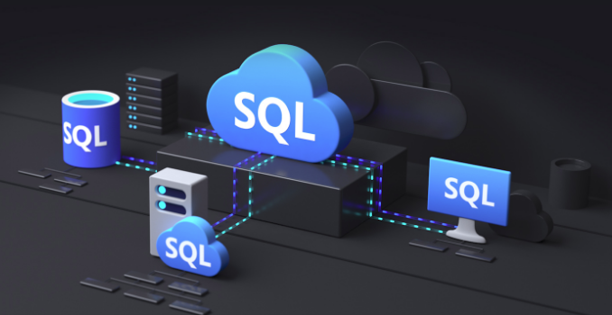

En este artículo conoceremos la familia de Azure SQL y veremos las
distintas opciones, describiendo los posibles casos de uso de cada una

**Introducción a Azure SQL**

En este articulo nos enfocaremos en las diferentes presentaciones del
motor de bases de datos relacional SQL en la nube de Microsoft Azure.
Conoceremos las diferentes presentaciones enumerando las características
y beneficios de cada una de ellas.

La familia de SQL Cloud database nos ofrece varias posibilidades para
poder migrar nuestras aplicaciones a la nube de Microsoft modernizando
nuestro entorno y ofreciendo diferentes opciones para los
desarrolladores.

Comencemos mencionando que la familia de
Azure SQL tiene sus orígenes en el superconocido Microsoft SQL Server,
con muchos puntos en común.

Ya desde hace algún tiempo Microsoft se enfoca en desarrollar nuevas
funcionalidades primero en la nube para luego llevarlas al producto SQL
Server, por lo que la mayoría de estas tienen muchos puntos en comun.
Como ejemplo, las relacionadas a mejoras en performance como "Query
Store", "Automatic Query Tuning" e "Intelligent Query Processing" fueron
testeadas e implementas primero de esta forma.

**Componentes de Azure SQL**

Son 3 las diferentes opciones de Azure SQL.

-   SQL Server en Azure Virtual Machines: Microsoft nos da la
    posibilidad de crear Virtual Machines en Azure corriendo la misma
    versión de SQL Server que utilizamos On-Premise, pudiendo
    seleccionar y combinar entre una enorme cantidad de Sistemas
    Operativos (Incluyendo varias distribuciones de Linux), versiones y
    ediciones de SQL Server.

Esta alternativa que se encuentra dentro de las opciones de
Infraestructura como Servicio (IaaS) Nos da la posibilidad de muy
rápidamente poder migrar nuestras bases de datos que están en servidores
de nuestra organización a Azure, sin necesidad de realizar testing
exhaustivo dado que es la misma versión de SQL Server que ya venimos
utilizado y conocemos. Hay algunos puntos que debemos poner principal
atención dado que hay tener en cuenta que debemos encargarnos de toda la
infraestructura para soportar SQL Server, esto es la configuración de
networking, la autentificación con Azure Active Directory, esquemas de
backup, alta disponibilidad y disaster recovery. También es importante
mencionar que nosotros debemos encargarnos de aplicar las
actualizaciones a Windows y a SQL Server, aunque en los últimos cambios
se permite delegar esto último a Microsoft

-   Azure SQL Database: Esta opción, que es la primera disponible
    en la forma de Plataforma como servicio (PaaS) y que está disponible
    desde los inicios de Azure (con muchísimas mejoras desde las
    primeras presentaciones) nos permite delegar muchas de las tareas de
    administración (HA/DR, Backups, Autotuning, etc.) dado que es SQL
    Server como servicio manejado pero con una característica muy
    particular.

> Podemos tener una única base de datos aislada, por lo que todos los
> objectos de nuestra aplicación deben estar contenidas dentro de esta
> única base. Por ejemplo, una Stored Procedure solo puede acceder a
> tablas y vistas dentro de esa misma base de datos. Esto nos permite
> utilizar este servicio para crear aplicaciones modernas "Cloud" que se
> basan en una única fuente de datos.

> Otra de las características importantes es que muy fácilmente podemos
> escalar el servicio para tener más recursos. Esto lo podemos realizar
> manualmente, en horarios particulares (Schedule) o bajo reglas de
> patrones de ubicación del servicio.
>
> Otra referencia a la forma de escalar son los distintos niveles de
> servicios (Service Tiers) como General Purpose o Business Critical con
> opciones de DTU o vCore (Virtual Cores).
>
> También con opciones de "Serverless" que nos permite "pausar" el
> servicio si no se detecta utilización de este y también la opción de
> "Hyperscale" que nos da la posibilidad de tener bases de datos de mas
> de 100 TB. Todo esto con niveles de servicio (SLA) de 99.99%

-   Azure SQL Database Managed Instance: Esta opción de SQL
    Server como servicio manejado es la más reciente de todas y nos
    permite tener una compatibilidad de casi 100% con las
    funcionalidades del producto SQL Server. Es básicamente el mismo SQL
    Server que utilizamos on-premise, incluyendo el SQL Server Agent,
    replicación transaccional, service broker, etc. Con el agregado
    importantísimo de las características de un servicio PaaS, donde los
    backups, la aplicación de actualizaciones y la configuración de alta
    disponibilidad forman parte de la oferta, por lo que el usuario no
    debe encargarse de ellos.

> Migrar desde SQL Server on-premise a Azure SQL Database Managed
> Instance (MI) es muy sencillo, solamente realizar el backup de
> nuestras bases de datos a un BLOB Storage para luego poder
> restaurarlas en nuestra MI por lo que mover nuestra aplicación a este
> servicio solo requiere que modifiquemos el string de conexión.
>
> Debemos considerar que las funcionalidades de Filestream y Filetable
> así como Transacciones Distribuidas no están disponibles en Managed
> Instance .

**Migrando hacia Azure SQL**

Microsoft nos ofrece la posibilidad de realizar la migración de nuestras
bases de datos locales utilizando la aplicación "Data Migration
Assistant" (DMA) que nos permite llevar a cabo un "Assesment" o
evaluación de las bases de origen, pudiendo detectar problemas que
puedan afectar la migración. Asimismo, nos genera un reporte detallado
indicando como resolver estos inconvenientes

Cuando seleccionamos Azure SQL Database como destino para nuestra
migración, DMA puede detectar funcionalidades parcialmente compatibles,
recomendando enfoques alternativos disponibles en Azure.

Para migraciones de gran escala, donde tengamos que mover muchas bases
de datos de gran tamaño, Microsoft recomienda utilizar "Azure Database
Migration Service"

**Conclusión**

La familia de Azure SQL nos da la posibilidad de seleccionar el destino
que mejor se adecue a nuestras necesidades y nos da las herramientas
para llevar a cabo la migración a una plataforma de datos moderna.

Un camino posible para realizar nuestra migración, para el caso donde
tengamos una aplicación de misión crítica que llevemos utilizando por
varios años, es llevar nuestro SQL Server Local a una Máquina Virtual
corriendo SQL Server 2017 o 2019, manteniendo el nivel de compatibilidad
de las bases de datos de usuario tal cual como en el servidor de origen.
Esto nos permitirá tener presencia en Azure muy rápidamente, manteniendo
los mismos niveles de performance. Como paso adicional lo ideal es
llevar esas bases a "Azure SQL Database Managed Instance" para así poder
tener nuestra bases y aplicaciones en una plataforma moderna, y todo
esto sin con mínimo esfuerzo.

Para el caso en donde tengamos que desarrollar una aplicación nueva, la
recomendación es considerar Azure SQL Database como la primera opción.

**Javier Villegas**  
Global Database Administrator & Design Coordinator @ MSC  
Microsoft MVP , Data Platform  
javier.ignacio.villegas@gmail.com  
[@javier_vill](https://twitter.com/javier_vill)  

[javiervillegas](https://www.linkedin.com/in/javiervillegas/)   
 
import LayoutNumber from '../../../components/layout-article'
export default LayoutNumber
