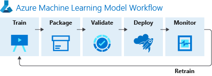

Cuando ayudamos a nuestros clientes a desarrollar proyectos de
inteligencia artificial abrimos la puerta de la cocina, miramos debajo
de la alfombra, detrás de la cocinilla, revisamos el filtro del
extractor, etc. En definitiva, vamos a ayudar a esta empresa a
implementar de principio a fin un ciclo de vida adecuado de desarrollo
de software. Para esto, entre muchas actividades, participamos del
proceso de desarrollo de los algoritmos y nos preocupamos por encontrar
el mejor modelo para desarrollar entrenamientos de algoritmos y/o
algoritmos que permitan hacer la inferencia de los modelos para realizar
las predicciones adecuadas.

Lo habitual es encontrarnos con científicos de datos trabajando con
notebooks en [JupyterLab](https://jupyter.org/) en local o en
[JupyterHub](https://jupyter.org/hub) desde una máquina virtual. ¿Qué
pensáis sobre esto? No tengo nada sobre JupypterLab y los notebooks,
pero este modelo ofrece ciertos problemas y desventajas con riesgos que
mitigar en una empresa:

-   La seguridad de esa máquina virtual es importante, tengamos en
    cuenta que la conexión SSH suele estar abierta a internet y/o la
    autenticación se realiza con usuarios locales.

-   Teniendo una máquina virtual, no nos aprovechamos de las ventajas
    del Cloud y nos toca mantener al día el sistema operativo, la
    versión de JupyterLab, copias de seguridad, etc.

-   Este modelo de desarrollo puede ser aceptable para el trabajo de un
    científico de datos cuando está explorando la información con la que
    trabaja o probando ciertos algoritmos, visualizando los resultados y
    demás. ¿Qué pasa cuando queremos productivizar estos algoritmos?
    ¿Programamos el entrenamiento en esta máquina virtual? ¿No
    necesitaremos un cluster con múltiples nodos para acelerar el
    entramiento y tener los resultados en un tiempo prudencial?

¿Qué alternativas tenemos? ¿Cómo podemos añadir seguridad a la vez que
mejoramos el proceso de colaboración y desarrollo? Seguro que hay muchas
opciones, pero, desde mi punto de vista, las más relevantes son
Databricks y Azure Machine Learning, que os describo a continuación.

**Databricks**

Ante estas desventajas/problemas se creó
[Databricks](https://databricks.com/), un servicio cloud que nos ayude a
mejorar nuestro proceso de colaboración y desarrollo dando respuesta a
estos de la siguiente forma:

-   [Databricks
    Workspace](https://databricks.com/product/data-science-workspace)
    nos permite seguir trabajando con notebooks, pero con la seguridad
    empresarial necesaria, por ejemplo, con nuestras cuentas de Azure AD
    cuando estamos con [Azure
    Databricks](https://azure.microsoft.com/es-es/free/services/databricks).

-   Al ser un servicio PaaS, tenemos todas las ventajas que no nos
    ofrece una máquina virtual y es, en este caso el equipo de Azure,
    quien se encarga de las actualizaciones del producto, con nuevas
    funcionalidades o parches de seguridad.

-   En [Databricks
    Runtime](https://databricks.com/product/databricks-runtime) tenemos
    un "self-service" de creación de clusters de Spark, lo que permite a
    cualquier usuario poder crear, arrancar, parar y ejecutar sus
    notebooks en un cluster, tan simple como seleccionar el cluster
    donde queremos hacer la ejecución desde el Notebook.

-   El sistema de programación de tareas de Databricks, nos ayuda a
    productivizar los modelos, pudiendo realizar tareas programadas que
    ejecutan Notebooks en un cluster definido y dimensionado para la
    tarea que va a ejecutar. Esto no quita de tener que aplicar un buen
    modelo de ALM para que se ejecute los notebooks que tiene realmente
    el código de entrenamiento, evitando ejecutar, por ejemplo, las
    actividades de exploración y pruebas.

**Azure Machine Learning**

Aunque parece que Databricks es la opción ideal, la ventaja de la
tecnología es que siempre hay diferentes opciones para realizar nuestras
tareas que ofrecen diferentes puntos de vista frente a las otras
opciones.

Microsoft ha ido evolucionando diferentes versiones de [Azure Machine
Learning](https://docs.microsoft.com/en-us/azure/machine-learning/) y,
en la última versión pública, podemos ver ciertas similitudes con las
capacidades que desarrolló el equipo de Databricks buscando ayudar a
mejorar el trabajo en los procesos de Big Data.

Azure ML es un conjunto de servicios, herramientas, SDKs que permiten
unificar el proceso de desarrollo de cualquier tipo de Machine Learning
desde cualquier lenguaje de desarrollo o, incluso, sin código. Desde
Azure ML se puede construir, entrenar y hacer un seguimiento de los
modelos de Machine Learning.

Entre otros muchos servicios, Azure ML nos ofrece las siguientes
capacidades que, desde mi punto de vista, permiten trabajar sin
necesidad de tener una máquina virtual aislada con JupyterLab:

-   Un
    [Workspace](https://docs.microsoft.com/en-us/azure/machine-learning/concept-workspace)
    donde podemos crearnos nuestra propia estructura de carpetas para
    almacenar nuestros
    [Notebooks](https://docs.microsoft.com/en-us/azure/machine-learning/tutorial-1st-experiment-sdk-setup#azure),
    además de la capacidad de poder editarlos utilizando un editor web o
    conectarlo a una instancia de computación donde poder ejecutar
    JupyterLab

-   Un servicio de [instancias de
    computación](https://docs.microsoft.com/en-us/azure/machine-learning/concept-compute-instance)
    con nuestro propio "self-service" de creación de máquinas virtuales
    o clusters de entrenamiento. Estás máquinas virtuales utilizan de
    serie la autenticación de Azure AD para poder conectarnos a
    JupyterLab o RStudio que vienen de serie configurados y listos para
    desarrollar y conectarse desde los Notebooks.

-   Una capa de abstracción a los [orígenes de
    datos](https://docs.microsoft.com/en-us/azure/machine-learning/concept-data)
    que nos ayuda a simplificar el código que tenemos que desarrollar
    para acceder a los orígenes típicos dentro de un proyecto de Big
    Data en Azure, Azure Storage, Azure Data Lake 2, etc.

-   Un servicio de
    [Pipeline](https://docs.microsoft.com/en-us/azure/machine-learning/concept-ml-pipelines)
    para diseñar y programar las ejecuciones de nuestros entrenamientos,
    donde un ingeniero de datos puede implementar los flujos de
    entrenamiento ejecutando módulos con el código necesario.

**¿Databricks o Azure ML?**

Trabajar con Databricks nos va a implicar algún que otro cambio en
nuestro código para poder aprovechar la ejecución en el cluster de Spark
que tenemos disponible para ejecutar nuestros notebooks. Nuestro código
debería de estar optimizado para ejecutarse en Spark, y digo debería
porque es la recomendación, ya que si ejecutamos código que no se puede
ejecutar de forma clusterizada, esto es, que no se puede distribuir las
tareas en los diferentes nodos de computación que podemos tener
disponibles, las tareas de este notebook se ejecutarán en el nodo de
Driver y no es los nodos Worker, con lo que trabajaremos únicamente con
una instancia de computación del cluster que no está optimizada para la
ejecución de las tareas.

Es posible que para el día a día de un científico de datos esto de Spark
no sea lo óptimo, que las pequeñas tareas de exploración y pruebas que
tiene que desarrollar en su Notebook no se ejecuten de la forma óptima
en Databricks y por eso una simple instancia de computación con un
JupyterLab sea más que suficiente y Azure ML sea lo más adecuado para su
trabajo diario.

Pero ¿qué pasa cuando se cambia de la fase de exploración con un
subconjunto pequeño de los datos y se empieza a explorar millones y
millones de registros? ¿Qué pasa cuándo queremos ejecutar un
entrenamiento completo con los datos reales? Azure ML nos ofrece poder
crear un cluster de computación o, incluso, poder conectar a un cluster
de Databricks, pero recordar que es posible que si estamos en JupyterLab
nuestro código no sea el más óptimo para ejecutarse en Databricks.

**La unión hace la fuerza**

Está claro que no hay ningún servicio que cubra todas nuestras
necesidades y siempre vamos a tener que adaptarnos a alguno de ellos, es
por eso que, en este caso, lo habitual es hacer uso de Azure Databricks
y Azure ML combinados para tener lo mejor de ambos servicios. Azure
Databricks como servicio para entrenar nuestros modelos, Azure ML como
servicio de exploración y desarrollo de algoritmos, pero también,
independientemente de usar o no los Notebooks de Azure ML, se usan los
servicios de publicación de modelos de Azure ML desde Databricks. Para
cada organización y teniendo en cuenta las capacidades del equipo, las
necesidades del algoritmo y los datos se utilizará una combinación de
ambas, no existe una combinación única, ideal y perfecta para todo.

**Alberto Diaz Martin**  
Microsoft Regional Director | Microsoft Azure MVP | Office Apps & Services MVP   
adiazcan@hotmail.com  
@adiazcan  
https://blogs.encamina.com/por-una-nube-sostenible/ 
 
import LayoutNumber from '../../../components/layout-article'
export default LayoutNumber
