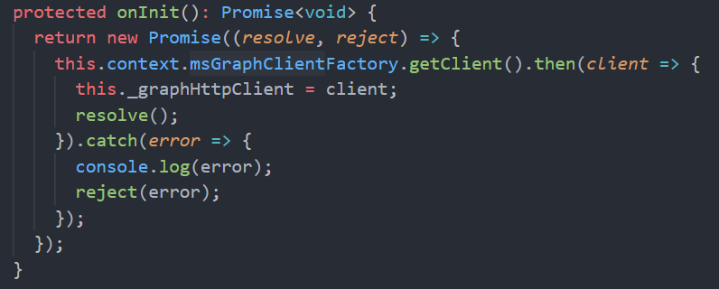

import ArticleHeader from '../../../components/article-header'

<ArticleHeader frontmatter={props.pageContext.frontmatter} />

Durante el pasado pasado **Build** (Mayo 2020), Microsoft anunció un
nuevo endpoint para su MS Graph API, que permite interactuar con
Microsoft To Do, la app que pretende ser, en palabras del propio
Microsoft: "*el destino único para las tareas del usuario en Microsoft
365*"

Dicho endpoint nos da la opción de crear y gestionar listas y tareas en
To Do, así que es ideal para integraciones con sistemas externos,
interfaces personalizadas, agregados, etc.

En este artículo vamos a ver cómo podemos consumir dicho endpoint desde
un Web Part SPFx, que, además, vamos a desplegar también como una Add-in
de Outlook (recuerda que un desarrollo SPFx puede desplegarse en
SharePoint, Teams, o Outlook).

A día de hoy, el endpoint se encuentra en Preview, y todavía no está muy
documentado, así que, antes de nada, vamos a ver qué operaciones tenemos
disponibles, y como invocarlas usando Postman
(<https://www.postman.com/>)

**Invocando el To Do endpoint**

Las tareas se crean dentro de Listas. La siguiente imagen describe las
diferentes entidades que componen en endpoint:

Para poder listar todas nuestras Listas, haremos un GET a la URL:

La respuesta es un objeto JSON con un Array de entidades **taskList**:

Podemos crear una nueva lista, si hacemos un POST de la siguiente forma:

Para ver todas las Tasks dentro de una lista, necesitamos partir del ID
de una Lista, que ya hemos visto como obtenerlo en el párrafo anterior.
Con ese ID, podemos listar las Tasks con la siguiente llamada:

La respuesta, como podéis ver en la imagen anterior, contiene un listado
de la entidad Task, con diferentes propiedades de ésta, como el Title,
Id, Body, etc.

Ya solo nos queda ver como podemos crear una nueva Task, a una Lista
dada. Para ello haremos la siguiente request:

**Desarrollando nuestro SPFx Outlook add-in para crear tareas**

Ahora que ya sabemos como podemos utilizar el To Do endpoint "en crudo",
vamos a desarrollar un SPFx Outlook add-in que permita seleccionar una
Lista existente, y crear una nueva task. Como mencionaba anteriormente,
dicho add-in funcionará en Outlook, pero también en SharePoint, así que
haremos uso del Contexto de Outlook, para que en caso de estar en él, el
título de las nueva Task, lo tome del Subject del email seleccionado.

La siguiente imagen muestra el resultado final de nuestro SPFx Web Part
ejecutado como add-in de Outlook:

**[Nota]**: Existe cierta funcionalidad similar en Outlook, que nos
permite crear una Task en ToDo, usando información del email, es la
opción "**Flas this message**", sin embargo, a mi no termina de
convencerme, ya que todas las Tasks las crea dentro de la misma Lista
(que es una lista predeterminada, con nombre "*Flagged emails*". Por el
contrario, nuestro add-in nos va a permitir seleccionar la lista a la
que queremos añadir nuestra nueva Task.

Empezaremos creando un proyecto SPFx estándar, usando la plantilla de
Yeoman. Dentro de nuestro Web Part, primero necesitaremos sacar un
objeto MSGraphClient, que nos permitirá invocar Graph API de forma
fácil, sin preocuparnos de la Authentication. Para ello, dentro del
OnInit del Web Part, hacemos:

Lo siguiente que necesitamos es saber si estamos siendo ejecutados en el
contexto de SharePoint, o de Outlook, ya que, en Outlook, tomaremos el
título de la Task, del subject del email. El propio SPFx framework nos
dará esa info del contexto, así que podemos hacer algo como:

Como veis, primero comprobamos si tenemos contexto de Office, con la
línea:

*if (this.context.sdks.office) {*

En ese caso, estamos en Outlook, y de nuevo el framework nos da opción
de recuperar cierta información del email seleccionado, esto lo tenemos
en la línea:

*const mailboxItem: Office.MessageRead =
this.context.sdks.office.context.mailbox.item;*

Nuestro siguiente paso, ya dentro de un componente React, es obtener las
diferentes Listas que tenemos en nuestro To Do App. El siguiente snippet
se encarga de ello:

Una vez tenemos listadas nuestras listas, ya solo nos queda crear la
nueva Task. Para ello podemos utilizar el siguiente snippet:

Tenéis el proyecto completo como parte de los ejemplos de SPFx-Web Parts
del PnP:

[https://github.com/pnp/sp-dev-fx-Web
Parts/tree/master/samples/react-outlook-add-todo-task](https://github.com/pnp/sp-dev-fx-webparts/tree/master/samples/react-outlook-add-todo-task)

Para su Deploy, se deben seguir los pasos bien documentados en los docs
oficiales de Microsoft:

[https://docs.microsoft.com/en-us/sharepoint/dev/SPFx/office-addins-create\#deployment-of-your-add-in](https://docs.microsoft.com/en-us/sharepoint/dev/spfx/office-addins-create#deployment-of-your-add-in)

Ten en cuenta que para utilizar el endpoint, necesitas otorgar los
permisos "**Tasks.ReadWrite**" a la aplicación de SharePoint. Para ello
te recomiendo que utilices el Office365 CLI
(<https://pnp.github.io/office365-cli/>), con el siguiente comando:

*spo serviceprincipal grant add --resource "Microsoft Graph" --scope "Tasks.ReadWrite"*

Espero haberos ayudado a entender como utilizar este nuevo endpoint.

¡Hasta el próximo artículo!

**Luis Mañez**  
Cloud Architect en ClearPeople LTD  
@luismanez  
<https://github.com/luismanez>