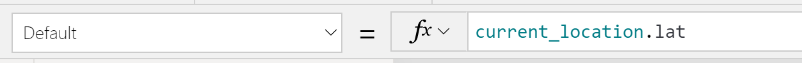

En este artículo vamos a revisar la unión de dos Servicios de Microsoft
uno del paquete Office 365 y del mundo Power Platform como es PowerApps;
y el otro Azure Maps, un servicio de Azure centralizado en el manejo de
mapas y todo lo relacionado con geoposicionar datos.

Veremos la nueva versión "Public Preview" de dos componentes que
podremos utilizar desde ya en PowerApps con unos sencillos pasos, y todo
el potencial de estos si necesitamos jugar con búsqueda de direcciones o
posicionar datos en un mapa interactivo dentro de nuestra PowerApps,
dejando atrás el control por Imagen que usábamos de forma muy limitada
con Google Maps o Bing Maps.

**Azure Maps, llegado para quedarse**

Cada vez está más asentado este servicio de pago por uso en Azure, y que
viene a sustituir al API original de Bing Maps, pasando casi en su
totalidad a ser Azure Maps.

Azure Maps para el que no lo conozca es un servicio que ha crecido una
barbaridad en los últimos años, no deja de ser un API de servicios
Geoespaciales, que podemos instanciar desde nuestras aplicaciones o
desde soluciones de Office 365, y en concreto desde el mes de abril en
"public preview" también en PowerApps.

El servicio proporciona funcionalidades del tipo:

-   **Búsqueda de localizaciones**: Direcciones, Puntos de interés,
    coordenadas Geográficas, etc.

-   **Mapas interactivos**: En los que podemos representar todo tipo de
    datos Geo posicionados, y tenemos componentes en PowerApps o
    componentes en JavaScript que podemos integrar en nuestras
    soluciones cliente.

-   **Rutas y Tráfico**: Para montar sistemas de seguimiento GPS para
    poder hacer por ejemplo traking de pedidos o rutas de navegación
    con tu vehículo.

-   **Sistemas de Geolocalización por IP**: Para poder adaptar los
    contenidos de nuestros sistemas por zona geográfica.

-   **Servicios meteorológicos**: ¿No te quieres mojar? ¿Quieres
    integrar tu servicio de IoT con el servicio de mapas y actuar en
    función de la meteorología?

-   **Servicios de datos**: Podemos almacenar datos en el propio
    servicio, del tipo geoespaciales para evitar latencia en la carga
    de estos.

-   **Creator**: Permite crear tus propios mapas con aplicaciones como
    AutoCad, y a partir de ellos geoposicionar los datos, hacer
    servicios de rutas, como por ejemplo digitalizar un mapa de un
    recinto para un festival de música o poder digitalizar el plano de
    un hospital.

-   **Geo-vallas**: Marcar una zona de seguridad, y detectar entrada y
    salida de vehículos, personas o lo que queramos "vigilar" y
    "controlar". Muy útil para sistema de conteo de entrada y salida,
    sistemas de videovigilancia o de seguridad privada..., todo un
    lujo poder controlar un área si es necesario.

Posiblemente me he dejado alguna característica por evaluar, o nombrar
al menos, pero bajo mi modesta opinión están son las principales y las
que hacen de Azure Maps un servicio "top" en cuanto al
geoposicionamiento de los datos.

**Powerapps y Azure Maps , ¿Qué nos aporta esta nueva unión?**

Como todos los servicios que se están pasando a Componentes de
PowerApps, lo primero que tenemos que entender es que han venido para
"facilitarnos" la vida siempre y cuando nos podamos adaptar a la
funcionalidad que nos proporcionan.

Es cierto que como con casi cualquier servicio de Azure, ya podíamos
instanciar el mismo desde un Componente personalizado (Aplicaciones de
Lienzo o Componente en React), haciendo uso de los "Custom Connector"
para poder instanciar el API de Azure Maps de forma controlada, y
creando una instancia del servicio en Azure.

Todo esto estaba genial, pero requiere "Conocimiento" del API, del
modelo de despliegue de los Conectores a medida, y claro está controlar
un mínimo Azure y mantener los costes de uso del servicio de Azure Maps
de nuestro tenant.

Pues lo dicho, PowerApps viene a ahorrarnos todo esto, y nos proporciona
dos componentes que podemos utilizar en fase de pruebas desde ya mismo y
que son:

-   **Mapas Interactivos:** Como veremos en los ejemplos, nos permite
    insertar un mapa 100% interactivos, y posicionar un juego de datos
    geposicionados mediante sus coordenadas en el mapa.


-   **Sugerencia y búsqueda de direcciones:** Este segundo componente
    nos permite atacar al API de Azure Maps, desde una simple caja de
    texto y buscar direcciones. Como es de esperar en este tipo de
    componentes el propio servicio sugiere direcciones una vez empezamos
    a escribir, y nos corrige si hemos metido algún error en la
    dirección.


**Como empezar a usar estos dos nuevos componentes, configurar el
entorno**

Si os habéis emocionado rápido, y habéis ido a buscarlo en el catálogo
de componente de vuestro PowerApps studio, y no está, podéis estar
tranquilos es normal porque debemos habilitar una serie de
características a nivel de tenant, y posteriormente en la propia
aplicación que estéis editando.

Lo primero que debemos hacer es acceder a la dirección
https://admin.powerplatform.microsoft.com/ con un usuario
administrador y seleccionar el "entorno" en el que vamos a utilizar las
nuevas capacidades de Azure Maps. Una vez dentro del entorno debemos
darle a "configuración", y en el menú que se nos presenta seleccionar
Productos-\>Características.


Una vez en características debemos habilitar los servicios
"Geoespaciales" que como veremos están en versión "preview".


Una vez configurado el entorno, para poder utilizar los componentes de
Maps en nuestra App debemos acceder a la aplicación en modo "edición"
desde el PowerApp studio, y en el apartado de
"configuración-\>Configuración avanzada", seleccionar en el apartado de
"Características experimentales" la opción:


**Construyendo nuestra primera pantalla con Maps: Añadiendo una posición
al mapa**

Vamos a crearnos una nueva pantalla en una aplicación de Lienzo en
PowerApps, que nos permita añadir un mapa interactivo y sobre este
pintar unas coordenadas que nosotros recojamos por pantalla tal y como
se ven en la siguiente imagen:


Voy a saltarme un poco la parte de diseño, dejando que cada uno le da la
forma que quiera, pero en resumen vamos a tener:

-   Dos cajas de entrada de texto que podamos escribir Latitud y
    Longitud a pintar en el mapa.

-   Un control booleano que nos permita elegir si queremos que nos
    geoposicione nuestra posición actual o no. Si elegimos la posición
    GPS o actual que nos da PowerApps las cajas de texto se van a
    sobreescribrir con las coordenadas exactas.

-   Un botón visualizar en mapa que lanzara la posición con "latitud y
    longitud" al mapa.

-   Mapa interactivo que permita renderizar la posición deseada en el
    mapa.

**Añadiendo la recogida de coordenadas**

Para ello en el menú insertar vamos a añadir dos componentes del tipo
"Entrada de texto" y unos label para poder visualizar "Longitud y
Latitud" tal cual vemos en la imagen.


Una vez insertados y posicionados a nivel de diseño como nosotros
queramos, yo recomiendo ponerles un nombre que nos permita luego
buscarlos en la caja de fórmulas de forma sencilla, en mi caso los he
llamado text_lon y text_lat.


Ahora nos toca añadir tanto el control booleano como el botón que nos va
a permitir almacenar la "posición a renderizar" en el mapa. l control
booleano se denomina "alternar" en el menú de controles de entrada, y el
otro es un control de tipo botón sencillo, que debemos añadir y dejar
como en la primera imagen de la aplicación que ya hemos visto.


En este punto debemos insertar un par de fórmulas:

1.  Seleccionamos el control "si o no" de Posición GPS y añadimos las
    siguientes fórmulas a los eventos OnCheck y UnCheck tal cual vemos
    en las siguientes imágenes:


Es muy simple de entender, vamos a guardar en una variable
"Current_location" los datos que nos proporciona nuestra aplicación de
la posición exacta en la que se encuentra, bien sea desde el navegador
web vía IP o desde el móvil con la función Posicionamiento.

```
Set(current_location;{lat:Location.Latitude;lon:Location.Longitude})
```

2.  Para pasar a los campos de texto la "lat y lon" correctas debemos
    seleccionarlos y en la propiedad "default", añadir
    current_location.lat o current_location.lon.




3.  Por último para terminar con la botonera, debemos configurar el
    evento OnSelect del botón "Visualizar en mapa" con la formula:
    
    ```
    ClearCollect(Positions;{lat:Value(text_lat.Text);lon:Value(text_lon.Text);Name:\"Current_Position\"})\
    ```

    Lo que hacemos con esta instrucción es crear una colección de datos Position, en la que guardamos:
    a.  Lat (latitud).
    b.  Lon (longitud).
    c.  Name (el texto Current_Position).

Esto genera una colección de un elemento que vamos a utilizar desde el
mapa interactivo, es importante usar una Colección y no una variable, ya
que el mapa espera una entrada de datos del tipo tabla, y en caso de
usar variable nos va a dar un error en la fase de mapeo.

**Añadiendo el componente de mapa Interactivo**

Una vez tenemos todos los datos necesarios en nuestra aplicación,
podemos pasar a renderizar las posiciones en el mapa. Para ello en el
menú insertar, buscamos "Map", y veremos que ahora una vez habilitado
todas las características de geoposicionamiento podemos agregarlo a
nuestro lienzo.


Como ves en la imagen, Microsoft ya nos deja alguna pista de que este
conector va a ser Premium y por eso no nos pide en ningún momento que
debemos de alta una conexión a Azure Maps como si nos pasa con otros
servicios. El propio componente nos deja conectado al api y nos
despreocupamos de todo.

El componente es muy sencillo de configurar lo insertamos debajo de
nuestra botonera, y lo adaptamos a la pantalla para que ocupe lo que
deseemos. Ahora solo nos queda, seleccionar el componente de mapa, y
configurar el Origen de datos que será nuestra colección "Positions", y
configurar los campos ItemsLabels, ItemsLongitudes y ItemsLatitudes, tal
cual se ve en las siguientes imágenes:


Las propiedades que hemos configurado permiten poner como nombre encima
de la chincheta el campo Positions.Name que como dijimos antes será
CurrentPosition, y por otro lado los campos latitud y longitud que
también tiene la estructura de datos definida en Positions. En este caso
como en Positions solo estamos metiendo un elemento, el mapa pinta uno,
pero como veremos en el siguiente ejemplo el propio control pinta tantos
como haya en la colección de datos.

Y con todo esto tenemos un mapa interactivo, que pinta una posición
geoposicionada por latitud y longitud.


Por terminar de cerrar la revisión del componente "Mapa interactivo",
podremos ver en el menú del componente que podemos visualizar en el mapa
la "ubicación actual" de forma nativa sin hacer la botonera, aunque yo
quería ver cómo hacer uso de la función "Location".

O por otro lado podemos habilitar opciones del mapa como, si queremos
que el usuario pueda hacer zoom, inclinar el mapa o ver una vista
satélite en vez de relieve. Todas estas opciones dan mucha libertad al
usuario de visualizar de la mejor forma posible la posición deseada.


**Busqueda de una dirección y renderizado de más de un punto en el
mapa**

Con este segundo ejemplo vamos a ver cómo hacer uso del segundo
componente que se llama "Adress suggestion" y poder añadir al mapa
tantos puntos como deseemos. La idea del mapa interactivo no va a
variar, vamos a escoger una colección de puntos a visualizar y este de
forma nativa los va a renderizar. Donde sí debemos poner más atención es
en el componente de búsqueda de direcciones que como vamos a ver es muy
muy sencillo de utilizar.

Esta nueva pantalla va a permitir añadir desde un campo de búsqueda de
direcciones "N" puntos a nuestro mapa interactivo.


La pantalla va a ser igual de diseño libre, pero debe tener los
siguientes elementos:

-   Un componente de búsqueda de direcciones de "Azure Maps".

-   Un botón Añadir: Para ir metiendo en una colección "Locations" las
    posiciones.

-   Un botón borrar: Vacía la colección "Locations".

-   Un mapa interactivo para renderizar los puntos.

**Primero recogemos la dirección a renderizar**

Insertamos el componente de búsqueda de direcciones desde el menú de
componentes, buscándolo por "Entrada de dirección", tal cual se ve en la
siguiente imagen.


Una vez añadido no tenemos que hacer nada con él, más que configurar un
poco el componente, tal cual se ve en la siguiente imagen:


Como veis se puede limitar el "rango de resultados" que en nuestro caso
lo hemos dejado en 50, y no queremos limitar el resultado a un radio de
coordenadas como podría ser la Comunidad de Madrid, sino que lo vamos a
dejar abierto a cualquier dirección del planeta para ver el rendimiento
del componente. Sí vamos a predefinir el idioma a castellano, para que
nos sea sencillo escribir la dirección y nos corrija palabras como
Calle, Avenida o Paseo, si lo metemos mal.

**Insertar los puntos recogidos en el buscador**

Para poder mandar las direcciones encontradas en el buscador en el botón
"Añadir" vamos a configurar la siguiente formula en el evento
"OnSelect":

**Collect(locations;\{Name:AddressInput2.UserInput;Lat:AddressInput2.SelectedLatitude;Lon:AddressInput2.SelectedLongitude;City:AddressInput2.Municipality\})**


Esta fórmula nos permite añadir elementos a la colección "Locations",
desde el buscador de direcciones que en nuestro caso se llama
AddressInput2 y cogeremos los siguientes campos:

-   UserInput: Cadena de texto con lo que hemos escrito en pantalla.

-   SelectedLatitude: Latitud de la dirección encontrada.

-   SelectedLongitud: Longitud de la dirección encontrada.

-   Municipality: Localidad o población de la dirección escogida.

En el botón borrar simplemente vamos a añadir en el evento OnSelect la
fórmula **Clear(locations)** para poder borrar la colección de datos
Locations.

**Renderizando y probando nuestra app**

Vamos a insertar un mapa interactivo, y añadir como origen de datos la
colección Locations (tal y como hicimos en el ejemplo anterior), y
seleccionaremos los siguientes campos para la leyenda y la posición:


Ahora podríamos lanzar la aplicación, añadir varias direcciones de
Madrid como podría ser Calle Gran Vía 20 o Calle Alcalá 200:


Si agregamos varios puntos relativamente cerca, según vayamos alejando
el Zoom veremos que se nos agrupan con un contador sobre la propia
leyenda, haciendo muy fácil localizar el número de puntos a posicionar.


**Interactuando con el mapa**

Una cosa que aún no hemos visto es que el mapa carga una serie de datos,
pero también expone una serie de eventos para poder interactuar con él,
y hacerlo muy integrable en la pantalla. Por ejemplo, podemos utilizar
el evento de clic de una chincheta sobre el mapa, para que por ejemplo
nos pinte una pequeña leyenda. En este caso podemos añadir un label
encima del mapa para poder pintar la "localidad" a la que hace
referencia ese punto exacto del mapa.


Para poder pintar la localidad es tan fácil como en el control label, en
el campo "Text" añadir **First(Map2.Items_SelectedItems).Name,** donde
"Map2" es el mapa y "Items_SelectedItems" son los puntos del mapa
seleccionado.\
En nuestro caso utilizamos la función "First" para coger solamente un
punto, que en este caso es el último que se ha seleccionado ya que están
ordenados por antigüedad.

**Un servicio más a PowerApps, más leña al fuego**

Bueno una funcionalidad más, para un servicio de PowerApps ya de por si
potente, pero al que aún le quedan cosas serias por pulir como es la
experiencia de trabajar con componentes, poder tener un entorno de
trabajo completo como puede ser Visual Studio Code, el modelo de
despliege y la configuración de las conexiones entre entornos.

Es cierto que nos encontramos lo que esperamos, un componente de Mapas
muy sencillo de usar, potente, aunque con muchas características por
añadir como son las rutas dentro de un mapa o añadir Shapes o áreas en
el mismo.

Sin duda añade un buscador muy potente, que aun sin limitar el rango de
resultados tiene un rendimiento muy notable; y el mapa interactivo
permite interactuar con el mapa y hacer uso de los datos del api de
forma muy ágil y directa sin tener necesidad de conocer el contrato del
api de Azure Maps más que lo necesario.

Seguimos echando "leña al fuego", ahora nos queda ver si el "Guiso" nos
sale bueno y podemos hacer aplicaciones cada vez más complejas y con
equipos grandes de trabajo, o se va a quedar en una herramienta para
hacer pequeños componentes muy puntuales en nuestras aplicaciones
móviles, o del entorno Office 365 como son SharePoint o Dynamics 365.

El tiempo lo dirá, es cierto que ahora mismo PowerApps es un buen
producto, al que le queda un pequeño paso para consolidarse entre las
comunidades de desarrollo de aplicaciones del mundo Microsoft, ¡¡aunque
todo es posible!!

**Sergio Hernández Mancebo** <br />
Principal Team Leader | Azure MVP <br />
@shmancebo