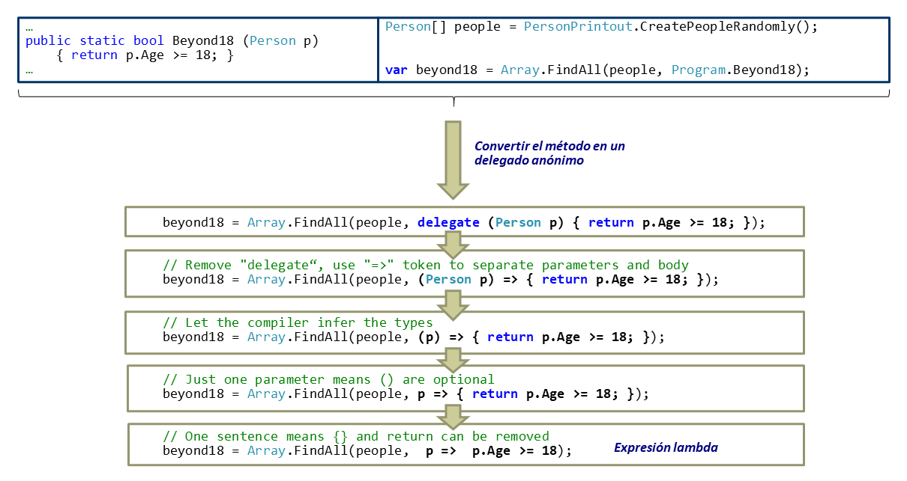

En un artículo anterior explorábamos una forma de hacer llegar conceptos
de programación básicos y avanzados a programadores que están en
formación
(https://www.compartimoss.com/revistas/numero-44/el-comic-como-medio-de-ensenanza-de-conceptos-de-programacion).
En este artículo también pretendemos hacer llegar conceptos de
programación a un sector de programadores, pero con la diferencia de que
están enfocados al único propósito de ahorrar escribir código y que nos
dirigimos a personas con una determinada experiencia. Y es que muchos
programadores, especialmente si llevan mucho tiempo en el mercado,
adquieren hábitos de uso a la hora de codificar que, bien por
desconocimiento o por inercia, son muy difíciles de desterrar aun cuando
existen en el lenguaje alternativas mejores para hacer el mismo trabajo.
C\# no es una excepción.

Es importante aclarar que no estamos diciendo que se hagan cosas mal,
sino que se invierte más tiempo y esfuerzo del necesario, ya que un
adecuado conocimiento de nuevas características de un lenguaje
permitiría realizar ciertas tareas con una inversión considerablemente
menor. Este artículo pretende hacer un recorrido por algunos de los
casos que creemos más típicos en los que hemos visto que ocurre,
destacando tanto elementos del lenguaje que ya tienen unos años como
otros mucho más modernos y, por tanto, potencialmente más desconocidos
por un mayor número de personas.

Este artículo se divide en dos partes: formas de ahorrar código a la
hora de hacer declaraciones de clases y variables, y formas de ahorrar
código en cuerpos de métodos. En donde sea aplicable, se proporciona un
ejemplo de "antes" y "después" que trate de ilustrar la técnica y
facilite que pueda aplicarse en otros contextos. Todas las pruebas
mostradas se han creado bajo un *Visual Studio Community 2019 Preview*
(versión *16.8.0 Preview 4.0*) con un proyecto que usa la última versión
disponible de *.Net 5.0* en el momento de la escritura de este artículo
(octubre 2020).

**Ahorrando Código en Declaraciones de Tipos**

*Getters y setters: encapsulando "sin traumas"*

Muchos programadores en C\#, especialmente si vienen del mundo Java,
están acostumbrados a generar métodos *getter* y *setter* para los
atributos de sus clases en función de cómo quieren que estos sean
encapsulados. Esto hace que el código de las clases se llene de pequeños
métodos, dificultando su mantenimiento, además de invertir tiempo en una
tarea tediosa y repetitiva. Para paliar estos problemas, se necesita la
ayuda del IDE (autogeneración de estos métodos) o bien, en caso de Java,
de librerías externas como el proyecto *Lombok*
(https://projectlombok.org/).

C\# soluciona este problema dentro del propio lenguaje, con una serie de
alternativas de generación de métodos get / set de uso muy sencillo y
adaptado a diferentes requisitos de encapsulación, gracias al uso de
propiedades. En la imagen 1 vemos algunas aproximaciones que ahorran
escribir código, destacando una nueva de **C\# 9** que permite
propiedades de solo lectura y de escritura solo en inicialización de la
instancia de la clase (init), un caso de uso muy común.

```csharp
class Computer {
    // Propiedad de lectura y escritura estándar, con métodos autogenerados
    public string Brand {get; set;}
    //Propiedad de solo lectura, como expresión (C\# 6.0+), necesita menos código
    public string ID => $"Standard Computer {Brand} ({CPU}, {Mhz})";

    //Si es necesario incluir una lógica especial en los get/set, hay que crear una
    //propiedad privada de respaldo
    private double _mhz;

    //Miembros con forma de expresión (C\# 7.0+)
    public double Mhz {
        get => _mhz;
        set => _mhz = (value>0)? value: throw new ArgumentException("...");
    }

    //Esta propiedad se puede leer. Escribir solo está permitido en constructores.

    public string CPU {get; init;}
}
```

*Poner tipos está "pasado de moda"*

A la hora de crear nuevas instancias de objetos, la forma de creación
estándar típica Computer computer = new Computer ("Ryzen 1700"); admite
variantes que requieren escribir menos código. Esto es especialmente
útil en clases con nombres largos y complejos. Por ejemplo:

-   Desde C# 3 en adelante, el uso de var deja que el compilador
    infiera el tipo de la declaración: var computer = new Computer
    ("Ryzen 1700");

-   Como nueva característica de C# 9, el tipo ahora puede omitirse del
    lado derecho de la asignación también, lo cual tiene unos efectos de
    ahorro de código interesantes que se pueden ver en la imagen 2:

```csharp
    public static Computer ConfigureComputer(string configurationName, Computer baseComputer) {

    ...

    }

    ...

    //Se omite el tipo en la creación, pues ya se conoce (C\# 9+)
    Computer computer = new ();

    //Se puede combinar con propiedades tipo init
    Computer computer2 = new() {CPU = \"Ryzen 2700\"};

    //Se puede usar para pasar instancias de una clase que se admita como parámetro

    var configured = ConfigureComputer(\"Standard_conf\", new());
```

*Métodos "de quita y pon": Extension methods y partial classes*

Una de las cosas que más puede dificultar la mantenibilidad de un código
es que una clase crezca desmesuradamente debido a que posea una gran
cantidad de atributos y métodos. Si bien esto puede evitarse
habitualmente con un buen diseño, en ocasiones no es así, y la clase
crece irremediablemente. No obstante, eso no quiere decir que no haya
formas de solucionar el problema, y C\# provee varias:

-   **Componer una clase "a trozos":** Mediante la palabra reservada
    partial un programador puede crear partes de una misma clase en
    varios ficheros, de forma que cada uno de ellos contenga solo
    aquellas partes de la clase que tengan que ver con una funcionalidad
    concreta. A la hora de compilarla, todos los "trozos" parciales de
    la clase se integrarán en una sola, y no habrá diferencia (más allá
    de tener un código más mantenible) respecto a haberlo hecho en un
    solo fichero. Esta palabra reservada también se admite en métodos,
    de manera que un fichero puede declarar la cabecera de un método y
    otro puede declarar su implementación. Esto último puede ayudar
    cuando necesitamos tener la certeza de la existencia de un método
    que se llama desde otro, pero dicho método está en otro fichero al
    haber usado clases parciales, como se muestra en la imagen 3.

| **Fichero1**                     | **Fichero2**                     |
|----------------------------------|----------------------------------|
| public partial class Network \{   | public partial class Network \{   |
|                                  |                                  |
| public int Mask \{get; init;\}     | public string BaseIP \{get;       |
|                                  | init;\}                           |
| public partial string            |                                  |
|                                  | public partial string            |
| GetNetWorkDescriptor() =\>       |                                  |
|                                  | GetNetWorkDescriptor();          |
| BaseIP + \"/\" + Mask;           |                                  |
|                                  | \}                                |
| \}                                |                                  |
|----------------------------------|----------------------------------|
| \...                             |                                  |
|                                  |                                  |
| //Todas las partes de la clase   |                                  |
| están disponibles sin problema   |                                  |
|                                  |                                  |
| var n = new Network () \{BaseIP = |                                  |
| \"156.45.34.0\", Mask = 24\};     |                                  |
|                                  |                                  |
| Console.Writ                     |                                  |
| eLine(n.GetNetWorkDescriptor()); |                                  |


-   **Extender la clase externamente**: Otra de las formas de disminuir
    el tamaño de las clases particionando su contenido son los
    *extension methods*. Estos permiten "añadir" métodos a una clase
    fuera de su declaración, en un fichero aparte, sin que en el momento
    de usarlos el programador note alguna diferencia respecto a los
    métodos que la clase realmente declara. No obstante, a la hora de
    usarlos hay que tener en cuenta una serie de consideraciones:

    -   Deben ser métodos estáticos, declarados en clases estáticas y
        cuyo primer parámetro sea un objeto del tipo de la clase que
        extiende, precedido de la palabra reservada this (ver imagen 4).

    -   Aunque a efectos de uso no es así, a efectos de creación
        funcionan como métodos externos a una clase. Esto quiere decir
        que no se tiene acceso directo a propiedades no públicas (habría
        que usar los métodos de acceso disponibles), no pueden
        sobrescribir métodos declarados en las clases y, si el fichero
        donde se declaran pertenece a un ensamblado/namespace distinto
        al de la clase principal y este no se referencia o se usa,
        entonces no estarán disponibles.

    -   Las limitaciones anteriores sin embargo hacen que puedan
        declararse *extension methods* de cualquier tipo de C\#
        existente, incluidos tipos básicos predefinidos (int,
        string...). La posibilidad de que no estén disponibles no es
        algo necesariamente malo: si una funcionalidad no es necesaria,
        no debería estar accesible. Por ejemplo, en el caso de *Linq*,
        si no hacemos uso del namespace System.Linq ninguna clase que
        implemente IEnumerable tendrá acceso a los métodos de esta
        librería, ya que están implementados como métodos de extensión
        de este interfaz.

```csharp
//No se declara dentro de class Network, sino en otra clase aparte

public static class NetworkExtensions {

public static string GetDHCPServerIP (this Network network) {

return network.BaseIP.Replace(\".0\", \".1\");

}

}

...

//Indistinguible de un método declarado

var dchp = n.GetDHCPServerIP();
```

*¿Que declare mi clase? No, yo soy un tipo anónimo*

En ocasiones necesitamos tener objetos de forma temporal para recoger
resultados, hacer composiciones de objetos existentes y otras acciones
que, debido a su carácter transitorio, ocasional y temporal, quizá no
merezca la pena que tengan una clase declarada solo para ellas.

El motivo es que, si tenemos muchos casos así, se incrementaría el
tamaño del código fuente de la aplicación y su complejidad,
dificultándose su mantenibilidad debido a la existencia de clases que
solo se usarían una o muy pocas veces. Esto es algo que se puede dar
frecuentemente cuando se recogen resultados de expresiones *Linq* (de
las que hablaremos más abajo).

Para estos casos C\# tiene la opción de crear tipos anónimos: objetos de
clases sin nombre que se crean en un punto del programa para algo
temporal, y que pueden estar compuestos de los miembros que queramos o
nos hagan falta en un momento dado. De esta forma, es mucho más fácil
crear algo que nos dé servicio en un punto concreto del programa y que
no tendrá vida más allá del mismo. Los tipos anónimos se comportan como
clases estándar (el acceso a sus miembros se hace de forma idéntica)
puesto que por debajo no son más que clases AnonymousType'\<Numero\> que
el compilador crea según sea necesario. De esta manera, usando los
ejemplos anteriores, si en un momento dado nos hiciera falta asociar un
ordenador con su red para hacer alguna operación concreta, podríamos
hacer algo como lo que se muestra en la imagen 5.

* Tipo anónimo creado en este punto. Los nombres de los atributos
pueden omitirse y se usaría el nombre de la instancia usada para darle
valor (var redPC = new \{n, computer2\} sería valido) *

```csharp
var redPC = new {

Network = n,

Computer = computer2,

};

\...

Console.WriteLine(redPC.Network + \": \" + redPC.Computer);
```

*Registros (records): clases "prefabricadas" (para ciertos contextos)*

Los *record types* de C\# son un añadido muy reciente de la versión 9
del lenguaje. Son básicamente clases (tipos referencia), pero con
semántica de tipos por valor por defecto. Esto quiere decir que
deberíamos usarlos de manera que sus atributos sean de solo lectura y
que solo puedan inicializarse en construcción (pudiendo usar el
modificador init visto anteriormente para sus propiedades). En otras
palabras, una vez creados, sus atributos no deberían cambiar de valor.

Los tipos inmutables evitan tener efectos laterales en la computación,
lo cual les hace perfectos para ser usados en escenarios donde se use
programación funcional pura y código concurrente. En este último caso,
evitarían el uso de mecanismos de sincronización que perjudicarían el
rendimiento global del programa.

¿Cómo se gestionan estos tipos entonces? Pues al ser básicamente clases,
su uso no es muy distinto al estándar. No obstante, dado su carácter
inmutable, hay que tener en cuenta una serie de propiedades que poseen.
La ventaja en el contexto de este artículo de los tipos record es que,
si quisiéramos conseguir estas mismas propiedades con clases estándar
(lo cual es un caso de uso bastante común), tendríamos que programar
código adicional. Los tipos record nos ahorrarían todo ese código.

-   Sus propiedades deberían declararse como get; init; (solo lectura,
    inicialización en el constructor)

-   Si tenemos la necesidad de cambiar el valor de alguno de sus
    atributos, mantener su semántica inmutable requiere la creación de
    un nuevo record con esos valores cambiados, quedando el objeto
    original inalterado. Esto se simplifica en C\# 9 mediante el uso de
    la palabra reservada with como se ve en la imagen 6:

```csharp
public record ComputerUser {

public string Name {get; init;}

public string Department {get; init;}

public ComputerUser(string name, string department)

=\> (Name, Department) = (name, department);

}

\...

var user2 = new ComputerUser(\"C\#erlock HolMS\", \"IT\");
```

* Creamos un nuevo usuario user3, que tiene los mismos valores que
user2 salvo los de las propiedades que enumeremos aquí. Se admiten
varias propiedades separadas por comas *

```csharp
var user3 = user2 with {Department = \"Accounting\"};
```

-   Se implementa por defecto una **semántica de comparación por
    valor**, es decir que, a diferencia de los objetos de las clases
    tradicionales que no redefinen su propio Equals, dos registros son
    iguales si los valores de todas sus propiedades son iguales. Nótese
    que esto nos ahorra la implementación tanto de un método Equals
    típico como de un método HashCode, ya que el lenguaje lo hace por
    nosotros. Por ejemplo, dada la clase anterior, vemos en la imagen 7
    como la comparación de los *record types* devuelve true cuando los
    valores de todas las propiedades de los objetos son iguales, aunque
    sean objetos distintos:

```csharp
var user1 = new ComputerUser(\"C\#erlock HolMS\", \"IT\");

var user2 = new ComputerUser(\"C\#erlock HolMS\", \"IT\");

var user3 = user2 with {Department = \"Accounting\"};

Console.WriteLine(user1.Equals(user2)); // Imprime true

Console.WriteLine(user3.Equals(user2)); // Imprime false
```

-   Se implementan automáticamente métodos Copy y Clone, ahorrándonos
    ese trabajo.

-   Adicionalmente, se implementa un método ToString que muestra los
    valores de cada instancia de un *record type* de una forma clara
    (ver imagen 8), y que también puede servir para ahorrarnos
    implementar este método en muchos escenarios.

```csharp
var user1 = new ComputerUser(\"C\#erlock HolMS\", \"IT\");

\...

//Imprime: ComputerUser {Name = C\#erlock HolMS, Department = IT}

Console.WriteLine(user1);
```

-   Finalmente, un último detalle de los *record types* es su especial
    relación con las tuplas (tipo de datos introducido en C\# 7+). Ya no
    solo es el hecho de que se admita la asignación de propiedades
    usando la sintaxis de tupla (ver la línea del constructor en la
    imagen 6), sino que hay una relación aún más estrecha en el caso de
    que declaremos los record con la sintaxis de *positional record*. Un
    *positional record* es equivalente al que hemos definido, pero
    usando aún menos código a cambio de tener una serie de
    comportamientos por defecto. Los miembros de un *positional record*
    se tratan automáticamente como si se declarasen con get; init; y en
    este caso, además de las propiedades vistas anteriormente (ToString,
    Copy, Clone, Equals...) implementan automáticamente un método
    Deconstruct que, al igual que con las clases estándar que cuentan
    con él, permite asignar sus propiedades a una tupla muy fácilmente
    de la siguiente forma:

```csharp
//Declaración de ComputerUser como positional record

public record ComputerUser (string Name, string Department);

...

//Deconstrucción como tupla automática

var (name, department) = user1;

Console.WriteLine(name + \",\" + department);
```

Por tanto, podemos ver los tipos record como una forma rápida de
implementar clases típicas que necesitamos que tengan una semántica
inmutable (o que el hecho de que la tengan no conlleva ninguna
penalización o problema). Esto nos da automáticamente una serie de
operaciones y semántica que nos ahorraría implementar bastante código
que tradicionalmente se añade a las clases que necesitan este conjunto
de funcionalidades (especialmente en el caso de los *positional
records*). En el resto de los sentidos, los *records* funcionan como
clases estándar: admiten herencia (pueden ser marcadas como "sealed"
para prevenirlo), permiten la redefinición de métodos, métodos
extensores...

**Ahorrando Código en Cuerpos de métodos**

*¿Por qué sobrecargar con varios métodos si solo puedes tener uno?*

En ocasiones nos vemos obligados a implementar varios métodos con un
mismo nombre, pero diferente número y tipo de parámetros. Esto nos lleva
a un método con un gran número de sobrecargas que, salvo que seamos muy
cuidadosos, puede hacernos repetir trozos de código y tener potenciales
problemas de mantenibilidad. Esto puede evitarse en C\# si usamos el
mecanismo de paso de parámetros con valores por defecto, que un
parámetro tomará si hacemos una llamada sin dar un valor a la posición
que ocupa. En la imagen 10 podemos ver las dos formas de hacerlo, y en
ambos casos Method1 se puede llamar con 1, 2 o 3 parámetros.

|     |     |
| --- | --- | 
| public string Method1 (int p1) \{ | public string Method1B (int p1,  |
|                                  | int p2=0, int p3= 0) \{           |
| \...                             |                                  |
|                                  | return null;                     |
| \}                                |                                  |
|                                  | \}                                |
| public string Method1(int p1,    |                                  |
| int p2) \{                        |                                  |
|                                  |                                  |
| return null;                     |                                  |
|                                  |                                  |
| \}                                |                                  |
|                                  |                                  |
| public string Method1(int p1,    |                                  |
| int p2, int p3) \{                |                                  |
|                                  |                                  |
| return null;                     |                                  |
|                                  |                                  |
| \}                                |                                  |

*¿De verdad hace falta todo esto para empezar un programa?*

Otra de las cosas nuevas que ha incorporado C\# 9 es la necesidad de
escribir una serie de código que tradicionalmente se usaba para crear el
punto de entrada Main de un programa. Ahora el compilador admite
*top-level statements*, de manera que un solo fichero de toda la
solución puede usar sentencias que estén en el ámbito global, sin
pertenecer a ningún método, clase o namespace. Dado que esta
característica está pensada para hacer la declaración del Main más
sencilla, este código tiene acceso a una variable args (array de string
con los parámetros pasados al Main, ver imagen 11) y en caso de que
devuelva un entero se usará como valor que se suministra al sistema
operativo.

|     |     |
| --- | --- | 
| public static class Application \{      | Console.WriteLine(args); |
|                                        |                          |
| public static int Main (string args) \{ |                          |
|                                        |                          |
| Console.WriteLine(args);               |                          |
|                                        |                          |
| \...                                   |                          |
|                                        |                          |
| return 0;                              |                          |
|                                        |                          |
| \}                                      |                          |
|                                        |                          |
| \}                                      |                          |

*¿Comprobar null antes de acceder a una variable? Sí, pero más fácil*

Una de las fuentes de errores en tiempo de ejecución más típicas a la
hora de programar es la falta de comprobación de si una determinada
variable es null antes de acceder a su valor. Si bien esto
tradicionalmente se cubre mediante if a modo de precondición, la
posibilidad de olvidarse de hacer estas comprobaciones puede llegar a
ser frustrante y tediosa, además de hacer el código más grande si es
algo que se comprueba a menudo. Para evitar estos casos, C\# contempla
dos opciones:

-   **El operador ?**, que hace que si la variable a la que está
    asociada tiene el valor null entonces el resultado de la expresión
    es también null, lo que evitaría problemas a la hora de acceder a su
    valor en ciertos escenarios típicos.

-   **El *null-coalescing operator* (??)**, que retorna el valor de la
    parte izquierda si no es null y, en caso contrario, evalúa la parte
    derecha y retorna el valor obtenido en dicha evaluación. Hay que
    tener en cuenta que este operador no evalúa su parte derecha si la
    parte izquierda no es null.

La imagen 12 ilustra el uso de ambos. En ambos casos se pueden lograr
comportamientos aceptables sin falta de hacer manualmente comprobaciones
previas con if.

|     |     |
| --- | --- | 
| var user1 = new                  | user1 = new ComputerUser(null,   |
| ComputerUser(\"C\#erlock         | \"IT\");                         |
| HolMS\", \"IT\");                |                                  |
|                                  | //Imprime el nombre del          |
| var user2 = new                  | departamento                     |
| ComputerUser(\"C\#erlock         |                                  |
| HolMS\", \"IT\");                | Co                               |
|                                  | nsole.WriteLine(user1.Department |
| //Imprime el nombre              | ?? \"Department not defined\");  |
|                                  |                                  |
| Console.WriteLine(user1?.Name);  | //Imprime \"Name not defined\"   |
|                                  |                                  |
| user1 = null;                    | Console.WriteLine(user1.Name ??  |
|                                  | \"Name not defined\");           |
| //Imprime null                   |                                  |
|                                  |                                  |
| Console.WriteLine(user1?.Name);  |                                  |

*No a los mini-métodos: Expresiones lambdas*

Una de las situaciones que más podría "ensuciar" el código de una
aplicación viene derivada de la existencia de una serie de métodos de
tamaño muy pequeño (una línea o poco más), cuya finalidad es usarse para
determinadas operaciones de manera muy esporádica. En estas situaciones,
lo mejor es optar por eliminar estos métodos del lugar donde se
encuentran declarados y convertirlos en **expresiones lambda**. Las
expresiones lambda son algo así como "pedazos de código" que pueden
usarse a voluntad en aquellos puntos donde sean necesarios. Esto crea
una filosofía de trabajo más ágil y mantenible, puesto que solo estarán
declarados aquellos elementos de la clase que tengan un uso más
constante (e importante) dentro de un programa. Cualquier método puede
convertirse a una expresión lambda siguiendo el procedimiento indicado
en la imagen 13. Aunque todos los pasos intermedios mostrados en la
misma llevan a código válido ejecutable, lo mejor es quedarse siempre
con la evolución final (la expresión lambda).




El uso frecuente de expresiones lambda introduce el paradigma funcional
en nuestro código, lo que puede usarse para ahorrar código en muchos
otros escenarios que se listan a continuación. En C\# 9 se ha
introducido además la posibilidad de usar \_ para descartar algún
parámetro que no tenga sentido en algún uso particular de una expresión
lambda, de forma que, aunque un parámetro no se use en un momento dado,
la expresión siga siendo compatible con un delegado que las contenga
determinado (ver https://docs.microsoft.com/es-es/dotnet/csharp/language-reference/operators/lambda-expressions).

*¿Comparadores? ¿Equals? Eso es muy \"clásico"*

Como se ve en la imagen siguiente, el uso en este contexto de
expresiones lambda junto con la librería *Linq* convierte en una línea
de código algo que antes necesitaba una clase auxiliar y una instancia
de esta.

| **Forma Orientada a Objetos**    | **Forma Funcional**              |
|----------------------------------|----------------------------------|
| class Person \{                   | *(solo tenemos que indicar el    |
|                                  | criterio de ordenación como una  |
| public string Name \{get; set;\}   | expresión lambda)*               |
|                                  |                                  |
| public string NIF \{get; set;\}    | var sorted =                     |
|                                  | persons.OrderBy(person =\>       |
| public override string           | person.NIF);                     |
| ToString() \{                     |                                  |
|                                  |                                  |
| return Name + \"; \" + NIF;      |                                  |
|                                  |                                  |
| \}                                |                                  |
|                                  |                                  |
| \}                                |                                  |
|                                  |                                  |
| *Tenemos que implementar una     |                                  |
| clase que implemente IComparer   |                                  |
| distinta por cada criterio de    |                                  |
| comparación usado (Nombre,       |                                  |
| Apellidos\...):*                 |                                  |
|                                  |                                  |
| class PersonByNameComparator :   |                                  |
| IComparer\<Person\> \{            |                                  |
|                                  |                                  |
| public int Compare(Person x,     |                                  |
| Person y) \{                      |                                  |
|                                  |                                  |
| return x.Name.CompareTo(y.Name); |                                  |
|                                  |                                  |
| \}                                |                                  |
|                                  |                                  |
| \}                                |                                  |
|                                  |                                  |
| \...                             |                                  |
|                                  |                                  |
| Array.Sort(persons, new          |                                  |
| PersonByNameComparator());       |                                  |

*¿Bucles? ¡Eso es muy orientado a objetos!*

Existen formas de sustituir operaciones típicas que se realizan con
bucles tradicionalmente en equivalentes usando programación funcional
que cubren las mismas necesidades. Esto es gracias a las funciones de
orden superior Select, Where y Aggregate, que son los nombres en C\# de
las clásicas implementaciones de Map, Filter y Reduce de la programación
funcional. En los siguientes ejemplos se pueden ver varios usos típicos
a efectos ilustrativos de cómo se podría hacer la sustitución de un
código orientado a objetos clásico en uno equivalente funcional. Por
ejemplo, en la imagen 15 se hace para convertir el conjunto de números
naturales menor que 100 a string.

| **Forma Orientada a Objetos**    | **Forma Funcional**              |
|----------------------------------|----------------------------------|
| var numbers =                    | Show(LazyNumber                  |
| OOPNumberGenerator(100);         | Generator(100).**Select**(number |
|                                  | =\> number.ToString()));         |
| var temp = new                   |                                  |
| string\[numbers.Count()\];       |                                  |
|                                  |                                  |
| for(int i = 0; i\<100; i++)      |                                  |
|                                  |                                  |
| temp\[i\] =                      |                                  |
| numbers\[i\].ToString();         |                                  |
|                                  |                                  |
| Show(temp);                      |                                  |

La imagen 16 ilustra cómo extraer de una colección aquellos elementos
que cumplan con una determinada condición, en este caso, que sea un
número primo.

| **Forma Orientada a Objetos**    | **Forma Funcional**              |
|----------------------------------|----------------------------------|
| numbers =                        | Show(LazyNumbe                   |
| OOPNumberGenerator(100);         | rGenerator(100).**Where**(number |
|                                  | =\> IsPrime(number)));           |
| var tempInt = new                |                                  |
| int\[numbers.Length\];           |                                  |
|                                  |                                  |
| int counter = 0;                 |                                  |
|                                  |                                  |
| foreach (var number in numbers)  |                                  |
|                                  |                                  |
| if (IsPrime(number))             |                                  |
|                                  |                                  |
| tempInt\[counter++\] = number;   |                                  |
|                                  |                                  |
| Array.Resize(ref tempInt,        |                                  |
| counter);                        |                                  |
|                                  |                                  |
| Show(tempInt);                   |                                  |

Finalmente, la imagen 17 ilustra cómo se puede usar la programación
funcional para hacer cálculos sobre los elementos de una colección, en
este caso la suma de todos los primos menos que 100.

| **Forma Orientada a Objetos**    | **Forma Funcional**              |
|----------------------------------|----------------------------------|
| numbers =                        | Console.Wri                      |
| OOPNumberGenerator(100);         | teLine(LazyNumberGenerator(100). |
|                                  |                                  |
| var result = 0;                  | Aggregate((accum, number) =\> \{  |
|                                  |                                  |
| foreach (var number in numbers)  | if (IsPrime(number))             |
|                                  |                                  |
| if (IsPrime(number))             | return accum + number;           |
|                                  |                                  |
| result += number;                | return accum;                    |
|                                  |                                  |
| Console.WriteLine(result);       | \}));                             |
|                                  |                                  |
|                                  | *Aunque en este caso concreto    |
|                                  | también se admitiría:*           |
|                                  |                                  |
|                                  | Console.Wri                      |
|                                  | teLine(LazyNumberGenerator(100). |
|                                  |                                  |
|                                  | Where(n =\> IsPrime(n)).Sum());  |

Cabe decir que esta forma de trabajo no solo aporta ventajas a la hora
de simplificar el código del programa, sino que también puede traer
ventajas de rendimiento: muchas de las funciones *Linq* se comportan de
forma *lazy*, es decir, solo calculan los elementos a medida que se le
van pidiendo. Esto puede hacer que su rendimiento aumente en muchos
escenarios (especialmente aquellos en los que no sea necesario recorrer
todos los elementos de la colección). Por otro lado, en el cálculo de
valores a partir de los elementos de una colección (imagen 17), el uso
de tipos anónimos (vistos anteriormente) para recoger los resultados
puede simplificar aún más el código de los cálculos.

*¡IEnumerable en una línea!*

Otro de los escenarios donde la programación funcional nos permite un
ahorro sustancial de código es si tenemos que hacer que una determinada
clase implemente la interfaz IEnumerable. En lugar de la aproximación
clásica, donde hay que implementar una clase auxiliar que tenga una
serie de métodos dada, la programación funcional, mediante el concepto
de **generador**, permite hacerlo de una forma muy sencilla haciendo
además que el IEnumerable generado siga automáticamente una política
*lazy*, con las ventajas ya mencionadas (ver imagen 18).

| **Forma Orientada a Objetos**    | **Forma Funcional**              |
|----------------------------------|----------------------------------|
| class MyList\<T\>:               | *Usando programación funcional   |
| IEnumerable\<T\> \{               | no tenemos que crear otra clase  |
|                                  | que implemente                   |
| public IEnumerator\<T\>          | IEnumerator\<T\>:*               |
| GetEnumerator() \{                |                                  |
|                                  | class                            |
| return new                       | MyListEnumeratorFunctional\<T\>: |
| MyListEnumerator\<T\>(this);     |                                  |
|                                  | IEnumerable\<T\> \{               |
| \}                                |                                  |
|                                  | public T GetElement(int pos)     |
| IEnumerator                      | \{...\}                            |
| IEnumerable.GetEnumerator()      |                                  |
|                                  | public int Length \{get; init;\}   |
| \{ return GetEnumerator(); \}      |                                  |
|                                  | public IEnumerator\<T\>          |
| \}                                | GetEnumerator() \{                |
|                                  |                                  |
| *Necesitamos otra clase que      | for (int i = 0; i\<this.Length;  |
| implemente IEnumerator\<T\>:*    | i++)                             |
|                                  |                                  |
| class                            | yield return GetElement(i);      |
| MyListE                          |                                  |
| numerator\<T\>:IEnumerator\<T\>\{ | \}                                |
|                                  |                                  |
| public                           | IEnumerator                      |
| MyListEnumerator(MyList\<T\>     | IEnumerable.GetEnumerator() \{    |
| listToEnumerate) \{...\}           | return GetEnumerator(); \}        |
|                                  |                                  |
| public void Dispose() \{...\}      | \}                                |
|                                  |                                  |
| public bool MoveNext() \{...\}     |                                  |
|                                  |                                  |
| public void Reset() \{...\}        |                                  |
|                                  |                                  |
| public T Current \{get;\}          |                                  |
|                                  |                                  |
| object IEnumerator.Current \{     |                                  |
|                                  |                                  |
| get \{return Current;\}\}           |                                  |
|                                  |                                  |
| \}                                |                                  |

Esta misma aproximación se puede usar también para la generación de
colecciones de números u otros elementos que sigan un determinado patrón
(en la imagen 19, números de 0 a un límite determinado, en el caso
funcional además sería *lazy*).

| **Forma Orientada a Objetos**    | **Forma Funcional**              |
|----------------------------------|----------------------------------|
| int \[\] OOPNumberGenerator (int | IEnumerable\<int\>               |
| limit) \{                         | LazyNumberGenerator (int limit)  |
|                                  | \{                                |
| int counter = 0;                 |                                  |
|                                  | int counter = 0;                 |
| int \[\] temp = new              |                                  |
| int\[limit\];                    | while (counter \< limit)         |
|                                  |                                  |
| while (counter \< limit)         | yield return counter++;          |
|                                  |                                  |
| temp\[counter\] = counter++;     | \}                                |
|                                  |                                  |
| return temp;                     |                                  |
|                                  |                                  |
| \}                                |                                  |

*Patrones para comparaciones avanzadas y ahorro de código (C\#9)*

Como ejemplo de nuevas características de C\# 9 que ahorran código junto
con elementos de programación funcional, tenemos los nuevos
*conjunctive*, *disjunctive* y *negated patterns*, que básicamente
permiten hacer *pattern matching* con expresiones lógicas and, or y not
respectivamente. Estos determinan, por ejemplo, si el valor de una
determinada variable cumple con unas determinadas características o
encaja con un patrón determinado, pudiendo hacer una expresión lógica
con estos encajes. En la imagen 20 se muestra un ejemplo para determinar
si una *password* tiene una complejidad mínima, usándose este tipo de
construcciones para simplificar mucho el código frente a su equivalente
orientado a objetos.

```csharp
public bool IsAcceptableEnoughPassword (string pwd) {

return pwd.Count(c => c is >= 'a' and <= 'z' or >= 'A' and \<= 'Z') > 5 && pwd.Count(c => c is >= '1' and <= '9') > 3;

}
```

Finalmente, la imagen 21 contiene un ejemplo de uso de *pattern
matching* que haría la misma labor que una estructura clásica if-else
anidada, pero usando mucho menos código.

```csharp
enum Cathegory {Bronze, Silver, Gold}

...

public Cathegory DetermineCathegory(int points) => points switch {

< 50 => Cathegory.Bronze,

< 70 => Cathegory.Silver,

_ => Cathegory.Gold,

};
```

**Conclusión**

Si bien existen más esquemas que permiten ahorrarse código (la palabra
using para ahorrarse cerrar ciertos tipos de objetos (ej.: ficheros) una
vez finalicemos de usarlos, los nuevos rangos soportados por el
lenguaje\...), creemos que en este artículo se ha hecho un recorrido por
aquellos que consideramos más útiles en un número de casos más elevados.
La intención de dar a conocer este tipo de mecanismos es demostrar que
C\# es un lenguaje vivo, en constante crecimiento y adquisición de
nuevas características (con énfasis en el aspecto funcional y de
lenguajes dinámicos), y que el conocimiento de dichas características
puede darnos una ventaja sustancial a la hora de mejorar la
mantenibilidad y legibilidad de nuestros programas, un mejor uso del
tiempo disponible y solventar algunos errores en tiempo de ejecución.

**José Manuel Redondo López** <br />
Doctor en Ingeniería Informática <br />
redondojose@uniovi.es <br />
@The_Rounded_Man <br />
https://www.researchgate.net/profile/Jose_Redondo8
<br />

**Antonio Payá González** <br />
Graduado en Ingeniería Informática <br />
uo251065@uniovi.es <br />
@AntonioPaya22 <br />
https://www.researchgate.net/profile/Antonio_Paya_Gonzalez
<br />

**Alba Cotarelo Tuñón** <br />
Graduada en Ingeniería Informática <br />
uo251336@uniovi.es <br />
@Albact7 <br />
https://www.researchgate.net/profile/Alba_Cotarelo 
 
import LayoutNumber from '../../../components/layout-article'
export default LayoutNumber
