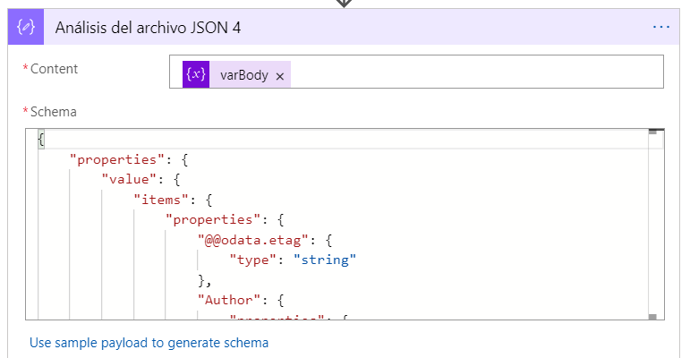

import ArticleHeader from '../../../components/article-header'

<ArticleHeader frontmatter={props.pageContext.frontmatter} />

En este artículo os mostraré cómo podemos volcar la información
contenida en una tabla de una cuenta de almacenamiento alojada en Azure
a una de las nuevas listas de Microsoft Lists que, como sabéis, son
listas de SharePoint.

**ANTECEDENTES**

Hace poco, estuve en conversaciones con el *Cloud Enablement Desk* de
Microsoft para poder incluir mi compañía (ILUNION IT Services) en el
marketplace comercial de Microsoft con una oferta SaaS. El caso es que,
para poder hacerlo, un requisito es conectar la oferta con un CRM para
volcar los Leads que se vayan generando. En caso de no disponer de un
CRM, se puede hacer mediante una tabla de almacenamiento en Azure (Azure
Table Storage) que es la opción que yo utilicé.

**[NOTA]**: Aquí está el enlace de Microsoft sobre cómo crear esta
tabla:\
<https://docs.microsoft.com/es-es/azure/marketplace/partner-center-portal/commercial-marketplace-lead-management-instructions-azure-table>

En esa página hay un tutorial sobre cómo crear un flujo de Power
Automate para enviar un correo con los registros de la tabla. Tened en
cuenta que los conectores de este tipo son Premium.

**[NOTA]**: Aquí os dejo un enlace por si queréis ver más
información sobre las Azure Table Storage:
<https://azure.microsoft.com/en-us/services/storage/tables/>

Una vez creada la tabla en mi entorno de Azure y asociada correctamente
al Marketplace, queda la parte de cómo acceder a la información alojada
en esa tabla. Para ver los registros de estas tablas, podemos utilizar
la herramienta "Microsoft Azure Storage Explorer" y ahí podremos
comprobar que las tablas de Azure Storage almacenan los datos con
formato JSON.

Para obtener los datos de una forma más visual y además evitar el tener
que acceder recurrentemente a la herramienta del Storage Explorer para
ver si teníamos nuevos registros (leads) en la tabla, se me ocurrió el
implementar una Logic App en un entorno de Azure que volcase el
contenido de mi tabla en una lista de Microsoft Lists. A continuación,
os muestro cómo lo he implementado.

**PROCESO COMPLETO**

***[PASO 1: Crear la Lista y la columna PrimaryKey]***

Para almacenar el contenido y probar las características de Microsoft
Lists, lo primero que hice es crear una lista de este tipo en uno de los
equipos que utilizo habitualmente en Teams. Para ello, basta con agregar
una nueva pestaña en el canal, seleccionar la aplicación de **Lists**,
pulsar en Guardar y después pulsar en '*Crear una lista*'. Desde ahí,
podréis elegir entre crear una lista en blanco, o escoger una plantilla
de las que ya vienen predefinidas:

Las listas de Microsoft Lists no son más que listas de SharePoint a las
que se les han aplicado una serie de estilos para que tengan un formato
más amigable. Así pues, la lista que generé en mi equipo de Teams, se
encuentra alojada en la colección de sitios de SharePoint de dicho
equipo.

Una vez creada la lista, procedí a agregarle una columna nueva de tipo
'*Una línea de texto*' que llamé '*PrimaryKey'* que me servirá
posteriormente para identificar si el registro ya existe en la lista.
Para ello, basta con situarse en la última columna de la lista y
seleccionar la opción '*Agregar columna'*.

***[PASO 2. Crear la Logic App]***

Dado que los conectores de Azure Storage de Power Automate son de tipo
Premium, decidí utilizar mi entorno Azure para implementar allí una
aplicación lógica que se encargase del proceso de volcado de
información. Para crear la Logic App, podéis buscar en el buscador del
portal de Azure el texto '*Logic apps'* y seleccionar el Servicio para
acceder a la página correspondiente. Desde allí, podréis ver todas
vuestras aplicaciones lógicas que hayáis creado anteriormente y podréis
crear una nueva seleccionando la opción **Add**.

Una vez pulsado el botón Add, bastará con elegir suscripción, grupo de
recursos donde queréis alojarla (en mi caso, el mismo donde tengo la
Azure Table Storage), ubicación (región), el nombre que queráis que
tenga y pulsáis en '*Review + create'*.

Una vez creada la Logic app, podréis comenzar con su configuración
utilizando la opción 'Logic app designer'.

La primera vez que accedamos, podremos seleccionar alguna plantilla que
se adapte a vuestras necesidades o partir de un disparador. También
tenéis la opción de partir directamente de cero utilizando la opción
*Blank Logic App* (que es la que yo utilicé)

Si es la primera vez que utilizáis las Logic apps, veréis que el
diseñador es exactamente igual que el que utiliza Power Automate. No en
vano, Power Automate está montado sobre el motor de Logic apps.

***[PASO 3. Diseño de la Logic App]***

Una vez en la pantalla del diseñador, configuraremos nuestra aplicación
lógica utilizando los siguientes pasos:

*Trigger (disparador)*

Dado que no hay un trigger que se dispare cada vez que se detecta un
nuevo registro en la Azure Table Storage (al menos yo no lo he
encontrado), lo que hice es utilizar un disparador de tipo recurrente.
Es decir, que se ejecute con una frecuencia determinada. Para ello,
buscaremos el disparador de tipo recurrente en la sección
*Programación*.

En mi caso, lo configuré para ejecutarse todos los días a las 7 a.m.

*Variables*

Las variables no pueden ser inicializadas dentro de los bloques de un
flujo. Por esta razón, lo primero que hace el proceso al ejecutarse es
inicializar las variables que usaré más adelante. En este caso, utilizo
una variable para guardar el cuerpo de una consulta de SharePoint y otra
con la dirección de correo donde enviaré los mails de aviso. La opción
de inicializar variable la encontraréis en la sección *Variables*:

Y las inicializaremos de la siguiente forma:

*Ámbito (Try)*

Para poder controlar los errores que se produzcan en la ejecución de
nuestro proceso, todos los pasos los vamos a incluir dentro de un
contenedor que vamos a denominar Try. Para ello, introduciremos un
*Ámbito* que se encuentra dentro de la sección *Controles*.

*Obtener todos los registros de la tabla*

Ahora es el momento de consultar todos los registros almacenados en mi
tabla de Azure. Para ello, dentro de nuestro contenedor Try, agregaremos
una acción y buscaremos la denominada como '*Obtener entidades*' de la
sección '*Azure Table Storage*'.

Una vez seleccionada, tendremos que hacer la conexión con la tabla. Para
ello, pulsaremos en la opción de rellenar la información manual e
introducimos los siguientes datos:

-   Nombre de la conexión: nombre descriptivo para la conexión que va a
    establecer entre este flujo y la tabla.

-   Nombre de cuenta de almacenamiento: nombre de la cuenta de
    almacenamiento para la tabla. Puede encontrarlo en la página Claves
    de acceso de la cuenta de almacenamiento.

-   Clave de almacenamiento compartida: valor de clave de la cuenta de
    almacenamiento de la tabla. Puede encontrar este valor en la página
    Claves de acceso de la cuenta de almacenamiento.

Tras establecer la conexión, ya podréis seleccionar la tabla en concreto
de la que queréis extraer las entidades (registros). En mi caso, la
tabla es la denominada *marketplaceleads*.

Si queréis, podéis establecer algún tipo de filtro para que sólo os
devuelva los últimos registros, aunque, en mi caso, como hay pocos
registros en la tabla, obtengo todos y, posteriormente, hago la
comprobación utilizando la columna *PrimaryKey*.\
Para agregar el filtro, podéis utilizar el desplegable '*Add new
parameter*' y seleccionar '*Filter Query*'.

*Recorrer los registros (entidades) y obtener la información (parseo)*

Ahora es el momento de recorrer los registros obtenidos de la tabla y
verificar si ya lo habíamos insertado en nuestra lista anteriormente.
Como la información que tenemos en las Azure Table Storage están en
formato JSON, vamos a formatearla (parseo) para poder extraerla en un
modo más estructurado. De hecho, la acción de obtener entidades nos
devolverá los registros con formato JSON. Por eso, lo primero que vamos
a utilizar es la operación de '*Parse JSON'* que hay en la sección de
'*Data Operations'*.

Una vez agregada la acción, en la parte del contenido incluiremos el
elemento actual (Current ítem) y en la parte de *Schema* debemos
introducir el esquema de los datos que obtenemos. Para sacar nuestro
esquema, podéis hacer una ejecución previa del flujo y en la vista de
ejecución, copiar los datos de un registro (sólo uno) del apartado
**Outputs** de la acción de '*Obtener entidades'* y pegarlo en la zona
de '*Use sample payload to generate schema'*:

Así, la acción quedará similar a esta:

Ahora que tenemos la información de nuestro registro, queremos obtener
los datos del campo "CustomerInfo" que se almacenan en la tabla en
formato JSON. Por ese motivo, vamos a hacer un nuevo parseo utilizando
un procedimiento como el anterior. Para el esquema utilizaremos el
Output de nuestro campo en cuestión (*CustomerInfo*), de forma que la
acción quedará de la siguiente forma:

Con estas dos acciones, dispondremos de todos los datos de nuestro campo
CustomerInfo en un formato legible para poder proceder a la inserción en
nuestra lista.

*Comprobar si ya hemos introducido ese elemento en nuestra lista.*

Ahora que tenemos los campos JSON en un formato adecuado, podemos hacer
una consulta a nuestra lista de SharePoint para ver si ya habíamos
creado ese elemento con anterioridad. Para ello vamos a utilizar la
columna PrimaryKey que creamos en la lista. Esta columna guarda la
concatenación de los campos "*PartitionKey*" y "*RowKey*" de cada
registro, por lo que nos bastará con hacer una búsqueda en la lista
utilizando un filtro OData con esa columna. Por tanto, cogeremos la
acción de '*Obtener elementos'* que hay en la sección *SharePoint* y
establecemos la conexión con nuestra lista de SharePoint:

Una vez establecida la conexión con nuestra lista, introducimos el
filtro de la siguiente forma:

PrimaryKey eq \'@{trim(body(\'Análisis_del_archivo_JSON_3\')?\[\'PartitionKey\'\])}-@{trim(body(\'Análisis_del_archivo_JSON_3\')?\[\'RowKey\'\])}\'

De forma que nuestra acción quedará como sigue:

El resultado de esta consulta lo vamos a almacenar en la variable
varBody que inicializamos al comienzo del flujo. Para ello seleccionamos
la opción 'Establecer variable' que hay en la sección Variables.

Seleccionamos nuestra variable y le asignamos el valor del body de la
consulta anterior (List of ítems)

Una vez que tenemos el cuerpo de la respuesta en nuestra variable, es el
momento de volver a ejecutar un parseo de esa variable para poder leer
su contenido que se recibirá en formato JSON. Así pues, utilizaremos de
nuevo la operación de '*Parse JSON',* pero ahora con la variable
*varBody* y sacando el esquema del Outputs de un lanzamiento previo:

Ahora, utilizando la acción de *Redactar* que hay en la sección de
'*Operaciones de Datos'*, vamos a poder verificar la longitud del valor
devuelto por la consulta para ver si nos ha devuelto algún elemento.
Para ello utilizaremos la siguiente expresión:
\@length(body(\'Análisis_del_archivo_JSON_4\')?\[\'value\'\])

Quedando la operación de la siguiente forma:

Ahora ya podemos establecer la condición de si el resultado es igual a
0, o no. En caso afirmativo, indicaría que es un registro nuevo ya que
la consulta no devolvió resultado para esa *PrimaryKey*. De lo
contrario, indicaría que ya existe un elemento en nuestra lista con esa
*PrimaryKey*, por lo que no tenemos que crearlo de nuevo y podremos
concluir el proceso para este registro. Por tanto, tendremos la
siguiente condición:

En caso afirmativo de esta condición, vamos a crear un nuevo elemento en
nuestra lista de SharePoint con todos los valores que hemos extraído en
los parseos de JSON anteriores. Por tanto, en la rama del **True** de
nuestra condición, agregaremos un paso nuevo utilizando la opción
'*Crear elemento'* de la sección *SharePoint*.

Y estableceremos todos los campos y valores que queremos almacenar. Es
muy importante en este paso que establezcamos correctamente el campo
*PrimaryKey* para poder hacer las consultas en próximas ejecuciones. La
acción quedará configurada de esta forma:

Ahora sólo nos queda incluir una nueva acción para enviar un correo de
aviso de la llegada de este nuevo lead a nuestra tabla. Para ello
escogeremos la opción '*Enviar correo (V2)*' de la sección '*Office 365
Outlook'* y estableceremos la conexión.

Configuraremos la acción con el texto que deseemos para que quede con un
aspecto similar al siguiente:

Y, con este paso, podemos dar por concluido el proceso de inserción del
registro.

*Ámbito (Catch)*

El último paso del proceso es definir qué ocurrirá si nuestro proceso
falla. Para ello, volveremos a agregar un nuevo ámbito que denominaremos
Catch y que estará después del ámbito Try que definimos inicialmente.

Una vez agregado, incluiremos en él las acciones que queramos que se
realicen cuando haya un error en el flujo. En mi caso, incluí el envío
de un correo de aviso.

Para definir que este ámbito sólo se ha de lanzar cuando haya un error,
nos situamos en las opciones del ámbito, seleccionamos la opción de
'*Configurar ejecución posterior'* y marcamos que sólo se ejecute si al
ámbito *Try* tiene errores (has failed).

Ya sólo nos falta realizar la ejecución de nuestra Logic App, para
comprobar que se ejecuta correctamente y se vuelca el contenido en la
lista.

**[NOTA]**: Cuando establezcáis las conexiones, es importante que
utilicéis usuarios cuyas contraseñas no expiren para evitar tener que
actualizarlas cada vez que éstas cambien.

***[PASO 4. Probar nuestra Logic App]***

Para lanzar nuestro flujo de la Logic App, basta con pulsar el botón Run
ubicado en la parte superior del diseñador

Una vez pulsado, veremos cómo se ejecuta el proceso:

Y una vez finalizado el proceso, podremos ver cómo nuestros registros se
han cargado correctamente en la lista de Microsoft Lists:

Con esto concluyo el artículo. Espero que os haya resultado interesante
y podáis aprovechar la información si alguna vez tenéis una necesidad
parecida.

**Enrique Sánchez Moreno**  
Cloud Services Manager en ILUNION IT Services  
[www.esanchezm.com](http://www.esanchezm.com)