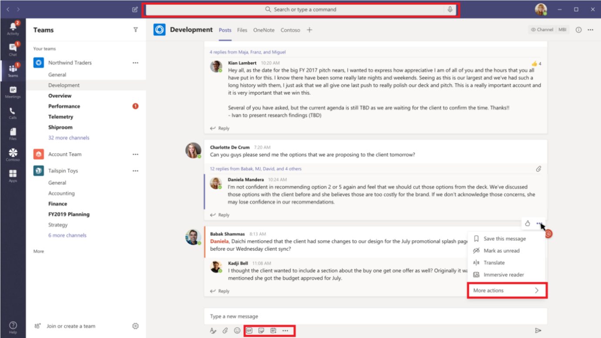
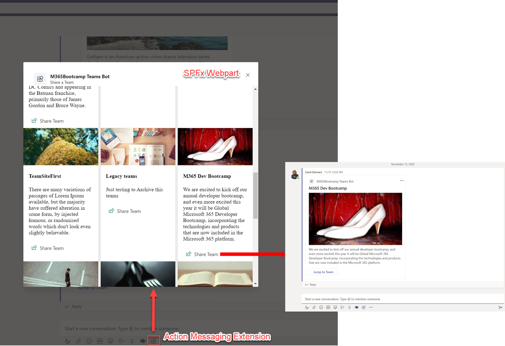
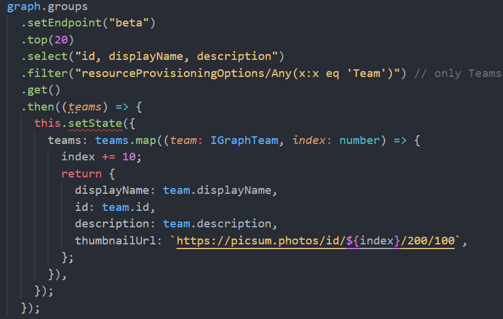
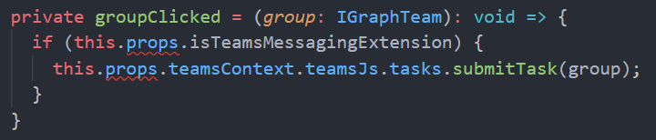
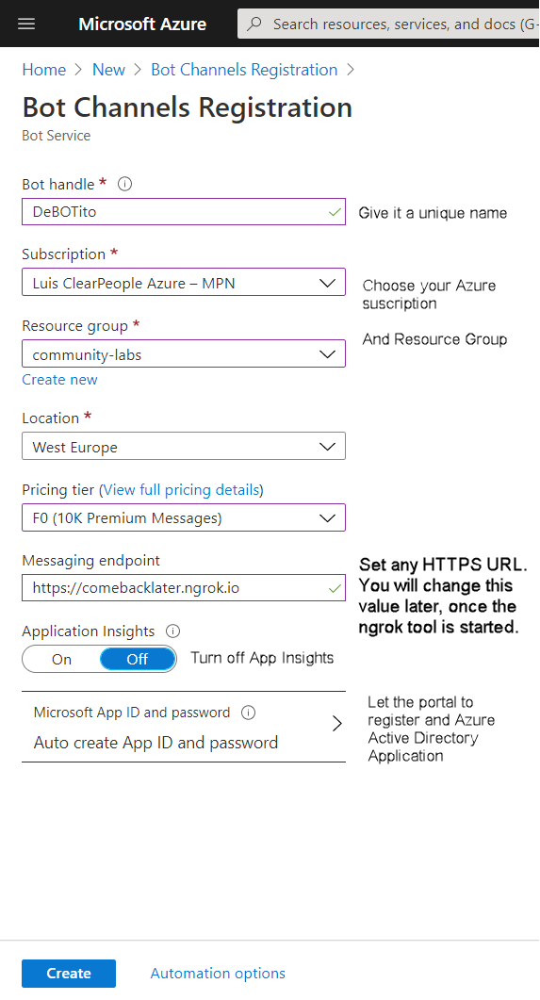
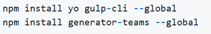
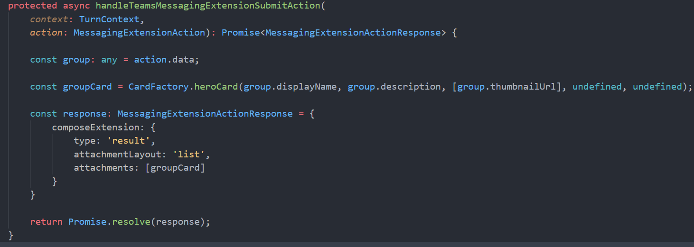

En este artículo, vamos a ver cómo podemos reutilizar nuestro
conocimiento del SharePoint Framework, para poder desarrollar *messaging
extensions* para Microsoft Teams.

**Introducción a MS Teams messaging extensions**

Si todavía no sabéis lo que es una *messaging extension* de Teams, en el
siguiente enlace oficial de MS se explica perfectamente:

https://docs.microsoft.com/en-us/microsoftteams/platform/messaging-extensions/what-are-messaging-extensions

Básicamente, *messaging extensions* nos permite extender Teams con
nuestro propio código, tanto a la hora de componer mensajes, como sobre
mensajes ya existentes. La siguiente imagen describe claramente en qué
puntos podemos incluir nuestras propias acciones:



Existen 3 tipos de extensiones:

-   **Comandos de acción**: Permiten presentar a los usuarios un
    elemento emergente modal para recopilar o mostrar información.
    Cuando envían el formulario, el servicio web puede responder
    insertando un mensaje en la conversación directamente o insertando
    un mensaje en el área de mensaje de redacción y permitiendo al
    usuario enviar el mensaje. Incluso puede enlazar varios formularios
    entre sí para flujos de trabajo más complejos.

-   **Comandos de búsqueda**: Permiten a los usuarios buscar información
    en un sistema externo y, a continuación, insertan los resultados de
    la búsqueda en un mensaje.

-   **Apertura de vínculos**: Permiten invocar a nuestro servicio cada
    vez que se pega una URL con un dominio dado en la caja de mensaje.

Ahora que ya sabemos lo que son las *messaging extensions*, viene la
buena noticia, y es que para desarrollarlas (si no por completo, una
gran parte de ellas), podemos reutilizar lo que ya sabemos de desarrollo
SPFx (desde la versión 1.11).

**Escenario**

Lo que vamos a desarrollar como parte del artículo, será una extensión
que estará disponible desde la caja de escribir un mensaje, y que nos
listará todos los Teams de nuestra Tenant (bueno, un número fijo
limitado, por simplificar), y que una vez seleccionado un Team,
incrustará una *Adaptive Card* en la caja de chat, con la información
detallada de dicho Team, para poderla enviar por el chat.

La idea es que puede que esté chateando con algún compañero que anda
buscando cierta información, que tú no le sabes dar exactamente, pero le
puedes orientar en qué Team (o Teams) puede encontrarla. La siguiente
imagen muestran el resultado final:




En nuestra solución, tendremos 2 piezas principales:

-   **SPFx WebPart**: Será un WebPart de SPFx que consultará la MS Graph
    API para obtener el listado de los Teams en la Tenant.

-   **Bot**: Será el encargado de recoger la información enviada por el
    WebPart SPFx (básicamente el Teams seleccionado de la lista), y
    componer una Adaptive Card con dicha información, para poder ser
    enviada por el chat. A día de hoy, desde el WebPart SPFx no podemos
    enviar nada por el chat, así que todavía necesitamos esta parte,
    pero como veremos, el código aquí será mínimo.

**Desarrollando nuestro WebPart SPFx para Teams extensions**

No vamos a entrar en mucho detalle en el código del WebPart. Vamos a
usar la grandísima librería del PnP JS para acceder a MS Graph y sacar
los Teams de la tenant. El snippet principal se muestra en la siguiente
imagen:



Lo importante viene ahora, donde necesitamos especificar que nuestro
WebPart debe funcionar como extensión de Teams, para ello, necesitamos
crear un archivo "**manifest.json**" en la carpeta "teams" de nuestro
proyecto SPFx.

Tenéis la base de ese fichero manifest en la siguiente URL:
[https://docs.microsoft.com/en-us/sharepoint/dev/spfx/web-parts/guidance/creating-team-manifest-manually-for-WebPart](https://docs.microsoft.com/en-us/sharepoint/dev/spfx/web-parts/guidance/creating-team-manifest-manually-for-webpart)

La parte principal de ese manifest, es el nodo "**composeExtensions**":

```json
"composeExtensions": [

{

"botId": "**** ESTE ES EL ID DE LA APP CREADA CUANDO REGISTRATE EL
BOT CHANNEL **",**

"canUpdateConfiguration": true,

"commands": [

{

"id": "shareTeam",

"type": "action",

"title": "Share Team info",

"description": "Find and share a Team",

"initialRun": false,

"fetchTask": false,

"context": [

"commandBox",

"compose"

],

"taskInfo": {

"title": "Share a Team",

"width": "700",

"height": "600",

"url":
"https://{teamSiteDomain}/_layouts/15/TeamsLogon.aspx?SPFX=true&dest=/_layouts/15/teamstaskhostedapp.aspx%3Fteams%26personal%26componentId=**WEBPART_ID**%26forceLocale={locale}"

}

}

]

}

],
```

Dicho nodo define las diferentes extensiones que queremos crear en
Teams, así como el Identificador del WebPart que queremos que se abra
cuando se pulse esa acción desde Teams. Además, debemos establecer el
Identificador del Bot que manejará el evento disparado desde el WebPart
de SPFx cuando se selecciona un Team de la lista. Posteriormente veremos
cómo registrar esa App y obtener el ID.

Nuestro WebPart, para disparar el evento que recogerá el Bot, hará uso
del mismo Framework de SPFx, que nos proporciona un objeto para ello. Lo
vemos en el siguiente snippet:




**Registro del Bot Channel en Azure**

Como decíamos, vamos a necesitar un Bot para recoger la información y
evento lanzado desde el WebPart, y mostrar esa información en el chat.
Para ello registraremos el Bot Channel en Azure. Tenéis detalle de cómo
hacer esto en el siguiente link:
https://docs.microsoft.com/en-us/azure/bot-service/bot-service-quickstart-registration?view=azure-bot-service-4.0




Una vez registrado el Bot, nos creará una aplicación en Azure Active
Directory, y es el ID de esa aplicación, el que necesitamos configurar
en el "manifest" del WebPart SPFx.


**Desarrollando nuestro Bot**

Para desarrollar nuestro Bot, vamos a utilizar la herramienta "**Yo
Teams**"



El Bot necesita una URL pública, así que para desarrollo, haremos uso de
ngrok, que además, el propio "Yo Teams" tiene un comando para arrancar
ngrok ya configurado para nuestro bot. Ten en cuenta que ngork, en su
versión gratuita, asigna una URL nueva cada vez que se arranca, por lo
que hay que cambiarla URL en el registro del Bot Channel. A nivel de
código, una vez el scaffolding hecho por la herramienta "Yo Teams",
necesitamos poco código para incrustar la información enviada por el
WebPart, a la caja del chat.



Como vemos, sobrescribimos uno de los métodos del SDK de Teams, donde en
su parámetro "action", recibimos la información enviada por el WebPart
de SPFx (el Teams seleccionado del listado). Luego hacemos uso de otro
método proporcionado por el framework, y construimos la Adaptive Card
con la información del Teams. Finalmente, devolvemos esa Adaptive Card,
que se incrusta en el chat de Teams.

Y hasta aquí el artículo. Tenéis todo el código completo disponible,
además de los pasos detallados para el registro del Bot, en el siguiente
repositorio de GitHub:

https://github.com/CompartiMOSS/Microsoft-365-Developer-Bootcamp-Virtual/tree/master/Track1/TeamsMessagingExtensionsWithSpfx

¡Hasta el próximo artículo!

**Luis Mañez** <br />
Cloud Architect en ClearPeople LTD <br />
@luismanez <br />
https://github.com/luismanez 
 
import LayoutNumber from '../../../components/layout-article'
export default LayoutNumber
