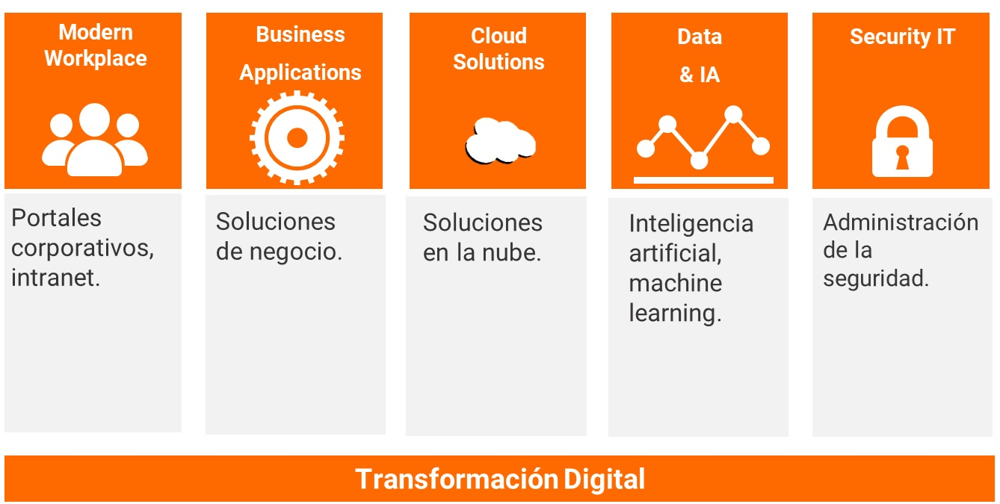

Aura es una empresa tecnológica, especializada en tecnología Microsoft,
posicionada siempre un paso por delante en aplicación de las últimas
tecnologías y estándares. No se conforma con conocer las tecnologías del
mercado, sino que cree realmente en la transformación de las empresas a
través de las tendencias más vanguardistas y novedosas aterrizando
conceptos y enfoques con una visión pragmática.

El equipo de Aura lleva más de 20 años liderando proyectos pioneros en
innovación y fomentando el cambio digital de las empresas, ayudando así
a sus clientes a superar sus objetivos, a mejorar su productividad y su
competitividad. Todo ello es posible gracias a su equipo humano que
supone su razón de ser y trabajar, valorando por encima de todo las
relaciones humanas y el talento y .... siendo el trabajo en equipo el
eje de su éxito. Su lema:

" ... predice lo que te puede afectar y reacciona antes de que suceda
... "

**¿Por qué y cómo empezó en el mundo de la tecnología?**

Aura es joven como compañía, pero con un equipo que acumula una gran
experiencia en el sector tecnológico.

El gran equipo que forma actualmente Aura se debe en parte a la unión de
perfiles polivalentes, conocidos ampliamente en el sector y que han
aunado su experiencia, basada en distintas trayectorias profesionales en
diferentes empresas, que en muchas ocasiones han coincidido en diversas
etapas de su evolución, lo que hace que el nivel de confianza y
compromiso sea pleno, con objetivo de actualización, trayectoria y
trabajo en equipo, Aura ha aunado estas inquietudes personales dando
forma a un modelo organizativo y de trabajo distinto.

El perfil que Aura busca para incorporar a su plantilla es un perfil que
se ajuste a su forma de trabajo donde prima el compañerismo, la
confianza, la transparencia, la implicación y el desarrollo avanzado
tanto profesional como personal, cada persona establece a su medida la
trayectoria en Aura. Esos son los valores que se necesitan para formar
parte de Aura.

**¿Cuáles son las principales actividades tecnológicas hoy en día?**

Aura se enfoca en las siguientes unidades de especialización:

- Modern Workplace: [Conexión y apoyo a los diferentes perfiles de una
compañía u organización para fomentar la productividad y el
compromiso](https://auragroup.es/servicios/modern-workplace/).

- Business Applications: [Desarrollo de software a medida para
proporcionar una funcionalidad
empresarial](https://auragroup.es/servicios/business-applications/).

- Cloud Solutions: [Los servicios de infraestructura hacen a las compañías
más
productivas](https://auragroup.es/servicios/aplicaciones-y-soluciones-cloud/),
rápida adaptación a necesidades y ahorro de costes.

- Data & AI: [Integración más avanzada en los procesos de negocio con
Inteligencia Artificial](https://auragroup.es/servicios/data-ia/).

- Security: [Tecnología al servicio de la seguridad para generar entornos
de trabajo seguros](https://auragroup.es/servicios/seguridad-it/).

- Transformación Digital: [Digitalización de procesos para mejorar la
eficiencia en los clientes con aporte de
valor](https://auragroup.es/servicios/transformacion-digital/).

**¿Cuáles son las principales actividades NO tecnológicas hoy en día?**

La gran familia de Aura está compuesta por personas apasionadas, con
experiencia y mucha dedicación por lo que hacen. Para conseguirlo,
desde Aura se apuesta por:

-   La identidad: Valora la implicación y el sentido de grupo, concibiendo todo el equipo humano de Aura como un conjunto global y no por áreas o de forma individual.

-   El compromiso: La dedicación en lo que se hace es un requisito fundamental en sus consultores y consultoras para conseguir la calidad, el desarrollo y la mejora continua dentro de Aura.

-   El reconocimiento: Aura con su programa de AuraCredits reconoce y premia el esfuerzo y la dedicación de sus equipos en función de acciones llevadas a cabo por sí mismos o acciones que valora la compañía (antigüedad, cumpleaños, felicitaciones de clientes, actividades personales ...).

-   El apoyo: A través de su programa AuraCare, facilita "cuidado" a la persona, acompañándola desde distintos estamentos o áreas de actividad y con diversas iniciativas desde el mismo proceso de incorporación.

-   El trabajo en equipo: Prima la labor conjunta y la integración de todos los consultores dentro de su modelo AuraTeam. La colaboración entre personas es fundamental dentro de la cultura Aura.

-   La transparencia y comunicación bidireccional: Aura apuesta por una comunicación bidireccional y transparente entre personas y de éstas con los diversos estamentos organizativos de la compañía de forma periódica.

-   La Igualdad: con programas de diversa índole que garantizan la igualdad de oportunidades entre las personas que forman Aura.

**¿Cuáles son las actividades que realiza en la comunidad técnica?**

Desde el comienzo de Aura, apuesta por la especialización dentro de
áreas estratégicas y aplicaciones tecnológicas en las empresas, para
ello apoya con patrocinio de diferentes eventos sobre tecnología
Microsoft, productos o tecnologías en las que Aura es reconocida como
puntera, para su difusión y debate de novedades y lanzamientos. Ha
colaborado patrocinando eventos de SharePoint, Microsoft365 o SQL entre
otros, así como publicaciones técnicas en foros especializados.

**¿Cuál es la visión de futuro en la tecnología de acá a los próximos
años?**

La tecnología evoluciona cada año más rápido y se redirige continuamente
con enfoques disruptivos como se ha plasmado en este último año tan
complejo. Vemos aplicaciones tecnológicas en todos los ámbitos y sobre
todos los dispositivos, esto está haciendo que las personas estén más
conectadas, informadas e incluso realicen sus labores diarias más rápido
de lo que lo hacían años atrás, hasta los dispositivos se acelera su
interconexión y aporte de información con la llegada del 5G y de
sistemas Cloud híbridos; si se añade a la ecuación modelos de
aprendizaje en sistemas basados en Inteligencia Artificial las
perspectivas para conjugar todo este ecosistema son prácticamente
infinitas. Este es el camino hacia dónde va Aura, tecnología como una
herramienta o vehículo para mejorar continuamente, ayudando a personas y
empresas a ser cada día más eficientes. Aura no cree que exista un
límite, cree que hay muchas cosas todavía por ser aplicadas, conjugadas
y la tecnología en la que Aura está especializada es la base de todas
ellas.