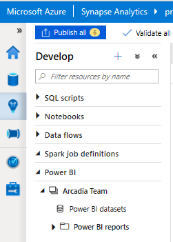

import ArticleHeader from '../../../components/article-header'

<ArticleHeader frontmatter={props.pageContext.frontmatter} />

En este articulo hablaremos sobre esta plataforma de datos en Azure, que
aún están en Vista Previa Publica pero que viene pisando fuerte en el
mundo de datos a nivel Enterprise. En términos generales Microsoft ha
encontrado la manera de generar una atractiva opción para todos aquellos
profesionales que trabajan con datos, para mejorar no solo la
integración sino la experiencia de usuario.

**Conceptos**

Comencemos con conceptos básicos de esta nueva plataforma. Al dirigirnos
al portal de Azure y utilizando la búsqueda con la consigna de Synapse
como palabra clave encontramos:

La opción de Azure Synapse Analytics - Workspaces, que es la que nos
dará acceso a un portal de manejo general de nuestra plataforma:

Por otro lado, la opción de Azure Synapse Analytics -- previamente SQL
DW nos da acceso a la creación de Synapse SQL pools.

La visión que anteriormente teníamos de la generación de un
Datawarehouse moderno era a través de varias capas en la arquitectura
como: Ingestión de datos, Preparación, Transformación y Limpieza,
Almacenamiento, Servicio y Visualización. Todas ellas se lograban a
través de diferentes servicios de Azure como: Azure Data Factory, Azure
Databricks, Azure SQL DW, Azure Data Lake Storage, Power BI, como vemos
en la siguiente imagen:

**Capacidades**

El concepto detrás de la nueva interfaz es el de integrar los servicios
en una única experiencia de usuario donde accedamos rápidamente para
monitorear e interconectar los mismos:

De esta manera tenemos un ecosistema integrado de plataforma de datos
para cada escenario: Inteligencia Artificial, Machine Learning, Internet
of Things, Aplicaciones Inteligentes, Analítica de Datos. A su vez esta
nueva interfaz se agregan piezas muy interesantes como la de contar con
una plataforma basada en servicios con muy poca necesidad de
codificación. En caso de ser necesario codificar además contamos con la
opción de agregar código en nuestro lenguaje favorito: SQL, Python,
.NET, JAVA, Scala y R.

Otras de las mejoras de esta plataforma es contar con tecnología
serverless: SQL Analytics para procesamiento batch, y streaming, como
también Spark para procesamiento de big data con Python, Scala, R y
.NET.

La plataforma además cuenta con una instancia de Azure Data Lake
integrada y acceso directo Data Verse de nuestra Power Platform.

Otros de los puntos a destacar es SQL On-Demand como experiencia
serverless que nos permite auto escalamiento y manejo automático para
tener menor costo de mantenimiento y la capacidad de pagar solo y
efectivamente por uso (no hay recursos reservados).

Accedemos de una forma rápida a los nodos de SQL donde la performance es
óptima para la ingestión de datos. La inferencia de schemas también es
un punto para destacar, donde la lectura es automática en una variedad
de formatos (CSV, JSON, TXT, Parquet).

En ciertos puntos también cabe la pena destacar la tecnología Multicapa
para mejorar la performance en visualizaciones de cara al usuario de
negocio:

-   Capacidad de acceder a los datos vía DirectQuery.

-   Cache ResultSet -- pool de cómputo y con elasticidad para manejo de
    clúster .

-   Cache In-Memory.

-   Materialized Views: opciones de hacer joins y agregaciones
    predefinidas de datos para garantizar consistencia transaccional y
    optimización automática de queries.

A continuación, un ejemplo de creación de Materialized Views, que además
podremos combinar con modelos composites en Power BI:

Por otro lado, la misma interfaz general de Azure Synapse Analytics nos
permite desarrollar pipelines de ingestión de datos, integrando no solo
SQL Scripts, Notebooks de Apache Spark, Dataflows, y exportando
directamente la información generando datasets de Power BI:

Como vemos en la imagen anterior la misma interfaz nos da la capacidad
de navegar entre las diferentes capas de acceso a datos (data), de
ingestión de datos (develop), orquestación de datos (pipelines) y de
monitoreo de la plataforma general (monitor).

**Integración con Power BI**

Además, contamos con el beneficio de integrar Synapse con Power BI de
una forma sencilla, permitiendo crear reportes en un Workspace,
actualizando reportes en tiempo real, con la capacidad de visualizar,
explorar y analizar los datos:

Como podemos ver a continuación, desde nuestra capa de Desarrollo en
Synapse accedemos a un Workspace de Power BI donde podemos explorar
nuestros datos en forma directa sin salir de la plataforma permitiendo
que el usuario pueda ver en tiempo real el impacto de las
transformación, limpieza e ingestión de datos desde diferentes fuentes:

De la imagen anterior se desprenden varias conclusiones interesantes al
momento de trabajar en Synapse: No solo trabajar en la conexión de
diferentes servicios como Power BI, otras fuentes de información, sino
la capacidad de trabajar con SQL scripts para la manipulación de datos,
Notebooks en nuestro Spark pool para la preparación de datos, dataflows
para limpieza de datos, y al conectarnos con un área de trabajo de Power
BI la directa visualización de nuestro conjunto de datos, hasta el punto
de generemos un reporte y lo visualicemos de forma inmediata.

**Conclusión**

A modo de conclusión, se vienen muchas funcionalidades a esta plataforma
que busca de esta manera integrar el trabajo de Arquitectos, Ingenieros
de Datos, y Científicos de datos en una interfaz muy amigable y que está
en constantes actualizaciones.

**Gastón Cruz**  
Data Platform MVP | Solution Principal at Slalom