import ArticleHeader from '../../../components/article-header'

<ArticleHeader frontmatter={props.pageContext.frontmatter} />

Microsoft Bookings es una aplicación disponible de serie en distintos
planes de Microsoft 365 que originalmente estaba pensada para que los
pequeños negocios pudiesen contar con una solución que facilitase la
reserva de citas en sus establecimientos u oficinas. Sin embargo, con la
llegada de Microsoft Teams y sobre todo con el COVID-19, Microsoft está
posicionando a Bookings como una solución simple para facilitar no solo
la reserva de citas en negocios de distinta naturaleza, sino planificar
consultas médicas por parte de pacientes y/o doctores, facilitar que
padres y alumnos puedan tener reuniones con profesores, etc. En este
artículo haremos un repaso a los escenarios de uso de Microsoft Teams, a
sus también a sus principales características y a como configurar la
solución.

**Casos de Uso de Microsoft Bookings y características principales**

Sin duda, los escenarios de uso de una solución como Microsoft Bookings
son variados en cuanto a que facilita una gestión sencilla de citas
tanto en escenarios in-person (no posibles hoy en día) como virtuales. A
modo de ejemplo, en la Imagen 1 se pueden ver algunos de los casos de
uso más habituales para Microsoft Bookings.

En cuanto a los beneficios que Bookings aporta a una organización, la
Imagen 2 muestra un resumen de estos en base a las principales
características de la aplicación.

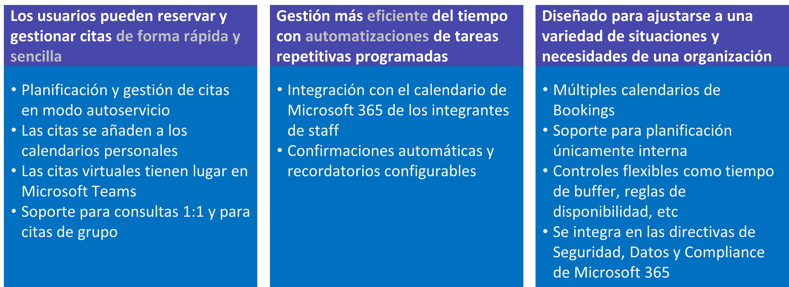

**Disponibilidad de Microsoft Bookings en Microsoft 365**

A nivel de disponibilidad de Microsoft Bookings, normalmente la
aplicación está disponible para casi todos los planes de Microsoft 365
aunque dependiendo de como se haya adquirido la suscripción
correspondiente, Bookings estará disponible de serie o será necesario
añadir el Add-on de Business Apps. El resumen de disponibilidad de la
aplicación en Microsoft 365 es el siguiente:

-   Disponible por defecto en los siguientes planes de Microsoft 365:

    -   Office 365 Edu A3, Office 365 Edu A5, Microsoft 365 Business
        Standard, Microsoft 365 Business Premium.

    -   Desde agosto de 2020 en tenants GCC G3 y GCC G5.

    -   Subscripciones de Microsoft 365 compradas de forma directa
        (Desde mayo de 2020).

-   Disponible de forma indirecta a través del correspondiente Add-On:

    -   Suscripciones adquiridas mediante un EA (Enterprise Agreement) o
        bajo modelo CSP.

    -   Esta era la forma de disponer de Bookings hasta mayo de 2020 en
        suscripciones Office 365 E3, E5.

**Configuración y uso de Microsoft Bookings**

En primer lugar, a nivel de controles de administración Bookings
únicamente viene con un par de controles disponibles en la Settings →
Org settings → Bookings:

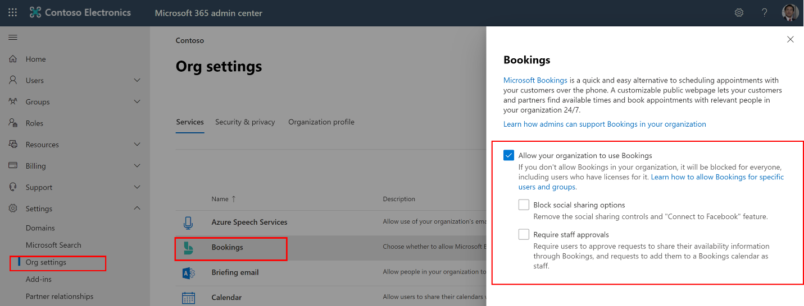

En lo que a habilitar/deshabilitar Bookings se refiere, un administrador
puede hacerlo a través de comandos PowerShell de Exchange Online
provistos para este propósito. Pero en este artículo partimos de la base
de que nos interesa utilizar Bookings, por lo que lo tendremos
habilitado y solo tendremos que asignar la correspondiente licencia a
los usuarios que vaya a utilizar Bookings:

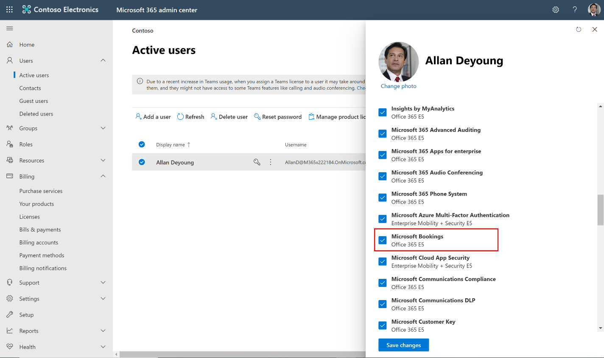

A partir de este momento, podemos empezar a revisar como configurar
Bookings accediendo a la solución desde el lanzador de aplicaciones
(**[Nota:]{.ul}** Bookings está construido sobre la base de elementos de
Exchange Online como iremos viendo a lo largo de las siguientes
páginas). Empezaremos revisando cada una de las opciones del menú de
navegación de Bookings que tendremos disponible por cada calendario de
que demos de alta en la solución:

-   Business Information permite como su nombre indica completar
    información relativa a la organización que ofrece servicios
    reservables mediante Bookings: Nombre, dirección, teléfono, logo,
    etc. Además, desde esta sección podremos indicar los horarios de
    atención al público.

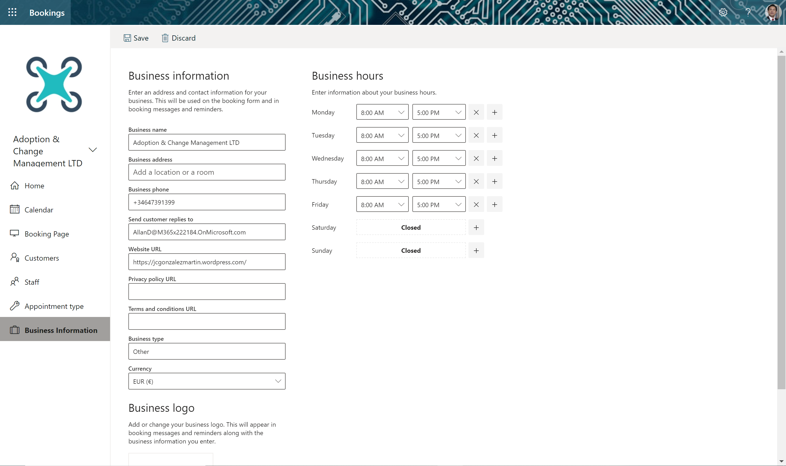

-   Appointment type permite establecer los tipos de citas que se pueden
    reservar a través de Bookings Por cada appointment podremos definir
    datos como nombre, descripción, ubicación, si se va a usar Microsoft
    Teams para generar un enlace para la cita, etc. También se puede
    asignar staff concreto para el appointment en concreto, la
    configuración de las notificaciones y los campos de información que
    se solicitarán a cualquier cliente, paciente o alumno que realice
    una reserva a través de la pçagima publica de Bookings. Desde la
    sección Appointmet type veremos todos los tipos appointments creados
    y tendremos la posibilidad de actualizarlos.

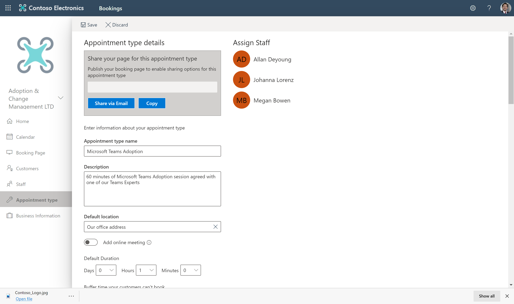

-   Staff, proporciona acceso al listado de Staff asociado al calendario
    de Bookings actual. Podremos añadir nuevo Staff o actualizar Staff
    existente indicando datos como la persona concreta de la
    organización, su e-mail o las horas de atención al público (que
    pueden ser diferentes a las definidas globalmente para el
    calendario).

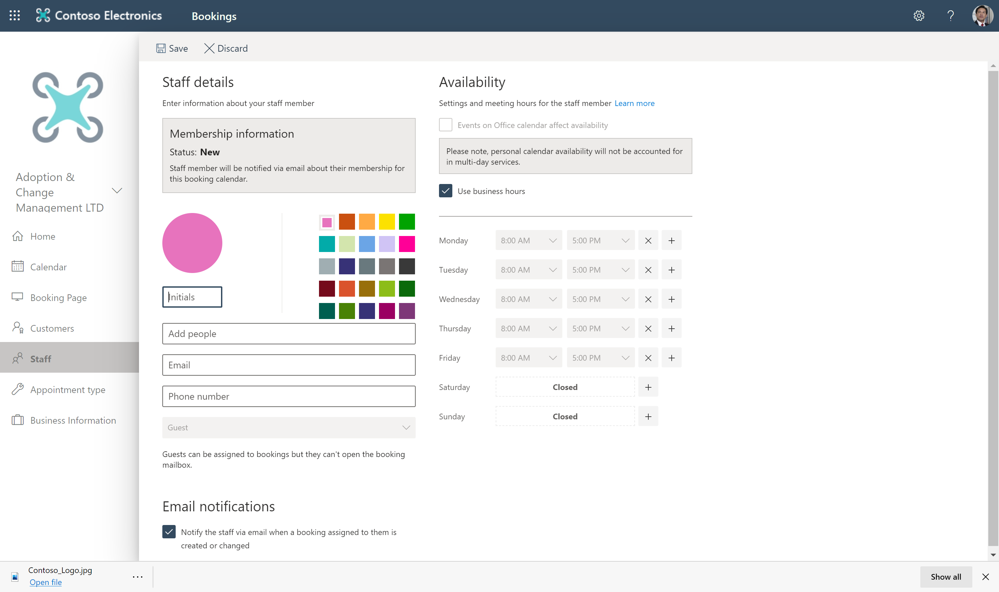

-   Customers, permite mantener un listado de clientes o contactos en
    Bookings sin pretender reemplazar a un CRM.

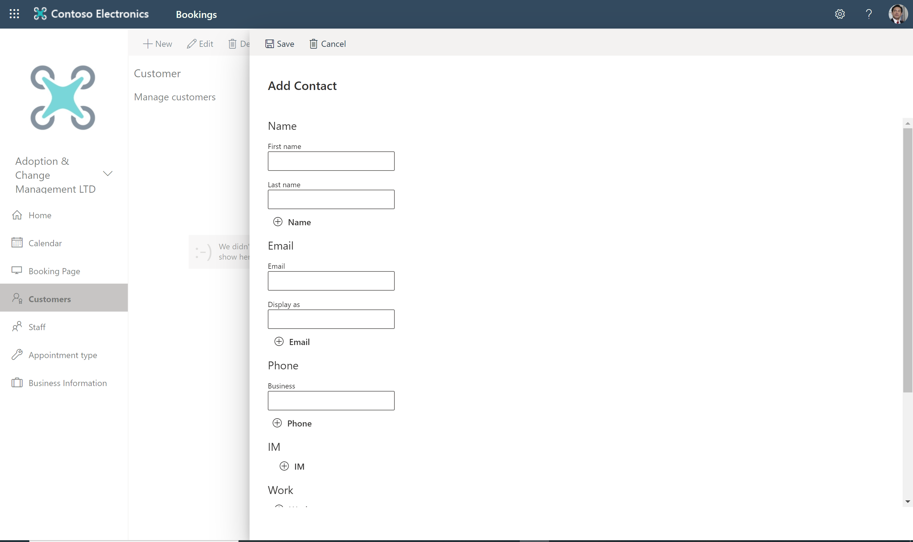

-   La sección "Booking Page" es la que nos permite configurar la página
    pública (con acceso anónimo o no) desde la que facilitar la reserva
    de servicios y del staff correspondiente. Podremos aplicar branding
    mínimo a dicha página como elegir un tema a aplicar, establecer la
    política de planificación en aspectos como los incrementos de
    tiempo, la configuración regional a utilizar o el consentimiento de
    datos cuando se realiza una reserva.

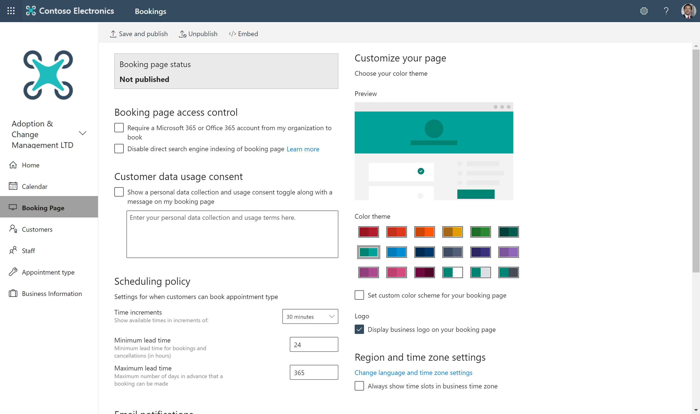

A partir de aquí, podemos decir que ya tenemos las herramientas
necesarias para configurar Bookings y comenzar a utilizar la aplicación
comenzando por la página pública de Bookings que tendrá una apariencia
similar a la que se muestra en la Imagen 10. Como vemos:

-   Se puede seleccionar entre los servicios disponibles.

-   Para una fecha en concreta, podremos elegir entre el Staff
    disponible y de acuerdo con su disponibilidad.

-   Además, se solicitarán los campos de información definidos en el
    tipo de servicio que se va a reservar.

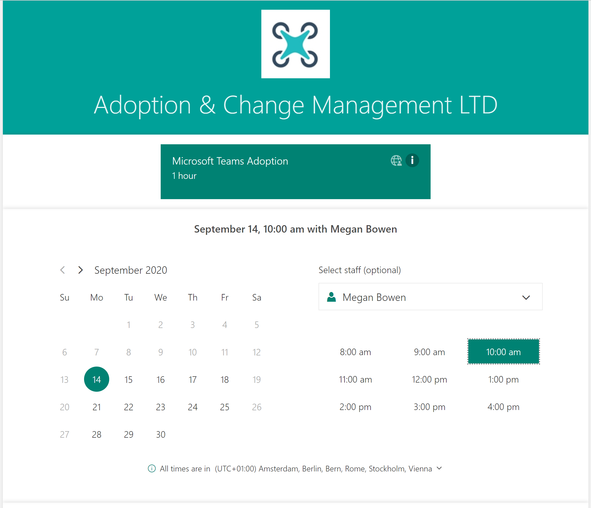

Una vez realizada la reserva, tanto el staff reservado como el
cliente/paciente/alumno recibirán un e-mail de confirmación de la
reserva en el que se incluye también en enlace de la sesión de Microsoft
Teams.

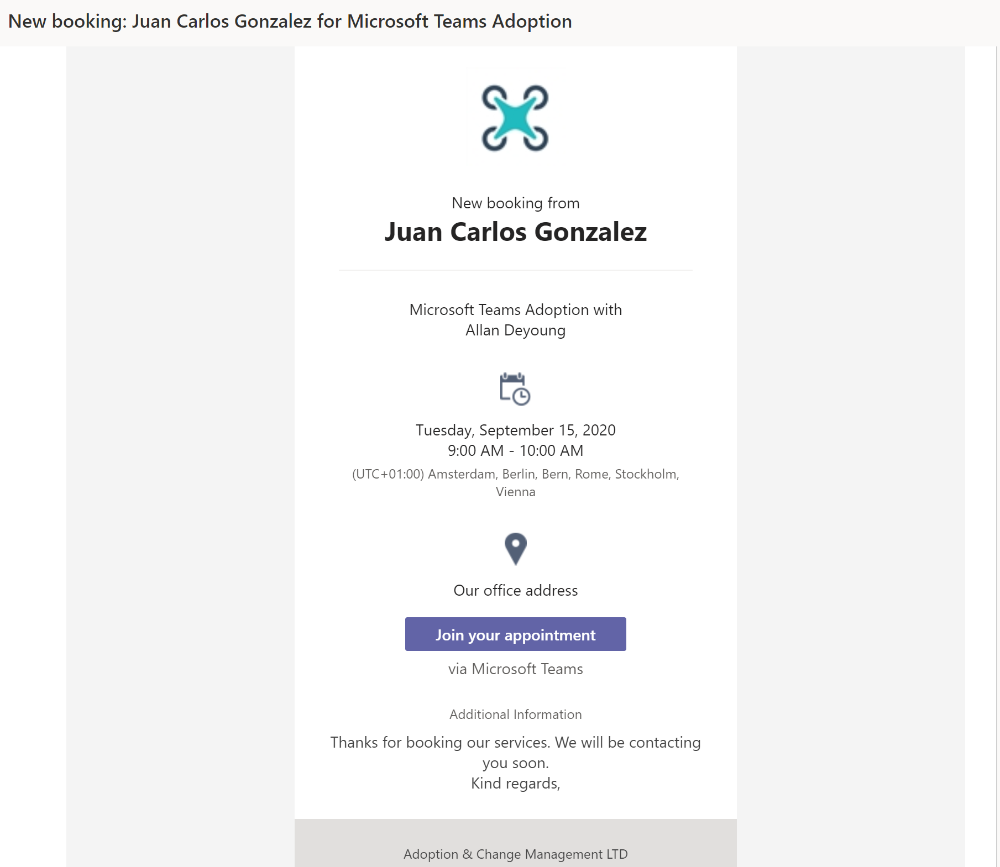

Por supuesto, las distintas citas, así como la disponibilidad del Staff
se podrá ver en todo momento a través del calendario de Bookings
integrado en la App.

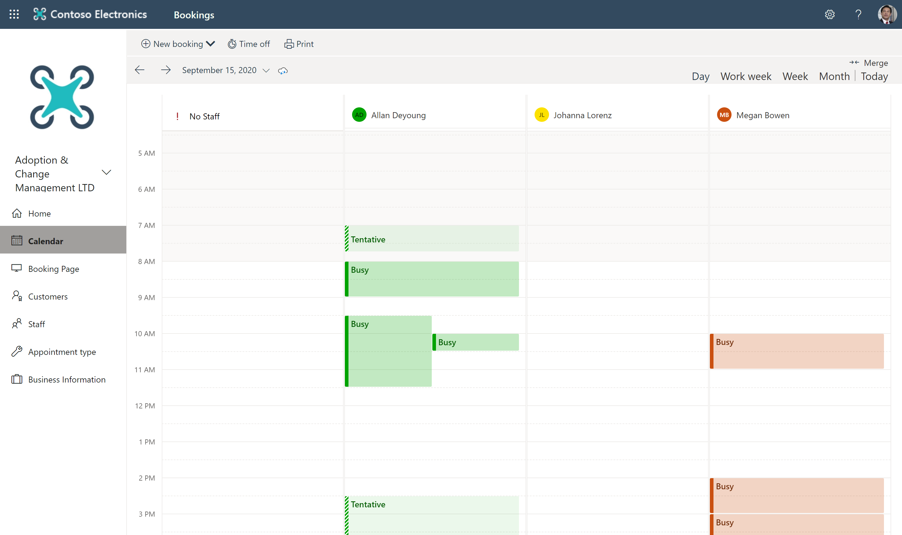

**Integración en Microsoft Teams**

Además de la Aplicación de Microsoft Bookings, disponemos de una versión
"ligera" de esta en la forma de una App para Microsoft Teams que, por
defecto, como se puede comprobar en el Teams Admin Center, está
configurada para que cualquier usuario pueda añadir la App en Teams.

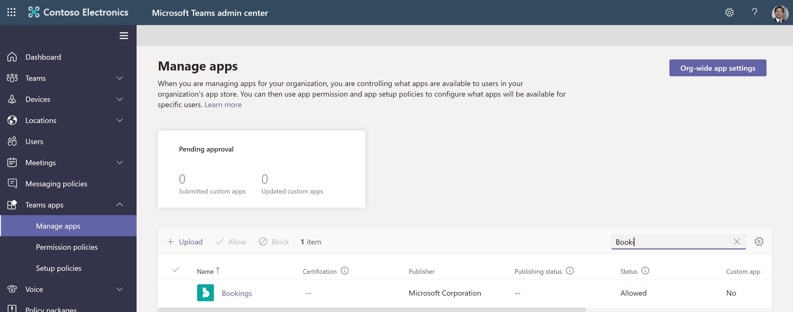

De esta forma, añadir la App de Bookings en Teams es tan sencillo como
localizarla en el Catálogo de Aplicaciones de Teams. Como es esperable,
previamente a añadir la App veremos los detalles de esta.

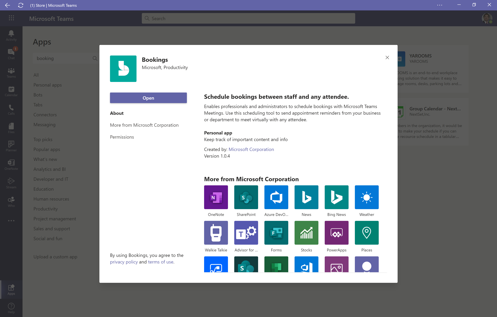

Las principales funcionalidades de la App de Bookings para Microsoft
Teams son las siguientes:

-   Por defecto se muestra uno de los Calendarios de Bookings definidos
    ya que desde la App es posible gestionar distintos calendarios desde
    Bookings. En ese calendario podremos ver las citas reservadas y la
    disponibilidad del Staff.

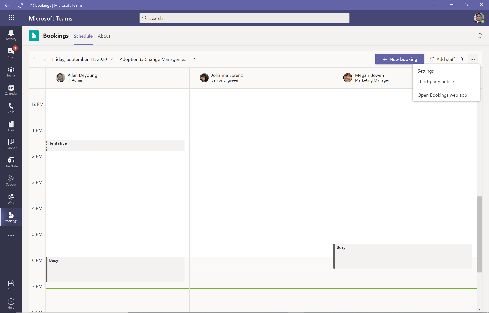

-   Desde la App podremos modificar algunas de las configuraciones de
    Bookings (no todas), añadir Staff o simplemente reservar una cita.

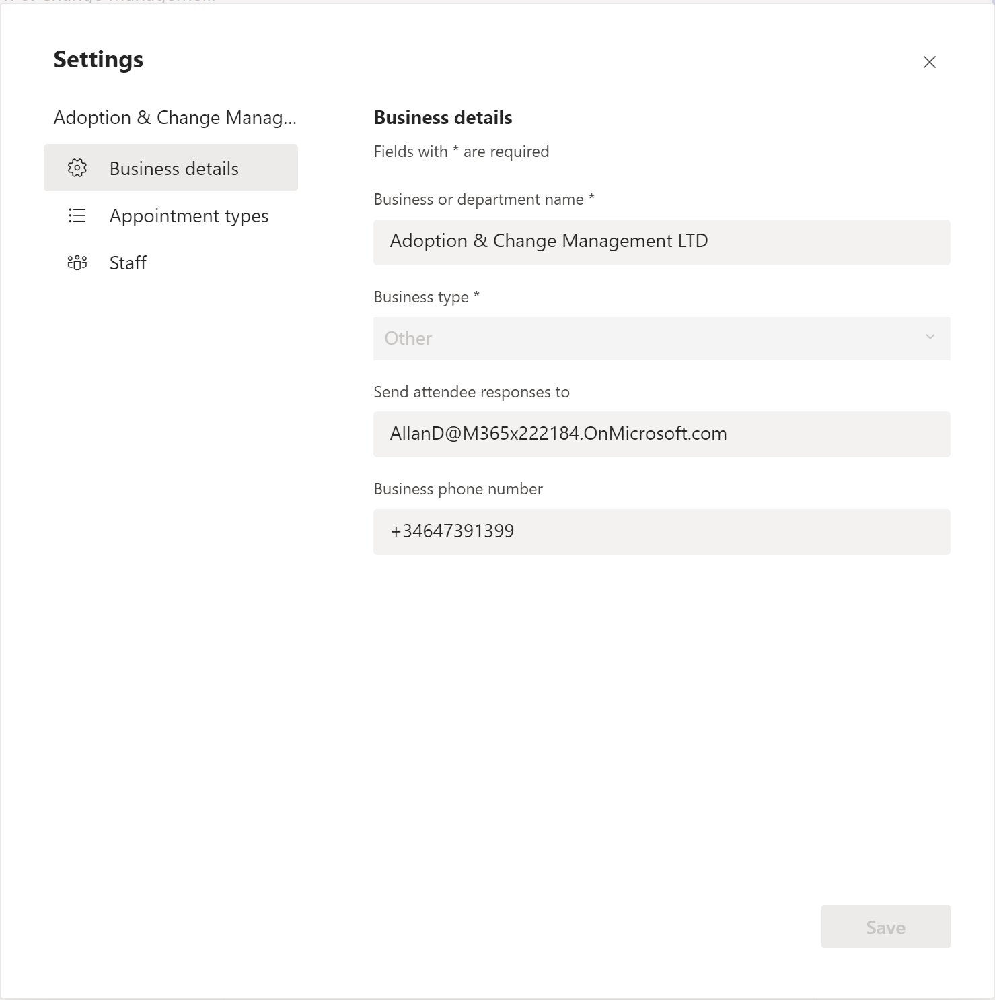

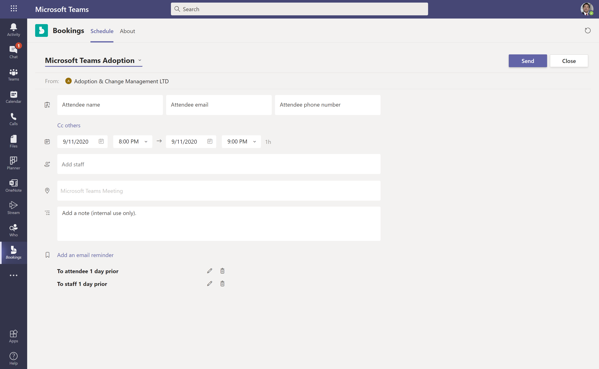

Si os preguntáis si hoy hay paridad entre la App Web de Bookings y la
App de Teams, la respuesta es que no y en la siguiente Tabla podéis ver
las principales diferencias a nivel de funcionalidad entre ambas Apps.

 | **Característica**                                                              |  **App Web de Bookings**|   **App de Bookings en Teams**
 | ---------------------------------------------------------------------------------|-------------------------|------------------------------
 | Creación de nuevos calendarios de Bookings                                      |  Sí                     |   Sí
 | Añadir / Eliminar staff de un calendario de Bookings                            |  Sí                     |   Sí
 | Crear nuevos tipos de citas                                                     |  Sí                     |   Sí
 | Planificar citas online                                                         |  Sí                     |   Sí
 | Editar los detalles de negocio                                                  |  Sí                     |   Sí
 | Añadir Staff con permisos de invitado para personas de fuera de la organización |  Sí                     |   No
 | Planificar citas In-Person u Offline                                            |  Sí                     |   No
 | Planificar Bookings de Grupo o de varios clientes                               |  Sí                     |   No
 | Indicar un logo para la organización                                            |  Sí                     |   No
 | Indicar horas de atención al público                                            |  Sí                     |   No
 | Publicar página de petición de cita en modo autoservicio                        |  Sí                     |   No
 | Administrar contactos de clientes                                               |  Sí                     |   No
 | Establecer tiempo de descanso para el Staff                                     |  Sí                     |   No

**Tabla 1.- Diferencias entre la App Web de Bookings y la App de Teams de Bookings.**

**Conclusiones**

Para finalizar este artículo, os dejo algunas de las principales
conclusiones relativas a Microsoft Bookings en Microsoft 365:

-   Facilita planificar y administrar citas de forma simple y sencilla

-   Permite administrar vía web calendarios de reservas y se integra con
    Outlook y Microsoft Teams para optimizar el calendario del Staff

-   Facilita flexibilidad a los clientes para reservar el mejor slot de
    tiempo

-   Permite pasar a un modelo de reuniones virtuales que tienen lugar en
    Microsoft Teams

-   Es una solución ideal para diferentes escenarios y casos de uso en
    Educación, Soporte a Cliente, Sanidad, etc.

**Juan Carlos González**  
Office Apps & Services MVP  
Microsoft 365 SME & Delivery Manager en RICOH España  
@jcgm1978