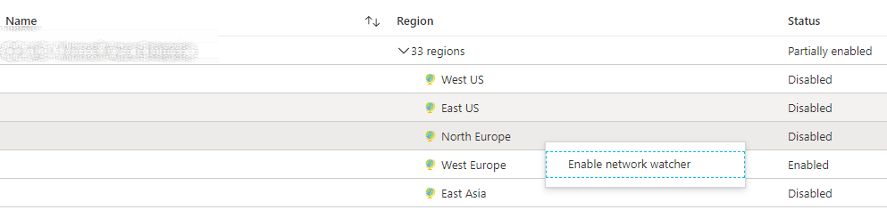
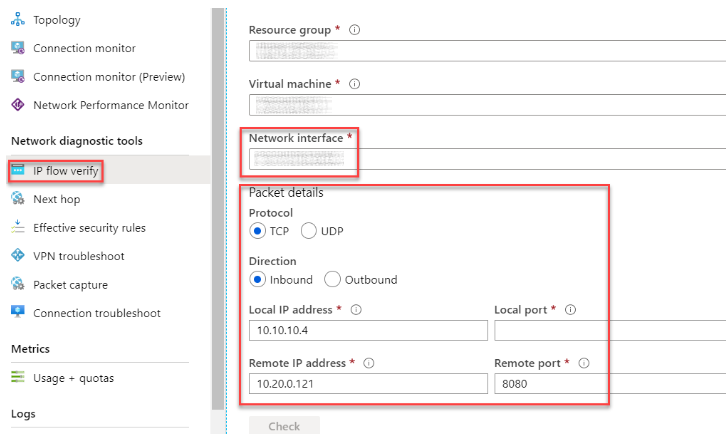
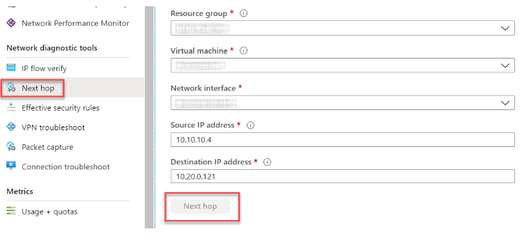
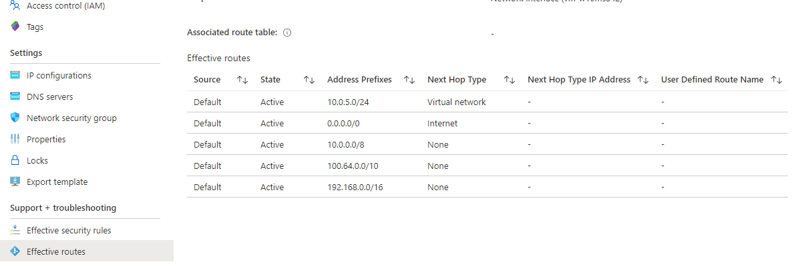
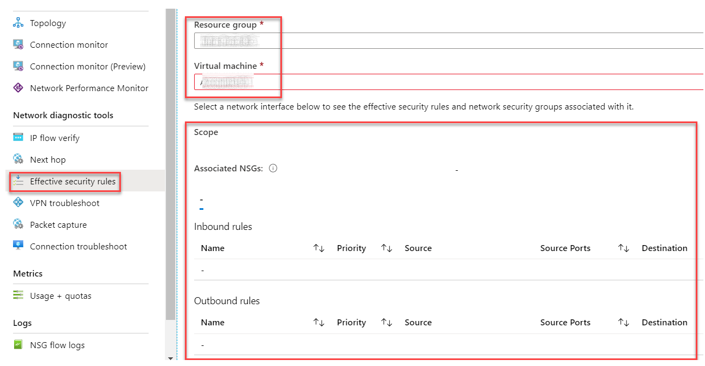
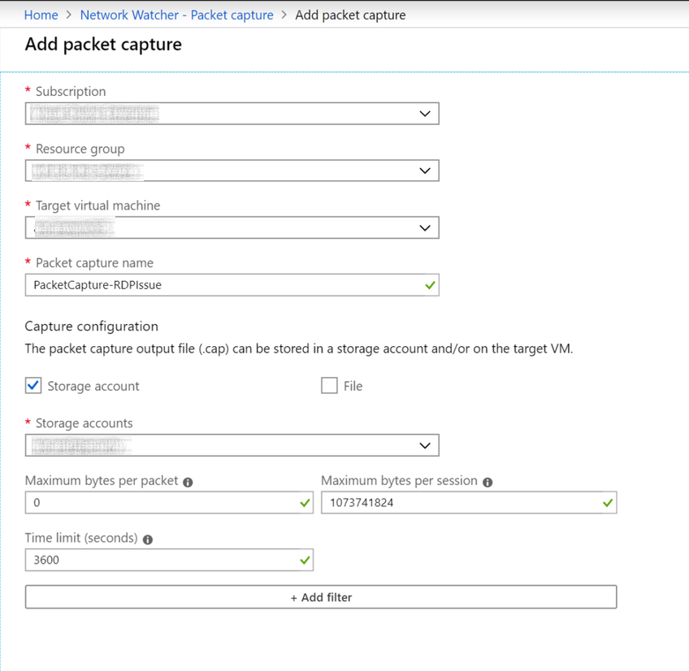
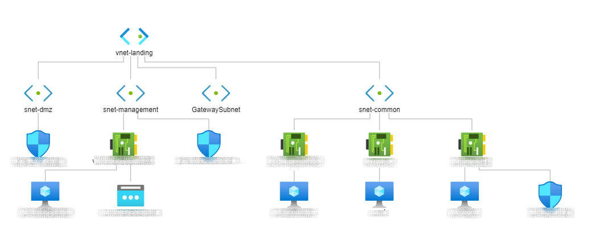
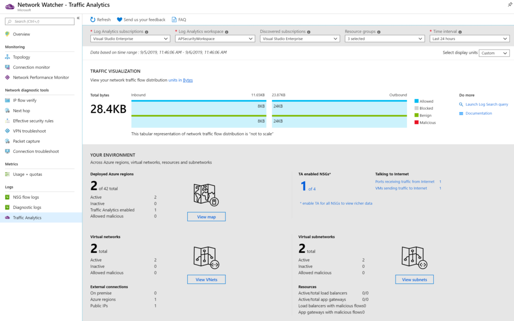
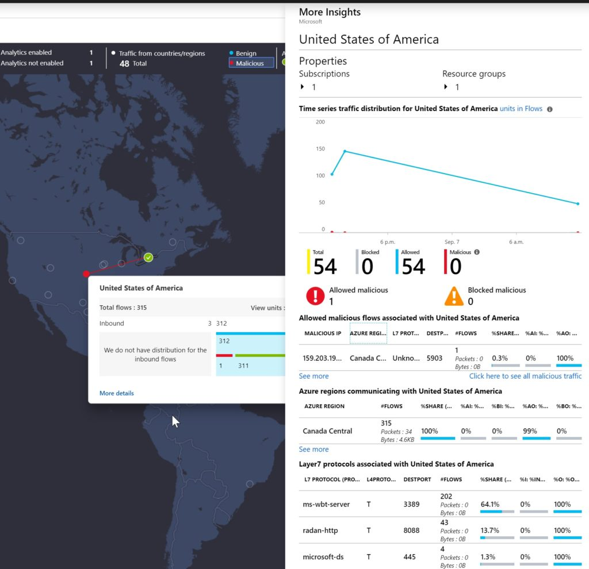

import ArticleHeader from '../../../components/article-header'

<ArticleHeader frontmatter={props.pageContext.frontmatter} />

En el número 45 de CompartiMOSS
(<http://www.compartimoss.com/revistas/numero-44/uso-de-azure-monitor>),
pudimos ver una introducción a Azure Monitor, en esta estrega hablaremos
sobre Network Watcher, para los que no lo conozcáis, puede ser
considerado como una navaja suiza para solucionar temas relacionados con
el networking. Ya sea para monitorizar o bien solucionar problemas que
podamos tener en nuestra red y componentes relacionados con el
networking.

**Habilitar Network Watcher**

Primero de todo, lo que debemos de hacer es habilitar el Network
Watcher. Para ello, debemos de hacerlo en cada una de las regiones que
tenemos una VNET desplegada o bien que vaya a ser objeto en un futuro.
Para hacer esto, bien podemos hacerlo por la UI del portal o bien por
PS, navegando al servicio de Network Watcher (buscando el servicio en la
barra de búsquedas).

Una vez hayamos encontrado el servicio, hacemos clic derecho sobre la
región que necesitamos habilitar el servicio y le damos a la opción de
"Enable network watcher"

La primera vez que hagamos esto, nos creará un grupo de recursos llamado
"NetworkWatcherRG", si entramos en este RG y mostramos los elementos
ocultos, veremos que contiene recursos del tipo
"microsoft.network/networkwatchers".

Tened en cuenta que si estáis siguiendo un plan de gobierno para
vuestros recursos de Azure (deberíais de tener uno si no es así), este
grupo de recursos se puede eliminar y podéis habilitar el network
watcher en un RG existente o bien crear uno con la nomenclatura que
necesites (PS es vuestro amigo)

Una vez hayamos habilitado este servicio, ya estamos preparados para
consumir otros servicios que nos darán la posibilidad de tener
características para el troubleshooting.

**IP Flow Verify**

Esta característica nos ayuda a saber el tráfico IP entre dos
direcciones, teniendo en cuenta dirección o bien puerto. Es muy útil
para conocer si el tráfico es capaz de fluir o bien está bloqueado.

Simplemente, seleccionamos la VM, la interfaz de red que queremos
checkear, veremos que la dirección IP Local se autopopula, simplemente
deberemos de introducir el resto de los detalles como la dirección IP
remota, puerto y hacer clic en check, una vez hecho esto, la herramienta
simulará el tráfico y nos arrojará los resultados.

**Next Hop**

En el caso de que en vuestra Sub Net tengáis varias tablas de rutas
asociadas, y necesitéis verificar como el tráfico está fluyendo hacia
una ruta en particular, "Next Hop" nos ayudará a ello. Con esta
herramienta podemos verificar si el tráfico desde un origen a un destino
pasará por un virtual appliance o no, basándose en las rutas que estén
definidas en la propia tabla de rutas.

Basta con seleccionar origen y destino, las direcciones IP se completan
en función de la NIC seleccionada. Simplemente nos quedará rellenar la
dirección destino, una vez introducidos los datos, hacemos un check y
nos mostrará los siguientes saltos junto con la ruta que está
redirigiendo el tráfico. Muy útil para escenarios de Hub&Spoke o bien
para aquellos que utilizamos FW de 3rd parties.

**Effective Routes**

Pese a que esta herramienta no esté incluida dentro del Network Watcher,
va muy en la línea del anterior punto, nos permite mostrar todos y cada
uno de los puntos de conexión que tenemos para una NIC en particular, de
manera que de una forma simple podemos ver como fluye el tráfico y si
tenemos alguna tabla de rutas que nos esté enrutando el tráfico de una
manera u otra. Puede ser muy útil cuando estamos en escenarios con FW de
por medio...

**Effective Security Rules**

Se puede dar el caso de que estemos protegiendo el tráfico mediante
varios NSG aplicados a una VM, o bien uno aplicado a nivel de NIC y otro
a nivel de SubNet. Por lo que esta herramienta nos ayudará a conocer que
NSG se están aplicando a nuestra VM y qué reglas se están aplicando en
todo momento:

**VPN Troubleshoot**

Si tenemos problemas con nuestra VPN, este es el punto donde deberemos
acudir, esta herramienta nos ayudará a conocer cuál es el estado de la
VPN mediante el estudio de las trazas de comunicación entre el Gateway
de Azure y el otro extremo (ya sea un dispositivo VPN local o de otro
proveedor Cloud).

La única diferencia, es que deberemos de tener una cuenta de
almacenamiento previamente creada, ya que ahí se almacenarán todas las
trazas que se generen. Una vez acabado el proceso, podemos acceder al
txt generado, y empezar a ver por dónde puede venir el posible problema.

**Packet Capture**

Nos permite capturar sesiones para seguir el tráfico desde y a una VM,
nos permite diagnosticar anomalías que pueda haber en la red, así como
estadísticas de la red, intrusiones, debugar comunicaciones
cliente-servidor, etc.

Debemos de tener en cuenta que esta solución se instala como una
extensión de la VM en particular, por lo que, si vuestra VM no es
compatible con el agente de Azure o bien tiene algún problema, es
posible que no os funcione, por lo que deberéis de verificar eso antes.

**Topology**

Personalmente, esta es una característica que me encanta, y que cuando
entro a un proyecto sobre Azure, le suelo dar uso, ya que nos permite
ver en forma de diagrama la topología de red y de interconexión de los
recursos en Azure. En esta representación veremos, VNets, VMs, NICs e
incluso NSG que estén aplicando.

**Traffic analytics**

Nos permite tener una visualización gráfica del tráfico de la red, así
como su distribución, incluyendo todos los objetos, regiones, VNets,
VPNs, NSGs y SubNets, y lo más chulo de todo, es que todos los objetos
tienen dashboards interactivos:

Una de las opciones que tenemos, es la visualización del mapa, en ella
podemos ver las direcciones IP y podemos ver más opciones, como
información de capa 7 y más:

**Resumen**

Ya vemos que Network Watcher es una herramienta muy válida para hacer
troubleshooting de nuestros entornos, conocer que está pasando en cada
una de las piezas del NW en un despliegue de Azure, así como identificar
riesgos potenciales que podamos estar teniendo.

**Alberto Andrés Rodríguez**  
Cloud Solutions Architect @ Seidor  
@albandrod