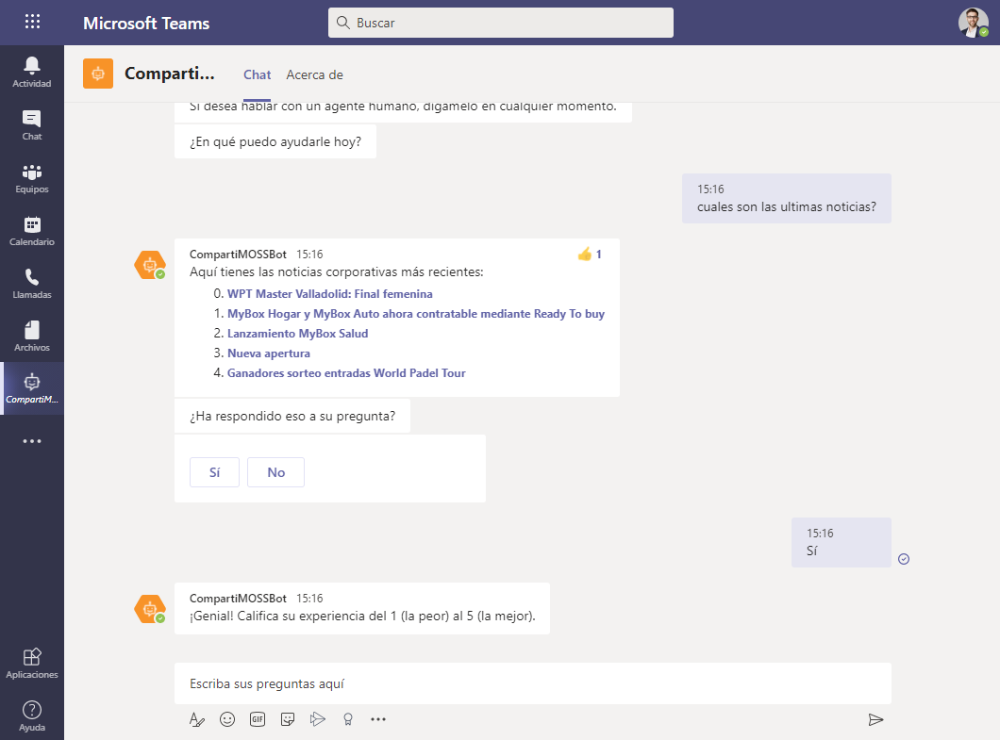

import ArticleHeader from '../../../components/article-header'

<ArticleHeader frontmatter={props.pageContext.frontmatter} />

Cada vez más nos estamos dando cuenta que la "era de la velocidad" nos
está poniendo a prueba en muchos ámbitos. Uno de ellos en estos últimos
meses ha sido el teletrabajo y la rapidez con la que nos hemos visto
forzados a adaptar este método de colaboración e interacción virtual con
nuestros clientes y compañeros.

Uno de los desafíos más importantes ha sido la falta de tiempo para
implementar sistemas de ayuda y soporte a los empleados, la
incertidumbre nos ha afectado a todos tanto a nivel personal como a
nivel empresarial, para que nos entendamos, nos ha pillado el toro.

Al estar en una situación así y viendo la necesidad del factor
**rapidez** al dar respuestas, basadas en soluciones de fácil
creación y mantenimiento, me viene a la cabeza una cosa: Microsoft Power
Platform.

En este articulo vamos a ver desde varios enfoques (técnico y funcional)
la manera de tener informados y actualizados sobre las noticias, cambios
de políticas, preguntas frecuentes y una infinidad de casos de uso, a
nuestros empleados utilizando estas 5 herramientas que Microsoft nos
proporciona:

-   **Microsoft Power Virtual Agents**: agente virtual que nos ayudará a
    conectar a los usuarios con la información de distintas fuentes
    gracias al lenguaje natural.

-   **Microsoft Power Automate**: servicio de flujos de trabajo que nos
    ayudará a ampliar las capacidades / funcionalidades del Bot.

-   **SharePoint Online**: espacio dedicado a la "intranet corporativa"
    y aplicaciones ad-hoc.

-   **Microsoft QnA Maker**: como base de conocimiento para intenciones
    del usuario no identificadas

-   **Microsoft Teams**: como canal de comunicación y colaboración entre
    los usuarios.

**Microsoft Power Virtual Agents**

Después de crear nuestro Bot desde la plataforma de
<https://powerva.microsoft.com/> debemos establecer los temas sobre los
cuales queremos dar respuesta a los usuarios. En nuestro caso vamos a
crear los siguientes temas de conversación:

-   **Noticias**: el usuario le pedirá al Bot que le informe de las
    ultimas noticias corporativas.

-   **Fichaje de horario laboral**: el usuario le pedirá al Bot cerrar
    el horario laboral del día y este a su vez le conectará a la
    aplicación de fichajes.

-   **Preguntas frecuentes**: el usuario le preguntará al Bot sobre cómo
    realizar gestiones dentro de la empresa (Ej.: pedir vacaciones,
    donde puede encontrar la última nomina, etc....).

Cada uno de esto temas los crearemos desde la opción lateral Temas ->
"+ Nuevo tema" rellenando el formulario con varios datos, así como el
Nombre del tema, una breve Descripción y una serie de frases que
desencadenaran este tema de conversación.

En este caso hemos creado el tema de conversación sobre "Noticias" donde
posteriormente debemos hacer el enlace con la fuente de Noticias
(colección de sitios de Sitio de comunicación en SharePoint Online). El
usuario al pedirle las noticias al Bot, este a su vez iniciara un flujo
que recoja los datos desde SharePoint Online y devolver los titulares de
las noticias dentro de la conversación. Para ello necesitamos ir a
lienzo de creación dentro del tema que acabamos de crear.

Dentro del lienzo añadiremos los pasos necesarios para el dialogo
especifico, en este caso hemos añadido una acción en Power Automate que
se encarga de traer las noticias desde SharePoint Online y las devuelve
al dialogo principal.

Por otro lado, debemos crear otro tema de conversación volviendo al
panel de temas, pero esta vez para el fichaje de horas. De la misma
manera tendremos un flujo de conversación vacío donde debemos añadir
varios pasos. En mi caso he realizado una comprobación de los fichajes
diarios del usuario actual para el día de hoy. Esta comprobación se ha
realizado llamando a una acción de Power Automate que se encarga de
comprobar mediante una petición REST el rango de horas que faltan por
fichar para el día de hoy.

El resultado de este flujo en Power Automate serán dos parámetros, así
como hora inicio de fichaje y hora fin de fichaje restantes del día.
Como pasos finales para cerrar este flujo de conversación le pediremos
al usuario mediante dos preguntas la hora de inicio de su fichaje y la
hora fin. Almacenamos esos dos valores y posteriormente los enviamos al
sistema de registro de fichajes mediante otra petición REST desde un
flujo de Power Automate.

Finalmente cerramos la conversación indicándole al usuario que su
fichaje ha sido realizado de manera correcta. Posteriormente mostraremos
al usuario un formulario de satisfacción donde puede indicar si le ha
sido útil o no la ayuda.

Para las preguntas frecuentes usaremos el "Tema alternativo" del
sistema. Este es un tema reservado por el mismo Bot para derivar al
usuario en caso de identificar un tema que no coincida con ninguno de
los ya configurados (en nuestro caso Noticias y Fichaje). De esta manera
derivaremos la petición desconocida del usuario hacia el QnA Maker donde
estará la base de conocimiento con las preguntas frecuentes. Para ello
debemos ir a la configuración del Bot y añadir el tema alternativo. Una
vez creado podremos editarlo de la misma manera que hemos editado los
temas, desde el lienzo de personalización.

Desde el lienzo de personalización añadimos los pasos necesarios para
enviar el texto del usuario hacia el servicio de QnA Maker. Al igual que
en los anteriores temas lo haremos a través de una acción que
desencadena la ejecución de un flujo de Power Automate. Este a su vez se
encargará de enviar el texto del usuario hacia QnA Maker y recuperar las
respuestas recibidas enviándolas de vuelta a la conversación.
(Previamente necesitaremos tener creada una base de conocimiento en QnA
Maker a la que poder conectarnos desde Power Automate.)

Como paso final devolveremos la respuesta al usuario y cerramos la
conversación con una encuesta de satisfacción para saber si la respuesta
proporcionada por QnA Maker ha sido de ayuda.

**Microsoft Teams**

Una vez finalizada la personalización del Bot debemos habilitar el canal
de comunicación de Microsoft Teams y realizar una petición de
publicación del Bot en la organización para que todos los usuarios lo
puedan utilizar.

Para ello debemos ir al menú lateral de Power Virtual Agents, en la
pestaña "Administrar", submenú "Canales". Dentro de esta ventana
podremos modificar los detalles del Bot, así como el color y el icono de
este al igual que la descripción. También podremos realizar la petición
de aprobación del Bot como aplicación disponible en toda la
organización.

A su vez los usuarios administradores desde el centro de administración
de Microsoft Teams recibirán una notificación en el cuadro de
aplicaciones para autorizar la distribución del Bot dentro de la
Organización**.**

Una vez aprobada esta petición, podremos encontrar nuestro Bot dentro de
la pestaña de Apps de la interfaz de Microsoft Teams y así poder iniciar
una nueva conversación.

Finalmente podremos probar los tres casos de uso que habíamos expuesto:

-   **Petición de las ultimas noticias:**

-   **Realizar fichaje de horario laboral diario**:

-   **Derivación y resolución de preguntas frecuentes**:

Como añadido Power Virtual Agents nos permite una infinidad de
posibilidades, así como autenticar nuestras peticiones, utilizar
diferentes canales de comunicación para el Bot (Facebook, Correo,
DirectLine, Cortana, etc....), en un futuro próximo podremos usar
AdaptiveCards para enviar mensajes al usuario y un largo etc. en
continua evolución.

Así que visto todo esto ya no hay excusa para no empezar a utilizar los
agentes virtuales que nos ofrece Microsoft en este nuevo formato. Aquí,
las necesidades de nuestros usuarios y la imaginación son nuestros
aliados a la hora de crear nuevos casos de uso o temas de conversación
del Bot y cada vez podamos aplicar sus funcionalidades.

**Cristian Dragos Fedotov**  
Office 365 & SharePoint Solutions Architect en Everis  
cristianfedotov@gmail.com  
https://www.linkedin.com/in/cristianfedotov/  