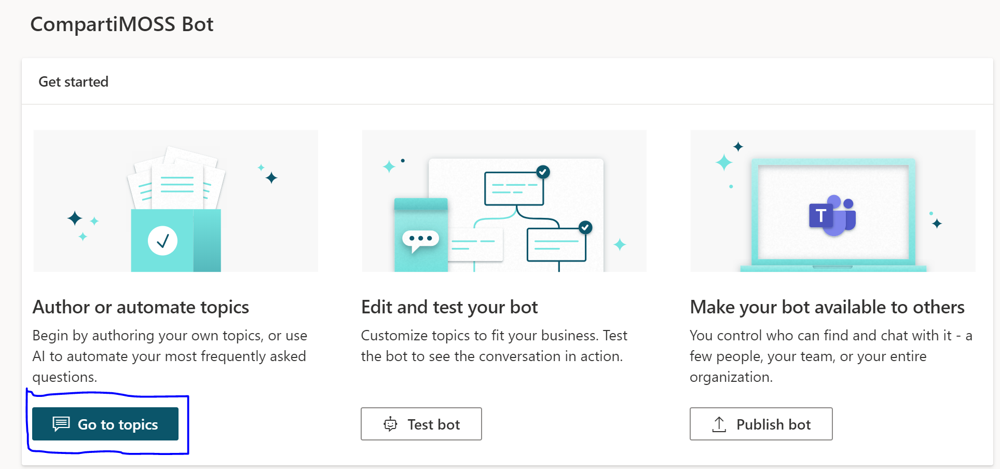
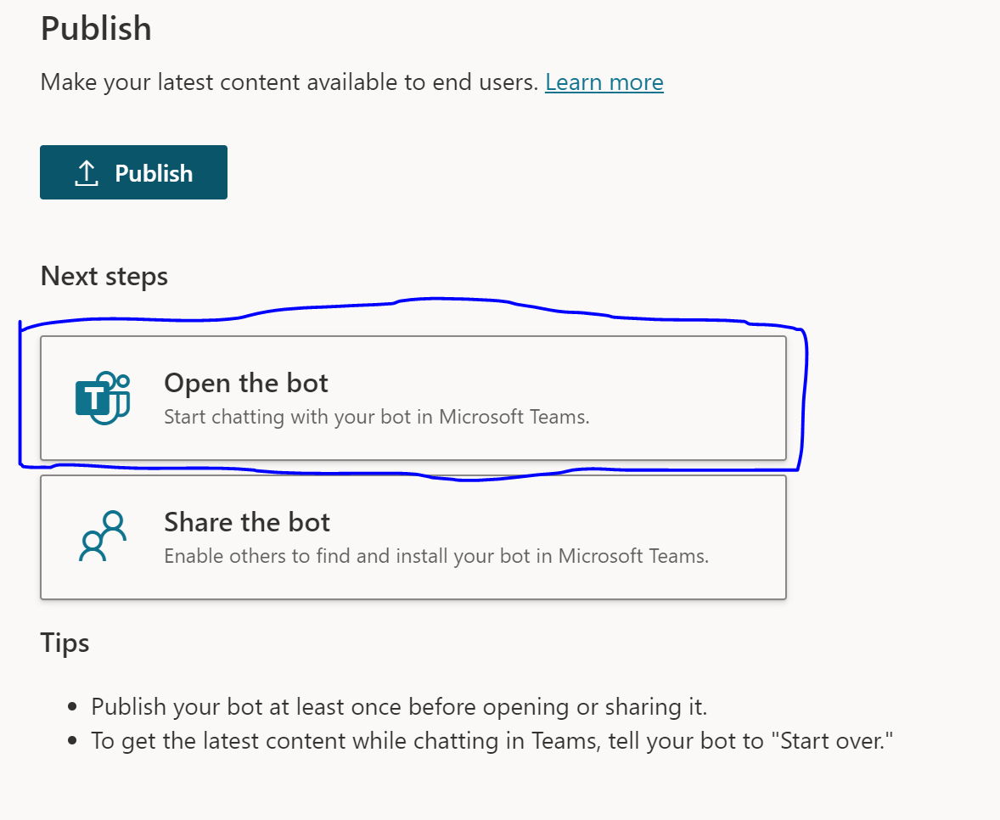

Al comienzo utilizamos Microsoft Bot Framework para desarrollar los
asistentes virtuales teniendo diferentes recursos de Azure y luego se
asociaba con un Bot en Teams y se publicaba para la organización. Esto
requería del equipo de desarrollo para la implementación del Bot y
conocimientos de Azure para el manejo de recursos

Después comenzamos a utilizar Power Virtual Agents dado que son una
forma rápida y efectiva de crear un Asistente Virtual con poco esfuerzo
en un entorno visual sin necesidad de código. Esto nos permitía que las
personas de las áreas no tecnológicas pudieran también participar de los
diferentes desarrollos. Este formato tenía un pequeño inconveniente de
cara a las organizaciones y era el costo de licenciamiento que para
algunas organizaciones resultaba elevado y en la incertidumbre provocada
por la pandemia no estaban dispuestos a invertir en eso.

Hace unas semanas Microsoft liberó Power Virtual Agents para el uso
exclusivo en Teams, esto significa que puedo utilizar todo el potencial
de Power Virtual Agents gratis con la restricción de que tiene que ser
desarrollado y utilizado en Microsoft temas.

En este articulo mostraremos como en pocos pasos puedo generar un
Asistente Virtual de Preguntas frecuentes para mi organización, como
ejemplo utilizaremos las preguntas frecuentes de MS Teams que resultan
ser de gran ayuda para aquellos que recién comienzan a utilizarlo.

**Creando Power Virtual Agents en Teams**

Primero que nada, debemos agregar la aplicación de Power Virtual Agents
en Microsoft Teams:

Una vez agregada a nuestras Apps, vamos a la pestaña de Chatbots y
creamos uno nuevo haciendo clic en "New chatbot":

Una vez en allí seleccionamos el Team al cual queremos agregar nuestro
Bot y luego "Continue" (Nota: Esto se debe a que solo se puede agregar
PVA a Teams de Microsoft Teams).

Nos aparecerá la siguiente pantalla donde debemos esperar a que todo
quede listo:

**[Nota]**: Podemos seguir realizando otras tareas hasta que
termine, Teams nos avisara cuando haya finalizado.

Una vez finalizada la creación de Bot debemos darle un nombre,
seleccionar el idioma y luego "Create"

Una vez finalizado estaremos en la siguiente pantalla listos para
comenzar a trabajar con el Bot

Ahora debemos agregarle nuestras preguntas frecuentes, vamos a "Go to
topics"

En la siguiente pantalla debemos ir a "Suggested" y luego a Get started:

En esta sección debemos indicar el origen de nuestras preguntas, este
caso utilizamos el sitio de preguntas frecuentes de Teams: [Ayuda y
aprendizaje de Microsoft Teams - Soporte técnico de
Microsoft](https://support.microsoft.com/es-es/teams)

Hacemos clic en "Start". Una vez procesado nos sugerirá diferentes
consultas y debemos ir agregando las que consideremos correctas

Una vez agregada los topics debemos habilitarla "turn on"

Ya con el topic habilitado podemos probar nuestro chatbot y verificar
que funcione correctamente directamente desde el cuadro de texto en la
parte inferior del chatbot.

Por último, debemos publicarlo para que los demás integrantes del grupo
de teams seleccionado al inicio lo puedan utilizar

Vamos a publish:

Confirmamos la publicación del chatbot

Luego también podemos agregarlo como una app en nuestro Teams

**Conclusión**

Esta forma de crear chatbot y agregarle preguntas frecuentes resulta ser
super rápida y sencilla, brindando respuestas y soluciones de forma
rápida y ágil a los colaboradores. Estos chatbots pueden se extender
utilizando Power Automate y sus conectores a Cognitive Services y
diferentes servicios permitiéndonos realizar innumerables automatismos.

**Alex Rostán**  
Business Applications MVP  
Country Manager AI & Smarts Applications - Arkano Paraguay  
rostanker@msn.com  
Twitter: @rostanker  
<https://www.linkedin.com/in/alexrostan/>  
<http://www.arkanosoft.com>  