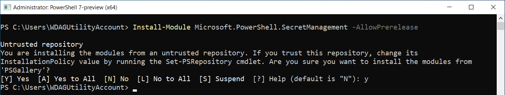
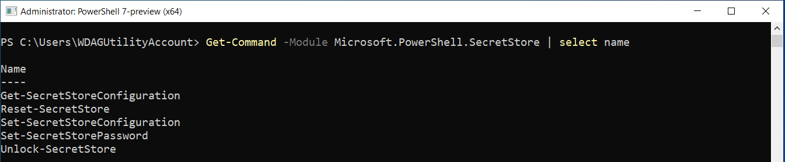
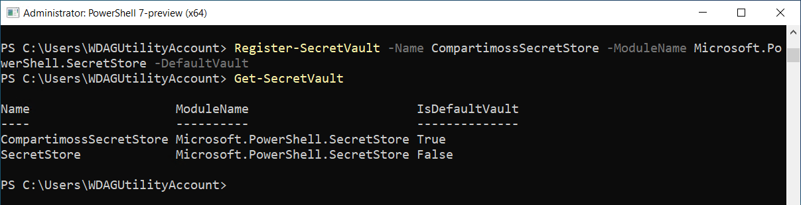
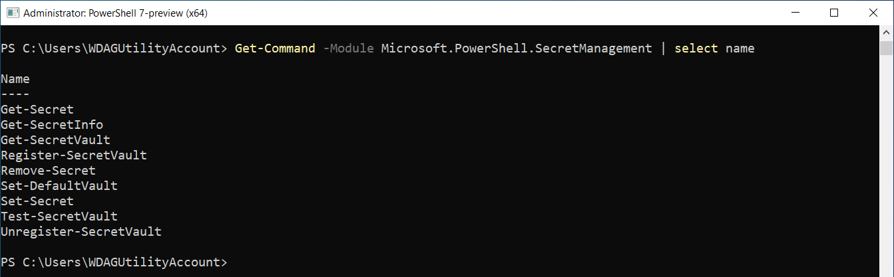
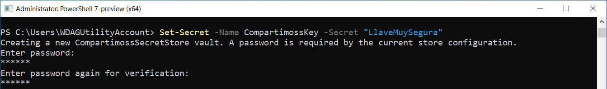
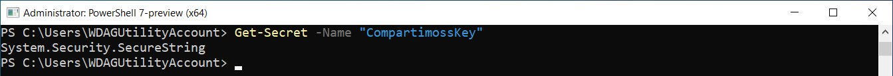
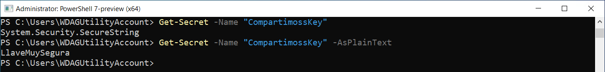

import ArticleHeader from '../../../components/article-header'

<ArticleHeader frontmatter={props.pageContext.frontmatter} />


El SecretManagement es un módulo de PowerShell que almacena "secretos"
de forma segura, tales como credenciales de usuario y tokens de APIs. El
módulo dispone de un conjunto de cmdlets que se pueden usar para
administrar los secretos desde PowerShell. Esto resuelve algunos
problemas comunes, como tener que introducir manualmente secretos en
cada sesión o almacenarlos en un archivo de texto.

Los componentes del módulo son extensibles, por lo que cualquier almacén
de secretos con una API / CLI puede hacerse compatible con el
SecretManagement. Esto simplifica la integración de depósitos de
secretos ya existentes (Azure Key Vault
[https://azure.microsoft.com/en-us/services/key-vault/], KeePass
[https://keepass.info], Hashicorp Vault
[https://www.vaultproject.io], SecureStore
[https://github.com/neosmart/SecureStore], etc.).

Recientemente Microsoft ha lanzado el SecretManagement Preview 3,
versión que ya es prácticamente definitiva, pero que todavía no es
recomendado utilizarlo para sistemas de producción. Adicionalmente,
Microsoft también lanzó el Preview 1 del SecretStore, que es un almacén
de extensiones local multiplataforma que funciona en todas las
plataformas compatibles con PowerShell, incluidos Linux y Mac.

**Prerrequisitos**

El SecretManagment está hecho para funcionar con PowerShell Core (desde
la versión 7), y no funciona en el PowerShell tradicional (hasta la
versión 5). Las versiones Core y tradicional de PowerShell pueden
convivir simultáneamente en un computador, por lo que, si no tiene
instalado la versión Core, puede hacerlo sin esperar problemas con la
versión tradicional.

PowerShell Core puede ser utilizado desde cualquier plataforma: Windows
32 y 64 bits, Linux, Centos, Debian, Ubunto, Mac, etc. A la fecha de
escribir este artículo, PowerShell Core se encuentra en versión 7.1.0
Release candidato 1 (RC), y se puede descargar desde la página de
releases del sitio de GitHub de PowerShell
(<https://github.com/PowerShell/PowerShell/releases>). Descargue la
versión adecuada e instálela en el computador a utilizar.

Microsoft proporciona instrucciones detalladas sobre instalación,
migración y uso de PowerShell Core en su sitio Web
<https://docs.microsoft.com/en-us/powershell/scripting/install/installing-powershell?view=powershell-7>.

**Instalación del módulo de SecretManagement**

Para instalar el módulo de SecretManagement, abra una consola de
PowerShell 7 como administrador y ejecute el siguiente comando (acepte
la instalación del componente desde "PSGallery" cuando un mensaje de
advertencia aparezca):

```powershell
Install-Module Microsoft.PowerShell.SecretManagement -AllowPrerelease
```




El módulo de SecretStore, como se indicó anteriormente, permite crear y
mantener un repositorio local de secretos en el computador del usuario.
Para instalar este módulo, ejecute el siguiente comando:

```powershell
Install-Module Microsoft.PowerShell.SecretStore -AllowPrerelease
```

**Creación y manejo de un almacén local de secretos**

El comando:

```powershell
Get-Command -Module Microsoft.PowerShell.SecretStore | select name
```

Muestra los cmdlets disponibles para el SecretStore:




Note que no hay cmdlets para remover un Store.

-   Reset-SecretStore borra todos los secretos almacenados en todos los
    almacenes.

-   Set-SecretStorePassword permite crear o configurar la clave para los
    almacenes.

-   Set-SecretStoreConfiguration y Get-SecretStoreConfiguration permiten
    ver y cambiar los parámetros de configuración de un almacén, por
    ejemplo, el tiempo que la clave permanece activa antes de que el
    usuario tenga que ingresarla de nuevo (900 segundos por defecto).

-   Unlock-SecretStore desbloque un SecretStore para el usuario actual
    con la contraseña proporcionada. Se puede utilizar para desbloquear
    un almacén cuando la configuración requiere una contraseña y la
    opción de configuración de solicitud está deshabilitada. Por
    ejemplo, cuando es necesario ejecutar scripts sin interacción del
    usuario. La contraseña proporcionada se aplicará a la sesión actual
    y dejará de ser válida después de que transcurra el tiempo de
    'PasswordTimeout'. Si el parámetro no proporciona ninguna
    contraseña, se le pedirá al usuario que la introduzca.

El siguiente comando crea un almacén local de secretos en el computador:

```powershell
Register-SecretVault -Name CompartimossSecretStore -ModuleName
Microsoft.PowerShell.SecretStore -DefaultVault
```

En este ejemplo se registra el módulo de almacén
Microsoft.PowerShell.SecretStore (almacén local) para el usuario actual.
El SecretStore se instala en una ruta de acceso de PowerShell conocida
por el módulo, por lo que solo se necesita su nombre. Utiliza el
modificador de parámetro 'DefaultVault' para convertirlo en el módulo
predeterminado para el usuario.

El comando 'Get-SecretVault' da una lista de todos los almacenes
registrados para el usuario y comprueba que el almacén se registró y
estableció como el almacén predeterminado. En el siguiente ejemplo,
mostrado en la imagen, se ve que hay dos almacenes registrados para el
mismo usuario.




**Creación y manejo de secretos en un almacén local de secretos**

El comando:

```powershell
Get-Command -Module Microsoft.PowerShell.SecretManagement | select name
```

Muestra los cmdlets disponibles para manejar secretos:



Antes de poder crear secretos, es necesario registrar el almacén con el
cmdlet Register-SecretVault, como se indicó en la sección anterior. Para
crear un secreto, utilice la siguiente sintaxis:

```powershell
Set-Secret -Name "CompartimossKey" -Secret "LlaveMuySegura"
```




Los dos parámetros de entrada indican el nombre que identifica al
secreto, y su valor. El parámetro -Vault (con el nombre de uno de los
almacenes definidos anteriormente, no usado en el ejemplo) no es
obligatorio, pero sirve para almacenar secretos en cualquier almacén
deseado. Use el cmdlet Get_Secret para recobrar el valor de un secreto
(utilizando el nombre del secreto):




El valor recobrado es directamente un objeto del tipo SecureString que
puede ser utilizado de inmediato para, por ejemplo, loguearse con
SharePoint. Si se desea ver el valor del secreto, use el parámetro
-AsPlainText:




Después de que pasa el tiempo predefinido en la configuración para
mantener la contraseña activa (900 segundos por defecto), o si se inicia
una nueva sesión de PowerShell, es necesario entrar de nuevo la llave
del almacén.

**Usando SecretManagement con SharePoint**

El módulo de SecretManagement se puede utilizar para guardar el usuario
y la clave necesarios para usar SharePoint PnP PowerShell. Como el
SecretManagement se puede utilizar solamente con PowerShell Core, es
necesario utilizar también el módulo Core de SharePoint PnP PowerShell.
Primero cree tres secretos en el almacén como se indica en seguida. Aquí
se guardan como secretos los tres parámetros necesarios para loguearse
solamente como un ejemplo; probablemente el primero no se debe guardar
como secreto para poderlo manejar fácilmente en la configuración del
script:

```powershell
Set-Secret -Name "CompartimossUrl" -Secret "https://dominio.sharepoint.com/sites/TestCompartiMOSS"

Set-Secret -Name "CompartimossUser" -Secret "user@dominio.onmicrosoft.com"

Set-Secret -Name "CompartimossPw" -Secret "MyPassword"
```

Normalmente en una rutina de PnP PowerShell para el DotNet Framework,
logearse en SharePoint y obtener el objeto de SharePoint Site significa
utilizar código similar al del siguiente script:

```powershell
$spUserPw = "MyPassword"

$spUserName = "user@dominio.onmicrosoft.com"

$spUrl = "https://dominio.sharepoint.com/sites/Test_Compartimoss"

[SecureString]$securePW = ConvertTo-SecureString -String $spUserPw
-AsPlainText -Force

$myCredentials = New-Object -TypeName
System.Management.Automation.PSCredential -argumentlist $spUserName,
$securePW

Connect-PnPOnline -Url $spUrl -Credentials $myCredentials

Get-PnpSite
```

La rutina es similar utilizando secretos del SecretManagement. Después
de instalar el módulo de PnP Core para SharePoint PowerShell, utilice el
siguiente script para utilizar los secretos guardados en el almacén:

```powershell
$spUserPw = Get-Secret -Name "CompartimossPw"

$spUserName = Get-Secret -Name "CompartimossUser" -AsPlainText

$spUrl = Get-Secret -Name "CompartimossUrl" -AsPlainText

$myCredentials = New-Object -TypeName
System.Management.Automation.PSCredential -argumentlist $spUserName,
$spUserPw

Connect-PnPOnline -Url $spUrl -Credentials $myCredentials

Get-PnpSite
```

Note que se está utilizando la variable $spUserPw directamente para el
objeto de credenciales, porque el módulo de SecretManagement lo entrega
directamente como un SecureString. De esta forma, el script se puede
ejecutar de forma más segura sabiendo que los datos sensibles no son
transmitidos en plain text.

**Gustavo Velez** <br />
Offices Apps & Services MVP <br />
gustavo@gavd.net <br />
<https://guitaca.com> <br />
<http://www.gavd.net> <br />