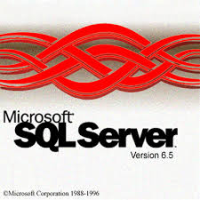
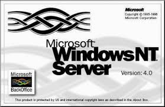
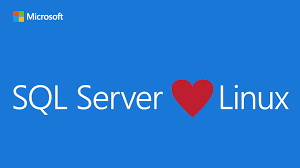
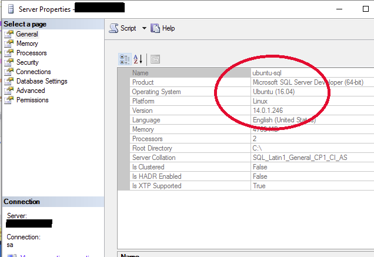
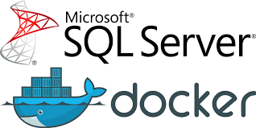
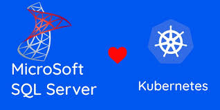
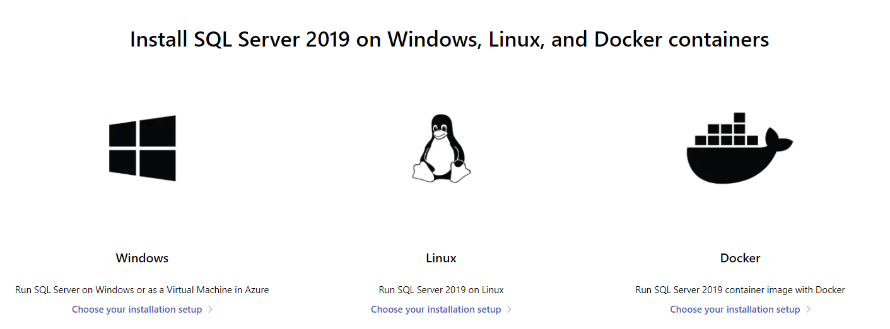
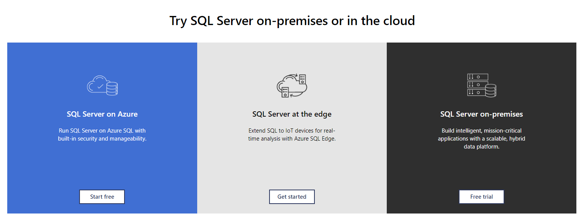

**SQL Server "Everywhere"**

Haciendo un poco de investigación para este artículo, encontré que hace
varios años Microsoft desarrolló una versión de SQL Server inicialmente
conocida como "Everywhere Edition", que luego saco al mercado como SQL
Server 2005 Compact Edition. La idea no es hablar de esa versión, que ya
ha quedado largamente en desuso. Por el contrario, nos enfocaremos en
las distintas plataformas en donde podemos correr nuestro motor de base
de datos y explicar porque hoy en día SQL Server corre en todos lados
"Everywhere"

**Inicios**

A mediados de los años 90, cuando empecé a involucrarme con SQL Server
en sus versiones 6.0 y 6.5, la única opción disponible era la plataforma
Windows. En ese entonces Windows Server 3.5 y Windows NT 4. Todavía
recuerdo los enormes servidores NEC y Compaq Proliant donde podíamos
tener entornos con discos mecánicos compartidos corriendo las primeras
versiones de Windows Clúster para así, poder entrar al mundo de la alta
disponibilidad.

La historia continua de la misma forma por muchísimos años más, ya no
con esas versiones "de museo" de Windows y SQL, pero si con las
versiones de 2016.

**Virtualización y plataformas**

Por esa época, la virtualización ya era una realidad, y recuerdo muchas
personas que me consultaban por la posibilidad de correr SQL Server en
esos entornos virtuales de VMWare y Hyper-V pero mi respuesta no era la
que ellos querían escuchar. Hasta esos tiempos mi mensaje fue que
debíamos correr SQL Server en un servidor físico dedicado, y a modo de
broma y como para reforzar la respuesta agregaba que debíamos tenerlo
cerca nuestro para comprobar que genere mucho calor mientras corríamos
nuestras cargas de trabajo transaccionales.

Luego la recomendación paso a ser que "tal vez" podrían considerar estos
entornos virtuales para trabajar con ambientes no productivos

La otra consulta que me hacían ocasionalmente era si veía la posibilidad
de que alguna vez SQL Server se podría correr en entornos Linux. (dado
que la competencia disponía de esta opción) También mi respuesta era
negativa, dado que Microsoft siempre había sido sinónimo de Windows

Bueno, la historia cambio radicalmente y hoy en día esas afirmaciones
del pasado han quedado totalmente fuera de tiempo y lugar.

La tecnología de virtualización continúo avanzando a grandes pasos,
convirtiéndose en la base de la mayoría de las implementaciones
productivas, incluso siendo parte fundamental de las plataformas de
nube. Hoy en día cuando necesitamos desplegar una solución SQL Server en
Azure (u en otra opción de Cloud), lo que obtenemos es una
implementación basada en máquinas virtuales

Con la presentación de SQL Server 2017, Microsoft nos dejó a todos
gratamente sorprendidos al darnos, por primera vez, la posibilidad de
poder utilizar dicha versión sobre las distribuciones mas importantes de
Linux (como Redhat , Suse y Ubuntu)

SQL Server sobre Linux más el avance acelerado de la tecnología de
visualización abrió otra gran puerta para tener la posibilidad de tener
Contenedores SQL Server "Containers". De esta forma ya no teníamos que
virtualizar el "Host o Servidor" sino solamente la aplicación, en este
caso nuestro motor de base de datos

Así fue como comenzamos a explorar Docker Desktop y tener la posibilidad
de hacer un despliegue de un container y poder tener instalado SQL
Server en cuestión de pocos minutos. Con Docker Desktop ahora también
tenemos otra opción nunca antes posible dado que puede correr en
sistemas operativos Mac OS ahora también podemos tener SQL Server en
equipos de Apple en formato de containers

La tecnología de contenedores nos dio la posibilidad de comenzar a
desplegar entornos con varias aplicaciones virtualizadas (por supuesto
incluyendo SQL Server) así que Kubernetes nos dio la posibilidad de
orquestar múltiples containers y así tener alta disponibilidad junto con
la posibilidad de tener nodos on-premises y en la nube para formar una
solución hibrida

Finalmente la ultima opción disponible es SQL Server en dispositivos ARM
(Como Rasberry Pi). Esta opción de Azure SQL Edge nos permite tener el
motor de base de datos disponibles en dispositivos IoT para poder
realizar análisis analítico en tiempo real en escenarios de Edge. Si
observamos el sitio donde podemos descargar SQL Server podemos comprobar
que ahora no solo podemos seleccionar Windows, sino que tenemos un
amplio abanico de posibilidades en relación con la plataforma. Windows,
Linux y containers, On-premises o Azure, y la posibilidad de usarlo en
dispositivos IoT con Edge.

En todos los casos SQL Server es siempre el mismo, por lo que podemos
utilizar herramientas como Management Studio, Azure Data Studio, Visual
Studio Code e incluso SQLCMD.

Los invito a explorar todas estas opciones

Esta nueva "Microsoft" en donde Linux y Open Source forman parte
esencial del Core de la compañía nos deja la puerta abierta para más
innovación.

**Javier Villegas**  
IT Director Data y BI @ MSC  
Microsoft MVP , Data Platform  
javier.ignacio.villegas@gmail.com  
[@javier_vill](https://twitter.com/javier_vill)  
[javiervillegas](https://www.linkedin.com/in/javiervillegas/)  