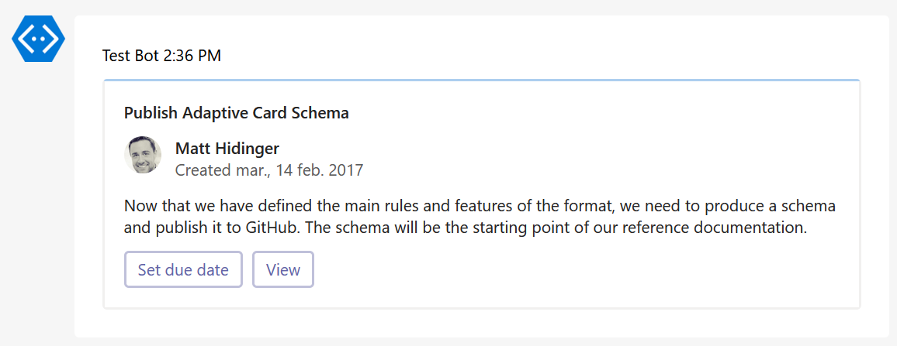
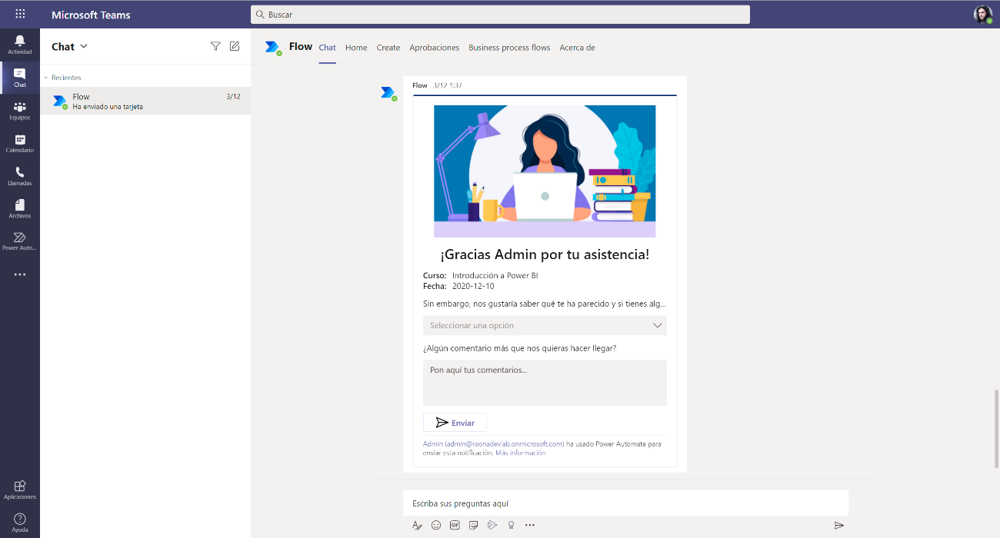

Desde hace unos cuantos meses, las Adaptive Cards se están convirtiendo
en algo habitual en nuestras vidas y especialmente muy útil, en parte,
por la potencia que ofrecen al poder ser integradas con múltiples
servicios de Office 365 como puedan ser Outlook o Teams entre otros.

En este artículo vamos a explicar cómo es la anatomía de una Adaptive
Card, cómo están formadas, cómo se pueden diseñar y posteriormente
implementar en nuestras aplicaciones con algún caso de uso práctico.

**Background**

Las Adaptive Cards realmente llevan con nosotros desde hace unos cuantos
años (Microsoft Build de 2018), pero no ha sido hasta finales del año
pasado/principios de este 2020 donde se han popularizado, especialmente
por unas nuevas acciones de Power Automate como "Muestre su propia
tarjeta adaptable como el bot Flow en un canal/a un usuario" o "Publique
una tarjeta adaptable en un canal de Teams/para un usuario y espere
respuesta", ambas en *preview* y que más tarde detallaremos.

Previamente a esto, ya existían entre nosotros otros tipos de tarjetas
como son las Message Cards, que nos permitían crear un tipo de tarjeta
informativa que nos permitía tener una visualización más simple y que
nos permitía integrar diferentes plataformas con nuestro Office 365.

**¿Dónde podemos usar Adaptive Cards?**

Microsoft da la posibilidad de utilizar las Adaptive Cards en varios
sitios como pueda ser Outlook, Teams, un bot, integradas en Cortana o en
el mismo Windows a través de sus tarjetas.


Un ejemplo de cómo se integran en los diferentes servicios es el
siguiente:

**Outlook Actionable Message**


**Microsoft Teams (Light Version)**


**Bot Framework WebChat**


**Notificaciones de Windows**


**¿Cuáles son las ventajas que ofrecen las Adaptive Cards?**

- Son portables: sirven para para cualquier aplicación y dispositivo. 
- Abiertas y con lenguaje declarativo: por estar hechas con un esquema JSON y no llevar código asociado. 
- De bajo coste y con estilos automáticos: por coger el UX de la aplicación que lo acoge. 
- Esquema único: minimizando el coste de crear un tipo de tarjeta por aplicación ni aprender nuevos esquemas 
- Experiencia de uso consistente. 
- Rendimiento nativo ya que coge los elementos nativos del framework que lo ejecuta. 
- Fácil de implementar.
- Altamente documentado. 

**¿Cómo se estructuran las Adaptive Cards?**

Las Adaptive Cards son unos elementos puramente declarativos, esto es,
que no requieren crearse con código para poder trabajar con ellas al
estar hechas en formato JSON. Un ejemplo de una Adaptive Card es el
siguiente...

```
{
    "type": "AdaptiveCard",
    "body": [
        {
            "type": "TextBlock",
            "size": "Medium",
            "weight": "Bolder",
            "text": "${title}"
        },
        {
            "type": "ColumnSet",
            "columns": [
                {
                    "type": "Column",
                    "items": [
                        {
                            "type": "Image",
                            "style": "Person",
                            "url": "${creator.profileImage}",
                            "size": "Small"
                        }
                    ],
                    "width": "auto"
                },
                {
                    "type": "Column",
                    "items": [
                        {
                            "type": "TextBlock",
                            "weight": "Bolder",
                            "text": "${creator.name}",
                            "wrap": true
                        },
                        {
                            "type": "TextBlock",
                            "spacing": "None",
                            "text": "Created {{DATE(${createdUtc},SHORT)}}",
                            "isSubtle": true,
                            "wrap": true
                        }
                    ],
                    "width": "stretch"
                }
            ]
        },
        {
            "type": "TextBlock",
            "text": "${description}",
            "wrap": true
        }
    ],
    "actions": [
        {
            "type": "Action.ShowCard",
            "title": "Set due date",
            "card": {
                "type": "AdaptiveCard",
                "body": [
                    {
                        "type": "Input.Date",
                        "id": "dueDate"
                    },
                    {
                        "type": "Input.Text",
                        "id": "comment",
                        "placeholder": "Add a comment",
                        "isMultiline": true
                    }
                ],
                "actions": [
                    {
                        "type": "Action.Submit",
                        "title": "OK"
                    }
                ],
                "$schema": "http://adaptivecards.io/schemas/adaptive-card.json"
            }
        },
        {
            "type": "Action.OpenUrl",
            "title": "View",
            "url": "${viewUrl}"
        }
    ],
    "$schema": "http://adaptivecards.io/schemas/adaptive-card.json",
    "version": "1.2"
}
```

...que una vez lo integremos con el servicio que vaya a hospedarlo, nos
ofrecerá su resultado. El código anterior, en Teams, se vería así:



**Diseñadores**

Ok ok. Os he enseñado las tripas de una Adaptive Card antes de decir
cómo podemos trabajar con ellas, pero en este aspecto, hay muchas
alternativas. Vamos a explorar los diferentes diseñadores que podemos
usar para ello:

**adaptivecards.io**

Existe una página que hace de *playground* con un editor WYSIWYG (*what
you see is what you get*) para ayudarnos a construir nuestra tarjeta
adaptable y posteriormente llevárnosla a nuestras aplicaciones con el
JSON que se nos genera automáticamente. Es
[https://adaptivecards.io/designer](https://adaptivecards.io/designer)


En esta página podremos ver los diferentes apartados:

**Menú superior**


En el menú superior vamos a poder generar una tarjeta nueva, seleccionar
el contenedor que va a hospedar nuestra Adative Card para ver los
estilos (Bot Framework, Outlook, Teams, Cortana, Windows, etc...), ver
cierta documentación y un botón para copiar el JSON resultante de
nuestro trabajo. Y, por último, y no menos importante, el *Target
version*: si queremos trabajar con Teams deberemos seleccionar la
versión 1.2, ya que la versión 1.3 del schema todavía no lo soporta la
plataforma.

**Barra lateral izquierda**


En la barra izquierda podemos elegir qué elementos queremos insertar en
nuestra tarjeta: imágenes, textos, botones, etc...

**Lienzo central: parte superior**


En la parte central superior vamos a ver que existen tres columnas
diferencias: a la izquierda, nuestra card en formato WYSIWYG, para que
veamos el resultado y podamos ir seleccionando cada elemento de la
estructura de la tarjeta; esa estructura está también indicada en la
columna central, para que veamos en formato árbol y sepamos cómo está
organizada y a la derecha las propiedades que se pueden asignar a cada
elemento posible de las Adaptive Cards: Id, título, estilo, icono,
efectos para el layout... y en definitiva múltiples opciones para hacer
nuestra tarjeta lo más configurable posible.

**Lienzo central: parte inferior**

Por último, en la parte inferior izquierda tendremos el *payload* con el
JSON resultante de nuestra tarjeta que será el que tengamos que utilizar
en nuestras diferentes aplicaciones y a la derecha un *template* de
ejemplo para que le demos información a nuestra Adaptive Card con texto
e imágenes de prueba.

**App Studio en Microsoft Teams**

A través del App Studio de Teams vamos a poder trabajar con ellas
directamente desde la plataforma:


**Add-Ins en Visual Studio Code**

En cambio, si nos gusta más trabajar con Visual Studio Code, tenemos
suerte porque hay un par de extensiones para este IDE donde nos
permitirá previsualizar en tiempo real nuestra Adaptive Card dentro de
él a partir del JSON que estemos trabajando. Son "[AdaptiveCards
Studio](https://marketplace.visualstudio.com/items?itemName=madewithcardsio.adaptivecardsstudiobeta)"
y "Adaptive Card Viewer":


**Ejemplos**

Y como siempre el movimiento se demuestra andando, lo mejor es que
podamos ver cómo funcionan estas Adaptive Cards en nuestros desarrollos.
En este caso, y por simplicidad, vamos a utilizarlos dentro de Teams
gracias a la acción "Muestre su propia tarjeta adaptable como el bot
Flow en un canal" que hemos comentado al comienzo del artículo.

**Adaptive Card en un canal de Teams**

Para poder mandar una Adaptive Card a un canal de Teams sólo tenemos que
elegir la acción correspondiente en Power Automate:


Y rellenar los campos que se solicitan:


Este resultado una vez enviado sería el siguiente:


**Adaptive Card en un chat de Teams**

Para el caso de enviar la información a un usuario, la forma de hacerlo
es la misma, pero eligiendo la opción de un usuario en vez de un canal:


Y su resultado:


**Esperando respuesta de nuestra Adaptive Card**

Por último, existe otro tipo de tarjeta que han introducido hace unos
cuantos meses que nos permite enviar una Adaptive Card a un canal o
usuario y esperar su respuesta. El formato es exactamente el mismo que
una Adaptive Card normal, pero permite recoger y registrar las
respuestas posteriormente en nuestro flujo.




Para ello tendremos que especificar los valores de los IDs que hayamos
indicado en nuestra Adaptive Card, en este caso, por ejemplo,
referenciando a:

```
"Calificacion": "@outputs('Publique_una_tarjeta_adaptable_para_un_usuario_de_Teams_y_espere_respuesta')?['body/data/id_calificacion']",

"Comentarios": "@{outputs('Publique_una_tarjeta_adaptable_para_un_usuario_de_Teams_y_espere_respuesta')?['body/data/id_comentarios']}"
```

Adicionalmente, aparecerán nuevas opciones en la propia Adaptive Card
para mostrar un mensaje tras haber interactuado con ella:


**NOTA:** Cabe indicar que las respuestas a las Adaptive Cards, como
cualquier flujo de Power Automate, tienen una vida de 30 días. Pasado
este tiempo el flujo fallará y no se registrarán acciones posteriores.

**Para finalizar...**

Como habéis podido ver a lo largo del artículo, las Adaptive Cards nos
muestran grandes capacidades para ampliar nuestros procesos de negocio
dentro de la propia plataforma en la que nos encontremos, siendo de
especial utilidad dentro de Microsoft Teams gracias a la potencia de
Power Automate.

Si queréis conocer las últimas novedades podéis añadir las Community
Calls en vuestro calendario
(<https://aka.ms/adaptivecardscommunitycall>), revisar el Portal de
features del producto (<https://aka.ms/ACFeatures>) para votar por
aquellas que queráis o proponer algunas o simplemente seguir el hashtag
#AdaptiveCards en Twitter o el blog oficial
<https://adaptivecards.io/blog>.


Ángel Carrillo <br />
MCT / Microsoft 365 CTO & Solutions Architect en Raona <br />
@angeldav  <br />