En Ignite 2020 Microsoft introdujo lo que denominó una nueva aplicación
de 1ª clase en Microsoft 365: Microsoft Lists. Sin embargo, los que
conocemos y trabajamos con SharePoint desde hace años sabemos que las
listas de Microsoft Lists vienen a ser listas de SharePoint con
super-poderes. En este artículo y siguientes iré desgranando el
potencial de Microsoft Lists que refleja la apuesta clara de Microsoft y
del equipo de SharePoint por modernizar las listas tradicionales de
SharePoint para facilitar construir rápidamente aplicaciones de negocio
sencillas sin apenas desarrollo.

**Acceso a Microsoft Lists**

Microsoft Lists está disponible como una App de Microsoft 365 que
podemos acceder desde el lanzador de aplicaciones de Microsoft 365 o
bien desde la página donde tenemos ubicadas todas las Apps que como
usuarios de la plataforma tenemos disponibles.

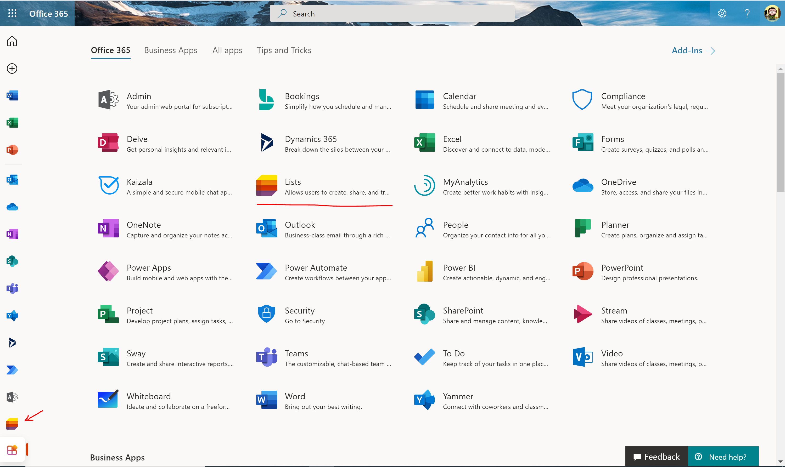

Cualquiera de las dos opciones nos lleva a la App de Listas que viene a
ser una página hospedada en el OneDrive For Business (ODFB) del usuario
como se podrá comprobar tras una inspección rápida de la URL que se
abre. Desde la App o Home de Microsoft Lists el usuario:

- Puede crear nuevas listas de Microsoft Lists.
- Visualiza las listas que ha marcado como favoritas.
- Visualiza las listas recientes a las que ha accedido.

> Las listas de Microsoft Lists pueden ser de dos tipos:               
> -   Listas personales que se crean en el ODFB del usuario.           
> -   Listas compartidas que se crean en sitios de SharePoint Online (SPO) a los que el usuario y otros usuarios tienen acceso.       

- Puede buscar una lista o contenido de una lista utilizando la caja de búsqueda.

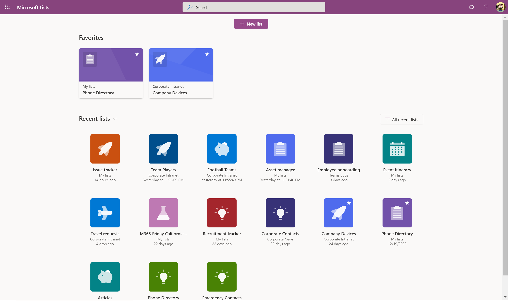

Para una lista ya existente, el usuario puede realizar las siguientes
acciones a través de los "...":

- Personalizar, lo que le permite cambiar el icono y color que se utiliza para identificar la lista.

- Compartir, lo que le permite dar acceso directo a la lista a otros usuarios. Esta opción es especialmente interesante cuando queremos dar acceso a nuestras listas personales a otros usuarios.

- Eliminar de listas reciente, para eliminar la lista del listado de listas recientes que se muestra.

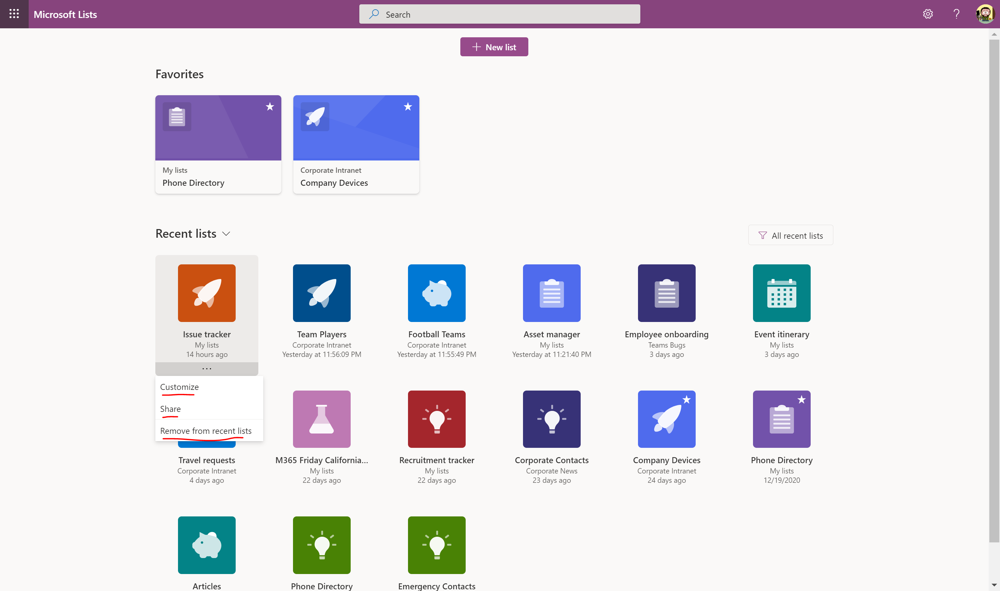

Por ejemplo, la opción de personalizar muestra una ventana que permite
cambiar el icono y color de la lista tal y como se ha indicado.

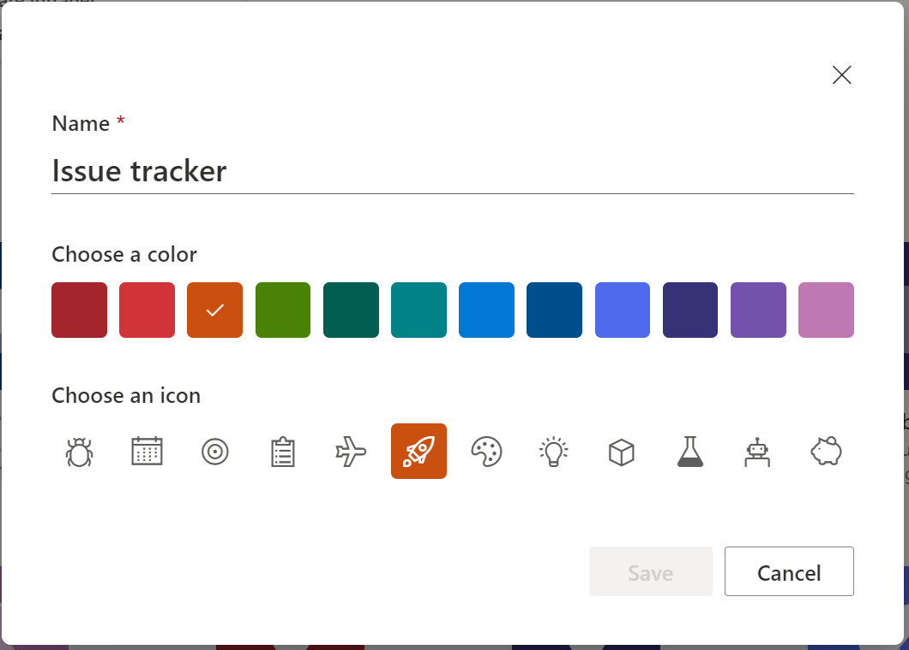

**Creando listas en Microsoft Lists**

Para crear una lista de Microsoft Lists tenemos tres posibilidades:

- Crear la lista desde la App de Microsoft Lists disponible en el ODFB del usuario.

- Crear la lista en un sitio de SharePoint concreto.

- Crear una lista desde la App de Microsoft Lists disponible para Microsoft Teams.

En esta sección vamos a revisar la primera posibilidad de creación de
una lista:

- Desde la App de Microsoft Lists, simplemente hacemos clic en "New"
    (Nuevo) de forma que se muestre una ventana modal con las distintas
    posibilidades de creación de una lista:
    - Crear una lista en blanco.
    - Crear una lista a partir de una hoja Excel que deberemos tener disponible en nuestro ODFB o bien cargarla en el momento de creación de la lista.
    - Crear una lista a partir de una lista existente.
    - Crear una lista a partir de una plantilla disponible.
- En nuestro caso, elegimos la opción de crear la lista a partir de una plantilla existente. Microsoft proporciona un total de 8 plantillas de serie y por el momento no proporciona la posibilidad de que podamos añadir nuestras propias plantillas de lista (Aunque a futuro tendremos dicha posibilidad).

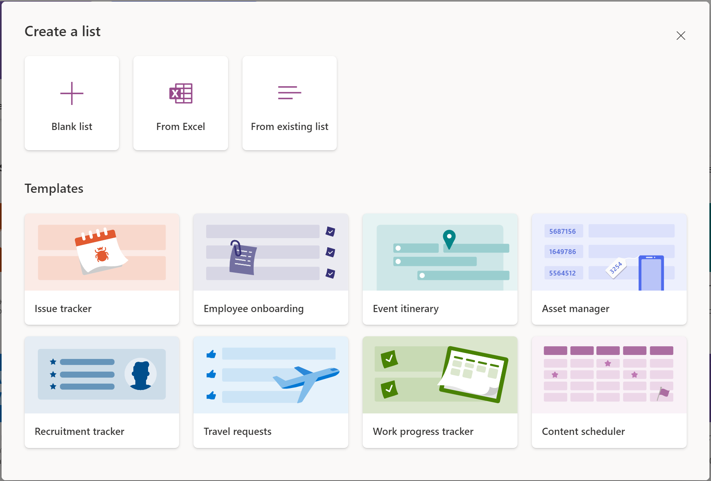

- Seleccionamos por ejemplo la lista "Recruitment tracker" lo que nos permite tener una preview de la información que se puede registrar en dicha lista, así como las personalizaciones vía formato de columna que se incluyen de serie. Si la lista nos parece adecuada, para usarla simplemente haremos clic en "Use template":

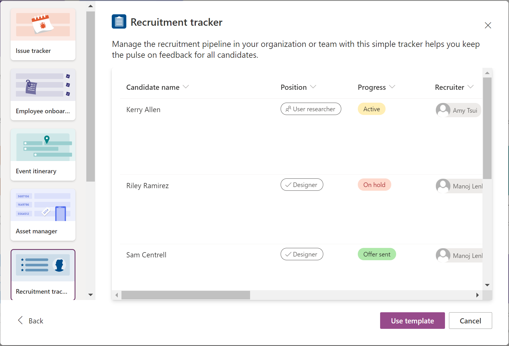

- A continuación, tendremos que indicar el nombre de la lista y opcionalmente una descripción. También podremos seleccionar el icono (Nota: No es posible añadir nuestros propios iconos por el momento) y color identificativo de la lista. Finalmente, seleccionaremos la ubicación en la que queremos guardar la lista:
    - My lists (Mis listas) lo que implica que la lista se guardará en el ODFB del usuario.
    - Un Sitio de SPO concreto seleccionado a partir de los sitios recientes en los que ha trabajado el usuario. A la fecha de redacción de este artículo, no es posible indicar mediante una URL o búsqueda un sitio específico que no esté disponible en el listado de sitios recientes.

En mi caso voy a crear la lista como una lista personal. Para crear la lista, simplemente hacemos click en "Create".

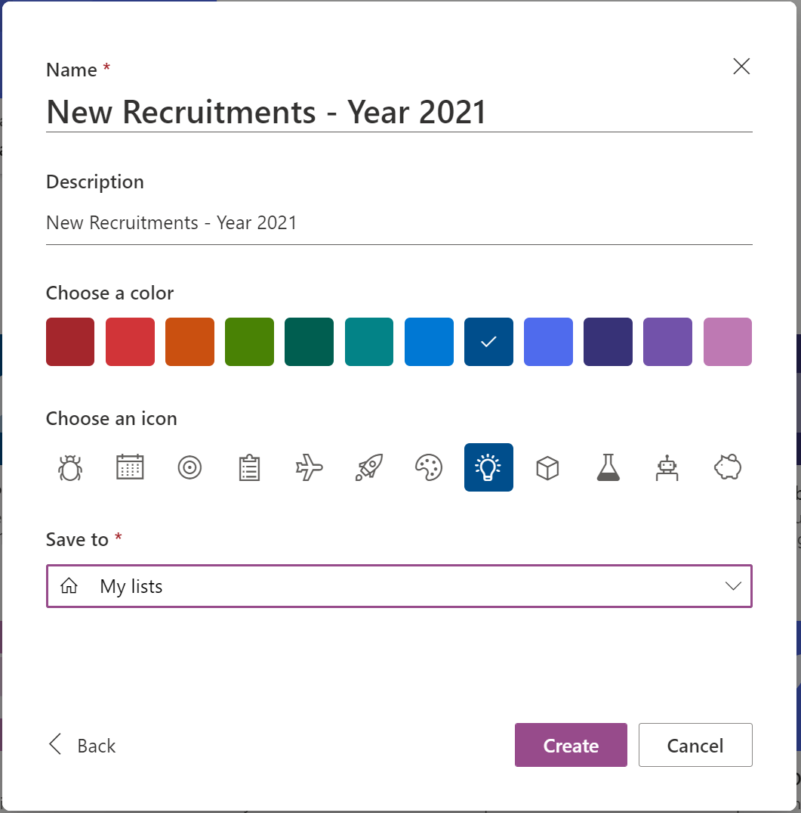

- A continuación, se muestra la lista creada ocupando todo el ancho de página. En la nueva lista podremos comenzar a añadir registros bien a través del botón "New" o bien mediante la opción de "Edit in grid view".

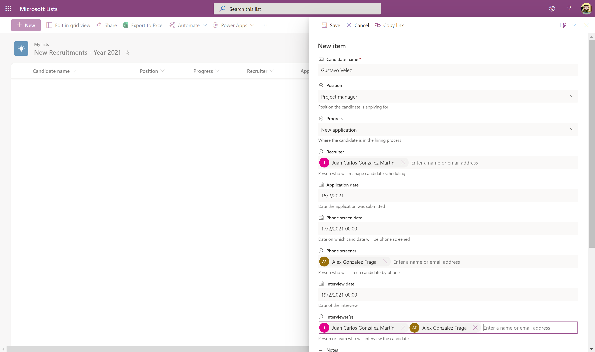

- Cualquiera de las dos opciones nos llevará al siguiente resultado en el que veremos que se han aplicado distintas personalizaciones a nivel de columna de lista, aunque también se pueden aplicar personalizaciones a nivel vista o de formulario (Veremos estas personalizaciones en artículos posteriores).

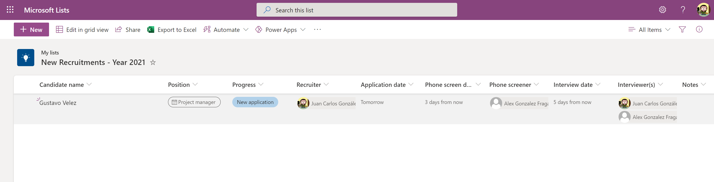

**Integración de Microsoft Lists en Sitios de SPO y en Microsoft Teams**

Microsoft Lists no solo está presente en Microsoft 365 a través de la
App de Microsoft Lists, sino también en Sitios de SPO y en Microsoft
Teams. En el caso de Sitios de SPO, la integración está disponible de
serie de acuerdo con dos posibilidades:

- Botón "New" disponible en la página principal de un sitio.

- Botón "New" disponible en la página de contenidos de un sitio.

Cualquiera de las dos opciones muestra el diálogo de creación de listas
que ya conocemos de la App de Microsoft Lists. La diferencia en este
caso es que la lista se va a crear en el sitio actual.

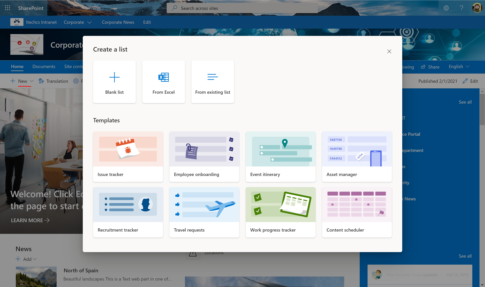

En el caso de Microsoft Teams, la integración con Microsoft Lists está
disponible como una pestaña que nos permite agregar listas en canales de
Teams:

- Dado un canal en Teams, hacemos clic en la opción de añadir una pestaña en un canal y a continuación seleccionamos Lists.

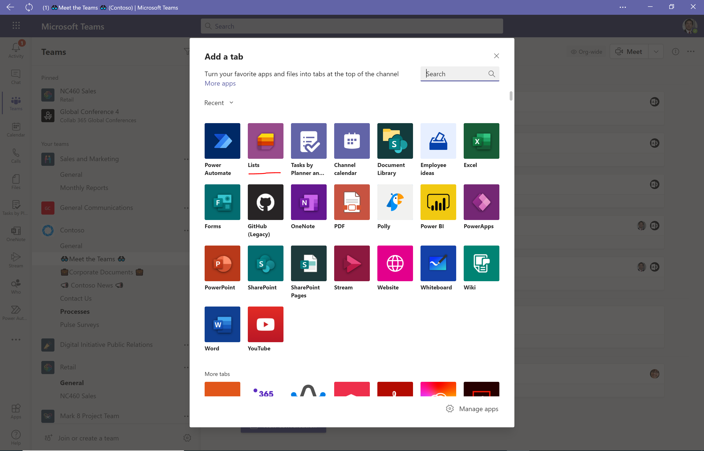

- Una vez que hemos añadido la pestaña, podremos elegir entre crear una lista o añadir una lista existente. En mi caso, voy a hacer click en la primera de las opciones:

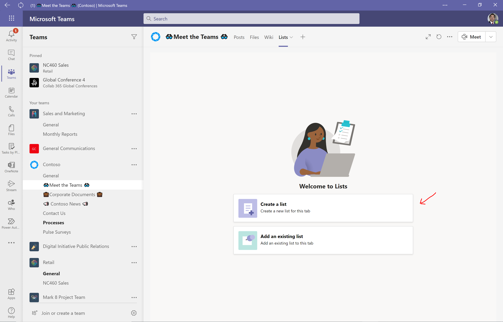

- A continuación, veremos que se muestra la experiencia familiar de creación de listas que hemos visto tanto en la App de Microsoft Lists como en un sitio de SPO. La diferencia sutil en este caso es que Microsoft proporciona 3 plantillas adicionales para listas en Microsoft Teams.

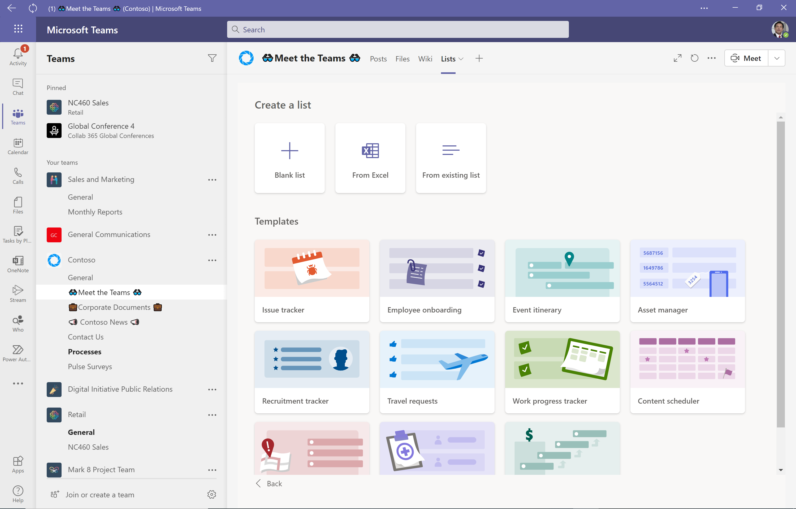

- Si por ejemplo seleccionamos la plantilla Incidentes, a continuación, tendremos que seguir el mismo proceso ya visto en la App de Microsoft Lists con la diferencia de que la lista se va a crear en el sitio asociado al Team. En primer lugar, previsualizaremos la plantilla y confirmaremos que vamos a utilizarla.

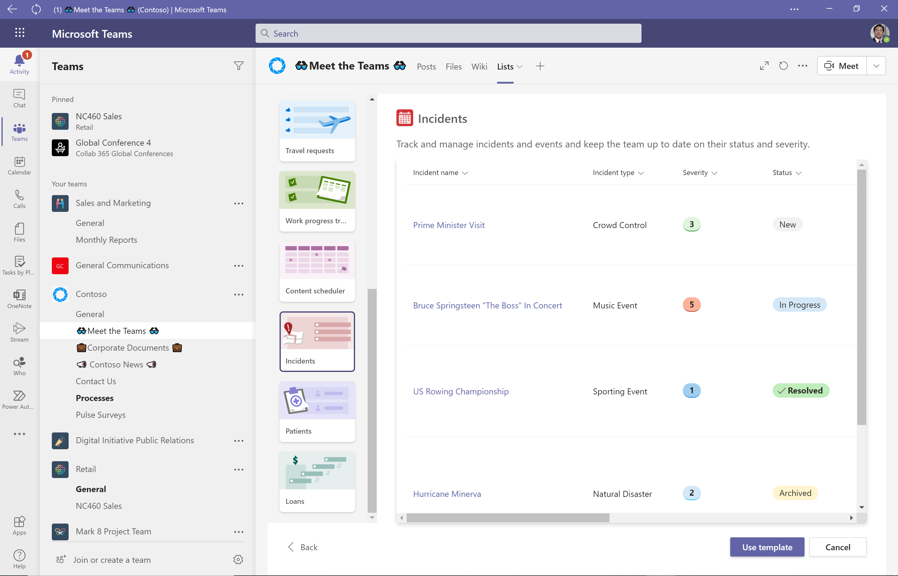

- Indicaremos el nombre, descripción, icono identificativo y color para la lista. Procedemos a su creación con el botón "Create":

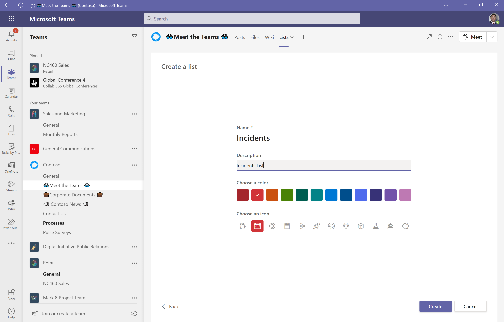

- Y a continuación tendremos la experiencia completa de trabajo con listas, pero en Microsoft Teams.

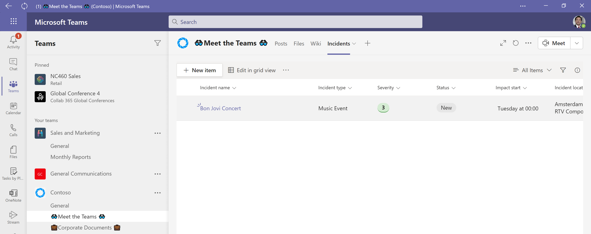

**Conclusiones**

Microsoft Lists representa la evolución de las listas tradicionales de
SharePoint a un concepto de lista moderno que facilita la creación
rápida de aplicaciones sin código para los usuarios a nivel personal (en
su ODFB) o bien de equipos de trabajo (en sitios de SPO). Microsoft
proporciona una serie de plantillas de lista por defecto, aunque se
pueden crear listas desde cero, a partir de hojas Excel o bien desde
listas existentes. Finalmente, las listas de Microsoft Lists se integran
tanto en Sitios de SPO como en Teams de Microsoft Teams.

**Juan Carlos González**  
Office Apps & Services MVP  
Microsoft 365 SME & Delivery Manager en RICOH España  
@jcgm1978