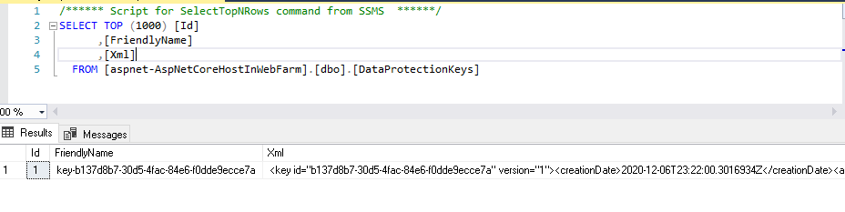
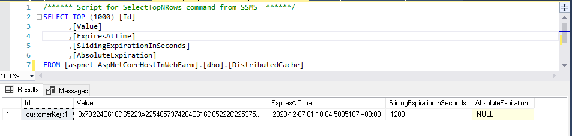

En este artículo, continuación de [ASP.NET Core - Gestionando Cookies De
Autenticación Server
Side](https://www.compartimoss.com/revistas/numero-45/asp.net-core-gestionando-cookies-de-autenticacion-server-side),
veremos cómo hay que configurar tu aplicación ASP.NET Core para que se
pueda desplegar en una granja de servidores de una forma exitosa.

Lo primero que necesitamos saber es qué es una granja de servidores:

Una granja de servidores es un conjunto de dos o más servidores web
(nodos) que pueden albergar varias instancias de una aplicación web.

Una granja siempre se encuentra detrás de un load balancer o balanceador
de carga, que se encarga de distribuir todas las peticiones recibidas a
los diferentes nodos que componen dicha granja.

**Ventajas de emplear una granja de servidores**

-   **Fiablidad.** Cuando un nodo falla, el balanceador de carga
    distribuye las peticiones a aquellos que están disponibles.

-   **Rendimiento**. Tener varios nodos permite manejar muchas más
    peticiones.

-   **Escalabilidad**. El sistema puede escalar a mayor o menor número
    de nodos según la carga de trabajo.

Si no se realiza correctamente la configuración de nuestra aplicación
para poder desplegar en una granja de servidores, obtendremos seguro,
unas excepciones en muchas peticiones. ¿Por qué? Porque tomemos un
ejemplo de encriptar una cookie desde una instancia de ASP.NET Core, al
mandar ese valor de vuelta y el load balancer mande la petición a otra,
ésta no será capaz de desencriptar dicha cookie. Esto es muy común en el
middleware de autenticación de OpenId.

Las partes fundamentales que debemos tener en cuenta para tener éxito en
el despliegue en una granja de servidores son:

-   **Data Protection.**

-   **Caching.**

**Data Protection**

Al activar Data Protection, por defecto las claves se almacenan en
disco, por lo que un nodo no puede descifrar algo cifrado por otro ya
que las claves son distintas. Para ello es necesario establecer un punto
común de claves que se compartan a través de todos los nodos de la
granja.

**Caching**

En una granja nuestro sistema de cacheo debe gestionar elementos de
todos los nodos de la granja, como se indicó en el punto anterior,
buscamos un punto común compartido. La ventaja de tener el sistema de
cacheo de forma distribuida es que no consume recursos de nuestro nodo y
que por ejemplo al reiniciarlo, la caché sigue persistida.

En el ejemplo veremos cómo usar una base de datos vía Entity Framework
Core para persistir y gestionar las claves de protección, así como
establecer un sistema de caché distribuido, empleando para ello SQL
Server como motor de base de datos.

También en el código de demo usaremos [Identity
Server](https://identityserver.io/) para la gestión del login de los
usuarios.

**¿Cómo implementar esto?**

Para configurar Data Protection en este ejemplo lo que se procede a
implementar un
[DbContext](https://docs.microsoft.com/en-us/dotnet/api/microsoft.entityframeworkcore.dbcontext?view=efcore-3.1).

```
public class DataProtectionKeysContext : DbContext, IDataProtectionKeyContext
{ 
    public DataProtectionKeysContext(DbContextOptions\<DataProtectionKeysContext\> options)
        : base(options) { } 

    public DbSet\<DataProtectionKey\> DataProtectionKeys { get; set; }
    public DbSet\<Customer\> Customers { get; set; }

    protected override void OnModelCreating(ModelBuilder modelBuilder)
    {
        modelBuilder.Entity\<Customer\>().ToTable(\"Customers\").HasKey(t =\> new { t.Id });
        base.OnModelCreating(modelBuilder);
    }
}
```

Si os fijáis, en este **DbContext**, implemento un interfaz denominado
[IDataProtectionKeyContext](https://docs.microsoft.com/en-us/dotnet/api/microsoft.aspnetcore.dataprotection.entityframeworkcore.idataprotectionkeycontext?view=aspnetcore-3.0)
para poder almacenar las claves usadas por [ASP.NET Core
DataProtection](https://docs.microsoft.com/en-us/aspnet/core/security/data-protection/introduction?view=aspnetcore-3.1).

Data Protection permite guardar las claves tanto en ficheros como blobs
de Azure Storage, base de datos, Azure Key Vault, etc... así como
utilizar certificados para firmar y añadir un plus de protección a
nuestras claves.

Os recomiendo echéis un vistazo a [Configure ASP.NET Core Data
Protection](https://docs.microsoft.com/en-us/aspnet/core/security/data-protection/configuration/overview?view=aspnetcore-5.0)
para que veáis varias opciones.

Para configurar el servicio de caché distribuido es necesario que os
descarguéis el paquete
[Microsoft.Extensions.Caching.SqlServer](https://www.nuget.org/packages/Microsoft.Extensions.Caching.SqlServer).

Ejecutar el siguiente comando dotnet para generar la tabla de base datos
que actuará para almacenar los elementos cacheados

PM\> dotnet sql-cache create \"Data
Source=(localdb)\\MSSQLLocalDB;Initial
Catalog=aspnet-AspNetCoreHostInWebFarm;Integrated Security=True;\" dbo
DistributedCache

En este caso se va a configurar la tabla denominada DistributedCache en
el servidor indicado en la cadena de conexión.

La tabla también la podremos crear con el siguiente script de SQL:

```
USE [aspnet-AspNetCoreHostInWebFarm]
GO
SET ANSI_NULLS ON
GO
SET QUOTED_IDENTIFIER ON
GO
CREATE TABLE [dbo].[DistributedCache](
 [Id] [nvarchar](449) NOT NULL,
 [Value] [varbinary](max) NOT NULL,
 [ExpiresAtTime] [datetimeoffset](7) NOT NULL,
 [SlidingExpirationInSeconds] [bigint] NULL,
 [AbsoluteExpiration] [datetimeoffset](7) NULL,
 PRIMARY KEY CLUSTERED
 (
  [Id] ASC
 ) WITH (PAD_INDEX = OFF, STATISTICS_NORECOMPUTE = OFF, IGNORE_DUP_KEY =
   OFF, ALLOW_ROW_LOCKS = ON, ALLOW_PAGE_LOCKS = ON) ON \[PRIMARY\]
 ) ON [PRIMARY] TEXTIMAGE_ON [PRIMARY]
GO
```

Una vez hecho esto sólo queda configurar la caché agregando el servicio
en el motor de inyección de dependencias de Net Core.

No se me olvida comentaros que el interfaz a usar en nuestra caché
distribuida es
[IDistributedCache](https://docs.microsoft.com/en-us/dotnet/api/microsoft.extensions.caching.distributed.idistributedcache?view=dotnet-plat-ext-5.0).

En el método ConfigureServices de nuestra clase Startup tendrá el
siguiente aspecto.

```
///<summary>
///ConfigureServices
///</summary>
/// <param name="services"></param>
// This method gets called by the runtime. Use this method to add services to the container.
public void ConfigureServices(IServiceCollection services)
{
    services.AddControllersWithViews();
    // Configure Data Protection
    var encryptionSettings = new AuthenticatedEncryptorConfiguration()
    {
        EncryptionAlgorithm = EncryptionAlgorithm.AES_256_CBC,
        ValidationAlgorithm = ValidationAlgorithm.HMACSHA256
    }; 
    services.AddDbContext\<DataProtectionKeysContext\>(options =\>
        options.UseSqlServer(
            Configuration.GetConnectionString(\"DataProtectionKeysConnection\")));
             
    services.AddDataProtection()
        .PersistKeysToDbContext\<DataProtectionKeysContext\>()
        .SetApplicationName(\"demo\")
        .UseCryptographicAlgorithms(encryptionSettings);
    // Configure Distributed Cache
    services.AddDistributedSqlServerCache(options =\>
    {
        options.ConnectionString = Configuration.GetConnectionString(\"DataProtectionKeysConnection\");
        options.SchemaName = \"dbo\";
        options.TableName = \"DistributedCache\";
    });
    services.AddAuthentication(options =\>
    {
        options.DefaultScheme = \"cookie\";
        options.DefaultChallengeScheme = \"oidc\";
    })
    .AddCookie(\"cookie\")
    .AddOpenIdConnect(\"oidc\", options =\>
    {
        options.Authority = \"https://localhost:5001\";
        options.ClientId = \"mvc.client\";
        options.ClientSecret = \"36F742BA-D9BF-49FE-B91A-D25E3A6354A5\";
                 
        // code flow + PKCE (PKCE is turned on by default)
        options.ResponseType = \"code\";
        options.UsePkce = true;
        options.Scope.Add(\"openid\");
        options.Scope.Add(\"profile\");
        options.Scope.Add(\"scope1\");
        options.Scope.Add(\"scope2\");
        options.GetClaimsFromUserInfoEndpoint = true;
        options.SaveTokens = true;
    });
}
```

Procedo a explicar el código para que no os perdáis:

-   Incluimos nuestro contexto de base de datos en el motor de inyección
    de dependencias.

-   Agregamos los servicios de DataProtection e indicamos que las claves
    se deben incluir en el contexto de base de datos del punto anterior.

-   Agregamos el servicio de caché distribuida de SQL Server que
    empleará la base de datos indicada en su cadena de conexión, puede
    ser una tabla de nuestra base de datos de la aplicación u otra
    externa.

-   Agregamos los servicios de autenticación en los cuales configuramos.

-   Agregamos los servicios para los controladores y vistas.

**¿Cómo verificamos que todo esto funciona?**

Para verificar que las claves de Data Protection se han generado
correctamente, con tan solo iniciar nuestra aplicación y realizar la
siguiente consulta veremos resultados:

```
SELECT TOP (1000) [Id]
,[FriendlyName]
,[Xml]
FROM [aspnet-AspNetCoreHostInWebFarm].[dbo].[DataProtectionKeys]
```




El XML generado con la clave tendría más o menos el siguiente aspecto:

```
\<key id=\"b137d8b7-30d5-4fac-84e6-f0dde9ecce7a\" version=\"1\"\>

  \<creationDate\>2020-12-06T23:22:00.3016934Z\</creationDate\>

  \<activationDate\>2020-12-06T23:21:57.6285509Z\</activationDate\>

  \<expirationDate\>2021-03-06T23:21:57.6285509Z\</expirationDate\>

  \<descriptor deserializerType=\"Microsoft.AspNetCore.DataProtection.AuthenticatedEncryption.ConfigurationModel.AuthenticatedEncryptorDescriptorDeserializer, Microsoft.AspNetCore.DataProtection, Version=3.1.9.0, Culture=neutral, PublicKeyToken=adb9793829ddae60\"\>

    \<descriptor\>

      \<encryption algorithm=\"AES_256_CBC\" /\>

      \<validation algorithm=\"HMACSHA256\" /\>

      \<masterKey p4:requiresEncryption=\"true\" xmlns:p4=\"http://schemas.asp.net/2015/03/dataProtection\"\>

        \<!\-- Warning: the key below is in an unencrypted form. \--\>

        \<value\>oWvh4tBJ8LqoCexLNWPx0cf4CJftdaI667N5ztM1+JdcOa4afKhRgWWUvG6Cty5KLaCW8OK32xVgk34gYxxdQA==\</value\>

      \</masterKey\>

    \</descriptor\>

  \</descriptor\>

\</key\>
```

Como se puede observar, se ven los algoritmos configurados AES_256_CBC y
HMACSHA26.

Veamos ahora ejemplos de cacheo.

```
[Authorize]
public class HomeController : Controller
{
    private readonly IDistributedCache distributedCache;
    private readonly DataProtectionKeysContext dbContext;
    public HomeController(IDistributedCache distributedCache, DataProtectionKeysContext dbContext)
    {
        this.distributedCache = distributedCache;
        this.dbContext = dbContext;
    }
    public IActionResult Index()
    {
        return View();
    }
    public IActionResult Privacy()
    {
        return View();
    }
    [ResponseCache(Duration = 0, Location = ResponseCacheLocation.None, NoStore = true)]
    public IActionResult Error()
    {
        return View(new ErrorViewModel { RequestId = Activity.Current?.Id ?? HttpContext.TraceIdentifier });
    }
    public async Task\<IActionResult\> AddCacheItem()
    {
        string key = \"customerKey:1\";
        var customer = new Customer()
        {
            Id = Guid.NewGuid(),
            Name = \"Test Name\",
            Surname = \"Test Surname\",
            BirthDay = DateTime.UtcNow.AddYears(-18)
        };
        await dbContext.AddAsync\<Customer\>(customer);
        await dbContext.SaveChangesAsync();
        await distributedCache.SetStringAsync(key, JsonConvert.SerializeObject(customer));
        return Ok(\"success\");
    }
    public async Task\<IActionResult\> GetCacheItem()
    {
        string key = \"customerKey:1\";
        var cachedItem = await distributedCache.GetStringAsync(key);
        if (!string.IsNullOrWhiteSpace(cachedItem))
        {
            return Ok(JsonConvert.DeserializeObject\<Customer\>(cachedItem));
        }
        else
        {
            var customer = await dbContext.Customers.FirstOrDefaultAsync(t =\> t.Name == \"Test Name\");
            await distributedCache.SetStringAsync(key, JsonConvert.SerializeObject(customer));
            return Ok(customer);
        }
    }
    public async Task\<IActionResult\> DeleteCacheItem()
    {
        string key = \"customerKey:1\";
        await distributedCache.RemoveAsync(key);
        return Ok(\"success\");
    }
}
```

Al ejecutar por ejemplo el método AddCacheItem() podemos ejecutar la
consulta para ver el elemento cacheado.

```
SELECT TOP (1000) [Id]
,[Value]
,[ExpiresAtTime]
,[SlidingExpirationInSeconds]
,[AbsoluteExpiration]
FROM [aspnet-AspNetCoreHostInWebFarm].[dbo].[DistributedCache]
```



**¿Dónde puedo encontrar el código de ejemplo?**

Podéis descargaros los proyectos de ejemplo en
<https://github.com/sparraguerra/compartimoss/tree/master/AspNetCoreHostInWebFarm>

**Conclusiones**

Hemos visto lo sencillo que es implementar la configuración de una
aplicación para que funcione en una granja de servidores, y hemos
comprobado la importancia que tiene Data Protection y nuestro sistema de
caching para ello.

Happy coding!

**Sergio Parra Guerra** <br />
Software & Cloud Architect at Encamina <br />
https://twitter.com/sparraguerra