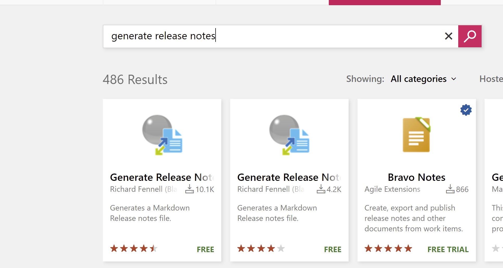

Cuando estamos envueltos en el desarrollo de un producto/proyecto, una
de las tareas que debemos llevar a cabo es controlar la versión en la
que está el producto y que mejoras se incluyen en dicha versión. Esta
labor muchas veces pensamos que puede ser una labor de marketing o del
equipo de producto ¿no? ¿Pero quién tiene el control sobre lo que se
está haciendo en el producto? El equipo técnico y hoy en día hay muchas
herramientas para que todo ese trabajo que se realiza se pueda vincular
con los casos de negocio, con las historias de usuario o simplemente con
los errores/bugs que se producen a lo largo de un sprint (siempre que se
siga una metodología Agile). A lo largo de este articulo vamos a ver
cómo podemos automatizar todo este proceso haciendo uso de algunas
herramientas de NPM o de Azure DevOps e incluirlas en nuestra rutina sin
mucho esfuerzo.

**Un poco de contexto**

Hoy en día muchos equipos de desarrollo se organizan en mayor o menor
medida haciendo uso de una metodología agile, siguen/seguimos una
aproximación a Scrum en la que el proyecto/producto que vamos a entregar
lo separamos por sprints de una duración de 2/3/4 semanas dependiendo
del equipo. En ese tiempo el equipo realiza las Tareas que se le han
asignado en un sprint, estas tareas están vinculado a una Historia de
Usuario, y esta Historia de Usuario está asociada a una Feature del
producto.

Siguiendo todo este flujo tenemos claro que si cada vez que nosotros
como desarrolladores cogemos una tarea y la damos por finalizada la
podemos hacer asociando nuestros "commits" con el desarrollo que hemos
realizado. ¿Cómo podemos hacer esto? Si estamos usando Azure DevOps se
puede poner como requisito que para que se apruebe un Pull Request sea
obligatorio que se asocie una tarea asociada. El poner esta opción
activa o no puede ser fruto de controversia entre el equipo (a mí
personalmente hay veces que me ha gustado y otras no). Pero motivos por
los que no nos gusta esta opción pueden ser : tener que acordarte de la
tarea, buscar el nombre de la misma (un poco de pérdida de tiempo), si
la tarea esta completada no la puedes volver a seleccionar, que tu
commit tenga código de más de una tarea o que por el contrario que no
tengas la tarea que estás haciendo en tu board, todos estos motivos
tienen un problema previo que no es otro que el encargado de llevar el
Board, el contenido del Sprint no se está haciendo con el rigor que
corresponde y supone que tenemos que mejorar algunos del procesos que
estamos llevando a cabo (algo que no corresponde con la finalidad de
dicho artículo).

El tema es que en algún momento tenemos que asociar la resolución de una
tarea/bug que tenemos asignado con la historia de usuario, este es el
punto de partida que se debe de realizar sí o sí. Si el desarrollador no
lo hace ya no tiene sentido el buscar como automatizar este proceso.

¿Pero cómo lo podemos hacer y de una forma sencilla para el
desarrollador? En primer lugar, para facilitar al desarrollador esta
tarea se debe de seguir una convención para para llevar a cabo los
"commits". La podéis consultar en la siguiente web
https://www.conventionalcommits.org/en/v1.0.0/

Porque usar esta convención:

-   Poder generar changelog automáticos

-   Poder versionar el producto de una forma natural

-   Comunicación con naturalidad los cambios que se producen en el
    equipo de una forma transparente

-   En proyectos open source hace mucho más fáciles que otras personas
    se puedan unir al proyecto y sea mucho más fácil empezar a colaborar

Cuáles son los aspectos principales que dice esta convención pues en
primer lugar en el mensaje del commit pongamos como palabra de inicio:

-   Feat: cuando vas a subir una feature

-   Refactor!: en el momento que vas a realizar un refactor de una
    solución

-   Docs: cuando se añade documentación

-   Fix: cuando se corrige un bug

En base esto un commit tendrá la siguiente estructura (esto es algo que
el equipo debe de tener grabado a fuego para poder hacer todo esto):

```
<tipo> [optional scope]: <descripción
[optional body]
[optional footer(s)]
```

Por ejemplo, un Commit con un mensaje que hay un "breaking changs":

Feat: allow provided config object to extend other configs

BREAKING CHANGE: 'extends' key in config file is now used for
extendending other confi files

Una vez, ya tenemos claro cuál es el objetivo que tenemos ahora vamos a
ver una herramienta para poder automatizarlo en este caso
Standard-Version
https://github.com/conventional-changelog/standard-version

**Standar Version**

Standar Version es una utilidad para hacer versionado usando semver, o
versionado semántico en castellano, que nos da la generación de un
Changelog de forma automática.

¿Como podemos automatizarlo? Vamos a explicar cuál es el flujo que
debemos de hacer para poder tener el resultado esperado

1.-Obtiene toda la información del repositorio

2.- "bumb" la versión basada en los commits

3.- Genera un "Changelog" basado en nuestros commits

4.- Crea un nuevo commit incluyendo la nueva versión y actualiza el
CHANGELOG

5.- Crea un nuevo "Tag" con el nuevo número de versión (opcional y
dependiendo del sistema de branching que tenga el equipo, aunque siempre
es bueno tener esto marcado para poder fixear errores en cada versión de
una forma sencilla)

**Manos a la obra**

Tenemos un proyecto en Azure DevOps, tenemos una API de serie que se nos
crea al crear un proyecto en DotNet. Para ello bastaría con poner las
siguientes líneas:


Una vez ya tenemos el proyecto creado haremos una serie de
modificaciones para realizar una serie de commits y así que el CHANGELOG
tenga algo de contenido y un poco de fundamento.

La primera pregunta que os estaréis haciendo seguro estamos
implementando un proyecto de .NET y me estabas hablando de una
herramienta NPM... ¿estamos haciendo lo correcto?? La respuesta
naturalmente es que sí pero claro para que podamos obtener la
información de los commits de nuestro código está claro que algo tenemos
que hacer para poder vincularlo y por ese motivo crearemos dentro del
repositorio un fichero .versionrc que tendrá el siguiente
formato


Donde

Host: La url de vuestro Azure DevOps por ejemplo compartimos.azuredevops

Your_azure_repo_link: La dirección donde esta vuestro repositorio en
Azure DevOps

Una vez ya tenemos donde vamos a obtener la configuración del
versionando el siguiente paso es automatizar dicho paso en la propia
Pipeline para ellos nos vamos a crear un pipeline en yaml, para ello nos
creamos un fichero azure-pipeline.yml que tendría el siguiente
contenido:


Que hace esta Build, compila el proyecto, ejecuta los test,
posteriormente instala standard versión, lo ejecuta para obtener todos
los cambios y posteriormente genera una rama con el tag de dicha
versión. Si ejecutáis esta build es necesario que el usuario que ejecuta
la Build tenga permisos para contribución. Para dar permisos Settings
Repos Repositorio Permisions


Si ejecutamos la Build, veremos que se ha creado un changelog dentro de
nuestro repositorio donde podemos visualizar la información relativa a
los commits que se han realizado. De la misma forma se ha creado un tag
sobre la rama que acabamos de actualizar. Cada vez que realizamos un
push sobre dicha rama este changelog se actualizará con los cambios y
actualizará la versión relativa a los cambios que se han implementado en
dicho repositorio. En el caso de que nuestro proyecto no sea de .NET sea
una aplicación de JavaScript las modificaciones que tendríamos que hacer
son mínimas ya que lo único que tendríamos que añadir es la compilación
de dicho proyecto (o bien poner un comando dentro del package.json en el
que se incluya todas estas opciones esa parte ya la dejamos para el
descubrimiento del lector)

¿Ahora bien, en qué momento creamos un changelog? Desde mi punto de
vista la generación de una actualización del changelog se debe de crear
en el momento que tenemos la versión lista para que se produzca dicho
cambio. Esto ya dependerá del propio equipo de desarrollo y de los
acuerdos que tenga el mismo. Una práctica común es cuando se termina un
sprint tener una nueva versión de dicho producto/proyecto y poder hacer
una recapitulación de todo lo que se puede entregar a QA, Bussines/
Clientes con la liberación de dicha versión.

**¿Qué problemas nos podemos encontrar con esta forma de versionar?**

Dependemos de los commits que hace el desarrollador y todos sabemos que
los desarrolladores no son máquinas (aunque algunos lo parezcan) y es
posible que se equivoquen al hacer commit, que pongan mensajes que no
correspondonan con la funcionalidad. También el mensaje muchos equipos
no le dan la importancia que toca el mensaje. Todos hemos visto
comentarios con fix o poner . o incluso comentarios vacíos. Por lo que
para realizar a poder tener un changelog, el equipo debe de tener un
nivel de madurez bastante elevado y estar bastante comprometido con la
forma en la que se trabaja.

Esta herramienta está muy bien y así podemos tener constancia de todas
las features que vamos a liberar, pero cuando vamos a comunicar estos
cambios si tenemos todo en Azure DevOps y usamos cualquier template
agile. El desarrollador vincula su commit y su mensaje con la historia
que negocio ha redactado y tiene su "idioma". Por lo que de esta forma
podemos por un lado tener controlado el versionado técnico haciendo uso
de standard version pero también a través de la API de AzureDevOps
podemos montarnos una relación entre estos commits y las historias de
usuario que se han redactado.

Ahora bien, como lo podemos hacer de una forma fácil en AzureDevops
existe una Store donde nos podemos descargar aplicaciones (algunas de
pago) para poder extender AzureDevOps. Para este caso en particular
hemos tenido la enorme fortuna que un miembro de la comunidad Richard
Fennell MVP en Developer Tecnologies (https://github.com/rfennell) que
implemento una solución
https://marketplace.visualstudio.com/items?itemName=richardfennellBM.BM-VSTS-XplatGenerateReleaseNotes

**Generate Release Note**

Como empezar a usarla, lo que tenemos que hace es instalarla. Buscamos
dicha App dentro de la Store y la instalamos.



Una vez ya la tenemos instala el siguiente paso es añadirla en la Build,
Release en el que queremos obtener el Changelog. En nuestra Build o
Release lo que ahora necesitamos es saber qué información vamos a
mostrar y como la mostramos. Para ello en la aplicación cada vez que la
añadimos a una Pipeline tendremos que configurar el fichero de salida y
el "template" con el que vamos a mostrar esta información. Este template
siguiendo la documentación que se proporciona hace uso de handlebar para
la sintaxis y nos queda tunearlo para adaptarlo a nuestras necesidades.


**Conclusión**

El versionado dentro de un producto/proyecto es algo muy importante y
que todos los miembros de este se deben de hacer cargo. En proyectos a
corto plazo muchas veces ni nos planteamos versionarlo, pensamos como
solamente lo vamos a hacer una vez pues no tenemos que versionar nada.
Otras veces empezamos a versionarlo, pero las prisas, las entregas y el
día a día nos hace abandonarlo y no tenerlo actualizado. Sin embargo,
sea la razón que se esgrima esto lo que se indica es el grado de madurez
que tiene el equipo para hacer las cosas. En equipos que se tienen todo
automatizado y funcionan como un reloj estas notas, changelog no son más
que un mecanismo más que hace que nuestro software sea entendible por
otros, ya sean developers o gente de negocio.

Como hemos visto en el artículo, no es algo muy costoso y que solo
requiere de un poco de organización dentro del equipo y que tenga el
mismo las ideas claras sobre lo que estamos haciendo. Este artículo es
tanto valido para proyectos como para productos y creo que es importante
para que el equipo se comprometa y sepa cuál ha sido el objetivo del
sprint, lo que hemos entregado y la calidad de este. Esto es un paso más
para la mejora continua del mismo y por dicho motivo se debe de evaluar
incluirlo dentro del mismo.

**Adrián Diaz Cervera** <br />
Technical Lead at SCRM Lidl Hub International <br />
MVP Office Development <br />
http://theavenger.dev <br />
@AdrianDiaz81