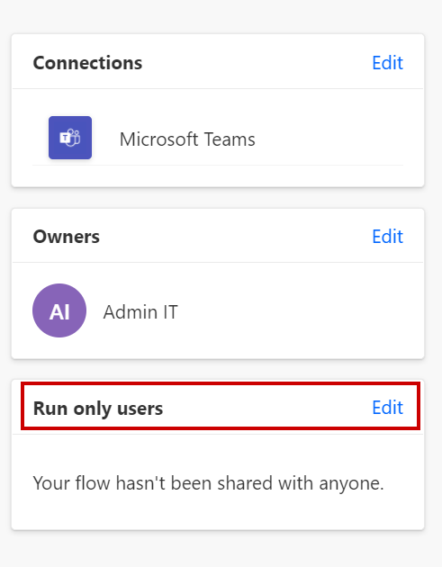
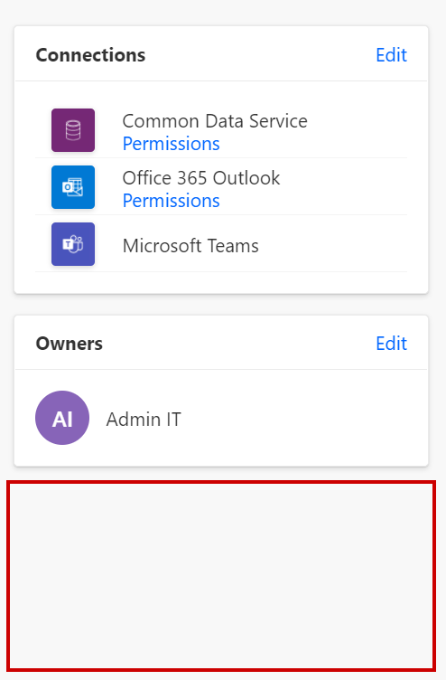
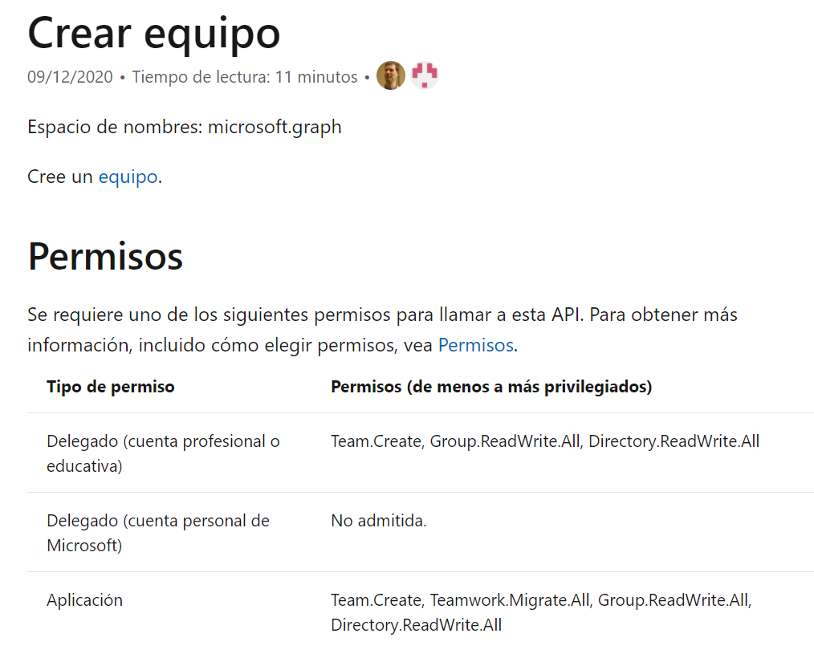
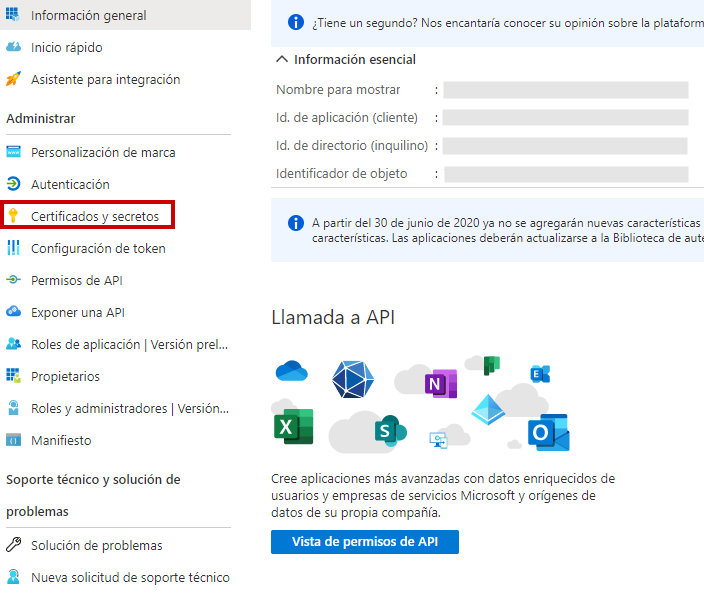
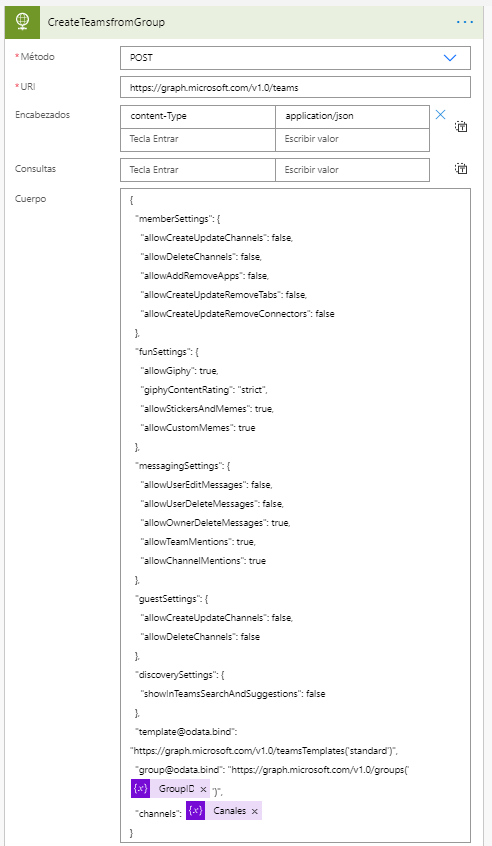
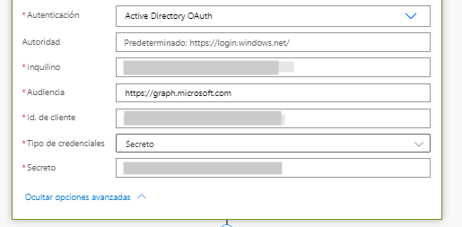
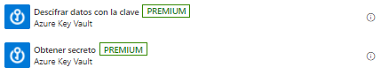

Descubre cuando y como utilizar Graph API en Power Automate en lugar de
los conectores estándar. En este artículo vamos a tratar como podemos
utilizar la API de Graph en nuestros procesos de Power Automate.

**¿Por qué usar Graph API si Power Automate tiene cientos de conectores?**

En algunos casos no disponemos de todos los conectores que nos gustaría
tener dentro de Power Automate, así que podemos hacer uso de la API de
Graph para ampliar las capacidades que nos ofrece la herramienta. En
otras ocasiones, esos conectores de los que disponemos se ejecutan con
la conexión del usuario que lo creó. Aunque la opción de "Run-Only User"
nos permite solucionar esto último esta no siempre está disponible.

¿Cuándo la tendremos disponible? En los flujos ejecutados de forma
instantánea con botón "Manually trigger a flow" o en aquellos flujos que
se generen desde SharePoint con el desencadenador "For a selected item".

[Aprenda a compartir un flujo de nube con otros usuarios - Power Automate | Microsoft Docs](https://docs.microsoft.com/es-es/power-automate/create-team-flows)

Por ejemplo, si quisiéramos usar el conector de Microsoft Teams para
crear un equipo cuando se crea un registro en dataverse no vamos a tener
disponible esta opción y por tanto el propietario del equipo será el
usuario que haya creado la conexión con el paso de Power Automate de
Microsoft Teams.

Si lo que queremos es que el propietario del equipo de Teams sea la
persona que lo ha solicitado o creado el registro en dataverse o incluso
su responsable deberemos usar Graph API.

Además, no todas las funcionalidades están disponibles desde los
conectores estándares de Microsoft Teams u otros servicios. Como, por
ejemplo, si continuamos hablando de los conectores de Microsoft Teams,
el crear un equipo en base a una plantilla de Microsoft Teams o incluso
gestionar los permisos de los miembro e invitados en el mismo momento de
la creación, no se puede realizar y por ello deberemos utilizar la API
de Graph.

[Crear una plantilla de equipo personalizada en Microsoft Teams - Microsoft Teams | Microsoft Docs](https://docs.microsoft.com/es-es/microsoftteams/create-a-team-template#:~:text=Inicie%20sesi%C3%B3n%20en%20el%20centro%20de%20administraci%C3%B3n%20de%20Teams.&text=En%20el%20navegaci%C3%B3n%20izquierdo%2C%20expanda,Haga%20clic%20en%20Agregar%20.)

**¿Cómo utilizar la API Graph en Power Automate?**

Lo primero será crear un registro de aplicación en nuestro Azure AD y
asignarle los permisos necesarios para el comando que va a ejecutar.
Para conocer esos permisos simplemente debemos consultarlos en la misma
documentación de la API.

Después necesitaremos crear un secreto para este registro de aplicación.

Finalmente, necesitaremos incorporar a nuestra Power Automate un
conector del tipo HTTP que lo encontraremos dentro de los conectores
premium, lo que significa que deberemos tener una licencia que nos
permita el uso de este tipo de conectores.

En el siguiente ejemplo, se muestra como crear un equipo de Microsoft
Teams en base a una plantilla, definiendo permisos y canales adicionales
que no estén en la misma. Como se muestra, algunos datos son variables
que se han generado durante el desencadenamiento del Power Automate. Los
canales son una variable de tipo matriz que se compone previamente y el
ID de grupo de Microsoft 365 lo obtenemos de la creación previa donde le
indicamos los miembros y propietarios.

En este conector, nos pedirá que introduzcamos el método de
autenticación que se debe elegir para desencadenar la API Graph y es
aquí donde es necesario nuestro registro de aplicación y nuestro
secreto. Elegiremos el método de autenticación "Active Directory OAuth"
e introduciremos los datos según la información de nuestro registro de
aplicación.

[How to authenticate as an application with Microsoft Graph API with flow ~ Benitez Here.](https://benitezhere.blogspot.com/2020/12/%20how-to-authenticate-as-application-with-microsoft-graph-api-with-flow.html)

Por último, para garantizar la seguridad de nuestro secreto, podemos
utilizar Azure Key Vault y llamar al servicio desde Power Automate para
que nuestro secreto permanecerá encriptado.

Por lo tanto, como hemos observado, aunque con los conectores de Power
Automate estándar no disponga dentro de su abanico de posibilidades la
funcionalidad que necesitamos, a través del conector de HTTP y un
registro de aplicación, podemos conectar con la API de Graph y extender
la funcionalidad de nuestro Power Automate.

**Mar Pedroche**  
Modern Workplace Solutions Specialist  
[LinkedIn](https://www.linkedin.com/in/mar%C3%ADa-del-mar-pedroche-ad%C3%A1n-2a9849119/)  
Twitter: @MarPedroche  
 
import LayoutNumber from '../../../components/layout-article'
export default LayoutNumber
