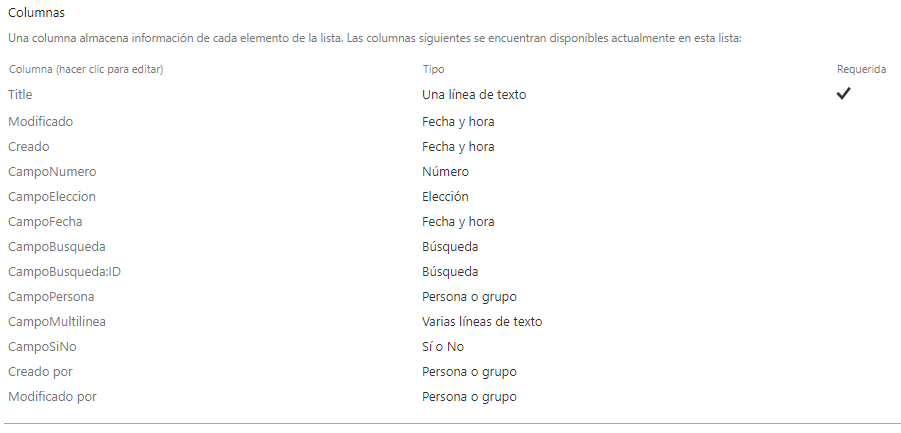
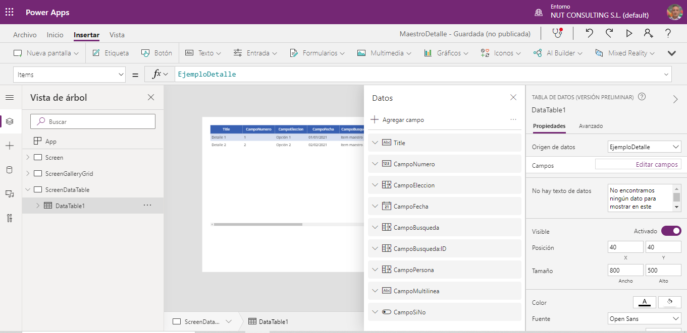

Una de las tareas más frecuentes que nos podemos encontrar al
desarrollar una App con PowerApps es el mostrar o manejar listas de
datos ya sea desde un origen de base datos, ficheros, o listas de
SharePoint por citar 3 ejemplos. PowerApps nos proporciona varios
controles para que podamos mostrar esos datos al usuario y que se pueda
realizar operaciones de inserción, modificación y borrado sobre
elementos de esas listas.

Es este articulo veremos cómo implementar estas funcionalidades, que
controles tenemos para ello y como personalizarlos.

Para los ejemplos he escogido listas de SharePoint como orígenes de
datos.

Estas listas son:

-   EjemploMaestro:


-   EjemploDetalle:




-   Continentes:


-   Países:


**Controles existentes que permiten manejar listas/tablas**

***DataTable***

Los DataTable son controles que permiten ver un origen de datos en
formato de grid o tabla. Es un control muy sencillo que NO permite
editar los datos ni personalizarlo en exceso, por ello su uso está
limitado a situaciones donde solo requiramos mostrar los datos sin
demasiadas "florituras" y sin poder editar esos datos sobre el mismo
grid (modo espartano ON ¡auhh! ¡auhh! ¡auhh!).

Para utilizar un DataGrid simplemente lo insertamos en la pantalla y
escogemos el origen de datos que queremos mostrar.


Tras escoger el origen de datos podremos escoger que campos queremos
mostrar en el DataTable.




La propiedad Items es la que enlaza el origen de datos con el control.
En el ejemplo es el origen de datos EjemploDetalle

La propiedad Selected del DataTable es la que nos permite acceder al
registro escogido por el usuario.

Es importante destacar que, aunque no escojamos para mostrar todos los
campos del origen de datos, sí que tendremos disponible el registro
completo cuando referenciemos la propiedad DataTable.Selected sin más
que añadiendo el nombre del campo a la expresión.

En el ejemplo tenemos el origen de datos EjemploDetalle enlazado al
dataTable1. Para obtener el valor del campo CampoNumero del registro
seleccionado por el usuario simplemente tendríamos que invocar
DataTable1.Selected.CampoNumero.

En cuanto a las personalizaciones, son escasas. Podemos cambiar el
nombre del encabezado de las columnas desbloqueando la edición de esta y
modificando la propiedad DisplayDataField.

NO es posible modificar, por ejemplo, la alineación de un campo, la
fuente de la columna o su color de fondo.

Microsoft ya ha anunciado para este año la liberación de un nuevo
DataTable con más funcionalidades.

***Gallery***

Los Gallery permiten mostrar uno o varios campos de un origen de datos
en un formato de lista horizontal o vertical. Están compuestos por uno o
varios controles para mostrar los valores de los registros y de un
Template que es la "caja" que contiene estos controles, este Template no
se ve en el control, pero sí que hay propiedades referidas al Template.

Lo interesante del control Gallery es que tiene muchas más opciones de
personalización que un DataTable, por lo que es más interesante de
utilizar cuando necesitamos un aspecto visual enriquecido.

Para insertar un Gallery lo escogemos sin más en el menú de controles y
escogemos que plantilla vamos a usar.

Las plantillas por defecto incluyen uno o dos campos de datos, insertar
una imagen (interesante opción si mostramos una lista de personas y
tenemos disponible su foto).


Una vez insertado, podremos añadir más controles dentro del gallery, por
ejemplo, un control de texto.


Igual que con los DataTable enlazamos el control con el origen de datos
mediante la propiedad Items.

El control Gallery dispone de la propiedad ThisItem, que es de un tipo
complejo, que hace referencia al registro actual dentro de cada elemento
mostrado por el Gallery.

Con esta propiedad es con la que podremos realizar operaciones en los
controles del Gallery. Podremos establecer la propiedad Default de un
control como ThisItem.NombreDeCampo con lo que en cada elemento del
Gallery se mostrará el valor de dicho campo.

Es importante señalar que esta propiedad ThisItem no se puede utilizar
fuera del control Gallery.

Si queremos acceder al registro seleccionado por el usuario, al igual
que en el DataTable, disponemos de la propiedad Selected.

**Form**

Un Form es un control que nos permite la visualización, edición o
inserción de registros en una fuente de datos. Se compone de uno o
varios controles DataCard que representan cada uno de los campos que
queremos gestionar. A su vez un DataCard se compone de varios controles
que nos permitirán ver o editar el campo.

Los Form son la forma más sencilla de gestionar registros de una fuente
de datos y deberían ser nuestra primera opción para ello.

Para insertar un Form solo hay que seleccionarlo en el menú de controles
y escoger el origen de datos (o fijarlo en la propiedad DataSource)


En el ejemplo he añadido un formulario en modo de edición con el origen
de datos EjemploDetalle. PowerApps genera los datacards y los controles
adecuados para cada tipo de dato del origen ya sean controles de texto,
listas desplegables, casillas o el control de adjuntos.

En el caso de campos obligatorios (Title en el ejemplo) se genera la
funcionalidad adecuada para que en caso de intentar guardar un nuevo
registro sin ese campo se avise al usuario y no se guarde el registro.

Los controles contenidos en el formulario están bloqueados para su
edición, sin embargo, es posible desbloquearlos para cambiarlos de
acuerdo con nuestras necesidades.

En el ejemplo podríamos cambiar la propiedad DisplayName de los datacard
que, por defecto, muestra el nombre del campo del origen de datos para
mostrar un nombre distinto (título en lugar de Title) o para incluir
espacios en blanco, tildes... (manías de un servidor, los nombres de las
columnas en listas de SharePoint siempre las pongo sin espacios ni
tildes).


Algunas propiedades que usaremos más habitualmente en este control son:

-   **Mode**: Indica si el formulario está en modo de edición, nuevo o
    vista.

-   **Item:** Fijando está propiedad con un registro el formulario
    muestra la información de dicho registro.

-   **Unsaved:** Esta propiedad booleana indica si se ha modificado los
    datos del registro que se ha cargado.

-   **LastSubmit**: nos proporciona el último registro que se ha
    guardado. Muy útil si necesitamos obtener el ID del registro que se
    ha guardado ya que ese dato se habrá generado automáticamente. Solo
    hay que invocar Form1.LastSubmit.ID.

-   **OnReset, OnFailure, OnSuccess:** propiedades de comportamiento
    (eventos) que se ejecutan al resetear, guardar con fallo o guardar
    con éxito.

Para cambiar el modo del formulario disponemos de las funciones
NewForm(NombredelForm), EditForm(NombredelForm),
ViewForm(NombredelForm).

Por último, para guardar un Form disponemos de
SubmitForm(NombredelForm).

En la sección siguiente veremos un ejemplo de uso de todas estas
funciones para implementar operaciones de creación, adición y borrado de
registros.

Podemos personalizar el Form haciendo que un DataCard sea más ancho,
cambiando su fuente, tamaño, poner un color de fondo en función de una
condición... simplemente desbloqueando el dataCard y modificando sus
propiedades o las propiedades de los controles que contiene.

En muchas de estas propiedades de los controles se hará referencia a la
propiedad del Datacard mediante el uso de Parent. Por mencionar un caso
un control TextInput dentro de un datacard tendrá fijada su propiedad
Default como Parent.Default

**Como realizar operaciones CRUD**

El escenario es el siguiente: vamos a tener una pantalla donde podremos
manipular el origen de datos Países. Insertamos los siguientes
controles:

-   DataTable (DataTablePaises).

-   Form (FormPais).

-   Icono IconNuevo.

-   Icono IconBorrar.

-   Icono IconGuardar.


El DataTable lo enlazamos al origen de datos Países y escogemos mostrar
los campos título y continente.

El Formulario lo enlazamos al mismo origen de datos fijando su propiedad
DataSource al origen de datos Países. PowerApps se da cuenta que el
campo Continente es un campo de búsqueda y nos crea automáticamente el
control adecuado para manejar este tipo de campo.

Fijamos la propiedad Item del Form con DataTablePaises.Selected. Con
esto cuando cambiamos el item seleccionado en el Datatable nos lleva el
registro escogido al Formulario.

*Añadir un registro*

Para añadir un nuevo registro: Invocaremos desde la propiedad Selected
del icono IconNuevo la función NewForm(FormPais) lo que nos limpia todos
los campos del formulario y lo pone en modo New para editar los campos
que contiene.

*Borrar un registro*

Para borrar un registro invocaremos en la propiedad Selected del icono
IconBorrar la función RemoveIf(Paises,\{ID:
DataTablePaises.Selected.ID\}).

*Guardar un registro*

Invocaremos desde la propiedad Selected del icono IconGuardar la función
UpdateForm(FormPais).

Hay situaciones donde tenemos que crear o modificar un registro en una
lista que no mostramos directamente al usuario, para ello podemos
utilizar la función Patch. Siguiendo con el ejemplo anterior la sintaxis
seria:

-   Para crear un registro nuevo:
    Patch(Paises;Defaults(Paises);\{Titulo:"nuevo pais"\})

-   Para modificar un registro que ya existe:
    Patch(Paises;Lookup(Países;ID=ID_DEL_REGISTRO);\{Titulo:"nuevo
    pais"\})

*Filtrado de datos*

Normalmente tendremos que filtrar el origen de datos de acuerdo con
reglas de negocio. Para Filtrar un origen de datos disponemos de 3
funciones:

-   Filter: Busca todos los registros que cumplen con una condición.

-   Search: Busca todos los registros que contienen una cadena de texto
    en una de sus columnas.

-   Lookup: busca el primer registro que cumple con una condición.

Si en un control DataTable o Gallery fijamos la propiedad Items con una
función de filtrado y en la condición de filtrado incluimos el valor de
otro control haremos que el usuario sea capaz de realizar un filtrado de
los elementos que desea ver.

Por ejemplo, disponemos de un Gallery que mostrará elementos del origen
de datos EjemploDetalle y añadimos un control DatePicker. En la
propiedad Items del Gallery ponemos la expresión:

```
Filter(EjemploDetalle;CampoFecha>=DatePicker1.SelectedDate)
```


Con esto conseguimos que el Gallery muestre solamente los registros de
EjemploDetalle cuyo campo CampoFecha tenga valores mayores o iguales que
la fecha seleccionada en el control DatePicker1.

**Limitaciones en el filtrado**

Cuando hacemos un filtrado, PowerApps intenta delegar esas condiciones o
consulta en la fuente de datos, lo que es más eficiente. Si no se puede
delegar y el conjunto de datos es muy grande podemos encontrarnos con
que el filtrado no funciona bien al no acceder al todo el conjunto de
datos ya que existe un límite de 500 elementos recuperados, es posible
ampliar este límite hasta 2000 editando la configuración avanzada de la
App.


¿Es posible sortear esta limitación? Que cosas pregunto ¡claro que sí!
...pero esa es otra historia y debe ser contada en otra ocasión.

**Manejo de estructuras de maestro/detalle o controles en cascada**

Cuando tenemos varias listas relacionadas entre ellas es frecuente ir
filtrando listas de acuerdo con el elemento de nivel superior escogido.
Por ejemplo, tenemos una lista de Continentes y una de Países donde
tenemos una columna de tipo búsqueda con el continente donde está ese
país.

Para tener controles en cascada hemos añadido un control de lista
enlazada al origen de datos Continente y un DataTable a la lista de
Paises.

Para que el DataTable solo muestre los países cuyo continente sea el
escogido por el usuario en la lista lo que debemos hacer es filtrar el
origen de datos del DataTable. Para ello modificamos su propiedad Items
con el filtro del campo búsqueda. Recuerda que el campo Continente en la
lista países es un campo de búsqueda enlazado a la lista Continentes

```
Filter(Paises;'Continente:ID'.Id=Dropdown2.Selected.ID)
```


**Manejo de tipos complejos de datos**

Los tipos complejos de datos requieren un tratamiento adicional ya que
PowerApps no los maneja directamente. Si nos centramos en tipos de datos
de listas de SharePoint esos tipos son:

-   Elección.

-   Búsqueda.

-   Persona.

Estos tipos de datos tienen una estructura interna con varios campos que
SharePoint maneja internamente pero que nosotros deberemos manejar
explícitamente desde PowerApps. Por ejemplo, para crear un registro en
un origen de datos con campos complejos con la función Patch debemos
utilizar las siguientes estructuras:

```
Campo de tipo búsqueda:
{'@odata.type':"#Microsoft.Azure.Connectors.SharePoint.SPListExpandedReference";Id:<<valor
del Id>>;Value:"<<texto>>"}

Campo de tipo persona:
{'@odata.type':"#Microsoft.Azure.Connectors.SharePoint.SPListExpandedUser";
Claims:"i:0#.f|membership|" & "<<correo del usuario>>";
DisplayName:"<<Nombre del usuario>>"}

Campo de tipo elección:

{'@odata.type':"#Microsoft.Azure.Connectors.SharePoint.SPListExpandedReference",
Id:<<ID>>, Value:"<<Texto de la opción>>"}
```

El ejemplo completo de la sintaxis para crear un nuevo registro en el
origen de datos Paises y teniendo la lista de continentes en un control
DropDown llamado ListaContinentes:

```
Patch(Paises;Defaults(Paises);{Title:"Uruguay";Continente:{'@odata.type':"#Microsoft.Azure.Connectors.SharePoint.SPListExpandedReference";Id:
ListaContinentes.Selected.ID;Value: ListaContinentes.Selected.Título}})
```

Este ejemplo es a titulo ilustrativo, ya vimos en la sección anterior
que con el uso de formularios el guardado es mucho mas sencillo. Sin
embargo, hay ocasiones en las que deberemos crear registros de orígenes
de datos SharePoint que no están enlazados a Forms por lo que deberemos
recurrir a la función Patch y al manejo de estos campos complejos.

**Uso del control Gallery como grid**

Un uso interesante de Gallery es "tunearlo" para que parezca un grid de
datos para, por ejemplo, mejorar el aspecto.

Para ello tendremos que realizar lo siguiente:

-   Añadir un Gallery vertical y establecer el origen de datos


-   Para cada campo que queramos tener en nuestro "GalleryGrid", añadir
    un control de entrada de texto, casilla, etc.


Disponemos los controles en horizontal y ajustamos el alto del elemento
dentro del Gallery.

Para enlazar cada control fijamos su propiedad Default al valor
ThisItem.NombreDelCampo

Añadimos un icono que nos servirá para que se guarde la línea.

Con esto ya podremos ver que el Gallery muestra los registros que
tengamos.

Podrías pensar, amable lector/a, "*a ver Alberto, alma de cántaro...en
vez de tanto rollo de controles inserta un Form dentro del Gallery*"
¡bien pensado! y es lo que pensé yo...pero PowerApps de momento no
permite insertar un Form dentro de un Gallery.

Curiosamente sí que es posible insertar un Gallery dentro de un Gallery
pero sin emocionarse, un tercer nivel de Gallery anidado ya no es
posible. En la siguiente sección veremos cómo hacer esto.

Sigamos entonces. Si queremos tener encabezados, una forma fácil es
añadir labels fuera del Gallery, también podemos darle un ancho al borde
del Gallery con lo que conseguimos un aspecto más de tabla o grid.


Ahora es cuando podemos jugar con las personalizaciones de los
controles. Por ejemplo, en la propiedad Fill del DatePicker2 añadimos la
siguiente expresión:

```
If(DatePicker2.SelectedDate>=Today();RGBA(0; 255; 0; 0,5);RGBA(255; 0;
0; 0,5))
```

Con esto conseguimos que el color de relleno sea rojo si la fecha del
registro está en el pasado y en verde si está en el futuro (Marty, Doc
esto no os aplica a vosotros).


Para ocultar el icono de guardar si no se ha cambiado nada añadimos la
siguiente expresión en su propiedad Visible:

```
TextInput3.Text<>ThisItem.Title ||
HtmlText1.HtmlText<>ThisItem.CampoMultilinea ||
Checkbox1.Value<>ThisItem.CampoSiNo ||
Dropdown1.Selected.Value<>ThisItem.CampoEleccion.Value
||DatePicker2.SelectedDate<>ThisItem.CampoFecha
```

Si tenemos muchos campos esta condición se nos hará un tanto larga.

Como último paso (porque se me ha olvidado ponerlo antes), configuramos
la propiedad TemplateFill del Gallery para que sea gris en el ítem
seleccionado por el usuario. Para ello Usamos la propiedad IsSelected de
ThisItem de la siguiente forma:

```
If(ThisItem.IsSelected;RGBA(0; 0; 0; 0,25);RGBA(0; 0; 0; 0))
```


Con esto tenemos nuestro "tuneado", solo faltaría añadir la
funcionalidad de guardado en la propiedad OnSelect del icono utilizando
la función Patch.

Una diferencia importante en cuanto a usabilidad de nuestro
"Gallery/grid" respecto a controles grid tradicionales es que los datos
no se guardan automáticamente al cambiar de campo o fila. Si es posible
guardar un campo cuando cambie su valor mediante la propiedad de
comportamiento OnChange, pero los tiempos de respuesta pueden no ser
buenos para la experiencia de usuario.

No es posible (al menos que este autor haya encontrado) guardar un
registro automáticamente al cambiar de fila ya que, aunque tenemos una
propiedad de comportamiento Selected, no hay una propiedad de
comportamiento que nos permita realizar una acción (guardar el registro)
al salir de una fila.

**Gallery en cascada**

Podemos tener un Gallery dentro de otro de forma que tengamos una
especie de control en árbol. Veamos como lo hacemos.

Vamos a hacer un Gallery anidado que muestre en su primer nivel los
elementos del origen de datos Continentes y para cada uno de ellos los
elementos del origen de datos Países que pertenecen a dicho continente.
Recuerda que en la lista de SharePoint Países tenemos un campo Lookup
enlazado a la lista Continentes.

En una pantalla insertamos:

-   Botón ExpandirTodos.

-   Botón ContraerTodos.

-   Gallery de tipo Flexible (GalleryContinentesFlexible):

    -   Label (labelNombreContinente).

    -   Icono de flecha a la derecha (Ico.nDerecha).

    -   Icono de flecha abajo (IconAbajo).

    -   Gallery (GalleryPaises):

        -   Label (LabelNombrePais).

        -   Rectángulo (Separador).

Colocamos los controles para que no se amontonen.


Fijamos las propiedades:

  | Control                     | Propiedad      | Valor
  | ----------------------------| -------------- |--------------------------------------------------------------
  | GalleryContinentesFlexible   | Items          | Continentes
  | GalleryContinentesFlexible   | TemplateFill   | If(ThisItem.IsSelected;RGBA(0; 0; 0; 0,25);RGBA(0; 0; 0; 0))
  | labelNombreContinente        | Text           | ThisItem.Título

Con esto ya tenemos la lista de continentes:


Ahora vamos con el Gallery de países, fijamos las siguientes
propiedades:

  | Control           | Propiedad   | Valor
  | ----------------- | ----------- | -------------------------------------------------
  | GalleryPaises     | Items       | Filter(Paises;'Continente:ID'.Id=ThisItem.ID)
  | labelNombrePais   | Text        | ThisItem.Título


Fácil ¿no?

Ahora nos venimos arriba y vamos a añadir funcionalidad para
expandir/contraer toda la lista de continentes y expandir/contraer un
continente.

Para ello Crearemos una variable _Expandir que tomará valores 0
(expandir todo), 1 (contraer todo) y 2 (expandir elemento actual).

  Control         Propiedad   Valor
  --------------- ----------- ---------------------------------------------------------
  BotonExpandir   OnSelect    Set(_Expandir;0)
  BotonColapsar   OnSelect    Set(_Expandir;1)
  IconAbajo       OnSelect    Set(_Expandir;1)
  IconDerecha     OnSelect    Set(_Expandir;2)
  IconAbajo       Visible     (ThisItem.IsSelected && _Expandir=2)|| _Expandir=0
  IconDerecha     Visible     (!ThisItem.IsSelected && _Expandir=2)|| _Expandir=1

Y ahora es donde hacemos que GalleryPaises se vea o no jugando con su
propiedad Height de la siguiente forma:

```
Switch(_Expandir;
//expandir todo
0;CountRows(GalleryPaises.AllItems)* Self.TemplateHeight;
//contraer todo
1;0;
//expandir seleccionado
2;If(ThisItem.IsSelected;CountRows(GalleryPaises.AllItems)*
Self.TemplateHeight;0)
)
```

Y ale, extra point, modificamos la propiedad Text de
labelNombreContinente

```
ThisItem.Título & " (" & CountRows(GalleryPaises.AllItems) &")"
```

Así vemos el número de países de cada continente:


Tenemos una limitación de este control compuesto: perdemos la
posibilidad de seleccionar un elemento del Gallery hijo y por lo tanto
la propiedad Selected no contendrá ningún valor y el evento OnSelect no
se producirá nunca.

¿Podemos hacer algo?

Resulta que sí: añadimos un icono IconEditar dentro del GalleryPaises y
resulta que si podemos hacer click sobre el icono. Fijamos su propiedad
OnSelect.

```
Set(_ItemPais;ThisItem.ID)
`` 

Añadimos un Formulario y fijamos su propiedad Items

`` 
LookUp(Paises;ID=_ItemPais)
```

¡Et voila!


Tarea para casa: añade tú la funcionalidad de guardar el formulario o
añadir un nuevo país

**Conclusiones**

PowerApps nos ofrece un potente mecanismo de conexión a fuentes de datos
y varios controles para manejar esos campos y listas de una forma muy
sencilla, encapsulando los orígenes para mostrarlos de forma homogénea.

Aunque los controles pueden parecer sencillos, con un poco de trabajo
podemos personalizarlos para enriquecer el aspecto y funcionalidad de
nuestras Apps sin tener que recurrir a técnicas más complejas (aunque
más potentes) como el desarrollo de componentes.

Debemos tener claras las limitaciones tanto en orígenes de datos como en
funcionalidad de controles a la hora de diseñar nuestra App.

PowerApps es una plataforma en continuo desarrollo por parte de
Microsoft e irá incorporando funcionalidades continuamente. Existen
varios canales donde podemos lanzar ideas para estas nuevas
funcionalidades o apoyar esas ideas.

¡Muchas gracias por leer mi artículo!

**Alberto Escola**