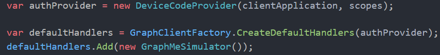

import ArticleHeader from '../../../components/article-header'

<ArticleHeader frontmatter={props.pageContext.frontmatter} />

En este artículo vamos a hablar de la última versión del SDK de MS Graph
para .NET, viendo las opciones que tenemos para personalizarlo a más
bajo nivel, algo que nos será muy útil en determinados escenarios.

**Introducción a Graph SDK para .NET**

A estas alturas, ya es bien conocido que, si trabajamos con Graph API
desde .net, tenemos un SDK desarrollado por MS, que está muy maduro, y
que desde luego recomiendo utilizar, en lugar de lanzar peticiones
directamente a la API.

Tenemos dos paquetes nuget a elegir, uno trabaja con la versión v1.0 de
la API, mientras que el otro, lo hace con la versión Beta. Esto no solo
influye en la URL de Graph a invocar por el SDK
(graph.microsoft.com/v1/... vs graph.microsoft.com/beta/...), si no que
el modelo de objetos en general, es diferente, y para el Beta, tendremos
más propiedades en clases como *User*, o todas las clases que dan
soporte a la nueva Taxonomía de SharePoint, y que ya podemos usar desde
Graph, incluidas en el namespace *Microsoft.Graph.TermStore*.

Y es aquí donde viene la primera decisión: ¿qué paquete debo utilizar?
Bueno, la recomendación es que, si no necesitas nada de la versión Beta,
utilices la V1, sino, la beta. Evidente, ¿verdad?\... pero, y si
necesito parte de la Beta, me refiero a funcionalidad que solo existe en
el /beta endpoint, y parte que no require del /beta endpoint? En este
caso, mi consejo es usar el paquete Beta, y para aquellas operaciones
que te sea suficiente con el endpoint v1.0 (y también te recomiendo que
siempre que te sea suficiente, tires del v1.0, ya que es el estable),
cambies el GraphServiceClient para que la base URL apunte al v1.0. Luego
veremos cómo hacer eso. Pero... y si invoco a un recurso de v1.0 que
tiene menos propiedades/campos, que en el endpoint Beta, ¿qué pasará con
el objeto tipado del SDK Beta que espera esos campos?\... pues en teoría
quedarán vacíos (null, default), ya que aplica lo mismo que cuando haces
una request, y aplicas un *select* para traer sólo los campos que te
hacen falta.

Existe también una tercera opción en la que convivirían ambos paquetes
en el mismo proyecto. A mí me parece menos interesante que la opción
anterior, pero si queréis tirar por este camino, está bien documentado
el proceso en la página principal del repositorio en GitHub del Beta
SDK:
<https://github.com/microsoftgraph/msgraph-beta-sdk-dotnet#using-the-beta-client-along-with-the-v10-library>

**Authorization en Graph SDK**

Como siempre, la parte de Authorization es de las más complejas. La MS
Graph API, espera un Bearer token válido en la cabecera *Authorization*
de la request, y la forma de obtener dicho Token, dependerá de nuestro
escenario y del *Flow* elegido para negociar dicho token con Azure
Active Directory.

Por suerte, tenemos un par de recursos que nos van a facilitar mucho la
vida:

1.  Si estás desarrollando una aplicación Web o API, te recomiendo que
    utilices una nueva librería que ha desarrollado la gente de Azure
    AD: **Microsoft.Identity.Web**
    (<https://github.com/AzureAD/microsoft-identity-web>).

2.  Si estás desarrollando otro tipo de aplicación: Daemons, Consola,
    Móvil... entonces te recomiendo que eches un vistazo a otra librería
    de la gente de Graph: **Microsoft.Graph.Auth**
    (<https://github.com/microsoftgraph/msgraph-sdk-dotnet-auth>).
    

> **Nota**: Dicho paquete está en preview, y según la propia gente de
> Graph, es difícil que alcance GA, ya que el equipo de Graph está
> trabajando con el de Azure AD para hacer algo mejor (al estilo de
> Microsoft.Identity.Web), pero de momento, si no quieres lidiar a más
> bajo nivel con la librería MSAL, este paquete te ayudará bastante.
> Yo de momento no he tenido problemas.

**Auth en API que consume Graph API**

En el startup, usamos varias extensiones de la librería MS Identity Web
para registrar un GraphServiceClient en el contenedor de servicios.
Además, estamos configurando la caché distribuída de Tokens
"*AddDistributedTokenCaches*" usando SQL Server
"*AddDistributedSqlServerCache*"

Una vez registrados los servicios, podemos inyectar en el constructor de
cualquier clase, un objeto *GraphServiceClient*, que ya estará
configurado adecuadamente para incluir un token válido a la petición.

Auth en una Azure Function Timer Trigger

En el startup de la Function, registramos el GraphServiceClient, usando
un Authentication provider de la librería *Microsoft.Graph.Auth*. En
este caso, necesitamos también usar MSAL, para construir un objeto
*ConfidentialClient.*

Una vez registrado, podemos hacer uso del GraphServiceClient
inyectándolo al constructor de nuestra Azure Function (igual que hemos
hecho en el punto anterior con el API Controller).

**Arquitectura del SDK**

La siguiente imagen describe la arquitectura del SDK y los diferentes
componentes principales:

A continuación, vamos a ver algunos ejemplos de cómo podemos
personalizar ciertos aspectos del SDK:

**Iterando colecciones paginadas**

En ocasiones, los datos devueltos por Graph, vienen limitados a un
número máximo de elementos, incluso si especificas un número en el
parámetro $Top. Por ejemplo, si quieres obtener los Users del
directorio, como máximo recibirás 999 usuarios en una única llamada. Lo
que hace Graph (como muchas otras APIs), es devolverte un *NextLink*,
para que puedas hacer otra petición a la siguiente página. Es muy normal
que quieras obtener todos los usuarios del directorio, así que tendrías
que mirar ese *NextLink*, e ir haciendo más peticiones usando ese Link,
hasta que no haya más páginas.

Por suerte, el SDK, en el módulo de Tasks, ofrece clases para poder
iterar una colección página de principio a fin. El siguiente snippet os
muestro como hacerlo:

> **Nota**: La clase PageIterator, sólo existe en el SDK v1. Existe un
> issue abierto en GitHub para llevarla también al Beta
> (https://github.com/microsoftgraph/msgraph-beta-sdk-dotnet/issues/187),
> pero de momento no está. También podéis copiar esa clase y añadirla a
> vuestro código, que, por mis pruebas, ha funcionado perfectamente.

**Manejando errores**

Cada vez que se produzca un error en la llamada a Graph, el SDK va a
lanzar una excepción del tipo *ServiceException*. Hay muchas posibles
causas del error, y el SDK se ha encargado de definir los posibles
errores, además de proveernos de una extensión en la clase
ServiceException para hacer el "match" con el posible código de error.
Vemos un ejemplo en el siguiente snippet:

Podéis ver todos los posibles ErrorCodes definidos en el siguiente enum:
<https://github.com/microsoftgraph/msgraph-sdk-dotnet/blob/dev/src/Microsoft.Graph/Enums/GraphErrorCode.cs>

**Cambiando la URL base de Graph API para una petición concreta**

Como comentaba anteriormente, que tengamos el SDK Beta, no significa que
no podamos hacer peticiones al endpoint v1.0. Para ello, es tan sencillo
como:

**Añadiendo Custom Headers a la petición**

En ocasiones, puede que necesites añadir alguna cabecera a la petición,
así que conviene saber cómo hacerlo. Un caso bastante común es que
algunas queries a Graph, requieren una cabecera concreta para que la
query funcione (ejm: ConsistencyLevel = Eventual), o añadir alguna
QueryString que no permite el SDK (Ejm: \$Search). Para esos casos,
podemos hacer:

**Añadiendo Custom Handler a la Pipeline**

El SDK define un pipeline que podemos extender a la hora de enviar la
petición y recibir la respuesta, lo que nos puede venir muy bien en
algunos escenarios, para temas de "cross-cutting concerns", como pueden
ser Logging, Retries, etc. En principio, el propio SDK ya viene por
defecto con 4 Handlers para Authentication, Compression, Retry y
Redirect:

Para ver la potencia de esto, vamos a hacer un Handler que va a devolver
un usuario ficticio cuando se llame al Me endpoint del
GraphServiceClient, algo que puede sernos muy útil para testing.

Primero creamos nuestro *DelegatingHandler*, de tal manera que, si la
*Request* contiene el endpoint de /me, en lugar de enviar la request a
Graph, creamos un objeto User con datos ficticios, lo serializamos, y lo
devolvemos en la respuesta. Aquí tenéis el código:

Ahora necesitamos incluir nuestro Handler en el GraphServiceClient, para
ello, primero obtenemos los *Handlers* que vienen por defecto en el
pipeline, llamando al método estático de la clase *GraphClientFactory*
"*CreateDefaultHandlers*". Seguidamente, podemos añadir nuestro Handler
a la lista de handlers.

Ahora sólo queda crear un *HttpClient* con nuestra lista de *Handlers*,
y pasar dicho *HttpClient* al objeto *GraphServiceClient*:

Si ejecutamos el código, vemos como nuestro "Fake User" aparece en
pantalla:

Como hemos visto, el SDK es un gran aliado para nuestro día a día
consumiendo la Graph API. Además de abstraernos de la complejidad de
montar la petición y gestionar la respuesta, nos ofrece un gran nivel de
personalización.

¡Hasta el próximo artículo!

**Luis Mañez**  
Cloud Architect en ClearPeople LTD  
@luismanez  
https://github.com/luismanez