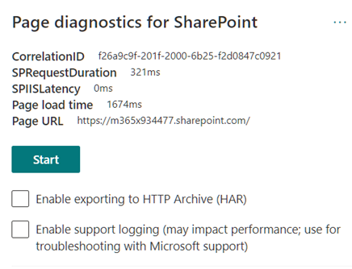

A mediados del 2020 Microsoft presento la herramienta de "Diagnostico
de SharePoint" (Page Diagnostics for SharePoint), para ayudar a los
propietarios y editores de sitios a optimalizar las páginas de
SharePoint en un tenant de Office 365. La herramienta extrae métricas de
rendimiento, y basado en ellas, recomendaciones para la mejora del
sitio. La herramienta mide la velocidad de carga de las páginas, lo que
afecta la experiencia de visualización, y la capacidad de la página para
interactuar con los espectadores y cumplir su propósito.

La herramienta es una extensión para Edge o navegadores basados en
Chrome, y después de instalada presenta información que permite analizar
lo que se debe mejorar en el sitio, como resolver problemas técnicos y
mejorar la experiencia de los usuarios. El Page Diagnostics analiza
sitios modernos y sitios clásicos de publicación de SharePoint Online
(no se puede usar para SharePoint Server OnPrem ni para páginas del
sistema, tales como "allitems.aspx") contra una serie de criterios de
rendimiento predefinidos.

**Instalación**

Las siguientes instrucciones de instalación son para Edge, pero los
pasos son similares para cualquier navegador basado en Chrome.

-   Abra la página de Extensiones de Edge (botón de elipse "..." en la
    esquina superior derecha y haga clic sobre "Extensions"). Haga
    clic sobre el botón "Get extensions for Microsoft Edge"

-   En la casilla de búsqueda escriba "page diagnostics for
    sharepoint", lo que muestra la extensión en la lista
    correspondiente. Haga clic sobre el botón de "Get".

-   Un mensaje de advertencia aparece indicando los derechos que la
    extensión necesita tener. Utilice el botón de "Add extension":

-   Una vez instalada, la extensión aparece en la esquina superior
    derecha del navegador. Haciendo clic sobre ella, se puede ver su
    versión y alguna información adicional (también aparece un error que
    indica que la herramienta solo se puede utilizar en paginas de
    SharePoint)

Microsoft no lee datos ni contenido de página analizado por la
herramienta, y no captura ninguna información personal, sitio web o
información de descarga. La única información identificable que la
herramienta registra en Microsoft es el nombre del Tenant de Office 365,
los informes de criterios que han fallado y la fecha y hora en que se
ejecutó la herramienta. Microsoft usa esta información para comprender
el uso de portales de SharePoint en general y los problemas de
rendimiento comunes con el propósito de mejorar el servicio en el
futuro.

**Utilización**

Abra una página de SharePoint Online, abra la ventana de la extensión y
use el botón de "Start". después de unos cuantos segundos aparecen los
resultados del análisis en la ventana de la extensión en tres regiones
diferentes: información general, diagnóstico y seguimiento de
componentes. La opción de "Enable exporting to HTTP Archive (HAR)"
permite utilizar el formato de archivo HTTP, o HAR, que es un formato
JSON especializado para registrar la interacción de un explorador web
con un sitio; normalmente la información es exportada en JSON.

-   Información general:

-   **CorrelationID** - Si necesita soporte técnico de Microsoft, este
    GUID le permite a Microsoft recopilar datos de diagnóstico
    adicionales.

-   **SPRequestDuration** - Es el tiempo que tarda SharePoint en
    procesar la página.

-   **SPIISLatency** - Es el tiempo en milisegundos que tarda SharePoint
    Online en cargar la página sin incluir el tiempo necesario para que
    la aplicación web responda.

-   **Page load time** - Es el tiempo total registrado por la página
    desde el momento de la solicitud hasta el momento en que se recibió
    y renderizó la respuesta en el explorador.

-   **Page URL** - Dirección web de la página actual.

-   Diagnostic tests: Aquí se enumeran los criterios con los que se
    analiza la página en tres secciones: lo que necesita atención, lo
    que se puede mejorar, y lo que no requiere ninguna acciones. Cada
    sección se puede extender para ver más información al respecto. Los
    criterios son modificados y extendidos regularmente por Microsoft,
    incluyendo los detalles mostrados en la pantalla.

-   Network trace: provee información sobre cada llamada y respuesta.
    Los colores indican si el rendimiento es aceptable o no (verde <
    500 ms, amarillo 500-1000 ms, rojo > 1000 ms). Puede ocurrir que
    algunos elementos no tengan ni color ni medida porque ya han sido
    almacenados en el cache del navegador; en este caso, limpie el cache
    y ejecute de nuevo la prueba. Los resultados se pueden exportar en
    formato JSON o HAR si se selecciona la opción inicialmente.

**Usando el soporte técnico de Microsoft**

Si hay algún problema en un sitio que no puede ser solucionado, es
posible activar la herramienta para proporcionar información en un caso
de soporte de Microsoft. Para hacerlo:

-   Abra la herramienta de Diagnóstico en la página de SharePoint a
    investigar.

-   Si la prueba todavía está ejecutando, deténgala.

-   En el teclado, utilice la combinación ALT-Mayúsculas(Shift)-L, lo
    que mostrará la opción "Enable support logging".

-   Active la opción y haga clic en "Start" para volver a cargar la
    página y generar un informe detallado.

Anote el CorrelationID que se muestra en la parte superior de la
herramienta, inicie un nuevo caso de soporte con Microsoft y proporcione
el identificador para que Microsoft pueda recopilar información
adicional sobre la sesión de diagnóstico.

**Reporte en las configuraciones del sitio**

Fuera de las ventanas de información de la herramienta misma, la página
de "Site performance" del sitio ofrece algunas otras opciones.

-   Después de ejecutar una prueba con la herramienta, desde el botón de
    configuración (esquina superior derecha en la página, icono de
    engranaje) haga clic sobre "Site performance".

-   Fuera de mostrar la misma información sobre los elementos que se
    deben/pueden mejorar y los que no tienen problemas, la página
    muestra un resumen grafico del rendimiento.

Puede ser útil probar una versión de borrador de la página principal
para ver cómo las mejoras afectan al estado de la página. La versión
publicada de la página se puede comparar con la versión de borrador
utilizando la casilla de selección en la parte superior del reporte.

**Visualización de archivos HAR**

Como se comentó inicialmente, los archivos HAR son utilizados para
reportar información de rendimiento de sitios web. El formato utilizado
es JSON.

Para visualizar los archivos, existe una extensión para navegadores
Chromium llamada "HTTP Archive Viewer"
(https://chrome.google.com/webstore/detail/http-archive-viewer/ebbdbdmhegaoooipfnjikefdpeoaidml)
que permite analizar los informes de forma mas fácil, incluyendo la
posibilidad de ver la consulta y la respuesta:

Note que la extensión **NO** se puede utilizar en Edge.

**Gustavo Velez**  
MVP Office Apps & Services  
gustavo@gavd.net  
https://guitaca.com   
 
 
import LayoutNumber from '../../../components/layout-article'
export default LayoutNumber
