Con la llegada de la App de Approvals a Microsoft Teams se habilitan
escenarios de aprobaciones rápidas en Teams sin necesidad de tener que
recurrir a crear procesos de aprobación con Power Automate, aunque la
tecnología base si sean las aprobaciones en Teams. En este artículo se
realiza un repaso a la App de Approvals en Teams.

**Accediendo a la App de Approvals en Teams**

La App de Approvals en Teams está habilitada por defecto, por lo que
acceder a la misma es tan sencillo como hacer clic en los "..." de la
barra de acciones, localizar la App y comenzar a utilizarla
(**Nota**: Si la App de Approvals no te aparece en Teams,
seguramente se deba a que un Administrador de la plataforma ha decidido
deshabilitarla):

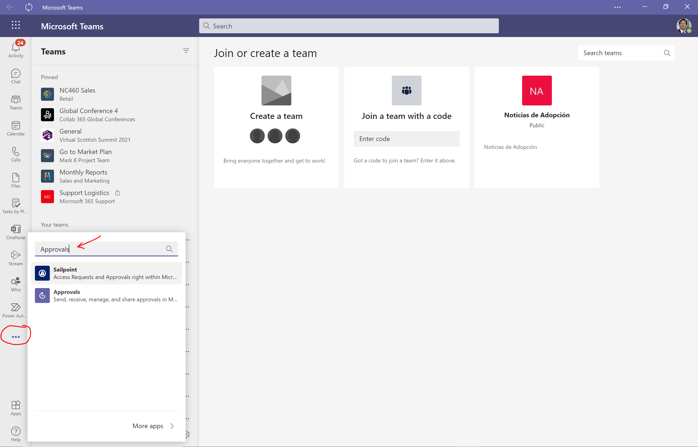

Cuando la App de Approvals se abre, se mostrarán las peticiones de
aprobación recibidas por el usuario y el estado de estas. Por cada
aprobación se visualiza la persona solicitante y la(s) persona(s) a las
que se ha enviado. Finalmente, como en todo listado que se precie
tendremos la posibilidad de aplicar filtros o bien cambiar de ámbito de
aprobación (Pasar de un ámbito global a uno más granular relativo a un
canal de Microsoft Teams).

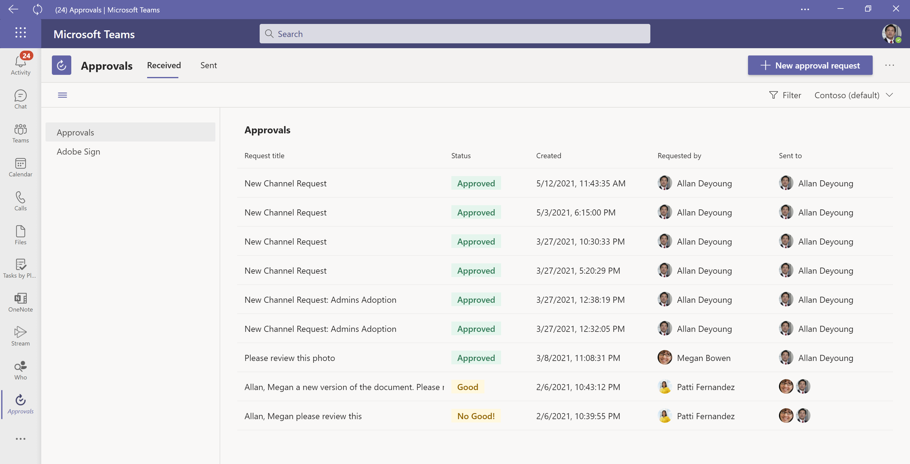

Desde la App de Approval también podremos:

-   Visualizar el detalle de una Aprobación concreta lo que incluye:

    -   El título de la petición de aprobación.

    -   La descripción de la aprobación.

    -   El archivo adjunto o enlace a un archivo / otro recurso
        relacionado con la aprobación.

    -   La cadena de aprobación, es decir, las personas por las que ha
        pasado la aprobación.

    -   El estado de la aprobación.

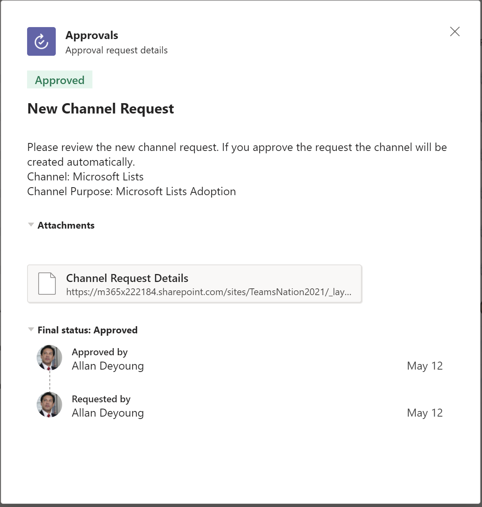

-   Visualizar las aprobaciones que se en usuario ha enviado.

-   Crear una nueva petición de aprobación a través del botón "New
    request".

-   Acceder a las plantillas por defecto de aprobaciones provistas por
    Microsoft a través de los "...". En la sección de plantillas de
    aprobaciones también podremos crear nuestras propias plantillas.

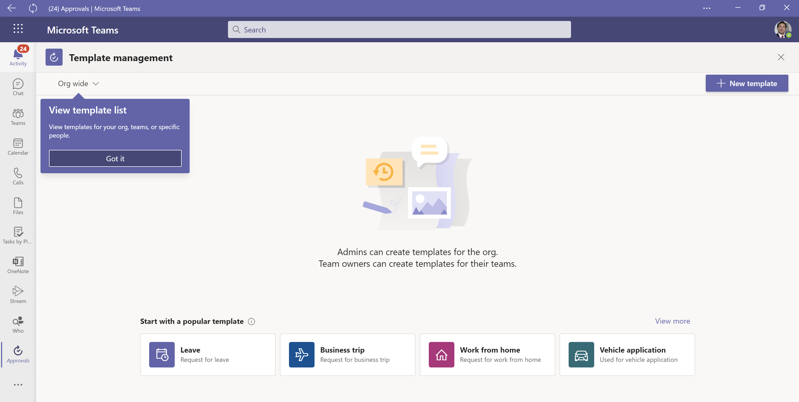

**Creación de una solicitud de Aprobación simple**

Para probar las Aprobaciones de la App de Approvals, vamos a generar una
petición de aprobación sencilla desde la página principal de la App:

-   Hacemos clic en el botón "New approval request" de manera que se
    muestra el formulario para crear una nueva aprobación. En este
    formulario indicaremos primero el tipo de aprobación que puede ser
    "Basic" o bien "eSign" para el caso en el que introduzcamos en el
    proceso de aprobación la firma de documentos con Adobe Sign.

-   Especificaremos también el nombre de la petición de aprobación, la
    descripción de la petición y la(s) persona(s) que tienen que aprobar
    la petición. Si se indica más de un aprobador, estaremos ante un
    escenario de aprobación en serie.

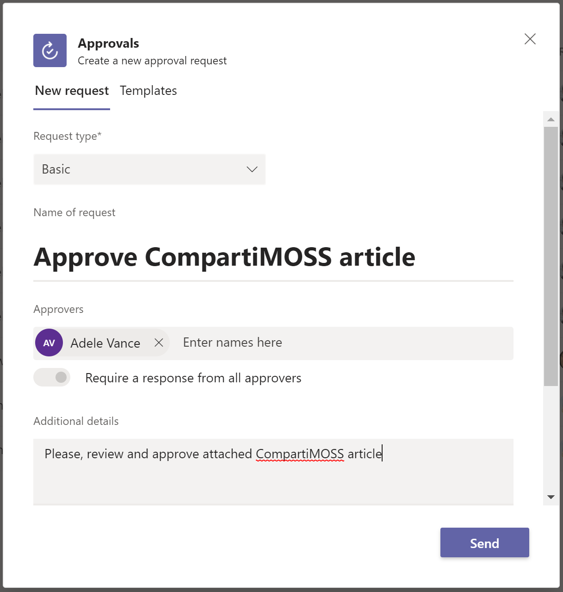

-   A continuación, tendremos la opción de adjuntar el archivo asociado
    a la petición (**Nota**: Podemos cargar un archivo desde
    nuestro equipo, elegir un archivo de nuestro OneDrive o simplemente
    indicar un enlace al archivo o recurso relativo a la aprobación) y
    personalizar el proceso de aprobación para que se muestren unos
    botones de acción personalizados en lugar de los estándares. Además,
    podremos indicar el ámbito (entorno) en el que se va a lanzar la
    aprobación.

-   Cuando estemos listo, para enviar la petición de aprobación hacemos
    clic en el botón "Send".

Con la petición de aprobación enviada, empieza el proceso de aprobación
en base a la siguiente secuencia:

-   Se genera una notificación en Teams a la(s) persona(s) que
    participan en la aprobación conforme se vayan realizando las
    aprobaciones secuenciales. Además, la petición recibida se reflejará
    en el listado de aprobaciones de la App de Approval. De esta forma,
    tanto desde la notificación recibida como desde el listado de
    aprobaciones recibidas, los participantes en el proceso pueden ver
    la petición y aprobarla o rechazarla.

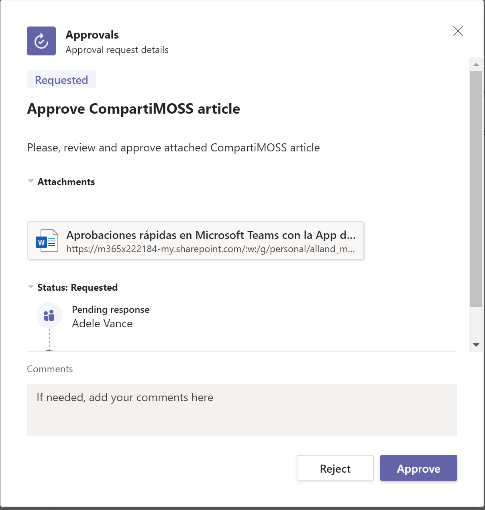

-   Tanto en el caso en el que se apruebe como en el que se rechace la
    petición, la persona que inicio el proceso recibirá la
    correspondiente notificación de Teams y el estado de la Aprobación
    se actualizará.

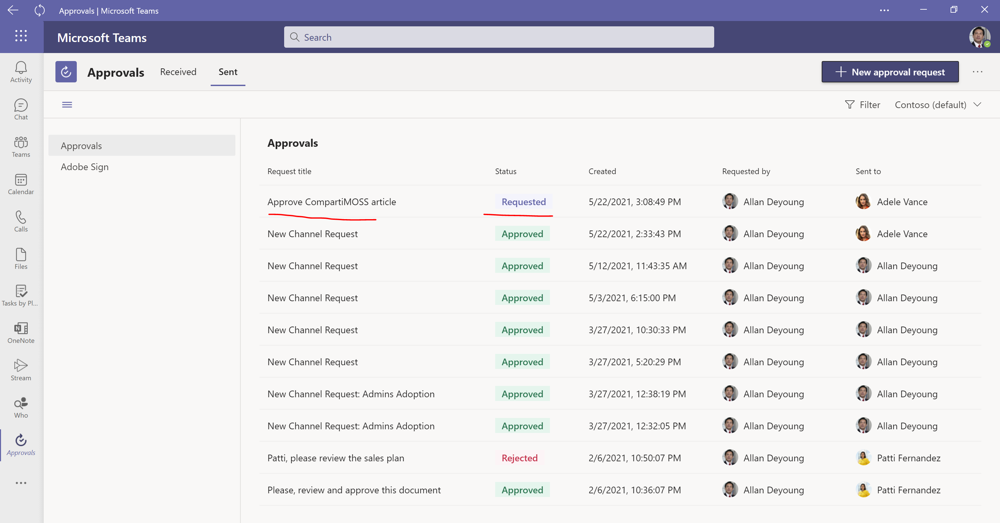

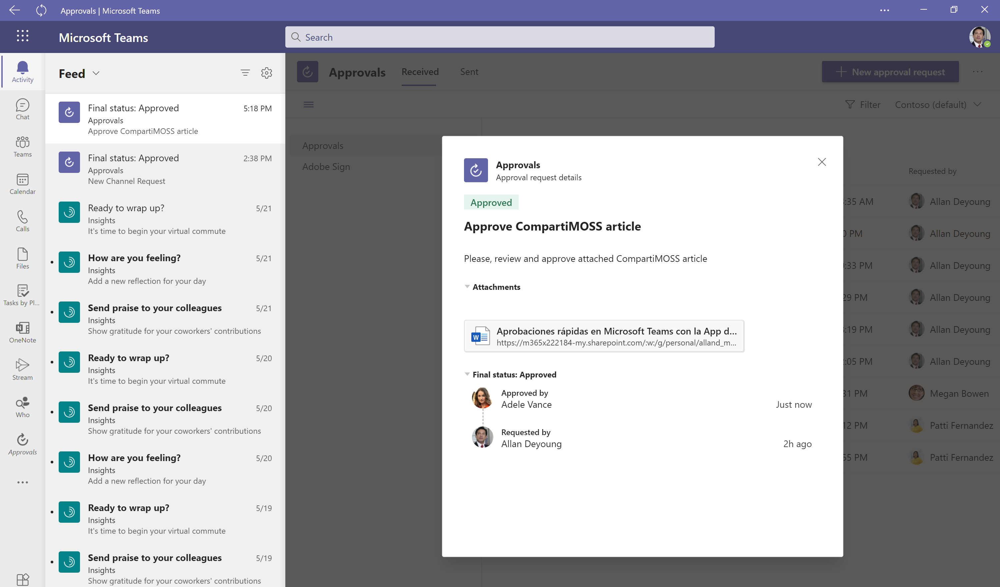

**Plantillas de Aprobaciones en la App de Approvals**

Para finalizar el artículo, vamos a revisar las plantillas de
aprobaciones disponibles en la App de Approvals. Desde esta sección
podemos optar por hacer clic en una de las plantillas existentes o bien
hacer clic en el botón "New template" para utilizar una plantilla
diferente o crear una plantilla desde cero:

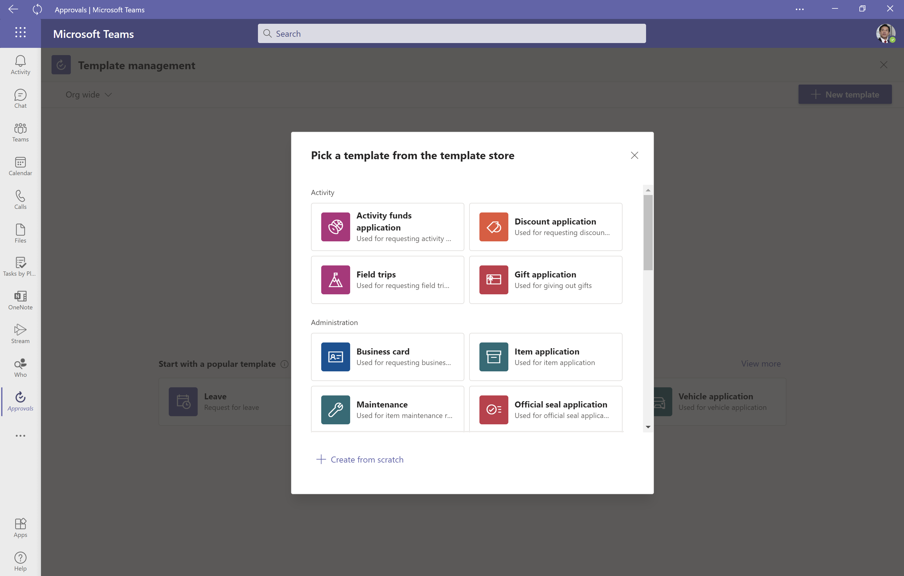

Para probar una de las plantillas existentes, vamos a hacer uso de la
plantilla de "Leave" (Ausencia):

-   Indicamos el ámbito de uso de la plantilla (Org wide, Specific
    People o bien Team wide) que permite determinar que usuarios van a
    poder administrar plantillas de aprobaciones:

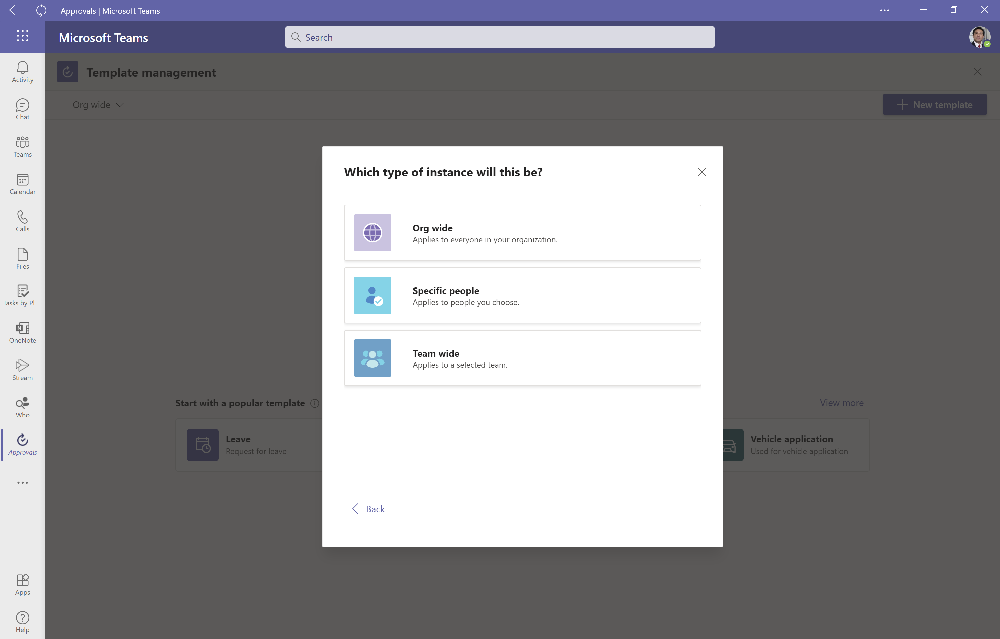

-   Para la opción seleccionada, haremos clic en el botón "Create" de
    manera que se creará un Team para poder añadir a los usuarios que
    pueden gestionar plantillas. Una vez creado el Team en el ámbito
    elegido, podemos pasar a configurar de acuerdo con nuestros
    requerimientos la plantilla comenzando por una serie de
    configuraciones básicas:

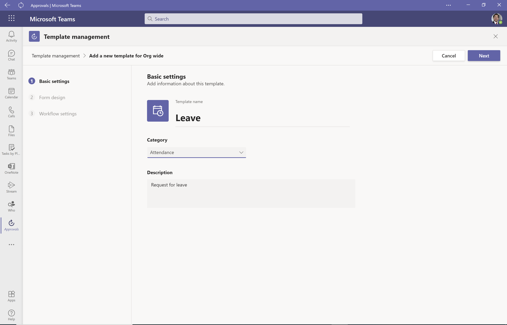

-   A continuación, podemos configurar el formulario de solicitud de
    aprobación partiendo de los campos por defecto de la plantilla:

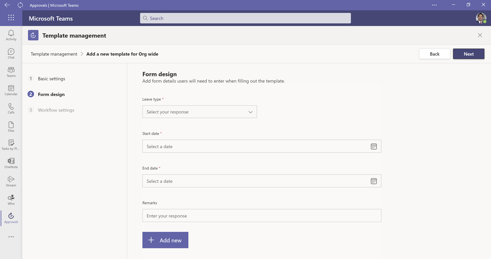

-   Finalmente, en el paso de configuración del Workflow podremos
    indicar los aprobadores por defecto si este es un requerimiento, así
    como la forma de interactuar con el proceso de aprobación.

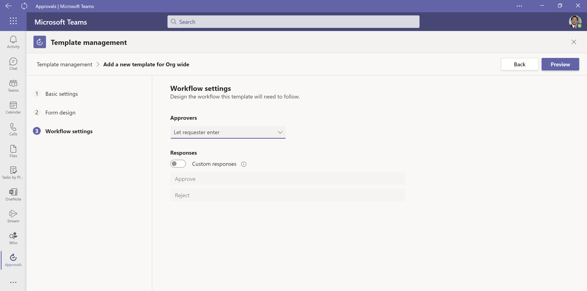

-   Una vez la plantilla de aprobación está configurada, podemos
    previsualizar la misma y si todo está correcto, publicarla.

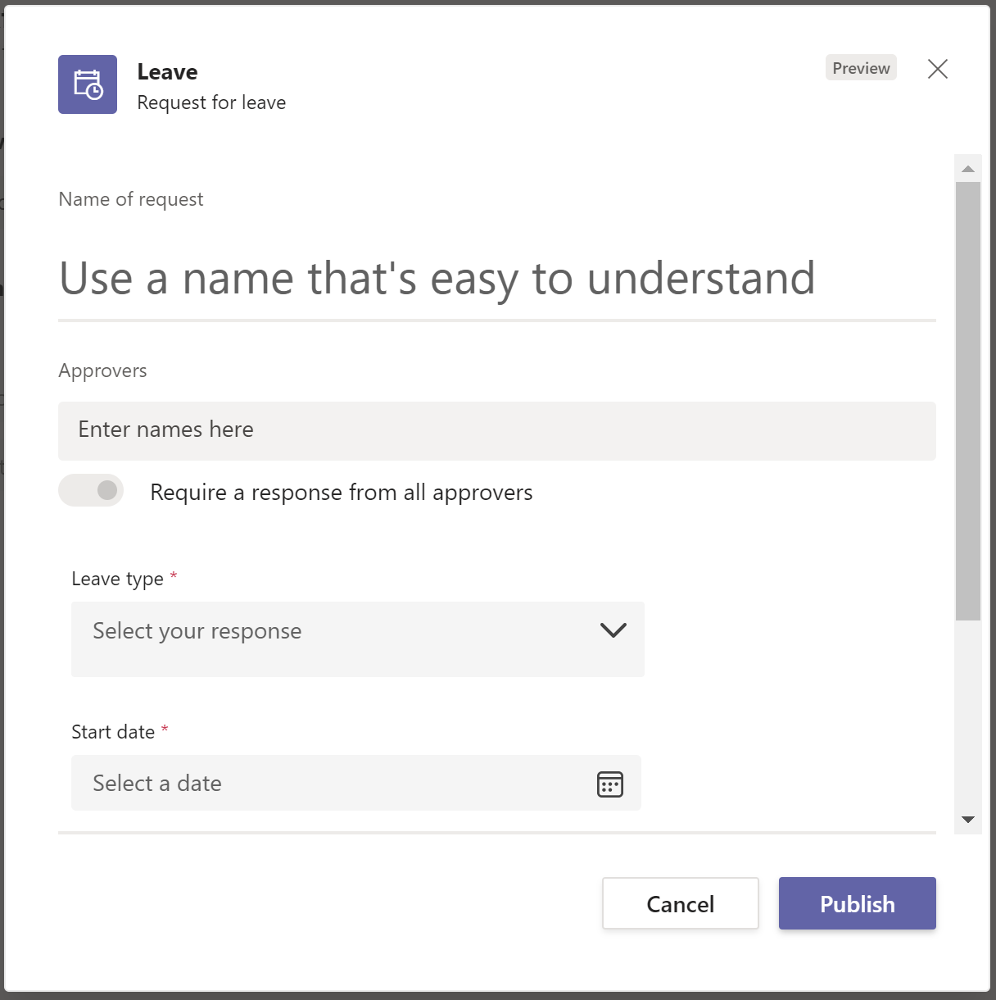

-   La plantilla publicada aparecerá en el listado de plantillas
    disponibles desde el que tendremos la opción de deshabilitarla o
    modificarla en cualquier momento.

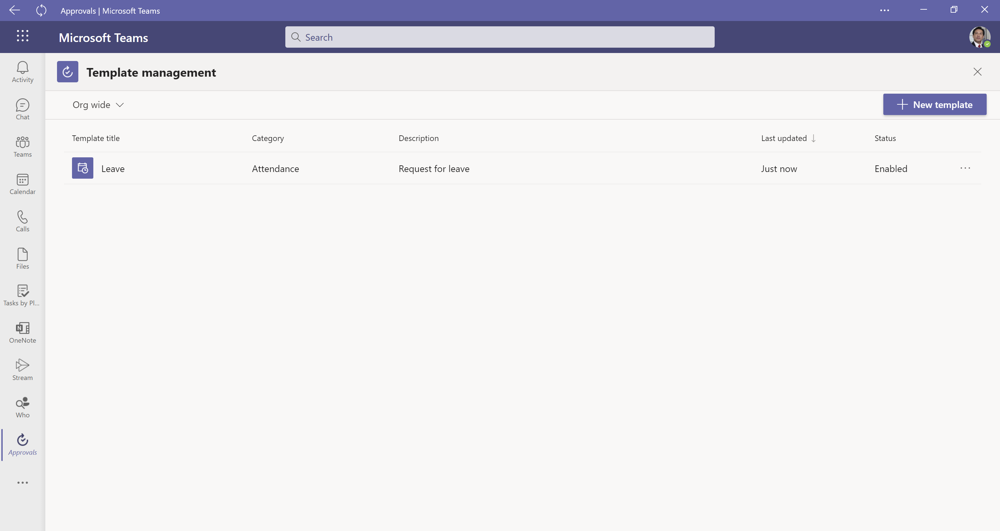

-   A partir de este momento, podremos utilizar la plantilla publicada
    para realizar peticiones de aprobación en base a la misma.

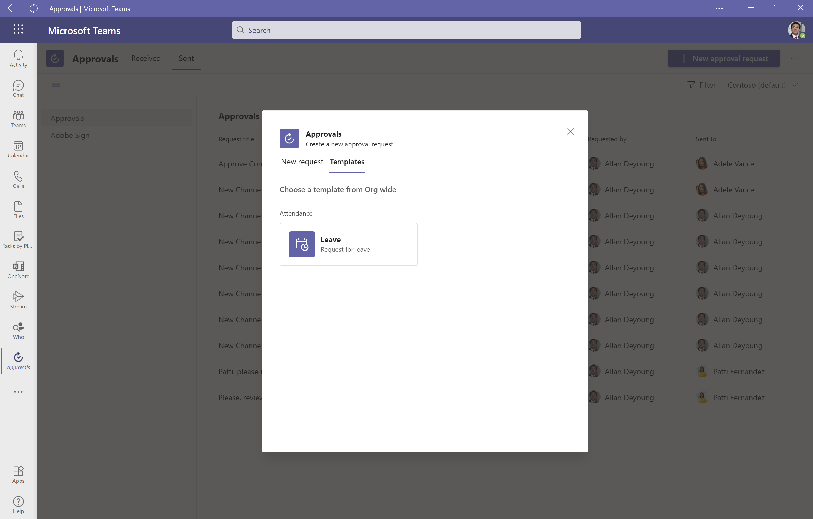

**Conclusiones**

La App de Approvals en Microsoft Teams facilita realizar aprobaciones
rápidas sin necesidad de tener que realizar desarrollo alguno. Con las
plantillas de aprobaciones, se habilitan además escenarios de aprobación
habituales como puede ser una solicitud de ausencia o una solicitud de
viaje. Tanto las aprobaciones simples como las aprobaciones en base a
plantillas permiten modelar circuitos secuenciales de aprobación en los
que participen más de un usuario.

**Juan Carlos González**  
MVP Office Apps & Services  
M365 SME & Deliver Manager, RICOH España S.L.U  
@jcgm1978 
 
import LayoutNumber from '../../../components/layout-article'
export default LayoutNumber
