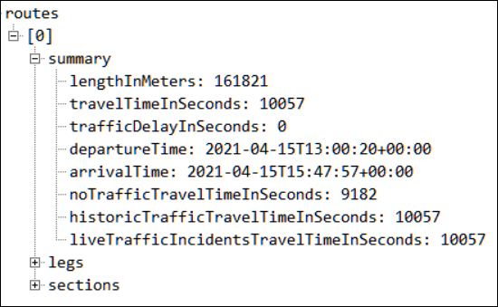

Probablemente uno de los servicios de Azure menos conocidos y utilizados
es Azure Maps, una colección de servicios geoespaciales y SDKs que
provee mapas y datos de contexto geográfico a lo largo y ancho del
planeta (menos en China y Corea del Sur). El servicio incluye un Web SDK
que renderiza mapas con múltiples opciones (geolocalización, trafico,
servicios de transporte públicos, cálculo de rutas, búsqueda de
direcciones, zonas geográficas, elevación, etc.), un SDK especializado
para Androide (otro equivalente para iOS está en construcción),
integración con Power BI y un REST SDK para obtener datos climáticos
(temperatura, precipitación, presión, etc., tanto actual como en el
pasado y predicciones para los próximos días).

**Azure Maps versus Bing Maps**

Microsoft tiene actualmente dos servicios de mapas: Azure Maps y Bing
Maps.

Azure Maps es la oferta de Plataforma como Servicio (PaaS) de Microsoft
Azure que apareció como versión beta en noviembre de 2017 bajo el nombre
de "Azure Location Based Services", y oficialmente en versión GA
(General Available) desde el 8 de mayo de 2018. Los datos de Azure Maps
son generados por TomTom, una empresa holandesa que es proveedor líder
mundial de información geográfica.

Los precios de Azure Maps son muy competitivos comparados con otros
servicios equivalentes (Google Maps), y consisten en un nivel básico
(S0) que ofrece 250.000 transacciones gratis al mes, limitada a menos de
50 consultas por segundo. Si se consumen más datos en el nivel S0, los
servicios cuestan EU 0.40 por cada 1,000 transacciones. El nivel S1
agrega características extras de enrutamiento e imágenes de satélite,
elimina el límite de 50 consultas por segundo, y cuesta EU 4 por cada
1,000 transacciones.

Bing Maps es alimentado por mapas de HERE y OpenStreetMap. HERE es
también uno de los principales proveedores de datos de mapas del mundo y
OpenStreetMap (<https://www.openstreetmap.org>) es la mayor comunidad de
mapas Open Source que existe en el momento. El modelo de precios de Bing
Maps es prácticamente indescifrable y requiere múltiples contratos con
Microsoft. La última versión (V8) fue publicada en 2016, con el último
update en 2018. No es conocido si Microsoft está deprecando Bing Maps,
pero en vista del continuo avance de Azure Maps y el poco trabajo
mostrado en Bing Maps, parece que la estrategia es mover todos los
servicios geográficos a Azure.

**Creando el servicio de Azure Maps**

Para usar Azure Maps es necesario crear una instancia del servicio. Abra
el sitio de administración de Azure (<https://portal.azure.com>)
utilizando credenciales de administrador (si no tiene un tenant de
Azure, se puede obtener uno de prueba por un mes desde
<https://azure.microsoft.com/en-us/free>).

Cree un nuevo Grupo de Recursos (Resource Group), y en el Grupo agregue
un servicio del tipo "Azure Maps". Durante el proceso de creación se
puede elegir por una suscripción tipo S0 o S1. Una vez creada la
instancia del servicio, abra su ventana de administración, abra la
página de "Authentication" y copie el valor de "Primary Key".

**Dibujando mapas en HTML**

El "Web SDK" de Azure Maps permite renderizar mapas con solo algunas
líneas de código. El SDK es basado en JavaScript lo que permite
integrarlo en paginas Web o en cualquier aplicación que utilice
tecnologías Web (node, JavaScript, TypeScript, etc.). Si pretende
integrar Azure Maps con alguna aplicación, explore primero las
posibilidades del SDK usando una página HTML, lo que acelera el trabajo
de programación considerablemente.

Cree un archivo con la extensión .html. Copie el siguiente código en el
archivo y guarde los cambios.

```
<!doctype html>
<html lang="en">
<head>
<meta charset="UTF-8">
<meta name="viewport" content="width=device-width, initial-scale=1,
shrink-to-fit=no">
<title>Html Map example</title>
<link rel="stylesheet"
href="https://atlas.microsoft.com/sdk/javascript/mapcontrol/2/atlas.min.css"
type="text/css">
<script
src="https://atlas.microsoft.com/sdk/javascript/mapcontrol/2/atlas.min.js"></script>
<style>
html, body {
margin: 0;
}
#myMap {
height: 100vh;
width: 100vw;
}
</style>

<script type="text/javascript">
function InitMap()
{
var map = new atlas.Map('myMap', {
language: 'es-ES',
view: 'Auto',
center: [-73.523544, 5.633902],
zoom: 14,
authOptions: {
authType: 'subscriptionKey',
subscriptionKey: '[Key from the Azure Maps service]'
}
});

map.controls.add([
new atlas.control.ZoomControl(),
new atlas.control.CompassControl(),
new atlas.control.PitchControl(),
new atlas.control.StyleControl(),
new atlas.control.TrafficControl(),
new atlas.control.TrafficLegendControl()
], {
position: "top-right"
});
}
</script>
</head>
<body onload="InitMap()">
<div id="myMap"></div>
</body>
</html>
```

Abra el archivo en un navegador Web para ver el resultado:


El código comienza agregando una directiva "meta" para hacer que el
mapa ocupe todo el espacio disponible en la página. Luego agrega la hoja
de estilo que utiliza el mapa y descarga el SDK de JavaScript del sitio
de Microsoft ("atlas.min.js").

En seguida se crea un estilo local "#myMap" que define la forma para
el contenedor del mapa, que es localizado en el código HTML como un tag
"div". Luego, un script de JavaScript contiene la función "InitMap"
que realiza todo el trabajo de comunicación con el servicio de Azure.
Dentro de la función se definen las propiedades de un objecto del tipo
"atlas.map" (lenguaje, tamaño y coordinadas del mapa, autorización) y
los controles que debe mostrar. El parámetro "center" indica las
coordinadas del punto central del menú. El parámetro "subscriptionKey"
contiene el valor de la llave de autorización de la instancia del
servicio de Azure creado en la sección anterior.

El objeto "map" contiene una colección de "controls" que proporciona
diferentes objetos adicionales para renderizar en el mapa. En el ejemplo
se están agregando un control de zoom (modifica las dimensiones a
mostrar), un compás (gira el mapa), un control de inclinación (pitch),
un control de estilo del mapa y otro para mostrar el trafico y el
significado de los colores usados para mostrar el tráfico:

{width="5.2421205161854765in"
height="3.550307305336833in"}


Este ejemplo solamente muestra la funcionalidad básica del Web SDK.
Funcionalidad adicional permite utilizar marcas en el mapa (con texto y
diferentes formatos), crear capas con diferente información, mostrar
rutas entre dos puntos, servicios de transporte publico (disponible
solamente en algunos países del mundo), búsqueda de Puntos de Interés
(POIs), etc. La descripción completa del SDK ha sido publicada por
Microsoft en el sitio
<https://docs.microsoft.com/en-us/javascript/api/azure-maps-control/?view=azure-maps-typescript-latest>.

**Integración de mapas: Power Apps, SPFx**

Los mapas de Azure Maps se pueden integrar fácilmente con otros
productos, incluyendo Office 365. Para crear una WebPart de SPFx, el
código utilizado para generar los mapas en una página HTML se puede
copiar prácticamente de principio a fin. Microsoft ha creado un modulo
de TypeScript que se puede usar para simplificar el uso del Web SDK;
para instalarlo, utilice npm con la siguiente sintaxis:

```
npm install azure-maps-control
```

Y para utilizarlo, al principio del código de una WebPart SPFx
inicialice el componente con:

```
import * as atlas from 'azure-maps-control';
```

Otros frameworks para usar con o sin SPFx disponen de librerías para
trabajar con Azure Maps. Vue, por ejemplo, tiene una librería que
integra Vue.js con Azure Maps
(<https://vuejsexamples.com/a-library-for-vue-js-that-integrates-azure-maps/>).
Esta librería ofrece soporte para el Web SDK de Maps y otros componentes
personalizados.

Por otro lado, el artículo de Sergio Hernández "Powerapps, Azure Maps y Geoespatial Features" en el número 45 de CompartiMOSS
(<https://www.compartimoss.com/revistas/numero-45/powerapps-azure-maps>)
da instrucciones detalladas para utilizar Azure Maps con una Power App.
Esto facilita la integración tanto en SharePoint como en Teams, pues la
aplicación de Power App se puede utilizar directamente en estas
aplicaciones sin necesidad de crear ningún código fuente adicional.

**Solicitando datos geográficos desde Azure Maps**

El REST API de Azure Maps permite obtener información geográfica y
climática sobre un sitio determinado. Varios de los puntos de entrada
del API están todavía en preview, pero son totalmente funcionales. Para
utilizar el API es necesario tener una clave de acceso como se describió
anteriormente en la sección sobre la creación de la instancia del
servicio.

En seguida se describen algunas de las posibilidades del REST API. Los
resultados siempre son devueltos en formato JSON por el servicio de
Azure.

**Localizar un sitio por medio de su dirección**. Defina la dirección en
el parámetro "query":

https://atlas.microsoft.com/search/address/json?subscription-key=[key]&api-version=1.0&language=es-ES&query=Calle
13 No. 8-95, Villa de Leyva, 154001

El resultado es un array de sitios encontrados indicando las coordinadas
geográficas, país y provincia de la dirección:


**Encontrar la dirección de un sitio por medio de sus coordinadas**.
Defina las coordinadas en el parámetro "query":

https://atlas.microsoft.com/search/address/reverse/json?subscription-key=[key]&api-version=1.0&language=es-ES&query=5.63128,-73.52631&number=1


**Clima actual**. Define las coordinadas del sitio en el parámetro
"query":

https://atlas.microsoft.com/weather/currentConditions/json?subscription-key=[key]&api-version=1.0&query=5.63128,-73.52631


**Pronóstico del tiempo**. Las coordinadas del sitio se definen en el
parámetro "query". El parámetro "duration" indica el número de días
del pronóstico por adelantado. Licencias del tipo S0 permiten hasta 15
días de pronóstico, y licencias S1 hasta por un mes.

https://atlas.microsoft.com/weather/forecast/daily/json?subscription-key=[key]&api-version=1.0&query=5.63128,-73.52631&duration=15


**Trafico**. Indica el trafico a esperar entre dos puntos (coordinadas
de salida y llegada en el parámetro "query"), en un momento
determinado de salida ("departAt") y para un tipo de transporte
("travelMode"). El resultado puede incluir diferentes rutas.

https://atlas.microsoft.com/route/directions/json?subscription-key=[key]&api-version=1.0&query=5.63128,-73.52631:4.680724,-74.085215&travelMode=car&traffic=true&departAt=2021-04-15T08:00:20&computeTravelTimeFor=all



Los ejemplos indicados en este articulo son solamente una parte de las
posibilidades que ofrece el REST API. La descripción de referencia
completa del API se puede encontrar en el sitio de Microsoft
<https://docs.microsoft.com/en-us/javascript/api/azure-maps-rest/?view=azure-maps-typescript-latest>.

**Otros recursos**

Hay varias iniciativas de código abierto impulsadas por la comunidad,
creadas y mantenidas por el equipo de Azure Maps y por desarrolladores
independientes, que no forman parte de las posibilidades estándar de
productos o servicios de Microsoft, y que expanden las posibilidades de
desarrollo utilizando Azure Maps:

-   <https://github.com/Microsoft/Maps/blob/master/AzureMaps.md> -
    Varias librerías y SDKs para mejorar y ampliar la forma de
    renderizar mapas.

-   <https://github.com/Azure-Samples/AzureMapsCodeSamples>.

-   <https://azuremapscodesamples.azurewebsites.net/index.html> -
    Ejemplos y Código fuente de utilización de Azure Maps.

**Conclusión**

El servicio de Azure Maps proporciona no solamente renderización de
mapas en diferentes formatos y con varias posibilidades técnicas, sino
también información geográfica y meteorológica sobre prácticamente
cualquier sitio en el planeta. El servicio es muy competitivo
económicamente en relación con servicios proporcionados por otros
proveedores, y dispone de diferentes SDKs que permiten trabajar
programáticamente con él de forma rápida y concisa.

Gustavo Velez <br />
MVP Offices Apps & Services <br />
<gustavo@gavd.net> <br />
<https://guitaca.com> <br />
<http://www.gavd.net> <br />
