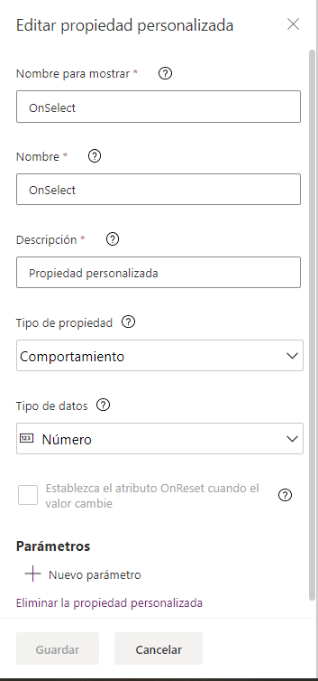
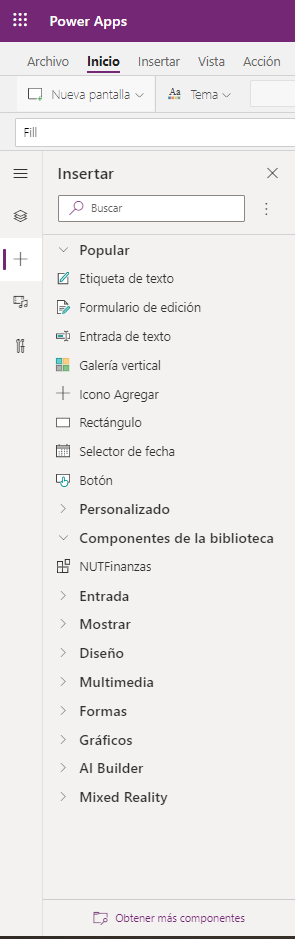

Los componentes son un conjunto de controles y propiedades que forman un
bloque reutilizable dentro de nuestra App ya sea para disponer de un
"bloque" con controles o para tener una función que podremos reusar en
toda la App.

En este articulo me centraré en los componentes "nativos" de Power Apps,
aunque recientemente Microsoft ha liberado el Power Apps Component
Framework que permite el desarrollo de componentes totalmente
personalizados utilizando TypeScript.

En una primera versión los componentes nativos estaban un tanto
limitados, pero recientemente se han incorporado un par de
funcionalidades a los mismos que les dotan de una mayor versatilidad.
Estas nuevas funcionalidades son las variables de comportamiento del
componente y los parámetros en variables de entrada y salida.

La primera forma en que podemos tener componentes nativos es como parte
de una App permitiendo reutilizar funcionalidad dentro de dicha App. La
segunda, y más interesante, es disponer de una biblioteca de
componentes, que nos permite tener uno o varios repositorios
centralizados de componentes.

**Biblioteca de componentes**

Una biblioteca de componentes proporciona un repositorio centralizado de
componentes. Actualmente está en versión preliminar por lo que aún
podría haber algunos cambios. La biblioteca se encuentra en una nueva
pestaña al lado de la pestaña Aplicaciones.


En la pestaña veremos las bibliotecas ya creadas


Para crear una biblioteca, simplemente vamos a la biblioteca y pulsamos
el botón Nueva biblioteca de componentes en la parte superior


Le ponemos su nombre, pulsamos crear y listo, ya tenemos nuestra
biblioteca creada.


Veremos que por defecto ya aparece un componente Component1 creado.

En la vista de árbol del editor vemos que tenemos una pestaña de
pantallas además de la pestaña componentes. Estas pantallas se pueden
usar solamente para probar los componentes, estas pantallas no se
exportarán cuando usemos la biblioteca desde una App.

**Creación de un componente**

Para crear un nuevo componente, simplemente se pulsa el botón Nuevo
componente. Por defecto un componente tiene un canvas de 650x650 pero le
podremos dar las dimensiones que queramos.

Dentro de ese canvas colocaremos los controles necesarios para dotar al
componente de la funcionalidad deseada.

**Propiedades del componente**

Al igual que los controles estándar de Power Apps podemos dotar a
nuestro componente de propiedades con las que podremos interactuar con
él hacia y desde la aplicación que utilice el componente.

Una propiedad puede ser

-   **Entrada:** La información que contiene la propiedad se fija en la
    aplicación y se podrá consumir en el componente.

-   **Salida:** La información que contiene la propiedad se fija en el
    componente y se podrá consumir en la aplicación.

-   **De comportamiento:** (un evento de toda la vida) donde el
    componente podrá desencadenar una acción en la aplicación. Esta
    propiedad se ha añadido hace poco y aún está en fase preliminar
    pública.

Para añadir una propiedad a un componente hacemos lo siguiente: en las
propiedades del componente pulsamos sobre **Nueva propiedad
personalizada**


Veremos un menú que nos permite configurar las propiedades, estas son:


-   **Nombre para mostrar:** el nombre que
    se mostrará al utilizar el componente. Admite letras, números y
    caracteres especiales.

-   **Nombre**: Nombre interno. Solo admite letras y números.

-   **Descripción**: Información que se mostrará como información sobre
    la propiedad en el panel propiedades al utilizar el componente

-   **Tipo de propiedad**: entrada, salida, de comportamiento.

-   **Tipo de Dato**: indica el tipo de dato que contiene la propiedad.
    Los tipos admitidos son: texto, número, booleano, fecha y hora,
    pantalla, registro, tabla, imagen, audio o video, color, moneda.

-   **Establezca el atributo OnReset cuando el valor cambie:** Esta
    opción solo esta disponible para propieades de entrada. si la
    marcamos cuando se cambie el valor de la propiedad desde la
    aplicación que use el componente se disparara el OnReset del
    componente.


La opción parámetros también es nueva y hablaré de ella un poco más
adelante.

Las propiedades de entrada se referencian dentro del componente como
NombredelComponente.NombreDeLaPropiedad.

Las propiedades de salida se fijan con valores usados dentro del
componente para exponer dichos valores en la aplicación. Como el
movimiento se demuestra andando, vamos a crear un componente dial que
permita al usuario escoger un valor numérico con un par de botones.

Tras crear el componente y dimensionarlo a 64*192 añadimos los
controles:

-   IconoArriba

-   IconoAbajo

-   Texto

Después añadimos las propiedades:

  | Nombre         | Tipo de propiedad   | Tipo de datos   | Descripción
  | -------------- | ------------------- | --------------- | ----------------------------------------
  | MaxValue       | Entrada             | Número          | Valor máximo admitido
  | MinValue       | Entrada             | Número          | Valor mínimo admitido
  | DefaultValue   | Entrada             | Número          | Valor por defecto
  | Increment      | Entrada             | Número          | Incremento del valor en cada pulsación
  | Editable       | Entrada             | Booleano        | El campo de texto es editable
  | Value          | Salida              | Número          | Valor actual del componente

Con lo que el componente quedará de esta guisa


Ahora tendremos que dotar a nuestro componente de la funcionalidad, para
ello:

-   Usamos una variable interna _NUTDialInternalValue que usaremos para
    contener el valor actual del dial. Para fijar su valor por defecto
    lo hacemos en el OnReset del componente
    Set(_NUTDialInternalValue;NUTDial.DefaultValue)

-   La propiedad Default del control texto la fijamos con esta variable.

-   Con esto conseguimos que cuando la aplicación cambie el valor de la
    propiedad DefaultValue de nuestro componente este valor aparezca en
    el control texto

-   En los eventos OnSelect de los controles Icono tendremos la lógica
    para incrementar o decrementar el valor de la variable con las
    siguientes expresiones:

```
 IconoArriba.OnSelect:                                                
                                                                     
 If(_NUTDialInternalValue+NUTDial.Increment<=NUTDial.MaxValue;S     
 et(_NUTDialInternalValue;_NUTDialInternalValue+NUTDial.Increment)) 
                                                                      
 IconoAbajo.OnSelect:                                                 
                                                                      
 If(_NUTDialInternalValue-NUTDial.Increment>=NUTDial.MinValue;S     
 et(_NUTDialInternalValue;_NUTDialInternalValue-NUTDial.Increment)) 
```

Solo nos queda que desde la aplicación se pueda acceder al valor actual,
para ello simplemente fijamos la propiedad Value del componente al valor
NUTDialInternalValue. Tarea para casa: hacer que el componente sea
redimensionable.

Para probar nuestro componente lo insertamos en una pantalla de nuestra
aplicación como un control más de Power Apps y sin más fijamos sus
propiedades de entrada.


Observa que en el panel de propiedades aparecen las propiedades
personalizadas de entrada que hemos configurado en el componente.

Yo he añadido dos controles de dial, fijado sus valores máximo y mínimo
a 23, 0 y 59,0 y los incrementos a 1.

El botón Ahora fija las propiedades de un par de variables _Hora y
_Minuto como Set(_Hora;Hour(Now()));;Set(_Minuto;Minute(Now()))

Estas variables se usan en las propiedades DefaultValue de los diales.

Y por último dos label con un literal al que concatenamos el valor de
salida Value del componente simplemente referenciándolo como
DialHoras.Value y DialMinutos.Value.

Con esto vemos cómo utilizar el componente dentro de nuestra aplicación
¿fácil verdad?

Un detalle a tener en cuenta es que si el componente lo creamos dentro
de una biblioteca de componentes debe tener nombres únicos para los
controles y variables. Yo he antepuesto _ND o NUTDial al nombre de las
variables y controles.

**Propiedades de comportamiento**

Este tipo de propiedades son una novedad y era algo demandado por la
comunidad. Este tipo de propiedades en un componente pueden desencadenar
una acción en la aplicación que utiliza nuestro componente.

Para definir una propiedad de comportamiento solo tendremos que escoger
este tipo de propiedad al crearla.



Por ejemplo, en el componente definimos
una propiedad de comportamiento que llamamos OnSelect, aquí el tipo de
dato realmente no es necesario para lo que queremos, pero aun así lo
definimos como número.

Desde el componente podremos invocar la llamada a esta propiedad de
comportamiento invocando NombreDecomponente.OnSelect()

Por ejemplo, lo añadimos al código que ya teníamos en los OnSelect de
IconoArriba e IconoAbajo lo siguiente:

Parent.OnSelect() o de forma equivalente NUTDial.OnSelect()

Con esto cada vez que se haga click en los iconos se desencadenará la
propiedad OnSelect del componente.

En la aplicación ahora veremos que tenemos disponible esta propiedad
OnSelect del componente. Aunque aparece un valor por defecto lo que
queremos es añadir aquí código que se ejecutará cuando se desencadene el
OnSelect.

Como ejemplo ilustrativo, añadimos lo siguiente:

Set(_HorasVisible;Not(_HorasVisible))


Y la propiedad Visible del label que muestra el valor de salida lo
fijamos a _HorasVisible

¡Listo! Ahora cada vez que hagamos click en un icono del dial de horas
el texto irá apareciendo y desapareciendo. Hemos conseguido que
desencadenar una acción en la aplicación desde el componente.

**Parámetros en propiedades**

La última novedad en los componentes es que ahora se pueden emplear
parámetros en las propiedades. ¿Por qué usar estos parámetros en lugar
de propiedades de entrada?

Tres respuestas:

1.  Para asegurarnos que varios valores se pasan en el mismo instante de
    tiempo.

2.  Para usar el componente como "función".

3.  Lo que a ti se te ocurra, que para eso eres tú el/la que está
    programando.

Para mi el caso más interesante es el 2.

Previamente a estos parámetros, si queríamos reutilizar un trozo de
código lo habitual era poner ese código en el OnSelect de un botón,
ocultar el botón y después invocar el botón.Select() para que se
ejecutara ese código...funciona pero no es lo más elegante.

Como ejemplo, si en una App necesitamos calcular muchas veces un interés
simple definido como CapitalFinal=CapitalInicial*(1+%interes*meses)
podríamos repetir la formula en todos los sitios (lo sé, te sangran los
ojos al leer esta opción), usar la opción "BotonComoFormula" o crear un
componente.

Este componente no tendrá parte visual, pero si tendrá una propiedad de
salida con tres parámetros: CapitalInicial, Interés y Meses los tres de
tipo número.

Ahora en la propiedad de salida definimos el valor según la formula
anterior


Ya tenemos un componente que nos realiza el cálculo.

Para utilizarlo hay que insertar al menos una vez el componente en
nuestra aplicación.

Para probarlo creamos una pantalla con el componente que acabamos de
crear, 3 diales para los valores de capital, interés y meses y un label
donde invocaremos nuestra "función" de esta forma:

NUTFinanzas_1.Montante(DialCapital.Value*1000;DialInteres.Value;DialMeses.Value)
& " € chavalín. Pon la pasta justo aquí. Si la pasta no aparece me la
debes, debes, debes"

[frikigallifante de oro al que sepa de donde he sacado la frase, no
vale preguntárselo a Google, Bing, Alexa o Siri]


Como podrás ver, con estas fórmulas podemos realizar cálculos complejos
en el componente y tener solo una llamada en la aplicación, llamada que
podremos hacer en varios sitios de la app.

Esta forma de tener funciones es mucho más limpia y con mayor
mantenibilidad que las opciones que teníamos anteriormente.

Existe una limitación para las propiedades de salida con parámetros: Han
de ser funciones puras, sin efectos laterales.

De momento tenemos la necesidad de "instanciar" este componente en la
aplicación, aunque no tenga interfaz gráfica, pero se está trabajando en
ello por parte de Microsoft.

**Uso de componentes de una biblioteca en una App de lienzo**

Para utilizar nuestra biblioteca de componentes en primer lugar
tendremos que publicarla tras guardarla. Tras la publicación podremos
añadir componentes de la biblioteca a nuestras aplicaciones, para ello
solo tendremos que ir al menú Insertar y pulsar en "Obtener más
componentes" (está abajo del todo) lo que abrirá un panel con las
bibliotecas disponible y podremos escoger que componentes queremos
añadir a nuestra aplicación.


Tras añadir el componente o componentes veremos que en el árbol del menú
Insertar aparece el ítem Componentes de la biblioteca con los que
hayamos añadido.




Estarás pensando ¿Y qué pasa si el componente se actualiza en la
biblioteca? Me alegra que me hagas esa pregunta. En ese caso al abrir la
edición de la aplicación recibiremos un aviso indicando de dicha
actualización.


Como se puede ver en la captura el aviso aparece en la parte superior
permitiéndonos revisar y actualizar el componente.

En resumen, los componentes en Power Apps son una valiosa ayuda para la
reutilización de funcionalidad sea esta visual o no, ya sea dentro de
una App con componentes dentro de ella o reutilizando componentes en
nuestras Apps desde bibliotecas de componentes.

Recuerda, la biblioteca de componentes aún está en preliminar por lo que
puede haber algún cambio.

¡Muchas gracias por haber leído hasta aquí!


**Alberto Escola** <br />
Systems & Cloud Engineer