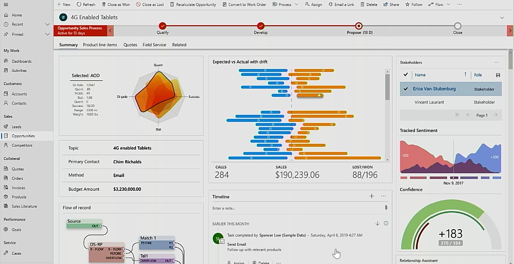
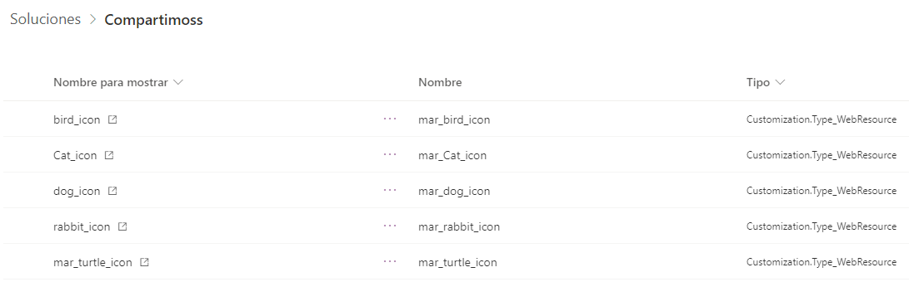
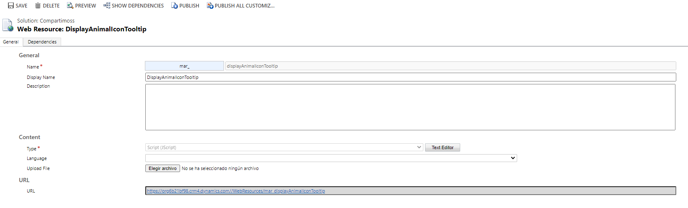
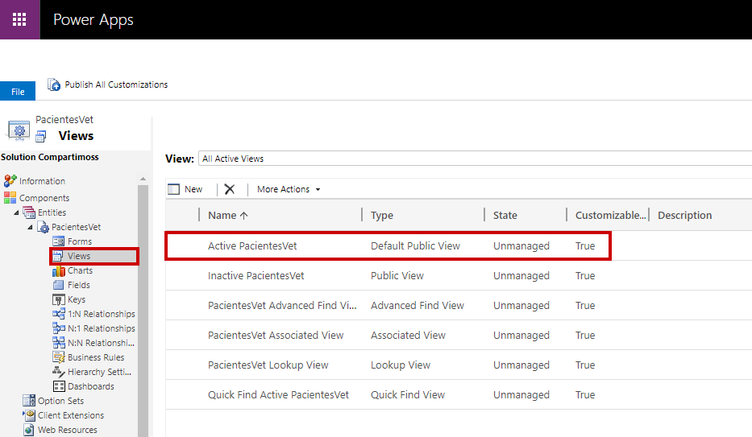
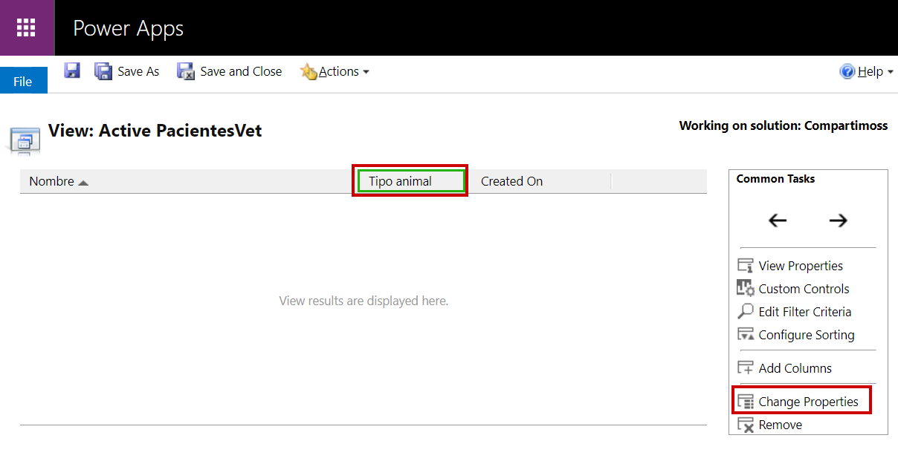
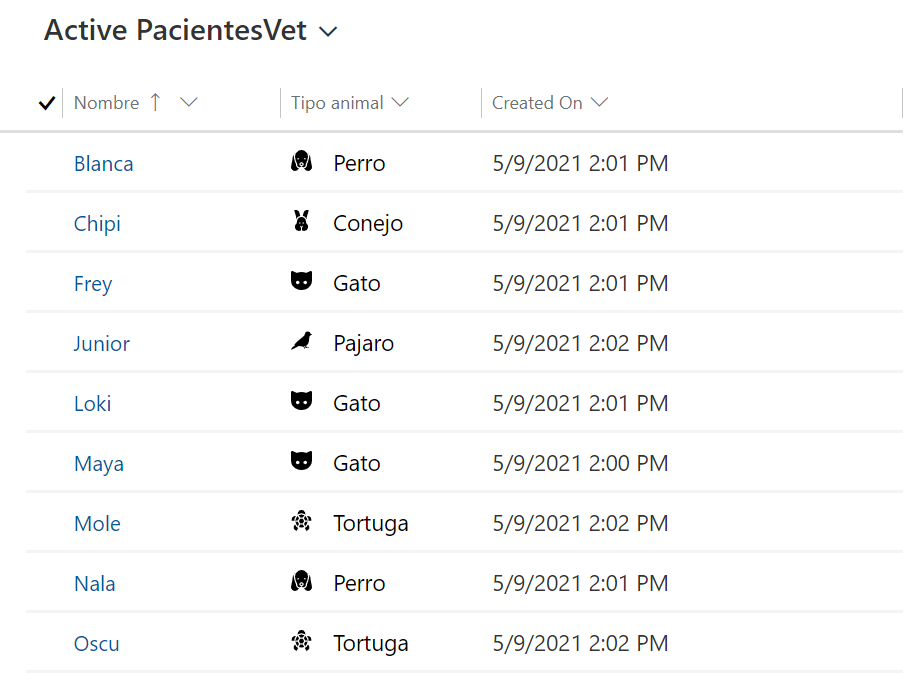

**Antes de empezar deberemos saber que es una Power Apps Model driven**

Este tipo de Power Apps se construyen siempre utilizando la base de
datos de Dataverse. Su interfaz es muy estándar lo que nos permite
también construir la aplicación más rápido y al usuario final le es
mucho más fácil adaptarse a ellas porque siempre mantienen el mismo
aspecto en cualquiera de las Power Apps. Esta interfaz es conocida como
la Unified Interface.

Aquellos que vengáis del mundo Dynamics 365 quizás lo que os estoy
contando no os resulta nada nuevo, ya que algunas de las aplicaciones de
Dynamics 365 son model-driven apps construidas sobre Power Platform.
Según el artículo publicado hace ya algún tiempo, *PowerApps is the
platform on which Dynamics 365 apps are natively built.*

[Introducing model-driven apps -- a new way to create | Microsoft Power
Apps](https://powerapps.microsoft.com/es-es/blog/introducing-model-driven-apps/)

**¿De qué forma podemos enriquecer la interfaz de este tipo de
aplicaciones?**

Cómo hemos dicho las Power Apps model-driven tienen una interfaz muy
estandarizada, pero Microsoft ha puesto a nuestra disposición
herramientas que nos permiten personalizar la interfaz de estas
aplicaciones.

La primera de ellas que quiero comentar es la posibilidad de crear
componentes a través de Power Apps Component Framework que nos permite
crear componentes a través de código para proporcionar una experiencia
mejorada. Este framework también está disponible para las Power Apps
canvas aunque por el momento en versión preliminar pública.

[Descripción general de Power Apps component framework en Microsoft
Dataverse - Power Apps | Microsoft
Docs](https://docs.microsoft.com/es-es/powerapps/developer/component-framework/overview)




La segunda a comentar es la posibilidad de utilizar Power Apps canvas
dentro de una model-driven app. Esta funcionalidad va en la línea de
seguir enriqueciendo con LowCode nuestras Power Apps y también una forma
de unificar la plataforma.

Aunque hasta la fecha era posible [incorporar Power Apps Canvas en una
Power Apps model-driven dentro de un
formulario,](https://docs.microsoft.com/es-es/powerapps/maker/model-driven-apps/embed-canvas-app-in-form)
Microsoft ha añadido las páginas personalizadas con Power Apps canvas
dentro de este tipo de aplicaciones también.

[Better together: introducing Custom Pages and the Modern App Designer | Microsoft Power
Apps](https://powerapps.microsoft.com/es-es/blog/better-together-introducing-custom-pages-and-the-modern-app-designer/)

Y, por último, la posibilidad de incorporar iconos en nuestras vistas. A
continuación, vamos a ver cómo podemos realizar esta personalización.

**¿Cómo crear iconos en vistas de una model-driven app?**

1.  **Crear recursos web con los iconos**

Lo primero que deberemos hacer es crear los recursos web de los iconos
que vamos a utilizar en nuestra vista.




2.  **Crear un código JavaScript para que en función del valor del campo
    muestre el icono correspondiente.**

> Para componer el código es necesario conocer el nombre interno de
> nuestros recursos web de imagen y aplicar la lógica correspondiente.
> El ejemplo se ha realizado con un campo de tipo opción y, por tanto,
> los valores son los códigos de cada una de las opciones.

```
function displayAnimalIconTooltip(rowData) {      
    var str = JSON.parse(rowData);  
    var coldata = str.mar_tipoanimal_Value;  
    var imgName = "";   
    switch (coldata) { 
        //Cat option set value
        case 809620000:
            //Nombre recurso web 
            imgName = "mar_Cat_icon";  
            break;
        //Dog option set value  
        case 809620001:
            //Nombre recurso web   
            imgName = "mar_dog_icon";  
            break;
        //Rabbit option set value   
        case 809620002:
            //Nombre recurso web   
            imgName = "mar_rabbit_icon";  
            break;
        //Bird option set value  
        case 809620003:
        //Nombre recurso web   
            imgName = "mar_bird_icon";  
            break;
        //turtle option set value  
        case 809620004:
            //Nombre recurso web   
            imgName = "mar_turtle_icon";  
            break;        
        default:  
            imgName = "";
            break;  
    }  
    var resultarray = [imgName];  
    return resultarray;  
}
```

> Este código se deberá crear como recurso web dentro de nuestra
> solución del tipo script.
>
> 


> Una vez creado habrá que incorporarlo a la vista. Para ello de momento
> es necesario utilizar el explorador de soluciones clásico o bien desde
> el diseñador de Power Apps en la vista, cambiar a modo clásico.
>
> Iremos a la vista de nuestra tabla para agregar nuestra librería de
> JavaScript a esa vista y al campo correspondiente.
>
> 


> Para realizarlo primero deberemos seleccionar la columna
> correspondiente e indicar *"cambiar propriedades".*



Después simplemente seleccionaremos la librería de JavaScript y la
función que se debe ejecutar.


Después de estas acciones guardaremos y publicaremos los cambios. Una
vez realizado esto, podremos ver como en la vista de la tabla donde
hemos incorporado el JavaScript se muestran los iconos correspondientes.




Por último, aquí tenéis la documentación oficial de Microsoft donde
explica cómo poder incorporar iconos personalizados a nuestras vistas:
[Mostrar iconos personalizados junto con los valores en vistas de lista
con Power Apps - Power Apps | Microsoft Docs](https://docs.microsoft.com/es-es/powerapps/maker/data-platform/display-custom-icons-instead)

En resumen, el método explicado nos permite personalizar las vistas de
una tabla dentro de una model-driven app. Si quisiéramos personalizar
con Power Apps canvas, solo lo podremos hacer en formularios o con las
nuevas páginas personalizadas. Esta última, es una novedad reciente que
va en la línea de unificar la Power Platform y utilizar la Power Apps
canvas para mejorar la experiencia de usuario dentro de las aplicaciones
Power Apps robustas y de negocio que son las model-driven apps.

**Mar Pedroche** <br />
Modern Workplace Solutions Specialist <br />
[LinkedIn](https://www.linkedin.com/in/mar%C3%ADa-del-mar-pedroche-ad%C3%A1n-2a9849119/) <br />
Twitter: @MarPedroche <br /> 
 
import LayoutNumber from '../../../components/layout-article'
export default LayoutNumber
