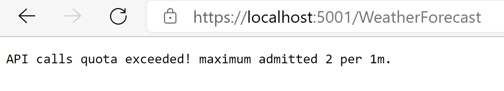

Muchas veces cuando implementamos una API Rest nos centramos en du
diseño, el control de errores, la nomenclatura de los endpoints, la base
de datos que vamos a utilizar, etc... pero muchas veces nos olvidamos de
los aspectos de seguridad. En este articulo vamos a ver cómo añadir
algunos elementos de seguridad a nuestra API: vamos a ver cómo podemos
implementar un middleware de throttling, de una forma muy simple y
sencilla.

**¿Qué es el throttling?**

Antes de empezar con la implementación y el detalle técnico vamos a ver
en que consiste el throttling. Podemos definir Throttling como el
comportamiento que tiene nuestra aplicación cuando piensa que va a
sufrir un ataque o es posible que ponga en peligro el rendimiento de la
aplicación. La palabra throttling viene del inglés y significa
asfixiamiento o estrangulamiento, pero extrapolado al mundo de la
tecnología se refiere al proceso por el cual un chip/servicio rebaja su
rendimiento al alcanzar, generalmente, un proceso crítico.

El Throttling es una técnica que se usa hace muchos años refiriéndonos
principalmente al hardware (aplicado a la CPU y GPU) pero a también se
aplica al desarrollo de software. A los lectores que han desarrollado
algún servicio vez contra la API de SharePoint o contra Microsoft Graph
seguro que les suena el error 429, según este código lo que indica es
que estamos realizando muchas peticiones. Ahora bien, ¿porque se produce
este error? En los inicios cuando la API de SharePoint en sus versiones
OnPrem el throttling se producía en el momento en el que el servidor
tenía una alta carga de CPU y por solucionarlo iba liberando recursos
para que el servidor mejorase su rendimiento y pudiera atender otros
procesos prioritarios. Posteriormente con la versión Online de
SharePoint este 429 se seguía produciendo sin embargo ahora no debería
de ser por problemas del servidor (debido a que ahora el servicio tenía
otro tipo de infraestructura). ¿Cuándo se produce principalmente? En el
momento en el que ponemos un proceso en una Azure Function y esta
realiza varias consultas consecutivas a la API, hablamos de que ponemos
una Function y esta puede escalar y es posible que desde la misma IP
podamos realizar más de 100 requests por minuto, en este momento
SharePoint nos vuelve a mostrar este 429. Este 429 nos lo devuelve para
evitar un ataque de denegación de servicio contra SharePoint Online,
porque lo hacen tenemos una API y si tenemos alguna IP que está
realizando multitud de peticiones lo normal desde el punto de vista de
la API es limitar este número para evitar que un cliente/IP consuma
todos los recursos y eso pueda provocar que nuestro servicio deje de
funcionar. Este tipo de servicios vienen incluidos en herramientas que
ponemos encima de nuestra API, como puede ser un [Azure API
Managment](https://docs.microsoft.com/es-es/azure/api-management/api-management-sample-flexible-throttling).
Sin embargo, ¿cómo podemos incluirlo en nuestro desarrollo de .NET Core
de una forma fácil?

**Manos a la obra**

Antes de ponernos a la implementación hay que tener claro cómo queremos
implementar el Throttling, es decir, tenemos que conocer nuestra
aplicación para saber dónde va a ser efectivo y como lo queremos
implementar. Podemos implementar un throttling general que es que
cualquier petición que nos realicen la almacenemos y cuando lleguemos a
un número de peticiones que consideremos la bloqueamos y listo. Pero
está claro que eso es matar moscas a cañonazos, por loque igual debemos
de conocer cuáles son los puntos que más nos atacan y en dichos puntos
activamos el throttling y de esta forma aplicamos la seguridad en los
puntos donde queremos. Para este ejemplo vamos a optar por esta segunda
opción ya que creemos que es un caso más parecido a la realidad.

Crearemos el proyecto con la línea de comando de dotnet

Dotnet new webapi

Ahora nos crearemos una carpeta "Infraestructure" donde crearemos la
siguiente estructura de carpetas:

-   **Dependency Injection** Donde pondremos los elementos que vamos a
    necesitar inyectar en el arranque de nuestra aplicación.

-   **Model** Crearemos las clases necesarias que vamos a utilizar.

-   **Stores** En esta carpeta crearemos los distintos tipos de
    almacenamiento que vamos a utilizar en nuestro desarrollo.

-   **Services** Aquí implementaremos el servicio de Throttling.

-   **Utilities** En esta carpeta pondremos todos los métodos,
    funciones, extensores que hemos implementado para facilitarnos la
    vida.

**Nota:** En el ejemplo vamos a mostrar las partes del código más
representativas, el resto del código lo puedes consultar y utilizar en
el [siguiente
repositorio](https://github.com/AdrianDiaz81/Compartimoss-numero-48).

**Elección del almacenamiento**

Uno de los puntos fuertes a la hora de añadir una funcionalidad a la API
es ver cuál es el tipo de almacenamiento que vamos a utilizar. En este
caso vamos a analizar qué es lo que necesitamos:

-   Tener algún sitio donde poder dar alta de forma dinámicamente las
    reglas que vamos a utilizar para bloquear las peticiones

-   Tener algún lugar donde poder tener almacenada la cuenta que hacemos
    de cada Request.

Ahora bien, ¿qué características debe tener el tipo de almacenamiento?
Lo primero es que las reglas que vamos a aplicar deben de tener un
almacenamiento persistente. Debe de ser rápido ya que vamos a realizar
peticiones constantes por lo que un Redis puede ser una buena opción.
Pero tiene un inconveniente: ¿cómo podemos mantener los datos
actualizados en el Redis? Quizás mediante un proceso en segundo plano
usando por ejemplo una Azure Function, ¿no? Por otro lado, para el tema
del alojamiento de la cuenta de cada Request, necesitamos una
información volátil por regla general no nos hace fala que esta
información persista más que una hora a los sumo dos y no se debe de
persistir en ningún otro sitio. ¿Quizás con una base de datos InMemory
puede ser también otra alternativa? Pero que ocurre si tenemos más de un
Frontal Web y un balanceador de carga, ¿sería una opción válida? La
respuesta es que NO, ... al final tenemos una elección del tipo de
almacenamiento dependiendo de nuestras necesidades. El tema de ver que
distintos tipos de almacenamiento da para más de un artículo (y no es el
objetivo de dicho artículo) y si sentís curiosidad podéis ver la [sesión
que
impartí](https://www.youtube.com/watch?v=rdBFak5_GEA&list=PLcw17gK4clWBM2gFYfdcM2sqyNDrZ8bzd&index=25&t=3s)
junto con [Robert Bermejo](https://twitter.com/robertbemejo) en el
pasado Global Azure.

Para este desarrollo vamos a simplificar, vamos a almacenar todo en
memoria y dejaremos a la inquietud del lector que implemente otra
alternativa. Para ello dentro la carpeta Store nos crearemos las
siguientes clases:

ICounterStore.cs
```
using Compartimoss.Example.Throttling.Model;
using System;
using System.Threading;
using System.Threading.Tasks;
namespace Compartimoss.Example.AspNetCore.Throttling.Stores
{
    public interface ICounterStore
    {
        Task<bool> ExistsAsync(string id, CancellationToken cancellationToken = default);
        Task<Counter> GetAsync(string id, CancellationToken cancellationToken = default);
        Task RemoveAsync(string id, CancellationToken cancellationToken = default);
        Task SetAsync(string id, Counter entry, TimeSpan? expirationTime = null, CancellationToken cancellationToken = default);
    }
}
```

IRuleStore.cs
```
using Compartimoss.Example.Throttling.Model;
using System.Threading;
using System.Threading.Tasks;
namespace  Compartimoss.Example.AspNetCore.Throttling.Stores
{
    public interface IRuleStore
    {
        Task<RuleCollection> GetAsync(CancellationToken cancellationToken = default);
    }
}
```

Ahora vamos a su implementación la Store de las Reglas, que directamente
se las vamos a pasar dentro de la configuración de la propia WebApi:

```
using Compartimoss.Example.Throotling.Model;
using Microsoft.Extensions.Options;
using System.Threading;
using System.Threading.Tasks;
namespace Compartimoss.Example.AspNetCore.Throttling.Stores
{
    internal class ConfigurationRuleStore : IRuleStore
    {
        private readonly RuleCollection _rules;
        public ConfigurationRuleStore(IOptions<RuleCollection> options)
        {
            _rules = options.Value;
        }
        public Task<RuleCollection> GetAsync(CancellationToken cancellationToken = default)
        {
            return Task.FromResult(_rules);
        }   
   }
}
```

Para la implementación de los Contadores, vamos a utilizar la
[MemoryCache](https://docs.microsoft.com/es-es/dotnet/api/system.runtime.caching.memorycache?view=dotnet-plat-ext-5.0)

MemoryCacheCounter.cs
```
using Compartimoss.Example.AspNetCore.Throttling.Stores;
using Compartimoss.Example.Throotling.Model;
using Microsoft.Extensions.Caching.Memory;
using System;
using System.Threading;
using System.Threading.Tasks;
namespace Lidl.Library.AspNetCore.Throttling.Stores
{
    internal class MemoryCacheCounterStore : ICounterStore
    {
        private readonly IMemoryCache _cache;
        public MemoryCacheCounterStore(IMemoryCache cache)
        {
            _cache = cache;
        }
        public Task<bool> ExistsAsync(string id, CancellationToken cancellationToken = default)
        {
            return Task.FromResult(_cache.TryGetValue(id, out _));
        }
        public Task<Counter> GetAsync(string id, CancellationToken cancellationToken = default)
        {
            if (_cache.TryGetValue(id, out Counter stored))
            {
                return Task.FromResult(stored);
            }
            return Task.FromResult(default(Counter));
        }
        public Task RemoveAsync(string id, CancellationToken cancellationToken = default)
        {
            _cache.Remove(id);
            return Task.CompletedTask;
        }
        public Task SetAsync(string id, Counter entry, TimeSpan? expirationTime = null, CancellationToken cancellationToken = default)
        {
            var options = new MemoryCacheEntryOptions
            {
                Priority = CacheItemPriority.NeverRemove
            };
            if (expirationTime.HasValue)
            {
                options.SetAbsoluteExpiration(expirationTime.Value);
            }
            _cache.Set(id, entry, options);
            return Task.CompletedTask;
        }
    }
}
```

**Servicio Throttling**

Antes de ponernos manos a la obra con la implementación del middleware
vamos a implementar un servicio que cumpla con las necesidades que
queremos. Vamos a implementar un servicio que tenga cuatro métodos:

-   Ver si la Request coincide con alguna de las reglas que hemos
    definido.

-   Ver si cumple los límites establecidos.

-   Comprobar si la dirección que nos llama tiene límites o no.

-   Procesar la Request.

Para ellos nos quedaría un servicio de la siguiente forma:

```
using System.Collections. Generic;
using System.Threading;
using System.Threading.Tasks;
using Compartimoss.Example.Throotling.Model;
using Compartimoss.Example.Throttling.Model;
namespace Compartimoss.Example.Throttling.Services
{
    public interface IThrottlingService
    {
        Task<IEnumerable<Rule>> GetMatchingRulesAsync(RequestIdentity identity, CancellationToken cancellationToken = default);
        RateLimitHeaders GetRateLimitHeaders(Counter counter, Rule rule, CancellationToken cancellationToken = default);
        Task<Counter> ProcessRequestAsync(RequestIdentity requestIdentity, Rule rule, CancellationToken cancellationToken = default);
        Task<bool> IsWhitelistedAsync(RequestIdentity requestIdentity, CancellationToken cancellationToken = default);
    }
}
```

Su implementación queda de la siguiente forma:

```
using System;
using System.Collections.Generic;
using System.Globalization;
using System.Linq;
using System.Security.Cryptography;
using System.Text;
using System.Threading;
using System.Threading.Tasks;
using Compartimoss.Example.AspNetCore.Throttling.Stores;
using Compartimoss.Example.Throotling.Model;
using Compartimoss.Example.Throttling.Model;
using Compartimoss.Example.Throttling.Utilities;
namespace Compartimoss.Example.Throttling.Services
{
    public class ThrottlingService : IThrottlingService
    {
        /// The key-lock used for limiting requests.
        private static readonly AsyncKeyLock AsyncLock = new AsyncKeyLock();
        private readonly IRuleStore _ruleStore;
        private readonly ICounterStore _counterStore;
        private readonly ICounterKeyService _counterKeyBuilder;
        public ThrottlingService(IRuleStore ruleStore, ICounterStore counterStore, ICounterKeyService counterKeyBuilder)
        {
            _ruleStore = ruleStore;
            _counterStore = counterStore;
            _counterKeyBuilder = counterKeyBuilder;
        }
        public async Task<IEnumerable<Rule>> GetMatchingRulesAsync(RequestIdentity identity, CancellationToken cancellationToken = default)
        {
            var rules = await _ruleStore.GetAsync(cancellationToken);
            if (rules?.Rules?.Any() == true)
            {
                return rules.Rules
                            .Where(item => (item.Ip == "*" || IpParser.ContainsIp(item.Ip, identity.Ip)) && RuleMatches(identity, rules, item))
                            .GroupBy(l => l.Period)
                            .Select(l => l.OrderBy(x => x.Limit))
                            .Select(l => l.First())
                            .OrderBy(l => l.PeriodTimespan)
                            .ToList();
            }
            return new Rule[0];
        }

        public async Task<bool> IsWhitelistedAsync(RequestIdentity requestIdentity, CancellationToken cancellationToken = default)
        {
            var rules = await _ruleStore.GetAsync(cancellationToken);
            if (rules==null)
            {
                return false;
            }
            if (rules.IpWhitelist != null && IpParser.ContainsIp(rules.IpWhitelist, requestIdentity.Ip))
            {
                return true;
            }
            if (rules.EndpointWhitelist != null && rules.EndpointWhitelist.Any())
            {
                var path = rules.EnableRegexRuleMatching ? $".+:{requestIdentity.Path}" : $"*:{requestIdentity.Path}";
                return rules.EndpointWhitelist.Any(x => $"{requestIdentity.HttpMethod}:{requestIdentity.Path}".IsUrlMatch(x, rules.EnableRegexRuleMatching))
                       || rules.EndpointWhitelist.Any(x => path.IsUrlMatch(x, rules.EnableRegexRuleMatching));
            }
            return false;
        }

        public async Task<Counter> ProcessRequestAsync(RequestIdentity requestIdentity, Rule rule, CancellationToken cancellationToken = default)
        {
            var counter = new Counter
            {
                Timestamp = DateTime.UtcNow,
                Count = 1
            };
            var counterId = BuildCounterKey(requestIdentity, rule);
            using (await AsyncLock.WriterLockAsync(counterId).ConfigureAwait(false))
            {
                var entry = await _counterStore.GetAsync(counterId, cancellationToken);
                if (entry != null)
                {
                    // entry has not expired
                    if (entry.Timestamp + rule.PeriodTimespan.Value >= DateTime.UtcNow)
                    {
                        // increment request count
                        var totalCount = entry.Count + 1;
                        // deep copy
                        counter = new Counter
                        {
                            Timestamp = entry.Timestamp,
                            Count = totalCount
                        };
                    }
                }
                // stores: id (string) - timestamp (datetime) - total_requests (long)
                await _counterStore.SetAsync(counterId, counter, rule.PeriodTimespan.Value, cancellationToken);
            }
            return counter;
        }

        public RateLimitHeaders GetRateLimitHeaders(Counter counter, Rule rule, CancellationToken cancellationToken = default)
        {
            var reset = (counter?.Timestamp ?? DateTime.UtcNow) + (rule.PeriodTimespan ?? rule.Period.ToTimeSpan());
            var remaining = rule.Limit - (counter?.Count ?? 0);
            return new RateLimitHeaders
            {
                Reset = reset.ToUniversalTime().ToString("o", DateTimeFormatInfo.InvariantInfo),
                Limit = rule.Period,
                Remaining = remaining.ToString()
            };
        }

        private string BuildCounterKey(RequestIdentity requestIdentity, Rule rule)
        {
            var key = _counterKeyBuilder.Create(requestIdentity, rule);
            var bytes = Encoding.UTF8.GetBytes(key);
            using (var algorithm = new SHA1Managed())
            {
                var hash = algorithm.ComputeHash(bytes);
                return Convert.ToBase64String(hash);
            }
        }

        private bool RuleMatches(RequestIdentity identity, RuleCollection rules, Rule item)
        {
            var path1 = rules.EnableRegexRuleMatching ? $".+:{identity.Path}" : $"*:{identity.Path}";
            var path2 = $"{identity.HttpMethod}:{identity.Path}";
            if (path1.IsUrlMatch(item.Endpoint, rules.EnableRegexRuleMatching))
            {
                // search for rules with endpoints like "*" and "*:/matching_path"
                return true;
            }
            if (path2.IsUrlMatch(item.Endpoint, rules.EnableRegexRuleMatching))
            {
                // search for rules with endpoints like "matching_verb:/matching_path"
                return true;
            }
            if (item.Endpoint == "*")
            {
                return true;
            }
            return false;
        }
    }
}
```

**Implementación del Middleware**

Una vez, ya tenemos todo listo vamos a implementar el middleware para
ello debemos de tener claro que solamente debemos de bloquear aquellas
peticiones que hayamos definido. Un middleware debemos de tener claro
que se tiene que ejecutar muy rápido y que una mala implementación de
este puede provocar que nuestro desarrollo tenga un problema de
performance. El middleware quedaría de la siguiente forma:

```
using Compartimoss.Example.Throotling.Model;
using Compartimoss.Example.Throttling.Model;
using Compartimoss.Example.Throttling.Services;
using Compartimoss.Example.Throttling.Utilities;
using Microsoft.AspNetCore.Http;
using Microsoft.Extensions.Logging;
using Microsoft.Extensions.Options;
using System;
using System.Collections.Generic;
using System.Linq;
using System.Threading.Tasks;
namespace  Compartimoss.Example.Throttling
{
    internal class ThrottlingMiddleware : IMiddleware
    {
        private readonly ThrottlingOptions _options;
        private readonly IThrottlingService _processor;
        private readonly IRequestIdentityService _requestIdentityService;
        private readonly ILogger<ThrottlingMiddleware> _logger;
        public ThrottlingMiddleware(IOptions<ThrottlingOptions> options, IThrottlingService processor, IRequestIdentityService requestIdentityService, ILogger<ThrottlingMiddleware> logger)
        {
            _options = options.Value;
            _processor = processor;
            _requestIdentityService = requestIdentityService;
            _logger = logger;
        }

        public async Task InvokeAsync(HttpContext context, RequestDelegate next)
        {
            // check if rate limiting is enabled
            if (_options == null)
            {
                await next.Invoke(context);
                return;
            }
            // check if throotling is enabled
            if (!_options.Enabled)
            {
                await next.Invoke(context);
                return;
            }
            // compute identity from request
            var identity = _requestIdentityService.Resolve();
            // check white list
            if (await _processor.IsWhitelistedAsync(identity))
            {
                await next.Invoke(context);
                return;
            }
            var rules = await _processor.GetMatchingRulesAsync(identity, context.RequestAborted);
            var rulesDict = new Dictionary<Rule, Counter>();
            foreach (var rule in rules)
            {
                // increment counter
                var rateLimitCounter = await _processor.ProcessRequestAsync(identity, rule, context.RequestAborted);
                if (rule.Limit > 0)
                {
                    // check if key expired
                    if (rateLimitCounter.Timestamp + rule.PeriodTimespan.Value < DateTime.UtcNow)
                    {
                        continue;
                    }
                    // check if limit is reached
                    if (rateLimitCounter.Count > rule.Limit)
                    {
                        //compute retry after value
                        var retryAfter = rateLimitCounter.Timestamp.RetryAfterFrom(rule);
                        // log blocked request
                        LogBlockedRequest(context, identity, rateLimitCounter, rule, _options.Mode);
                        if (_options.Mode == ThrottlingMode.Restricted)
                        {
                            if (_options.RequestBlockedBehaviorAsync != null)
                            {
                                await _options.RequestBlockedBehaviorAsync(context, identity, rateLimitCounter, rule);
                            }
                            // break execution
                            await ReturnQuotaExceededResponse(context, rule, retryAfter);
                            return;
                        }
                    }
                }
                // if limit is zero or less, block the request.
                else
                {
                    // log blocked request
                    LogBlockedRequest(context, identity, rateLimitCounter, rule, _options.Mode);
                    if (_options.Mode == ThrottlingMode.Restricted)
                    {
                        if (_options.RequestBlockedBehaviorAsync != null)
                        {
                            await _options.RequestBlockedBehaviorAsync(context, identity, rateLimitCounter, rule);
                        }
                        // break execution (Int32 max used to represent infinity)
                        await ReturnQuotaExceededResponse(context, rule, int.MaxValue.ToString(System.Globalization.CultureInfo.InvariantCulture));
                        return;
                    }
                }
                rulesDict.Add(rule, rateLimitCounter);
            }
            // set X-Rate-Limit headers for the longest period
            if (rulesDict.Any() && !_options.DisableRateLimitHeaders)
            {
                var rule = rulesDict.OrderByDescending(x => x.Key.PeriodTimespan).FirstOrDefault();
                var headers = _processor.GetRateLimitHeaders(rule.Value, rule.Key, context.RequestAborted);
                headers.Context = context;
                context.Response.OnStarting(SetRateLimitHeaders, state: headers);
            }
            await next.Invoke(context);
        }

        private Task ReturnQuotaExceededResponse(HttpContext httpContext, Rule rule, string retryAfter)
        {
            var message = string.Format(
                _options.QuotaExceededResponse?.Content ??
                _options.QuotaExceededMessage ??
                "API calls quota exceeded! maximum admitted {0} per {1}.", rule.Limit, rule.Period, retryAfter);
            if (!_options.DisableRateLimitHeaders)
            {
                httpContext.Response.Headers["Retry-After"] = retryAfter;
            }
            httpContext.Response.StatusCode = _options.QuotaExceededResponse?.StatusCode ?? _options.HttpStatusCode;
            httpContext.Response.ContentType = _options.QuotaExceededResponse?.ContentType ?? "text/plain";
            return httpContext.Response.WriteAsync(message);
        }

        private Task SetRateLimitHeaders(object rateLimitHeaders)
        {
            var headers = (RateLimitHeaders)rateLimitHeaders;
            headers.Context.Response.Headers["X-Rate-Limit-Limit"] = headers.Limit;
            headers.Context.Response.Headers["X-Rate-Limit-Remaining"] = headers.Remaining;
            headers.Context.Response.Headers["X-Rate-Limit-Reset"] = headers.Reset;
            return Task.CompletedTask;
        }

        private void LogBlockedRequest(HttpContext httpContext, RequestIdentity identity, Counter counter, Rule rule, ThrottlingMode mode)
        {
            var message = (mode == ThrottlingMode.Restricted)
                ? $"Request {identity.HttpMethod}:{identity.Path} from IP {identity.Ip} has been blocked, quota {rule.Limit}/{rule.Period} exceeded by {counter.Count - rule.Limit}. Blocked by rule {rule.Endpoint}, TraceIdentifier {httpContext.TraceIdentifier}."
                : $"[Skip] Request {identity.HttpMethod}:{identity.Path} from IP {identity.Ip} shold be blocked but i'm in observe mode, quota {rule.Limit}/{rule.Period} exceeded by {counter.Count - rule.Limit}. Blocked by rule {rule.Endpoint}, TraceIdentifier {httpContext.TraceIdentifier}.";
            _logger.LogWarning(message);
        }
    }
}
```

**Configurando el Middleware**

Antes de lanzar y probar el funcionamiento de nuestro desarrollo debemos
de configurar el arranque de nuestra app según los métodos que hemos
implementado en la carpeta de inyección de dependencias. Para ello en el
método ConfigureService del Startup añadiremos esta configuración:

```
             services.AddThrottling(p =>
            {
                p.Enabled = true;
                p.Mode = ThrottlingMode.Restricted;
                p.CounterStoreType = CounterStoreType.InMemory;
            })
            .AddRules(p => Configuration.GetSection("Throttling").Bind(p));
```

Y en el método Configure algo tan sencillo como:

```
  app.UseThrottling();
```

Ahora lo que nos queda es configurar las settings de nuestra aplicación
por ejemplo como las siguientes:

```
{
  "Logging": {
    "LogLevel": {
      "Default": "Information",
      "Microsoft": "Warning",
      "Microsoft.Hosting.Lifetime": "Information"
    }
  },
  "Throttling": {
    "EndpointWhitelist": [ "*:/WeatherForecast/Three" ],
    "IpWhitelist": [],
    "StackBlockedRequests": true,
    "EnableRegexRuleMatching": false,
    "Rules": [
      {
        "Ip": "*",
        "Endpoint": "get:/WeatherForecast/*",
        "Period": "1m",
        "Limit": 2
      },
      {
        "Ip": "*",
        "Endpoint": "*:/WeatherForecast",
        "Period": "2m",
        "Limit": 3
      }
    ]
  }
}
```

Si ahora ejecutamos la API: dotnet run y lanzamos hacemos dos peticiones
y veremos como la API nos devuelve un 429.



**Conclusión**

En multitud de ocasiones delegamos responsabilidad de nuestra aplicación
en otros servicios, sin embargo, es conveniente saber que al final
nuestra aplicación debe de estar siempre activa y si nuestra aplicación
se cae la responsabilidad es solamente nuestra. Además de por el tema de
responsabilidad también hay un tema de costes que siempre hay que tener
en cuenta a la hora de llevar a cabo una implementación. En este caso de
una forma sencilla y muy simple podemos evitar que un determinado
cliente pueda provocar que nuestro desarrollo se caiga.

También hay multitud paquetes de Throttling en Nuget que podemos
utilizar en nuestros desarrollos.
https://nugetmusthaves.com/Tag/throttling Sin embargo a la hora de
incluirlo en nuestros desarrollos siempre hay que tener en cuenta: la
funcionalidad, la calidad del código y el número de usuarios que tiene
ese proyecto. Por eso para funcionalidad pequeña y que no cueste mucho
esfuerzo yo recomiendo la implementación de dicha característica para no
tener una dependencia con dicha librería y su posterior actualización.


**Adrián Diaz Cervera** <br />
Technical Lead at SCRM Lidl Hub International <br />
MVP Office Development <br />
http://theavenger.dev <br />
@AdrianDiaz81 <br /> 
 
import LayoutNumber from '../../../components/layout-article'
export default LayoutNumber
