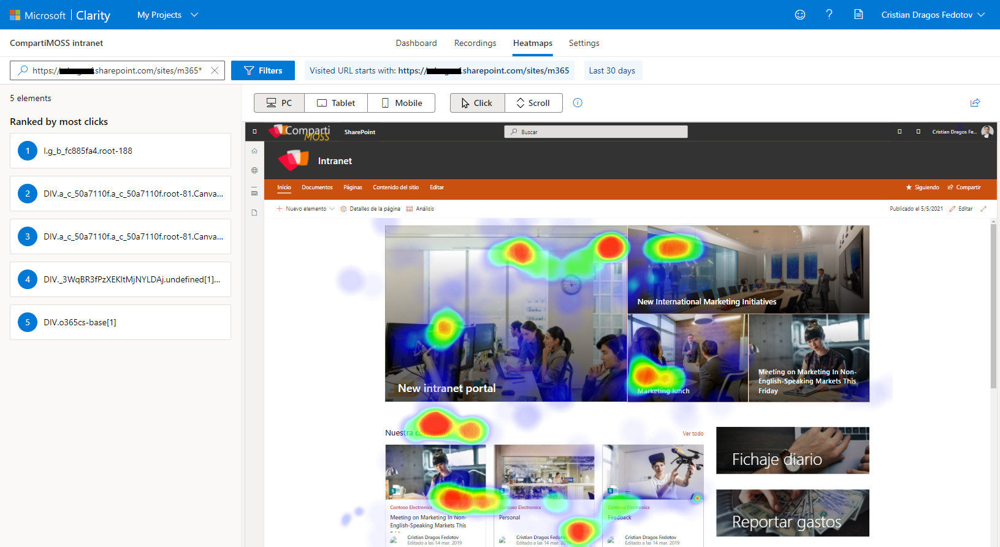

No conocer los hábitos/preferencias de los usuarios y dar por hecho que
lo que les estamos ofreciendo es lo que más se adapta a sus necesidades,
son dos de los problemas más comunes a la hora de tener y mantener una
intranet.

Cuánto, cuándo y cómo consumen la información con la que se les
bombardea (páginas con scroll infinito, banners, noticias, enlaces a
documentos, enlaces externos que rompen la experiencia de navegación,
etc.), son factores muy importantes para mantener viva una intranet.

Y... ¿cómo vamos a conocer todos esos hábitos de los usuarios?

Muy fácil y sobre todo gratis: [Microsoft Clarity](https://clarity.microsoft.com/).

**Microsoft Clarity** es una herramienta que nos puede ayudar a
comprender el comportamiento de los usuarios en nuestra intranet/página
web, mediante:

-   Métricas y datos de uso (tiempos, páginas más populares, sistemas
    operativos, dispositivo, ubicación de usuarios, engagement, etc.).

-   Grabaciones de sesiones de usuario (posibilidad de visualizar en
    diferido los movimientos de los usuarios sobre la intranet).

-   Mapas de calor (analizar puntos más clicados dentro de las páginas y
    nivel de scroll en las páginas).

En este caso de uso vamos a tener en cuenta una intranet creada sobre
SharePoint Online, pero Microsoft Clarity nos permite analizar cualquier
tipo de página web, sobre multitud de plataformas disponibles en el
mercado, incluso en algunas de ellas existen plugins oficiales, como por
ejemplo en
[Wordpress](https://es.wordpress.org/plugins/microsoft-clarity/).

Muy importante: no deberíamos utilizar esta herramienta si nuestros
usuarios manipulan información sensible dentro de la intranet, así como
información médica, datos bancarios, etc.

1.  **Creación de un nuevo proyecto en Microsoft Clarity**

Después de iniciar sesión en https://clarity.microsoft.com, debemos
crear un nuevo proyecto donde vamos a recolectar y organizar todos los
datos sobre el uso de nuestra intranet.

Una vez creado el proyecto se abrirá la pantalla de configuración, donde
podremos modificar ciertos parámetros del proyecto:

a.  Datos generales, así como el titulo o la categoría del proyecto.

b.  Miembros del equipo que van a trabajar sobre el proyecto (roles de
    administrador o miembro).

c.  Instrucciones sobre la instalación/utilización del tracker dentro de
    distintas plataformas web (Adobe Tag Manager, Google Tag Manager,
    Shopify, Wix, Wordpress, etc.).

d.  Enmascarar textos sensibles como direcciones de correo, cajas de
    texto, incluso tenemos la posibilidad de seleccionar y ocultar
    trozos de html dentro de las páginas mediante selectores de CSS.

e.  Bloquear IPs para no tener en cuenta el tráfico desde ciertas
    direcciones (esto puede ser útil para excluir tráfico generado por
    los administradores o grupos de usuarios que no queramos tener en
    cuenta al recoger datos de uso).

2.  **Empezar a recolectar datos de nuestra intranet/web**

Para poder capturar los datos de SharePoint Online (plataforma sobre la
cual está montada nuestra intranet), debemos crear una nueva Extensión
mediante SharePoint Framework (SPFx). Esta extensión se encargará de
ejecutar el código del tracker de Microsoft Clarity en cada una de las
páginas de la intranet.

El código de este desarrollo es muy simple, ya que lo podemos copiar y
pegar desde la parte de ajustes del proyecto que hemos creado
anteriormente, en la pestaña "Setup", donde tendremos también el id de
tracking que se le ha asignado a nuestro proyecto.

Finalmente, nuestra solución de SPFx quedaría de la siguiente manera:

He querido organizar un poco más el código y he parametrizado el id del
tracker de tal manera que podamos modificarlo en cualquier momento desde
las propiedades de la extensión en el catálogo de aplicaciones de
SharePoint Online, sin tener que modificar el código de la solución y
volver a empaquetarla.

Por último, esta solución de SPFx tendremos que subirla al catálogo de
aplicaciones de SharePoint Online y configurar el uso de la extensión, a
nivel de tenant o instalándola en cada colección de sitios que nos
interese. Muy recomendable está última opción ya que tendremos más
control sobre el ámbito de datos que se van a recolectar.

A partir de este momento, nuestra extensión hará que el código de
tracking de Microsoft Clarity se ejecute en las páginas de la intranet y
así poder recolectar los "movimientos" de los usuarios.

3.  **Explorar los datos obtenidos**

Será necesario dejar un tiempo mínimo de recolección de datos (2 horas
aproximadamente) hasta que podamos ver resultados dentro del Dashboard
de Clarity. Después de este tiempo tendremos acceso a diferentes
posibilidades para analizar los datos obtenidos.

Mediante el cuadro de mandos principal podremos ver diferentes métricas,
así como el número de sesiones, el número de usuarios, los exploradores
que se han utilizado, porcentaje de sesiones con errores de JS,
porcentaje de sesiones que han tenido clics "enfurecidos" (acción del
usuario que demuestra frustración por no conseguir el resultado
deseado), páginas más visitadas, países desde donde se ha accedido a la
intranet y un largo etc. de información útil para poder realizar
informes de uso.

Para obtener incluso más detalles podemos acceder a la pestaña de
grabaciones de sesiones (Recordings), donde podremos visualizar en
formato video, acciones realizadas por los usuarios con detalles sobre
el tiempo real transcurrido en cada interacción, tiempo de inactividad
del usuario dentro de las páginas, el recorrido del ratón, los clics del
usuario y en qué partes de la página se realizan.

Dentro de cada grabación, en la barra de avance del video, podemos ver
los puntos más destacados de actividad del usuario (clics o navegación
en páginas).

Y, por último (en mi opinión lo más interesante de esta herramienta)
tenemos los mapas de calor (Heatmaps) generados automáticamente según
los clics o interacciones de los usuarios con las diferentes partes de
cada página. Dentro de estos mapas de calor podremos ver que partes de
las páginas son más atractivas para el usuario ya que serán las que más
interacción han obtenido.

Los mapas de calor se crearán en base a diferentes tonos de color.
Cuanto más se acerque al color rojo una zona, más "caliente" estará.

También podremos ver mapas de calor de scroll en páginas, en otras
palabras, podremos ver hasta donde han hecho scroll los usuarios, dentro
de las páginas tanto en versión PC, Tablet o móvil.

4.  **Conclusión**

Como hemos visto, la palabra "espiar" no se queda tan grande al utilizar
esta herramienta, aunque esta vez es por una buena causa. Lo haremos
para mejorar nuestra intranet y ofrecerle al usuario una información
acorde a sus preferencias.

Mediante los datos recolectados con Microsoft Clarity podremos reubicar
los contenidos, descartar los contenidos poco atractivos, identificar
distracciones y frustraciones del usuario, incluso identificar
incidencias de funcionamiento de las páginas o desarrollos que tengamos
en las mismas.

Podemos utilizar Microsoft Clarity como añadido a los datos de análisis
de uso del sitio de SharePoint Online, una herramienta de caja del
producto que en la mayoría de los casos se queda corta para realizar
informes o tener información algo más detallada.

Por lo tanto, creo que queda bastante claro que Microsoft Clarity es
fácil y rápido de utilizar... ah, se me olvidaba, es gratis.

**Cristian Dragos Fedotov**  
Office 365 & SharePoint Solutions Architect en Everis  
cristianfedotov@gmail.com  
https://www.linkedin.com/in/cristianfedotov/ 
 
import LayoutNumber from '../../../components/layout-article'
export default LayoutNumber
