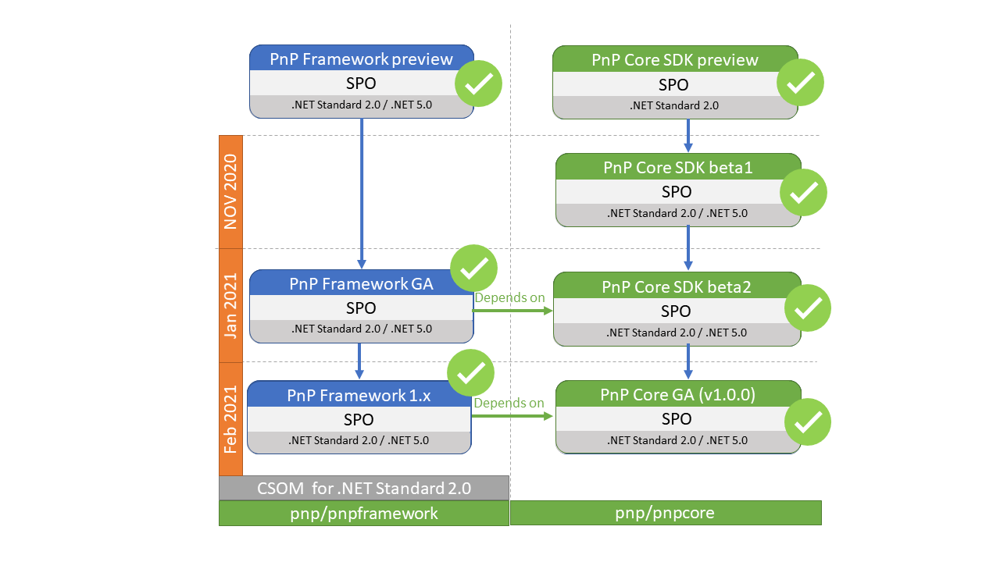
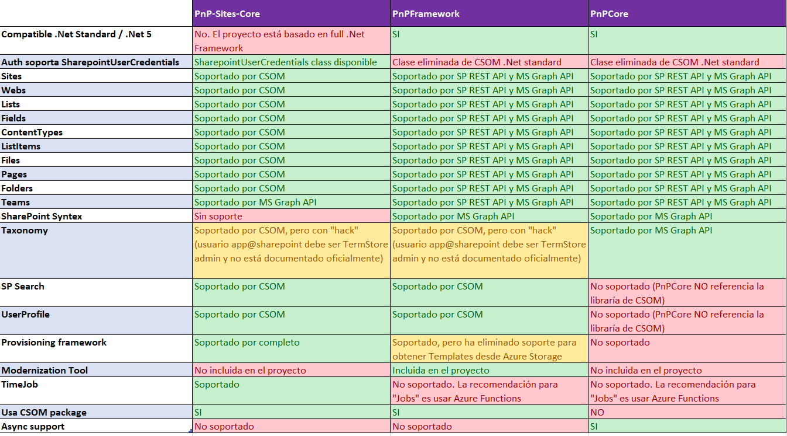
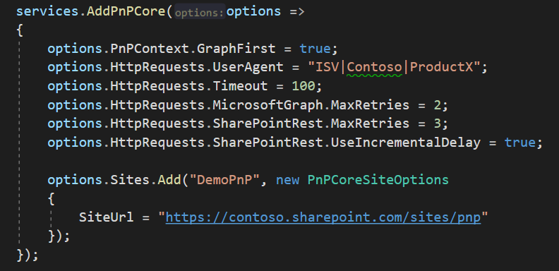
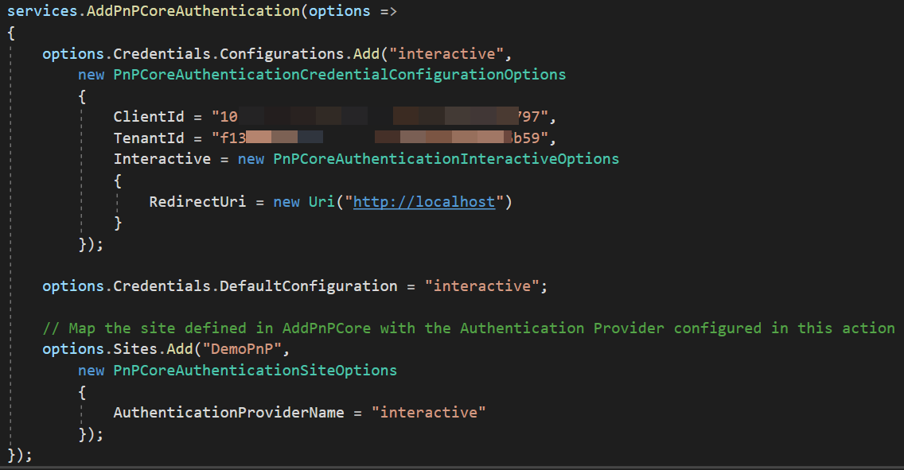
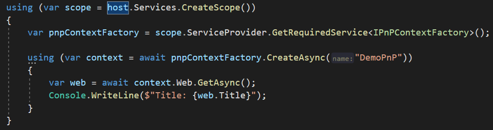

A estas alturas, por todos es conocido el programa Patterns and
Practices, también conocido como PnP, que se dedica a ayudarnos en
nuestros desarrollos para plataforma Microsoft 365, a través de
ejemplos, training, buenas prácticas, etc. Uno de los componentes clave
de dicho programa es lo que se llamó PnP-Sites-Core
(https://github.com/pnp/PnP-Sites-Core), una librería en .NET,
construida por encima de CSOM, y que ofrecía utilidades a la hora de
desarrollar con SharePoint. Seguramente todos conocéis el gran framework
de "Provisioning" que ofrece, con el que podemos desplegar plantillas
XML y provisionar artefactos en SharePoint.

Sin embargo, este componente estaba desarrollado en .Net Framework (no
lo culpéis, al final necesitaba referenciar CSOM, y éste, hasta hace muy
poco, no soportaba .Net Standard), así que, desde hace un tiempo, se
había quedado un poco "viejuno", y empezaba a ser un dolor de muelas
para soluciones modernas. Por ejemplo, si querías utilizarlo en tus
Azure Functions, estabas condenado a usar las Functions V1, y si,
además, necesitabas Durable Functions, algunas referencias del SDK de
las Durables, daban muchos problemas con referencias del PnP-Sites-Core.

Por suerte, el pasado verano, Microsoft liberó una versión de CSOM con
soporte para .Net standard, así que el equipo del PnP, se puso manos a
la obra para migrar el componente PnP-Sites-Core a una nueva versión
compatible con .Net Standard.

**Versiones y Roadmap**

Sin embargo, existe un poco de confusión con respecto a esa migración,
ya que el equipo, además de la migración, ha decidido hacer un nuevo
componente desde cero, quedando así 3 versiones, que en algún momento se
espera se unifiquen. La siguiente imagen, del propio equipo del PnP
trata de explicarlo.

-   **PnP-Sites-Core**: el componente "original", quedaría ya
    "Deprecated", así que se recomienda no usarlo. No se va a invertir
    más tiempo en él. Es muy posible que ni si quiera en bug-fixing.
    Repositorio (archivado: https://github.com/pnp/PnP-Sites-Core)

-   **PnPFramework**: así se ha llamado a lo que sería la migración del
    componente original, PnP-Sites-Core, para hacerlo compatible con
    .Net standard / .Net 5. Actualmente ya se encuentra en versión
    Released (v 1.4.0 en el momento de escribir este artículo). Sin
    embargo, como veremos más adelante, no ha sido una migración "1 a
    1", y se han perdido algunas cosas por el camino. Repositorio:
    https://github.com/pnp/pnpframework. Conviene remarcar que el
    PnPFramework, referencia el paquete PnPCore, por lo que cierta
    funcionalidad es ofrecida a través de este paquete (PnCore).

-   **PnPCore**: este componente es un completo "re-vamp" del original,
    hecho desde cero con todo lo aprendido por el equipo del PnP hasta
    el momento, y adaptado a desarrollos modernos. Ya se encuentra en
    Release (v 1.1.0 en el momento de escribir este artículo). Sin
    embargo, las funcionalidades que ofrece a la fecha, son
    considerablemente menores que el PnPFramework. Se espera que en un
    futuro no muy lejano, ofrezca prácticamente las mismas capacidades
    que el *PnPFramework*.

**Diferencias entre versiones**

La siguiente tabla intenta explicar las principales diferencias entre
versiones, sirviendo de apoyo a la hora de decidir qué versión es más
apropiada para nuestra solución.

Como resumen, mi consejo es que, si tu solución necesita hacer uso del
framework de Provisioning, vas a necesitar usar el PnPFramework. Para
todo lo demás, te diría que uses el PnPCore. Ten en cuenta que, aunque
estoy diciendo que PnPCore no tiene soporte para el SharePoint Search o
UserProfile, esto es porque la librería no referencia el paquete de CSOM
(el equipo ha preferido eliminar esta dependencia, y ha hecho un gran
esfuerzo en ofrecer casi toda la funcionalidad de CSOM, a través de SP
REST API o Graph). Sin embargo, si tu solución necesita hacer algo con
Search o UserProfile, puedes perfectamente añadir el paquete de CSOM, y
combinar el PnPCore y CSOM. Ten en cuenta que el roadmap deja bien claro
que, en algún momento, sólo tendremos el PnPCore, así que cualquier otra
opción, debe estar muy bien justificada.

**PnPCore "in Action"!**

Antes de nada, lo primero que vas a necesitar es registrar una
aplicación en Azure Active Directory (hey, ¿no he dicho ya que todo es
mucho más "Modern"? :D). Vamos a saltarnos esta parte en el artículo, ya
que tienes los pasos muy bien detallados en la misma documentación del
PnPCore
(https://pnp.github.io/pnpcore/using-the-sdk/configuring%20authentication.html#i-want-to-configure-my-own-azure-ad-application-recommended).

También es muy importante que tengas en cuenta, que, si quieres hacer
llamadas a la API de SharePoint con *Application Permissions*, tendrás
que configurar la *Azure Ad App* para usar certificados. Por suerte está
bastante bien explicado en esta otra sección de la documentación:

Una vez configurada nuestra aplicación en Azure AD, lo siguiente que
necesitamos es añadir el paquete PnPCore a nuestro proyecto \*no lo
agregues

Como no queremos montarnos nuestra propia Auth, vamos a hacer uso del
paquete de Auth que nos ofrece el PnP:

Para el ejemplo, voy a utilizar una aplicación de consola. El PnP está
basado en Inyección de Dependencias (algo que te será muy familiar si ya
trabajar con asp.net), y proporciona dos métodos principales para
configurar el propio SDK de PnPCore, así como la parte de Auth. Para
nuestra app de consola, el esqueleto principal del método Main, sería:

Toda esta configuración, se puede especificar desde un fichero de
settings, cosa que tenéis documentada aquí:
https://pnp.github.io/pnpcore/using-the-sdk/basics-settings.html, pero
para nuestro ejemplo, vamos a hacerlo desde código, estableciendo las
opciones más habituales. Para la configuración del PnPCore, podemos
hacer algo como:

Fijaros como tenemos opciones para decidir si queremos usar Graph API
siempre que sea posible (incluso si existe la opción de sacar esa misma
información a través de la API de SharePoint), y tenemos también
bastantes opciones para controlar las llamadas a las APIs, pudiendo
definir números de reintentos, hacerlos incrementales, etc. Recomiendo
también establecer un valor para el *UserAgent*, ya que esto ayudará a
tener menos problemas de *Throtling*.

Para acabar con esta sección, configuramos las diferentes
*SiteCollections* de SharePoint sobre las que vamos a operar luego. A la
hora de configurar la Auth, podemos definir varios Proveedores, bien los
ofrecidos por el paquete PnP.Core.Auth, como si queremos crearnos el
nuestro propio (más info aquí:
https://pnp.github.io/pnpcore/using-the-sdk/custom-authentication-provider.html).
En nuestro caso, vamos a hacer uso del proveedor para Auth interactiva.

Una vez definidos los proveedores, podemos asociar los Sites definidos
en el apartado anterior, con el proveedor. En nuestro caso quedaría:

Una vez configurados tanto el SDK como la Auth, ya podemos sacar un
contexto y acceder a la información deseada. En este caso vamos a sacar
el título de la Site Collection

Podemos obtener el contexto también a través del ID de un Group de
Graph, o a través de una URL, por lo que no siempre es necesario
configurar dicho Site en la sección de "*AddPnPCore*".

A partir de aquí, ya podéis hacer uso de todo lo que ofrece PnPCore para
acceder a la información de Listas, Páginas, Teams, Syntex, etc. Para
acabar, os dejo un Gist con el ejemplo completo de la aplicación de
consola, que además muestra cómo podemos configurar varios proveedores
de Auth (Interactivo y DeviceCode), y usar uno concreto para un Site
concreto:

https://gist.github.com/luismanez/e17d7a415baf2def2833c2fe8bc4b80e

Nada más, espero que os sea de utilidad.

¡Hasta el próximo artículo!

**Luis Mañez**  
Cloud Architect en ClearPeople LTD  
MVP Office Development  
@luismanez  
https://github.com/luismanez 
 
import LayoutNumber from '../../../components/layout-article'
export default LayoutNumber
