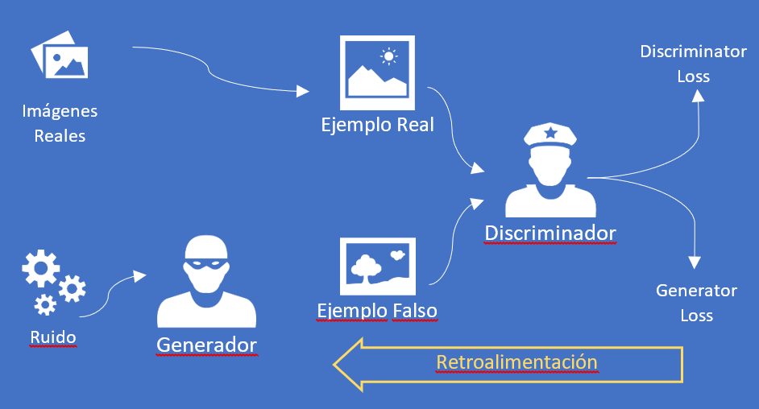

Hace unos años estaba trabajando con Inteligencia Artificial
especialmente orientada al tratamiento de imágenes y di con estas redes
por casualidad. En un inicio no solo despertaron mi curiosidad por ser
muy efectivas, sino que su forma de funcionamiento lleva a que el
algoritmo final se encuentre en constante perfeccionamiento si quiere
sobrevivir, brindando un potencial abismal con un sinnúmero de
aplicaciones hoy en día.

**¿Pero... de qué estamos hablando?**

Tal vez, una de las cosas que más sorprende sobre las Redes Generativas
Antagónicas (GANs de aquí en adelante) es la extensa aplicación que
tienen en nuestro día a día sin que, en muchos casos, sepamos que juegan
un papel primordial en muchas aplicaciones. En realidad, hay mucho
software incorporando Inteligencia Artificial en el día de hoy que se
basan en GAN o en las diferentes variantes que han surgido desde su
concepción en 2014.

La GAN es en realidad el resultado de una competencia entre dos redes
neuronales, las cuales compiten entre sí para lograr un objetivo.

**Definición: dos redes a sopapo limpio**

Si, no solo es título. El motivo por el cual las GAN's son tan efectivas
es que ambas redes neuronales compiten para ver cuál es la mejor en pro
de lograr determinado objetivo. En realidad, la red *Generativa* o
***Generador*** intenta generar nuevos datos partiendo de un
conjunto de datos predeterminados, pero teniendo en cuenta las mismas
características y propiedades. La segunda red, la red *Discriminativa* o
***Discriminador***, intenta encontrar si determinado dato es
real, o por el contrario es falso y ha sido generado por el generador.

La mejor forma de entender su funcionamiento es mediante un ejemplo.
Piensa en imágenes de caras de personas, y partamos imaginando un
conjunto de fotos totalmente reales. Lo primero que haremos será darle
al *Discriminador* ese conjunto de fotos reales y haremos un
entrenamiento de reconocimiento, para que sea su punto de partida y de
esa forma "aprenda" a reconocer la cara de una persona. En paralelo le
diremos a nuestro Generador que coja determinados datos de partida, por
ejemplo, fotos de ojos, de labios, de cejas, de narices, a los que
llamaremos "ruido", y que genere una cara de persona basada en ese
ruido. Ahora el *Generador* enviará esta nueva cara, generada de forma
totalmente sintética, al *Discriminador* y esperemos por el resultado.

Seguramente en las primeras ejecuciones
del proceso anterior, el *Discriminador* se dará cuenta de que la imagen
que le ha pasado *Generador* es falsa, y marcará justamente ese
resultado, "el *Generador* pierde" dirá... (lo que exactamente conocemos
como *Generator Loss*). Pero aquí no termina la cosa, porque como parte
del funcionamiento de la GAN devolveremos al Generador el veredicto
emitido, de forma que pueda considerarlo para futuras interacciones.
Pasada la primera ejecución, todo vuelve a empezar y se vuelve a
ejecutar, pero esta vez el Generador ya cuenta con feedback por parte
del Discriminador y lo tendrá en cuenta.

De esa forma, a medida que el Generador sea ejecutado una y otra vez,
encontrará mejores formas de "engañar" al Discriminador, detectando qué
cosas son buenas para engañarlo y que cosas no son tan buenas. Cuando
hayan pasado miles de ejecuciones llegará un punto en que el Generador
se ha vuelto muy bueno en su afán por engañar al Discriminador, y es en
ese punto cuando empezamos a obtener buenos resultados, cuando el
Discriminador interpreta una imagen totalmente sintética (generada por
el Generador) como si fuese real. En este momento y para el caso de
nuestro ejemplo, podremos decir que tenemos un generador de caras
totalmente artificial, que genera caras falsas que no se pueden
diferenciar de las caras reales.

**¡No termino de ver la aplicación de esto en el mundo real!**

Yo mismo tuve ese pensamiento cuando entendí el funcionamiento de una
GAN, pero vayamos por partes que veremos que estaba equivocado, muy
equivocado.

Imagina que estamos ante una aplicación que, con el mismo tipo de
trabajo que el generador de caras del ejemplo anterior, debe "aprender"
a crear cuadros siguiendo el estilo de Van Gogh. Ahora que ya conocemos
como funciona GAN parece que esta sería una aplicación posible: partimos
entrenando a nuestro Discriminador con todas las imágenes de cuadros de
Van Gogh que podamos conseguir. Al mismo tiempo podríamos partir de una
foto cualquiera, del paisaje que más te guste, y dársela a nuestro
Generador para que la utilice de base para incorporarle ruido y generar
imágenes que simulen una pintura, especialmente siguiendo el estilo de
pintura de Van Gogh. Como sabemos que es una cuestión de tiempo y número
de ejecuciones hasta que nuestro Generador logre engañar al
Discriminador podemos dar por sentado que llegará un momento en que le
haremos creer que hay un nuevo cuadro de Van Gogh basado en la nueva
foto que habíamos seleccionado. Pero no me quiero quedar ahí: ahora
incorporemos otra foto de otro paisaje al mismo modelo, y volvamos con
el proceso de entrenamiento hasta lograr confundir al Discriminador. Y
cuando hayamos terminado incorporemos otra foto. Y así una y otra vez
hasta que hayamos convertido nuestro modelo inicial que convertía una
foto en un cuadro de Van Gogh, hasta un modelo que convierte cualquier
foto en un cuadro de Van Gogh. Esto ya parece hilar fino ¿no?, pues la
respuesta es que no te preocupes por hacerlo: ¡ya existe!, y se basa en
algo que llamamos StyleGAN, que lo que persigue es justamente eso, la
generación de "estilos" sintéticos.

Si todavía no ves la aplicación real aquí van más ejemplos. Como sabes
(y si no lo sabías te lo cuento ahora) la efectividad de algunos modelos
de Inteligencia Artificial que reconocen "cosas" en un conjunto está
estrechamente relacionado con la cantidad de ejemplos de partida con los
que se ha entrenado. Por ponerle nombres: un modelo que reconoce gatos
funcionará mejor cuanto mayor sea el número de gatos distintos con el
que lo entrenas; otro modelo que reconoce matrículas de coches
funcionará mejor cuantos más ejemplos de matrículas le des para
entrenar; y así podría seguir durante páginas con cada cosa que se nos
ocurra, pero no es el objetivo.

Ahora simplemente extrapola lo anterior a cosas más mundanas como por
ejemplo la escritura a mano ("handwriting"), el lenguaje, la voz, el
reconocimiento facial, y en realidad cualquier elemento que se nos
ocurra reconocer o trabajar a través de Inteligencia Artificial. En
todos los casos la redes GAN podrán ayudar en el reconocimiento, dotando
a otros modelos con más ejemplos de partida (por ejemplo, generando
caracteres manuscritos tan perfectos y vastos que parecen escritos
realmente por muchas personas) con un coste muchísimo menor que buscar
miles y miles de ejemplos reales.

Imagina entrenar un modelo de diagnóstico de manchas en la piel solo con
imágenes reales o con imágenes reales + GANs de generación de manchas en
la piel. Sin temor a equivocarnos podríamos decir que el segundo es
muchísimo más extenso que el primero, lo que hará que nuestro modelo de
diagnóstico tenga mayor base y por ende haga mejor reconocimiento. Y
ahora imagina algo similar para reconocer tonos de voz. Dejo el resto a
tu imaginación.

**Próximamente: ejemplos reales**

Continuaré con esta temática en futuros números de la revista,
especialmente trayendo ejemplos concretos de aplicación y ver cómo
funcionan sus tripas. Veremos aplicaciones diversas, desde los DeepFakes
que nacieron con no muy buenos ojos, hasta los Smart Mirrors. Por
último, me gustaría dejarte con una perla que aún está operativa en la
red: <https://thispersondoesnotexist.com/>, donde te aseguro que cada
foto de persona que veas en esa página NO existe y cualquier parecido
con la realidad es pura coincidencia. Juega con la página refrescándola
para generar una nueva foto, o haciendo zoom, y me cuentas.

Javier Menéndez Pallo  
Azure MVP