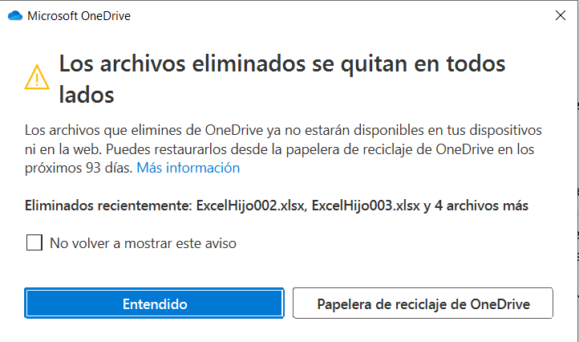

En este artículo os quiero mostrar cómo podemos recuperar determinados
elementos de la papelera de reciclaje de SharePoint utilizando
PowerShell y superar la limitación del umbral de vista que se puede
plantear cuando la papelera tiene demasiados elementos.

 

Este problema se me planteó recientemente porque un usuario de un
cliente eliminó miles de ficheros de una biblioteca de SharePoint. El
usuario tenía sincronizada una biblioteca de SharePoint utilizando el
cliente de OneDrive For Business (ODFB). Como la cantidad de documentos
de la biblioteca era enorme, le estaba ocupando mucho espacio en su
equipo local, así que decidió borrar las carpetas sin haber desactivado
antes la sincronización de la biblioteca.

Aunque el cliente de ODFB muestra por defecto un aviso cuando se
eliminan muchos ficheros, los usuarios no suelen prestar atención a
estos mensajes y los ficheros acaban irremediablemente en la papelera.




A este hecho hay que agregar que, si se eliminan los ficheros de una
carpeta desde el cliente de PDFB, todos ellos aparecen en la papelera de
forma individual (no agrupados en las carpetas raíz) por lo que hay que
ir restaurándolos uno a uno. Por ejemplo, si eliminamos la carpeta raíz
N1 cuando la tenemos sincronizada con el cliente de OneDrive, nos
aparecerán todos los elementos contenidos en ella de forma individual:


Sin embargo, si la eliminación de la carpeta N1 la hiciésemos desde la
vista web, sólo nos mostraría la carpeta raíz que se ha eliminado y
bastaría con restaurarla para obtener todos los elementos incluidos en
su interior.


En este caso en concreto, se eliminaron cientos de miles de ficheros y
carpetas por lo que la tarea no era viable realizarla de forma manual y
es cuando hubo que acometerla utilizando a nuestro inseparable compañero
PowerShell y, en concreto, utilizando algunos comandos de PnP. Por
tanto, será necesario que os instaléis los componentes desde la página
de PnP: <https://pnp.github.io/powershell/index.html>. A continuación,
os pongo los diferentes pasos para crear un PowerShell de este tipo:

En primer lugar, definiremos nuestros parámetros del PowerShell:

a)  Sitio donde está la biblioteca con los elementos eliminados

```
$siteURL="https://contoso.sharepoint.com/sites/TEST/"
```

b)  Usuario que eliminó los documentos

```
$userDelete="johndoe@contoso.com"
```

c)  Fecha a partir de la cual queremos restaurar los que fueron eliminados

```
restoreDate = Get-Date -Date "2021-04-12"
```

Establecemos la conexión con el sitio de SharePoint donde está la
biblioteca que alojaba los documentos. En este caso, como tenían
activada la MFA, utilicé la siguiente instrucción:

```
$conn = Connect-PnPOnline -Url $siteURL -UseWebLogin
```

Procedemos a obtener los elementos de la papelera de reciclaje (sin
indicar en qué fase de la papelera están) filtrando por el usuario y
estableciendo que la fecha sea posterior a la que establecimos en
nuestros parámetros. Aquí podemos incrementar el RowLimit que tiene por
defecto el comando y podemos ordenar los resultados por Ruta y Nombre de
Fichero para evitar el problema de que se esté restaurando un elemento
de una subcarpeta antes que la carpeta padre:

```
$rbinItems = Get-PnPRecycleBinItem -RowLimit 150000 | ?
{($_.DeletedDate -gt $restoreDate) -and ($_.DeletedByEmail -eq
$userDelete) } |sort DirName, LeafName
```

Los comandos de PnP tienen una instrucción para restaurar los elementos
de la papelera (Restore-PnPRecycleBinItem). Sin embargo, al haber tantos
elementos, se producía un error a la hora de ejecutarla. Este error
aparecía incluso si establecía el parámetro del RowLimit. Es decir, el
siguiente comando siempre daba error:

```
Restore-PnPRecycleBinItem -Identity $ritem -RowLimit 1000 -Force
```

El error era el siguiente:

"*The attempted operation is prohibited because it exceeds the list view
threshold enforced by the administrator.*"

Afortunadamente, buceando por la red, encontré el siguiente enlace donde
ofrecían una forma alternativa para restaurar los elementos a partir de
un csv:

<https://gist.github.com/pmatthews05/bf918f76f8fd06f3b0629327d246317a#file-restore-recyclebinitems-ps1>

Como veréis en ese enlace, la restauración se realiza llamando a la API
REST desde PowerShell con los comandos de PnP:

```
Invoke-PnPSPRestMethod -Method Post -Url $apiCall -Content $body | Out-Null
```

Por tanto, lo que hice es incluir ese método en mi script para hacer la
restauración de cada ítem utilizando el Id de cada elemento pasándoselo
de la siguiente forma:

```
Restore-RecycleBinItem -Id $ritem.Id
```

Con este método, el proceso se ejecutó sin problemas. En el caso de que
el número de elementos fuese demasiado elevado, se puede ir lanzando el
script en varias fases hasta completar la restauración de todos los
elementos. A continuación, os pongo todo el script completo (aunque,
para abreviarlo, he quitado las partes en las que registraba cada
elemento restaurado en un fichero de log):

```
# Input Parameters
$siteURL="https://contoso.sharepoint.com/sites/TEST"
$userDelete="johndoe@contoso.com"
$restoreDate = Get-Date -Date "2021-04-12"
###########################################################################################################
function Restore-RecycleBinItem {
    param(
        [Parameter(Mandatory)]
        [String]
        $Id
    )
    $siteUrl = (Get-PnPSite).Url
    $apiCall = $siteUrl + "/_api/site/RecycleBin/RestoreByIds"
    $body = "{""ids"":[""$Id""]}"
    Write-Verbose "Performing API Call to Restore item from RecycleBin..."
    try {
        Invoke-PnPSPRestMethod -Method Post -Url $apiCall -Content $body |
        Out-Null
    }
    catch {
        Write-Error "Unable to Restore ID {$Id}"
    }
}
cls
echo Init
$conn = Connect-PnPOnline -Url $siteURL -UseWebLogin
$rbinItems = Get-PnPRecycleBinItem -RowLimit 150000 | ? {($_.DeletedDate -gt $restoreDate) -and ($_.DeletedByEmail -eq $userDelete) } |sort DirName, LeafName

if ($rbinItems.Count -gt 0)
{
    $n=0
    foreach($ritem in $rbinItems)
    {
        $n++
        try {
            Restore-RecycleBinItem -Id $ritem.Id
        } catch {
            write-host "$($n.ToString("0000")) - ERROR AL RESTAURAR '$($ritem.Title)'|ERROR:'$($_.Exception.Message)': $($_.ScriptStackTrace)" -ForegroundColor Red
        }
    }
} else
{
    write-host "NO se han encontrado elementos eliminados por el usuario '$($userDelete)' posteriores a la fecha $($restoreDate.ToShortDateString())" -ForegroundColor Yellow
}
echo Fin
```

Espero que os sea de utilidad si os encontráis con el problema de que
algún usuario que elimina por error una gran cantidad de información de
vuestros sitios de SharePoint.

**Enrique Sánchez Moreno** <br />
Cloud Services Manager en ILUNION IT Services <br />
[www.esanchezm.com](http://www.esanchezm.com)