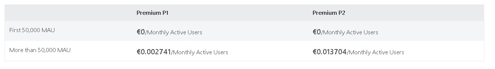
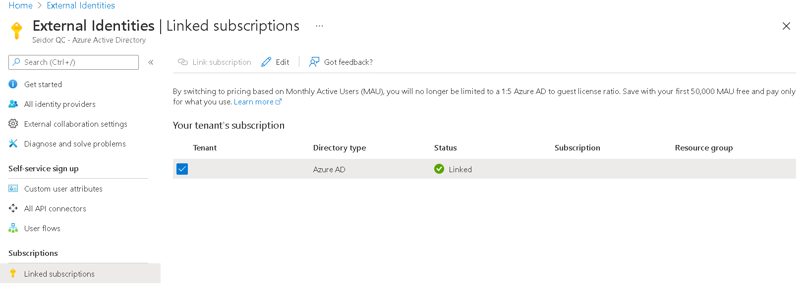
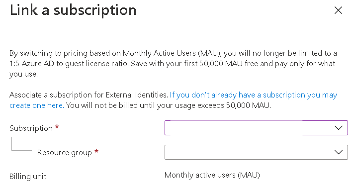
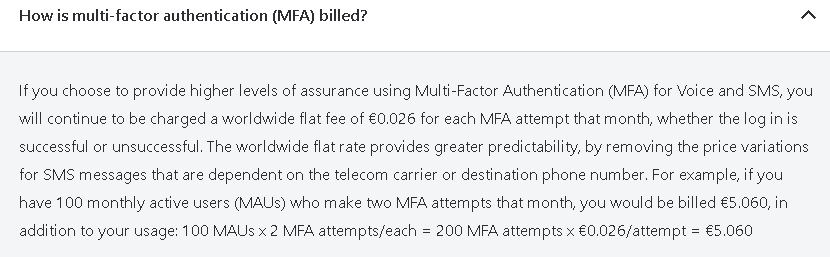

Ya en 2020 Microsoft anunció un cambio en el modelo de precios para las
identidades externas en nuestro tenant, en este artículo vamos a repasar
estas opciones y cómo podemos beneficiarnos de ellas.

**¿Pero cuál es el cambio?**

El modelo de precios "antiguo" se basa en una proporción de 1:5, lo
que significa que podría servir a 5 usuarios invitados por cada licencia
premium en nuestro tenant. Esto se calcula automáticamente. Por ejemplo,
si tenemos **50** usuarios invitados que usan el acceso condicional,
debe tener al menos **10** licencias de Azure AD P1.

En cambio, en el nuevo modelo de precios, la facturación se cambia al
"modelo MAU". MAU significa Usuarios Activos Mensuales. Este modelo es
más predecible y flexible, y el más importante: gratuito para los
primeros 50.000 usuarios invitados. Si, has leído bien, **gratis.** Por
lo tanto, es posible que solo se necesite comprar 1 licencia P2 única
para que actualicemos el tenant a P2 y configurar las opciones
necesarias, pero después de eso, poder proporcionar a 50.000 usuarios
invitados todas las bondades premium que hay de forma gratuita. ¿No está
mal, no?

Para aclarar aún más, el nuevo modelo de precios se ve así:

Tened en cuenta que estos precios variarán dependiendo de donde estéis
ubicados, así que os aconsejo mirar la fuente: [Pricing - Active
Directory External Identities | Microsoft Azure](https://azure.microsoft.com/en-us/pricing/details/active-directory/external-identities/)

**Vale me has convencido, ¿Cómo me cambio al nuevo modelo?**

Cambiar al nuevo modelo es bastante sencillo. Lo único que necesitará es
una suscripción de Azure. Puede ser una suscripción nueva o existente.
Para habilitar el nuevo modelo de precios, deberemos de vincular el
tenant de AzureAD a dicha suscripción. Para ello vamos al Portal de
Azure (https://portal.azure.com) y buscamos External Identities.
Marcamos la opción de linked subscription y a continuación se nos
mostrarán las suscripciones vinculadas a nuestro directorio:

Marcamos la suscripción link subscription y deberemos de indicar un RG
donde asociaremos este nuevo precio:

Una vez realizado este cambio, ya no estaremos limitados a una
proporción de licencias de 1:5 de Azure AD para los invitados. En este
caso no se nos facturará hasta que no superemos los 50.000 MAU.

**Otras consideraciones**

Este nuevo modelo de precios puede ser una característica muy bienvenida
para muchas organizaciones, lo que significa que ya no tienen que
preocuparse por comprar licencias para sus usuarios invitados y
externos. Pero es bueno saber que: este modelo se aplica tanto a
usuarios B2B como B2C.

Pero hay algunas cosas a considerar aquí, ya que en la [documentación](https://azure.microsoft.com/en-us/pricing/details/active-directory/external-identities/)
nos indica que tenemos una tarifa adicional 0.026€ por cada intento de
autenticación multifactor basado en SMS / teléfono, fallido o exitoso.

Eso sí, si utilizamos la aplicación de Authenticator, no tendremos
cuotas adicionales.

**Alberto Andrés Rodríguez**  
@albandrod  
Cloud Solutions Architect @ Seidor