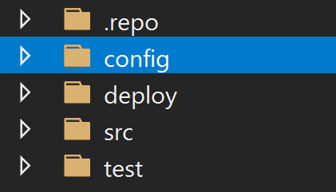
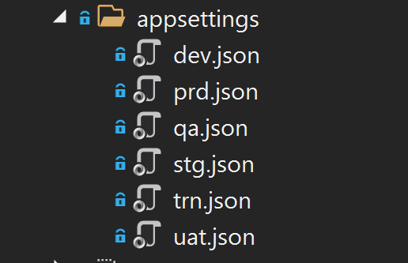

A la hora de llevar el ciclo de vida de un producto o desarrollo, el
equipo debe tener claro tres aspectos claves y como los va a gestionar.
Estos aspectos son la infraestructura, la configuración y el propio
desarrollo. En este artículo nos vamos a encargar de la parte de la
configuración, para ello explicaremos el concepto de Configuration as a
Code (CoC) para gestionar la configuración del producto, porque debemos
de utilizarla y que beneficios nos aporta.

**Un poco de contexto**

Antes de empezar con el desglose de la definición de que es
Configuration as a Code (CoC), vamos a poner un poco de contexto,
necesario para entender que en que nos ayuda la CoC, dentro del ciclo de
vida de desarrollo del software. Partimos de la base de que se está
desarrollando un proyecto/producto en el que se tiene que decidir cómo
se va a llevar a cabo el proceso de configurar el desarrollo de una
forma automática. Existen multitud de opciones, desde realizarlo de
forma manual, un formato hibrido (algunas cosas mediante código otras de
forma manual). o bien el objetivo de tenerlo todo automatizado, evitando
en la medida de lo posible cualquier interacción manual. Ni que decir
tiene que la parte de Configuration as Code va ligada con esta última
opción.

¿Qué consideramos configuración? Cualquier valor que vaya desde una
cadena de conexión para la conectividad a un servicio de Azure,
Microsoft 365, SharePoint hasta cualquier inserción en una base de
datos. Pongamos por ejemplo que estamos creando un Servidor de
Identidades basado en Identity Server, está claro que los clientes,
scopes y resources que va a tener nuestro servidor son elementos de
configuración porque si no hay nada nadie lo puede usar. Los usuarios de
ese servidor de identidades no son aspectos de configuración y por ese
motivo no se deberían de incluir en el CoC.

Para los lectores habituales iguales les suena el proyecto Open Source
en el que participé que se llamaba [Enmarcha](https://github.com/Encamina/Enmarcha-SharePoint-PowerShell). 
En el proyecto hay una aplicación en PowerShell que en base a ficheros de
configuración se recreaban el entorno para poder levantar un entorno de
una forma rápida y automatizada. Este proyecto no es puro Configuration
as a Code sino que tiene elementos de configuración y elementos de
infraestructura. Esto es algo que debemos de tener claro que la
Infraestructura as a Code y la Configuration as a Code NO es lo mismo y
debemos tener claro cuáles son las diferencias. Infraestructura as a
Code es el proceso en el que creamos la Infraestructura por ejemplo
creamos un servicio de Azure una base de datos, establecemos su talla,
configuramos la vNET a la que pertenece. Mientras que la Configuration
as a Code debe de tener todo lo necesario para crear la Base de Datos,
el Seed de Datos inicial y cualquier otro aspecto que va a ser necesario
para que la aplicación arranque cuando la despleguemos en el entorno
oportuno.

Partiendo de este contexto vayamos a un poco las tripas del
Configuration as a Code

**Introducción**

Si consultamos en cualquier referencia (libros, blogs, conferencia) cual
es la definición de Configuration as Code nos lo define como algo
parecido a la siguiente frase *"es la práctica de gestión de los
archivos de configuración en un repositorio fuente"*. Esa definición es
un poco ambigua en varios aspectos, ¿que consideramos como "archivos de
configuración"? Está claro que en un primer pensamiento en caso de estar
desarrollando una aplicación en ASP .NET Core nos viene a la mente la
idea de que se almacenan el fichero "app.settings.json" o un web.config
dentro del repositorio fuente.

¿Es esto lo que se busca en el Configuration as a Code? La respuesta
clara es que NO, además el guardar dichos ficheros dentro del
repositorio fuente es una mala practica y algo que no debemos de hacer
bajo ningún concepto.

Entonces, **¿estos ficheros que se hablan en la definición? ¿qué formato
tienen?** Estos ficheros pueden tener la extensión y el formato que el
equipo de desarrollo quiera. Al final debe de ser un acuerdo entre los
miembros de este y de esta forma todos tener claro como establecer la
configuración.

**¿Qué elementos/artefactos deben estar en esta configuración?** Debemos
incluir en estos ficheros todos los aspectos que son necesarios para que
el producto arranque en el entorno indicado.

**¿Qué entornos?** Al final los entornos es algo que va vinculado como
se gestione el propio producto/desarrollo. Esta claro que se deberá de
tener unos ficheros de configuración que sean dependientes del entorno
en el que se ejecuten, es decir, deberemos de tener tantos ficheros de
configuración como entornos tengamos. Este grado de madurez también va
vinculado al propio grado de madurez del equipo de desarrollo como del
propio producto.

**¿Se usa alguna aplicación para ejecutar esta Configuration as a
Code?** La respuesta esta claro que sí, pero esta aplicación es algo que
va vinculada al propio desarrollo de la aplicación y la/s tecnología/s,
servicio/s que se estén utilizando. Que quiero decir que esta
"aplicación" debe ser algo custom que se haga el propio equipo de tal
forma que podamos ejecutar esta aplicación bajo demanda o incluida en la
propia pipeline de despliegue.

Está claro que el concepto de Configuration as a Code es algo conceptual
y que cada equipo lo puede hacer/organizar de la mejor forma, por ese
motivo vamos a ver como lo implementamos nosotros en nuestro día. La
Configuration as a Code es una parte más de nuestro desarrollo para ello
disponemos de una aplicación que es la que se encarga de poner la
configuración de nuestro desarrollo.

**Como lo hacemos nosotros**

Nos creamos una aplicación en .NET Core que se llama DoConfigure (el
nombre es lo suficientemente claro, para indicar que es lo que se va a
realizar). Esta aplicación esta en el mismo repositorio que el código
fuente de la aplicación. Esta aplicación tiene un paso en la Pipeline de
despliegue. Un ejemplo de estructura de una solución de un proyecto que
tenemos seria la siguiente:




Donde:

-   [.repo] están todos los ficheros de configuración de la
    solución que se utilizan, desde reglas de compilación, readme y
    otros aspectos de nomenclatura.

-   [config] creamos la aplicación (DoConfigure) que se encarga de
    realizar la configuración de nuestro desarrollo. En nuestro caso es
    una aplicación en .NET Core donde tenemos los distintos ficheros de
    configuración por entorno, así como una carpeta para cada elemento
    que se vaya a configurar. Mas adelante veremos un ejemplo para que
    el lector pueda entender mejor el concepto.

-   [deploy] tenemos los ficheros yaml de las pipelines que va a
    tener nuestro desarrollo, así como la infraestructura que se va a
    desplegar.

-   [src y test] está el desarrollo fuente de la aplicación y las
    pruebas de estas.

En este articulo nos vamos a centrar solamente en la parte de
Configuración. Esta aplicación de configuración puede cambiar
dependiendo del tipo de desarrollo que vayamos a realizar. En esta
aplicación se debe de implementar la forma en la que se va a establecer
la configuración en los diversos servicios artefactos. Es normal/natural
que todos estos aspectos estén en librerías comunes (Nuggets) para poder
reutilizarlo en cada nuevo proyecto.

**Caso de ejemplo**

Como desarrollaríamos el DoConfigure, para desplegar un Identity Server
en una Web App de Azure. Partiendo de la base que debemos tener una Base
de Datos en este caso puede ser un SQL Server, una cache usando Azure
Redis Cache. Como sería nuestro DoConfigure.

Lo primero de todo que debemos tener claro son los parámetros que se van
a necesitar para ejecutar la aplicación, lo lógico es que la aplicación
tengamos una configuración por entorno. Por este motivo algo obvio que
debemos de tener es pasarle el entorno que vamos a configurar. En base a
ese entorno nuestra aplicación cogerá unos ficheros de configuración u
otros. Está claro que las bases de datos no son las mismas en todos los
entornos por eso es algo obvio que tengamos esta utilidad. Otro de los
aspectos que debemos de tener claro es que valores pasamos, en nuestro
caso para la conexión con los datos de Azure también le pasamos la
información necesaria para poder establecer la conexión contra una
subscripción de Azure. ¿Por qué motivo hacemos esto? Lo primero es que
está claro que no todos los desarrolladores deben tener acceso al
entorno de producción, por este motivo quien tenga esta información
podrá ejecutar y configurar el desarrollo. Este paso, aunque pueda
parecer trivial es algo de lo más común, más adelante también veremos
alguna casuística que seguro que al lector le llama la atención. Un
ejemplo básico que puede tener nuestra aplicación sería el siguiente
código:

```
static void Main(string[] args)
{
var environment = args[0];
var azureFile = args[1];
var slotName = args[2];
var appsFile = args[3];
var configFile = args[4];
....
}
```

Pero como he comentado anteriormente estos parámetros de configuración
es algo que debe de decidir el equipo. Puede variar dependiendo del tipo
de proyecto y de la experiencia del propio equipo y naturalmente también
del propio producto/proyecto.

Una vez ya si tiene claro cuáles son los parámetros de entrada, en
primer lugar, vamos a configurar las Settings de la Web App, así por
ejemplo sin complicar mucho el caso de ejemplo está claro que debemos de
tener la cadena de conexión a la base de datos y al Redis. Ahora bien,
como lo hacemos dentro del DoConfigure, en nuestro caso hemos decidió
crear una carpeta appsettings, donde vamos a tener un fichero por cada
uno de los entornos que disponemos. La estructura que tenemos es algo
similar a esto:




Para actualizar los valores utilizamos el SDK de Azure y pondremos el
valor de estos ficheros, quedando el código algo similar al siguiente:

```
var tenantId = azureSettings["tenant_id"];
var subscriptionId = azureSettings["subscription_id"];
var clientId = azureSettings["client_id"];
var clientSecret = azureSettings["client_secret"];
var azure = Azure.GetAzure(tenantId, subscriptionId, clientId, clientSecret);
foreach (var app in apps)
{
    azure.UpdateWebAppSettings(app["id"], appSettings, slotName);
}
```

¿Ahora bien, dentro de estos ficheros de configuración tendremos todos
los valores de conectividad en plano? ¿Es decir, estará accesible para
todos los desarrolladores la cadena de conexión a la base de datos? La
respuesta es obvia y naturalmente es que NO. En nuestro caso todo lo que
son cadenas de conexión y otros valores "secretos" usamos un servicio
para almacenarlos en nuestro caso Azure Key Vault (pero se podría
utilizar el servicio que el lector considere o que este adecuado). Lo
que hace la aplicación es acceder al valor que se ha configurado en el
fichero, acceder al valor en el Key Vault y con esto actualizar la
Settings dentro de la Web App. Muchos lectores pensarán que porque
complicarse la vida y no vincular directamente la Web App con el
servicio de Key Vault... y la respuesta es que no todo oro es el que
reluce y cuando hay aplicaciones que tienen un trafico considerable
pongamos una cantidad de unas 20.000 peticiones por minutos y Microsoft
lleva acabo alguna actualización en las WebApps sabrán de lo que estoy
hablando :P En verdad esto es un problema especifico de las
características de los App Service de Azure, pero todos estos aspectos
hay que tenerlos en cuenta en el ciclo de desarrollo y así evitarnos
algunos errores en entornos productivos.

La parte de la configuración de una Web App es algo obvio. Pero en este
caso, si configuramos las cadenas de conexión, pero no tenemos los
clientes de nuestro Identity server ¿cómo podemos saber que nuestro
desarrollo está bien configurado? Como hemos comentado anteriormente, en
nuestro DoConfigure debemos de configurar TODO lo necesario para que
nuestra aplicación arranque y funcione. Por lo que en este caso si
nuestro desarrollo tiene ya unos clientes que hacen uso de nuestro
servidor de identidades pues los damos de alta, en este proceso de
configuración. Que tenemos que hacer si algún cliente cambia
(modificamos/eliminamos) pues que nuestro proceso se debe de encargar de
esto. Al final nuestra aplicación debe de ser lo suficientemente lista
como nosotros queramos, si solamente añade/actualiza debemos de ser
consciente de estas limitaciones. Al final esta configuración es algo
que ponemos en un repositorio fuente para ahorrarnos trabajo y podamos
levantar los entornos de una forma sencilla y rápida y sobre todos
iguales.

**Cosas Positivas**

-   Al tener la configuración en el repositorio tenemos una trazabilidad
    de todos los cambios que se han producido.

-   La configuración se prueba en cada uno de los entornos de forma
    automatizada, el probar esto en cada uno de los entornos se limita
    el número de errores que llegan a producción.

-   Se puede/debe de incluir en el proceso de despliegue del equipo.

**Cosas Negativas**

-   Cualquier modificación que se realice de forma manual, se debe de
    hacer posteriormente en el código porque si no se pierde este cambio
    en el siguiente despliegue.

-   Requiere de equipos de desarrollo muy maduros.

-   Aplicación muy personalizada y adaptada a dicho proyecto, por lo que
    para las primeras veces que lo utilizamos requiere la creación de
    mucha "fontanería" inicial. Pero una vez creada se ahorra muchísimo
    tiempo.

**Otros aspectos**

-   Dependiendo de como se tenga configurado la parte del despliegue,
    hay que tener claro aspectos que pueden provocar un breaking changes
    o bien tener claro un histórico de los mismos para que no se
    produzcan caídas del sistema.

-   Otras dependencias que se pueden tener dependiendo de los servicios
    que se utilicen es que esta aplicación se tenga que hacer en varios
    pasos que no tienen porque ser consecutivos. Por este motivo el
    equipo debe tener claro esta madurez para utilizar correctamente
    Configuration as a Code.

**Conclusiones**

Desde mi punto de vista hoy en día no visualizo ningún proyecto que no
se utilice Configuration as a Code, es algo que he sufrido mucho en
muchos proyectos donde cada entorno lo operaba/administraba un equipo
distinto y había que realizar muchas acciones manuales, todas estas
acciones al ser manuales lo normal es que se puedan producir fallos, el
simplificar este proceso de una forma sencilla desde mi experiencia es
una bendición.

Ahora bien, el Configuration as a Code es un paso más dentro de todo el
proceso de desarrollo, pero por tener esto no implica que nuestros
despliegues sean mejores o peores. Es un proceso más que haciendo buen
uso del mismo ayuda y simplifica mucho. Pero ojo hay que tener un equipo
muy maduro y que todo el mundo sepa que un gran poder llevar una gran
responsabilidad.

Happy Codding.


**Adrián Diaz Cervera** <br />
Technical Lead at SCRM Lidl Hub International <br />
MVP Office Development <br />
http://theavenger.dev <br />
@AdrianDiaz81 <br /> 
 
import LayoutNumber from '../../../components/layout-article'
export default LayoutNumber
