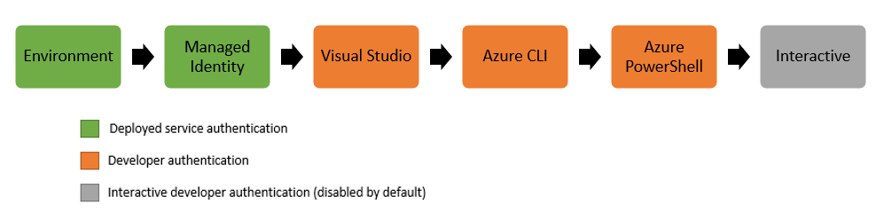
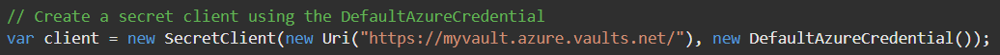
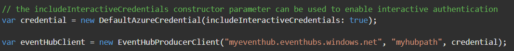
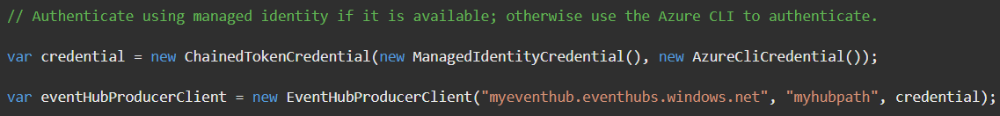
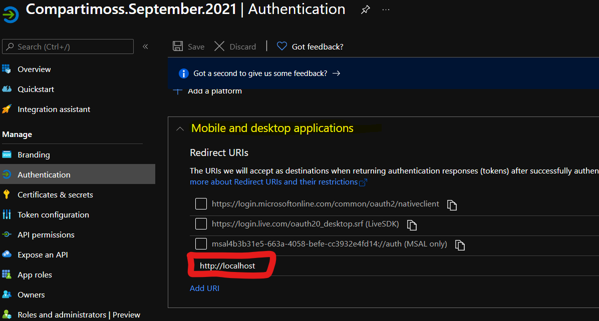
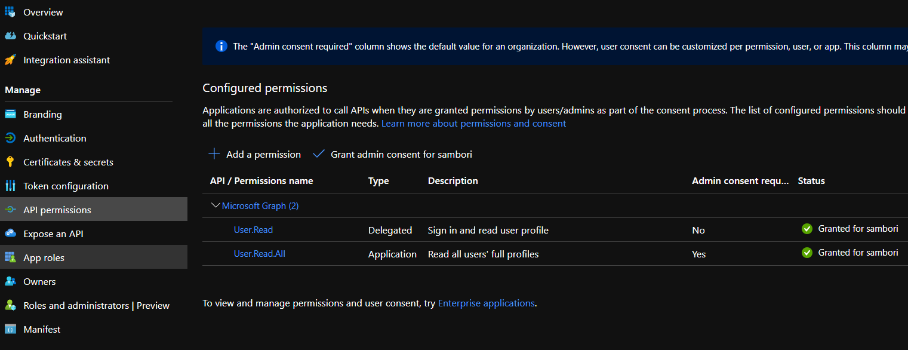
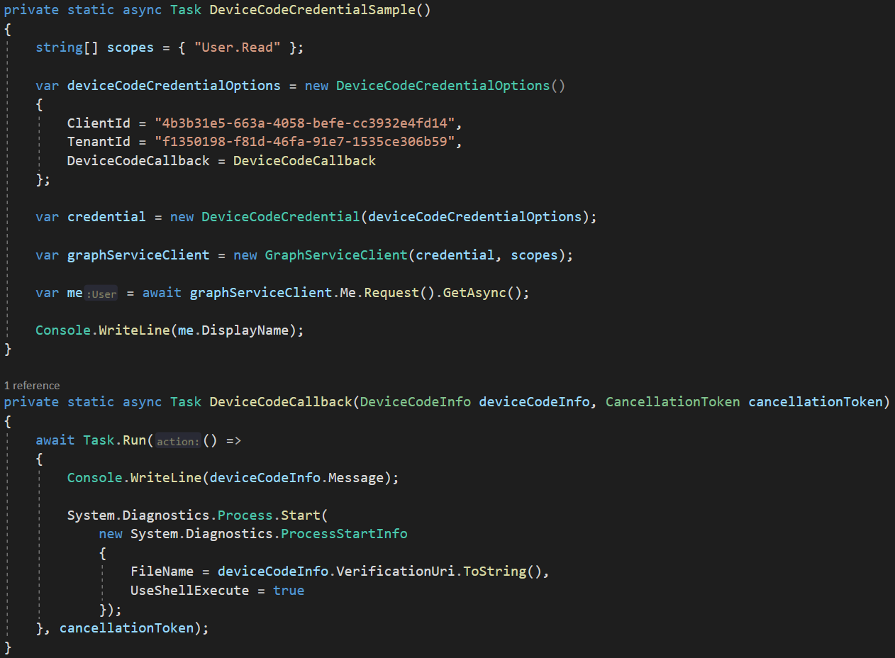

Cada vez que hablo con otros desarrolladores sobre MS Graph API, sale un
comentario parecido al siguiente: "Graph es genial, pero la mayoría de
las veces no sé cómo obtener un *Access token* para poder consumirla".
Quizá estés diciendo ahora, "sí, a mi también me pasa", y sí, a mi
también me pasa, y desde hace un tiempo que Microsoft se ha puesto las
pilas y está facilitando cada vez más esa tarea.

El pasado mes de mayo, el equipo de Azure liberó una nueva versión del
SDK para .NET de **Azure Identity** (versión 1.4.1), que dispone de
varias clases para proveernos de un Token con el que consumir la mayoría
de los servicios de Azure (*KeyVault*, *Storage*, etc). Estas nuevas
clases, unidas a algunas mejoras en el SDK de MS Graph en la versión
4.0, nos va a permitir usar Azure Identity para obtener un Token y poder
consumir Graph sin mucho esfuerzo.

Básicamente, el SDK proporciona un conjunto de clases para Credenciales.
Las Credenciales son unas clases que nos permiten autorizar a un cliente
que quiere consumir un servicio de Azure. A continuación, vamos a ver
algunas de las clases "**Credentials**" que a nuestro parecer son más
utilizadas.

**DefaultAzureCredential**

Esta clase es apropiada para la mayoría de los escenarios donde nuestra
aplicación cliente va a correr en la nube de Azure. Es una clase
"comodín", ya que se va a buscar la vida para obtener un token probando
diversos mecanismos. La siguiente imagen ilustra la cadena que la clase
DefaultAzureCredential va a utilizar para intentar conseguir un
AccessToken para el recurso:

1.  **Entorno**: buscará ciertas variables de entorno a usar para la
    obtención del token.

2.  **Managed Identity**: si la aplicación tiene habilitada la Managed
    Identity, se intentará obtener el token con esa cuenta.

3.  **Visual Studio**: si estamos debugeando desde Visual Studio y
    estamos autenticados en Visual Studio, se usará dicha cuenta.

4.  **Visual Studio Code**: similar a la anterior, pero para Visual
    Studio Code. Si el desarrollador se ha autenticado usando el
    "*Visual Studio Code Azure Account plugin*".

5.  **Azure CLI**: si el desarrollador se ha autenticado con el comando
    "az login" del Azure CLI, se usará dicha cuenta.

6.  **Azure PowerShell**: Será la utilizada si el desarrollador se ha
    autenticado a través de Azure PowerShell, con el comando
    *Connect-AzAccount*.

7.  **Interactive**: Está deshabilitado por defecto, pero si se
    habilita, como última opción, la clase intentará autenticar al
    usuario de forma interactiva, usando el navegador por defecto del
    sistema.

A continuación, tenemos un ejemplo de como usar la clase para conectar
al KeyVault:

Ahora otro ejemplo de cómo podemos habilitar la Autenticación
interactiva en la clase, en este caso, para conectar a un EventHub de
Azure:

**ChainedTokenCredential**

Con esta clase, vamos a poder definir nosotros mismos la cadena que
queremos ejecutar a la hora de intentar obtener el Token. Es muy similar
a la clase anterior, pero aquí tienes el poder de definir tú mismo la
cadena a utilizar. Como dato curioso, se podría esperar que la clase
anterior heredase de esta, y definiera la cadena que hemos visto en la
primera imagen, sin embargo, no es el caso, y tanto esta clase, como la
DefaultAzureCredential, heredan de la misma clase TokenCredential (clase
abstracta que está definida en el paquete Azure.Core). En la siguiente
imagen vemos un ejemplo de como crear un objeto de la clase
ChainedTokenCredential. En este caso, la cadena definida es, primero
para intentar autenticar a través de una Managed Identity, y si no es
posible, pasaría a intentarlo vía Azure CLI:

**EnvironmentCredential**

Esta clase intentará autenticar utilizando ciertas variables de Entorno.

**ClientSecretCredential**

Esta clase habilita la autenticación basada en un Secret generado por la
aplicación registrada en Azure Active Directory.

**ClientCertifcateCrendetial**

Similar a la clase anterior, pero en lugar de usar un Secret, utiliza el
certificado registrado en la aplicación de Azure Active Directory.

**DeviceCodeCredential**

Autentica el usuario siguiendo el OAuth2 flow llamado *Device Code*.
Pare entender como funciona este Flow, podemos revisar el siguiente
enlace: [Device Code Flow ·
AzureAD/microsoft-authentication-library-for-dotnet Wiki
(github.com)](https://github.com/AzureAD/microsoft-authentication-library-for-dotnet/wiki/Device-Code-Flow)

**Utilizando Crendential class para consumir MS Graph API**

La buena noticia es que desde la versión 4 de SDK para .NET de MS Graph
API, el constructor de la clase **GraphServiceClient**, acepta cualquier
clase que derive de la clase *TokenCredential* (que como ya hemos dicho,
las clases *Credentials* de *Azure Identity* todas derivan de dicha
clase, por lo que pueden ser usadas a la hora de crear un
*GraphServiceClient*). Siendo así, vamos a ver un ejemplo donde
obtendremos datos de un usuario de nuestra Tenant, haciendo uso de la
clase *ClientSecretCredential*.

Para los ejemplos de este artículo, se asume el registro de una
aplicación en Azure Active Directory, con permisos sobre MS Graph API
para lectura de usuarios. Las siguientes imágenes muestran las partes
más relevantes de dicha AAD App.

**Imagen 2.- URLs de redirección para la App.**

**Imagen 3.- Configuración de Allow public client flows**

**Imagen 4.- Configuración de Client Secrets.**

**Imagen 5.- Permisos requeridos en la App.**

Una vez la app ha sido registrada, podemos obtener la información de un
usuario con el siguiente snippet:

Recordad que, al usar este tipo de credenciales, se utiliza el OAuth2
flow "Client Credentials", por lo que la petición se realiza con
permisos de Aplicación (no delegados), así que un administrador debe
haber consentido dichos permisos (cosa que podemos hacer fácilmente
desde el portal de Azure). En el siguiente snippet, vamos a utilizar la
clase InteractiveBrowserCredential. Con dicha clase, obtendremos un
popup del browser preguntando por un login y password, y una vez
autenticados, la petición a Graph se hará con el contexto de ese
usuario, y, por lo tanto, permisos delegados.

Para acabar, en el siguiente snippet vemos cómo podemos autenticar
usando el Device Code Flow de OAuth2, a través de la clase
**DeviceCodeCredential**.

Y con este terminamos. Como veis, la combinación de Azure Identity y MS
Graph SDK nos permite poder consumir datos de nuestra Tenant sin
complicarnos mucho la vida con el manejo de Tokens. Espero que os sea de
utilidad.

¡Hasta el próximo artículo!

**Luis Mañez**  
Cloud Architect en ClearPeople LTD  
@luismanez  
https://github.com/luismanez   
 
import LayoutNumber from '../../../components/layout-article'
export default LayoutNumber
