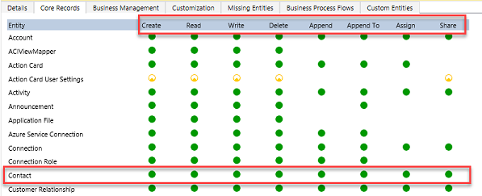
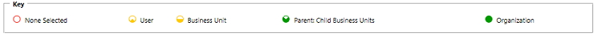
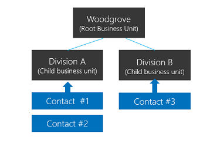
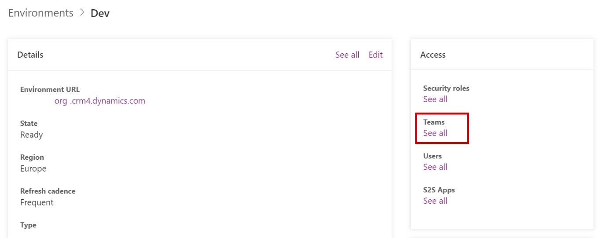
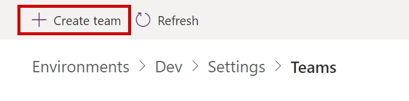
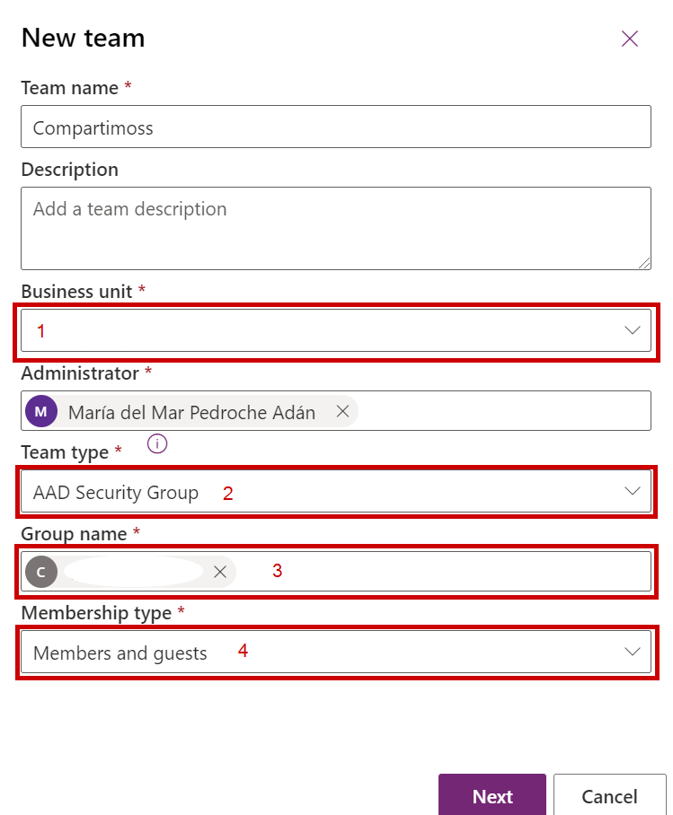
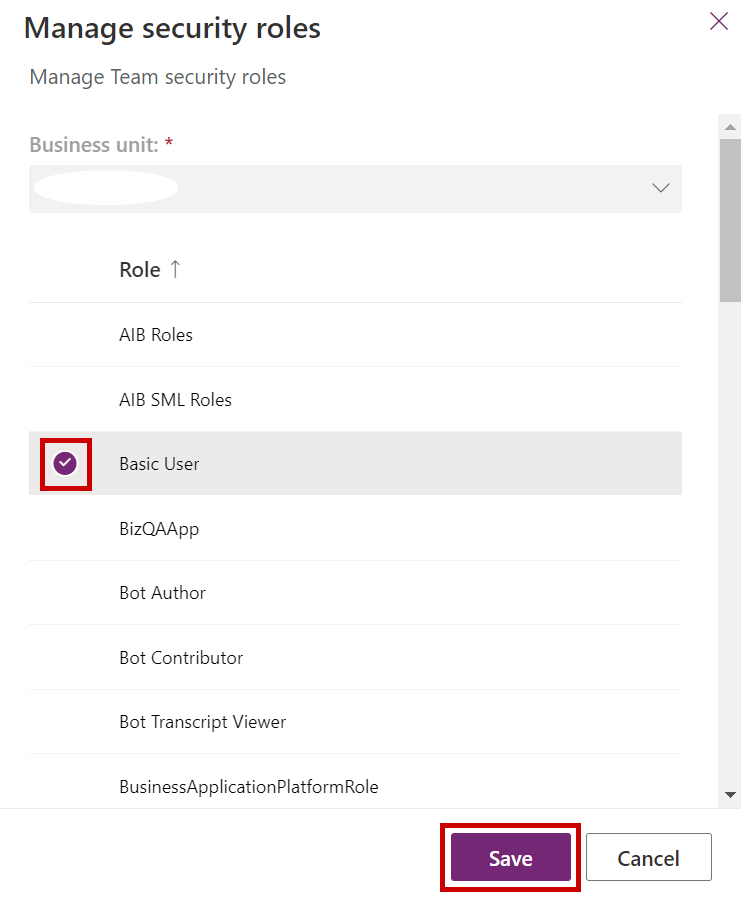
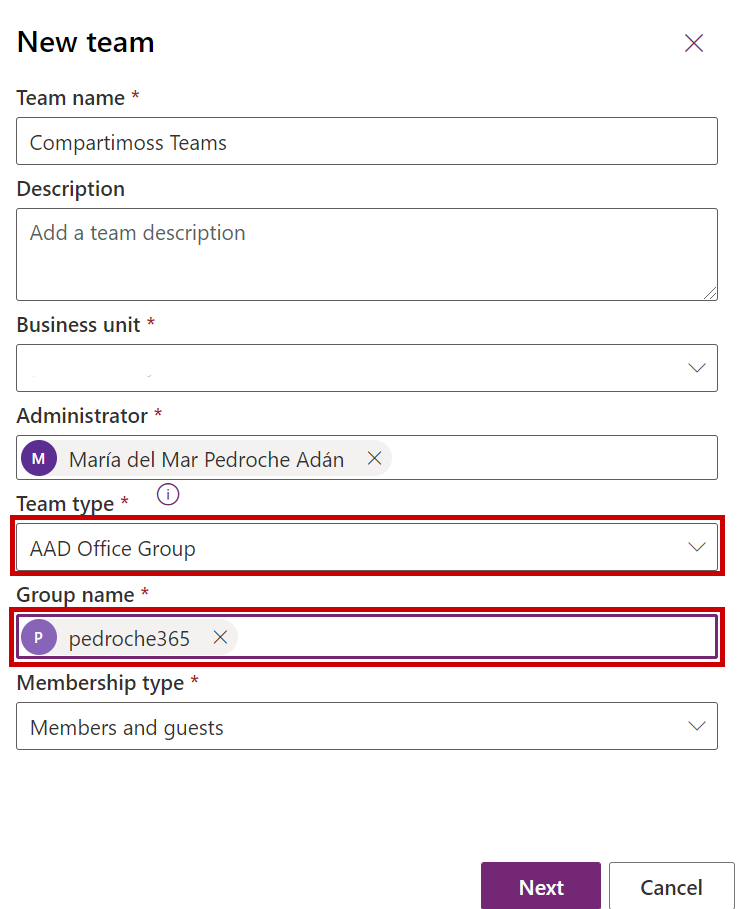

La seguridad en Dataverse se define por roles, estos pueden estar
asignados a usuarios de forma individualizada, a equipos y a unidades de
negocio. Para hacer una gestión eficiente y evitarnos la asignación
individualizada de dichos roles, podemos modelar la seguridad en
Dataverse utilizando los equipos. Estos equipos pueden relacionarse con
grupos de Azure AD de forma que la asignación del usuario a este grupo
hará que se hereden los privilegios definidos en los roles asignados al
equipo de Dataverse correspondiente.

**Roles de seguridad en Dataverse**

Los roles de Dataverse son una serie de privilegios que pueden ser
aplicables a usuarios, equipos y unidades de negocio. Estos roles son
acumulativos y siempre prevalecerá la suma de los roles que conceda
mayores privilegios de acceso.

Por ejemplo, si un rol asignado tiene acceso de lectura sobre la entidad
o tabla de contactos y otro igualmente asignado, tiene privilegios de
escritura. Ese usuario o grupo de usuarios tendrá privilegios de
escritura sobre los contactos.

El tipo de privilegios para cada una de las tablas o entidades es:
crear, leer, escribir, eliminar, anexar, anexar a, asignar y compartir.

El nivel de permisos se podrá configurar de la siguiente forma:

-   **Usuario:** Solo se dispondrán de los privilegios asignados en
    aquellos registros en los que el usuario que ha iniciado sesión en
    la aplicación es propietario.

-   **Unidad de negocio:** El usuario iniciado en la aplicación tendrá
    esos privilegios sobre aquellos registros que pertenezcan a miembros
    de su unidad de negocio.

-   **Primario: unidades de negocio secundarias*: ***El usuario iniciado
    en la aplicación tendrá esos privilegios sobre aquellos registros
    que pertenezcan a miembros de su unidad de negocio y de unidades de
    negocio hijas.

-   **Organización:** El usuario iniciado en la aplicación tendrá los
    privilegios asignados sobre todos los registros de la organización

[Roles de seguridad y privilegios - Power Platform | Microsoft Docs](https://docs.microsoft.com/es-es/power-platform/admin/security-roles-privileges)

**¿Qué son las unidades de negocio?**

Las unidades de negocio son conjuntos de usuarios pertenecientes a
distintos departamentos, divisiones, áreas, empresas, etc. El modelado
en unidades de negocio nos puede ayudar a establecer un buen modelo de
seguridad para garantizar los privilegios que deben disponer los
usuarios dentro de Dataverse. Normalmente se establecen distintas
unidades de negocio cuando el acceso a la información entre los usuarios
es muy diferente.

**¿Qué son los equipos de Dataverse?**

Los equipos son otro de los elementos que podemos utilizar para modelar
la seguridad dentro de Dataverse. Los equipos pertenecen a unidades de
negocio, de modo que existe al menos un equipo por unidad de negocio de
forma predeterminada. Ese equipo contiene aquellos usuarios que
pertenecen a esa unidad de negocio. Existen dos tipos de equipos:

-   **Equipos propietarios:** pueden poseer registros dándoles
    privilegios sobre los registros asignados mediante rol. Este tipo de
    equipos nos permite gestionar de una manera amplia los roles y
    privilegios de los usuarios sin necesidad de realizarlo por cada
    usuario de forma individual.

-   **Equipos de acceso:** Nos permiten compartir registro entre equipos
    diferentes sin necesidad de modificar los roles de seguridad.
    Además, en este caso la propiedad del registro no es necesario que
    pase a ser del equipo.

[Conceptos de seguridad en Microsoft Dataverse - Power Platform | Microsoft Docs](https://docs.microsoft.com/es-es/power-platform/admin/wp-security-cds)

**¿Cómo crear un equipo asociado a un grupo de seguridad?**

Los equipos pueden crearse con un grupo de seguridad del Azure AD
asociado, de forma que asignemos el rol a este equipo y los usuarios que
pertenezcan a él disponga de los privilegios definidos en el rol. Estos
equipos asociados al grupo de seguridad funcionan como los equipos
propietarios, les podemos asignar la propiedad de registros.

Para crearlos lo haremos desde el centro de administración de Power
Platform. Aquí deberemos elegir el entorno e ir a equipos

Desde esta sección deberemos crear el equipo:

Elegiremos el nombre y el administrador del equipo, así como los
siguientes parámetros.

1.  **Unidad de negocio:** Elegiremos a que unidad de negocio pertenece
    este equipo, si no tenemos unidades de negocio creada elegiremos la
    de la organización.

2.  **Tipo de equipo:** En este caso elegiremos grupo de seguridad del
    AAD.

3.  **Nombre del grupo:** Nombre del grupo de seguridad del AAD que
    previamente deberá estar creado.

4.  **Tipo de membresía:** Podremos elegir entre miembros e invitados,
    solo miembros, solo propietarios o solo invitados.

Una vez que hayamos creado el equipo simplemente deberemos asignarle el
rol o roles de seguridad que le correspondan.

**¿Cómo crear un equipo asociado a un grupo de Microsoft 365 o equipo de Teams?**

Igual que el caso anterior, este tipo de equipos funcionan como los
equipos propietarios, por lo tanto, además de asignarle el rol para no
tener que gestionarlo de forma individualizada, podemos asignar
registros a un equipo de Teams ya que estos generan en el Azure AD un
grupo de Microsoft 365.

[Equipos en Dataverse - Power Platform | Microsoft Docs](https://docs.microsoft.com/es-es/power-platform/admin/manage-teams)

**Algunas consideraciones importantes.**

Los integrantes de los equipos asignados a grupos del Azure AD se
agregan y quitan de forma dinámica cuando tienen acceso al entorno y por
lo tanto también se le asignan los roles correspondientes al equipo.
Para aclarar, hasta que el usuario no ha accedido al entorno, es decir
no ha iniciado sesión en él, no aparecerá en el equipo de Dataverse
aunque ya esté agregado al grupo de Azure AD. Para forzarlo podemos
utilizar llamadas de suplantación: [Suplantar a otro usuario (Microsoft Dataverse) - Power Apps | Microsoft Docs](https://docs.microsoft.com/es-es/powerapps/developer/data-platform/impersonate-another-user)

Solo puede crear un equipo de grupo para cada tipo de pertenencia de
grupo de Azure AD por ambiente, y el nombre o identificador del Azure AD
del equipo de grupo no se puede editar una vez creado el equipo de
grupo.

El tipo de pertenencia no se puede cambiar una vez creado el equipo de
grupo. Si se necesita actualizar este campo, se deberá eliminar el
equipo de grupo y crear uno nuevo.

Si el entorno tiene un grupo de seguridad, deberemos agregar al grupo de
Azure AD del equipo del grupo como miembro de dicho grupo de seguridad
para que los usuarios del equipo del grupo puedan acceder al entorno.

Si quieres más información y algunas otras consideraciones, recomiendo
visitar el siguiente enlace:

[Administrar equipos de grupos - Power Platform | Microsoft Docs](https://docs.microsoft.com/es-es/power-platform/admin/manage-group-teams)

En definitiva, para mejorar la gestión de los roles de seguridad en
Dataverse, sin que se requiera hacerlo de forma individualizada, es
necesario modelar la seguridad de Dataverse utilizando unidades de
negocio y/o equipos relacionados con los grupos ya generados en nuestro
Azure AD lo que nos permitirá que los usuarios se agreguen a los equipos
de forma dinámica y estos hereden los privilegios asignados en el rol o
roles del equipo.

**Mar Pedroche**  
Modern Workplace Solutions Specialist  
[LinkedIn](https://www.linkedin.com/in/mar%C3%ADa-del-mar-pedroche-ad%C3%A1n-2a9849119/)  
Twitter: @MarPedroche 