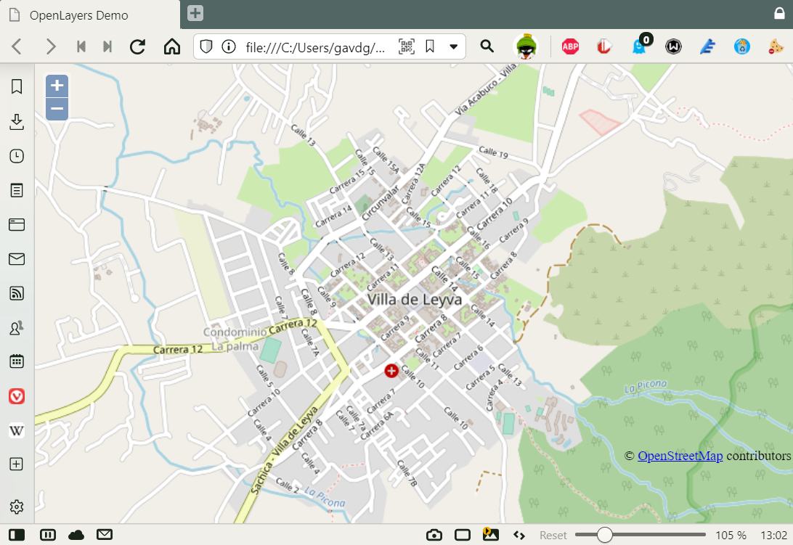

**Introducción**

En el artículo "[Azure maps - una ventana al mundo](https://www.compartimoss.com/revistas/numero-48/azure-maps)"
publicado en el número 48 de CompartiMOSS, vimos que es el servicio de
Azure Maps, comparándolo con el servicio de Bing Maps, sus
características y posibilidades técnicas, y como utilizar su API tanto
con HTML como en aplicaciones SPFx (SharePoint Framework) y aplicaciones
creadas con Power Apps.

En este segundo articulo exploramos el mundo de APIs para mapas, que no
se reduce a lo que podemos obtener con Azure y/o Bing. El mundo actual
de APIs para mapas es bastante amplio, incluyendo multitud de empresas y
servicios, tanto de pago como de uso gratuito.

En el mundo moderno de programación de aplicaciones es casi imposible
encontrar una aplicación o sitio de internet que no utilice mapas, yendo
desde los sitios de internet más sencillos que muestran la dirección
física de la empresa mediante un mapa, pasando por aplicaciones de
geolocalización tales como las utilizadas con GPS para encontrar
direcciones y rutas de un sitio a otro, yendo hasta aplicaciones
especializadas como las utilizadas por atletas para controlar su
velocidad en competencia. Todas esas aplicaciones utilizan algún tipo de
servicio de mapas por medio de sus APIs.

Hay aplicaciones de incalculable valor que se basan en mapas, como el
sitio de Internet "[Zombie Apocalypse Survival Map](https://projects.raspberrypi.org/en/projects/zombie-apocalypse-map)",
en donde usted puede crear un mapa real de su área local y marcar en él
las ubicaciones de suministros a usar en caso de un ataque de zombis,
bases secretas, e incluso las zonas donde los propios zombis se
encuentran. Algunas otras, un poco más banales como "[Tetsudo
now](http://www.demap.info/tetsudonow/)" que utiliza un mapa animado
creado con el OpenLayers API en donde se indican los horarios de los
metros subterráneos y autobuses de Tokio en tiempo real; también es muy
útil para aprender japones simultáneamente.

**Mapbox**

[Mapbox](https://www.mapbox.com/) proporciona un conjunto de
herramientas para la creación de mapas digitales personalizados de forma
rápida y sencilla. Mapbox es open-source y ofrece cinco planes de pago
para su utilización, que van desde un plan gratuito que permite hasta
25.000 usuarios mensuales (que pueden ver hasta 50.000 mapas), hasta
planes empresariales con alto volumen de uso.

Mapbox dispone de varios APIs (mapas, navegación y geocodificación) de
JavaScript propios, SDKs (Android, iOS y Unity) y otras herramientas que
los desarrolladores pueden utilizar para agregar mapas dinámicos en
aplicaciones. Dispone también de un editor en línea (Mapbox Editor) que
permite crear rápidamente mapas personalizados utilizando datos propios,
importados como un archivo .csv, GeoJSON, KML o GPX. El sitio de Mapbox
proporciona una gran cantidad de [demostraciones en vivo y
ejemplos](https://docs.mapbox.com/mapbox.js/) de código que los
desarrolladores pueden utilizar como punto de partida para sus
aplicaciones.

Para utilizar Mapbox programáticamente es necesario primero [crear una
cuenta](https://account.mapbox.com/access-tokens) en el sistema, con la
que se genera un token público que debe ser usado en cada consulta a
Mapbox (hay una versión gratis, como se indicó anteriormente).

El siguiente es un ejemplo en HTML:

```
<!DOCTYPE html>
<html>
<head>
<meta charset=utf-8 />
<title>Mapbox API for JavaScript </title>
<meta name='viewport'
content='initial-scale=1,maximum-scale=1,user-scalable=no' />
<script src='https://api.mapbox.com/mapbox.js/v3.3.1/mapbox.js'></script>
<link href='https://api.mapbox.com/mapbox.js/v3.3.1/mapbox.css' rel='stylesheet' />
<style>
body {
margin:0;
padding:0;
}

#myMap {
position:absolute;
top:0;
bottom:0;
width:100%; }
</style>
</head>
<body>

<div id='map'></div>

<script type="text/javascript">
L.mapbox.accessToken = '[Su Token Aqui]';
var map = L.mapbox.map('myMap')
.setView([5.633902, -73.523544], 15)
.addLayer(L.mapbox.styleLayer('mapbox://styles/mapbox/streets-v11'));
</script>
</body>
</html>
```

Note la similitud del código con el mostrado en el artículo de
CompartiMOSS número 48, utilizado para generar un mapa con Azure Maps.
Para Azure Maps se necesitan dos librerías de .js y .css de la forma:

```
<script src="https://atlas.microsoft.com/sdk/javascript/mapcontrol/2/atlas.min.js"></script>

<link rel="stylesheet" href="https://atlas.microsoft.com/sdk/javascript/mapcontrol/2/atlas.min.css">
```

Y para Mapbox las librerías son:

```
<script src='https://api.mapbox.com/mapbox.js/v3.3.1/mapbox.js'></script>

<link href='https://api.mapbox.com/mapbox.js/v3.3.1/mapbox.css' rel='stylesheet' />
```

El archivo .html genera un mapa similar al siguiente:


Para utilizar Mapbox en una aplicación SPFx, primero es necesario
importar el módulo de Mapbox usando npm:

```
npm install mapbox.js
```

Y luego, al inicio del código en el archivo de TypeScript, inicializar
el module por medio de:

```
import * as atlas from 'mapbox.js';
```

El código de TypeScript para generar los mapas en una aplicación SPFx se
puede copiar prácticamente de principio a fin del código mostrado al
principio para generar mapas en una página HTML.

**Esri ArcGIS**

Esri (Environmental Systems Research Institute) fue originalmente un
grupo de investigación que analizaba información geográfica para la
planificación del uso de la tierra con fines agrícolas. En 1996, Esri
lanzó MapObjects, la primera plataforma de mapas disponible para
Internet. Actualmente, Esri se centra principalmente en aplicaciones
empresariales y ofrece una plataforma GIS (Geographic Information
System) completa que incluye no solo generación de mapas, sino también
múltiples tipos de análisis geográficos. Esri incluye acceso por
intermedio de numerosas APIs y SDKs incluyendo un API para mapas basado
en JavaScript. Esri ofrece una suscripción gratis para desarrollador y
un modelo de pago para uso comercial.

Para obtener una licencia de desarrollo, [cree una cuenta en el sitio de Esri](https://www.arcgis.com/sharing/rest/oauth2/authorize?client_id=arcgisdevelopers&response_type=token&expiration=20160&redirect_uri=https%3A%2F%2Fdevelopers.arcgis.com%2Fpost-sign-in%2F%3Fredirect_uri%3D%252Fdashboard%252F%26required%3Dtrue&state=arcgisdevelopers&locale=&showSignupOption=true&signuptype=developers),
lo que produce una llave para generar mapas y utilizar algunos otros
servicios de la empresa. El API de JavaScript está totalmente
documentado en el sitio de [ArcGIS API for JavaScript](https://developers.arcgis.com/javascript/latest/), e incluye
numerosos ejemplos de uso del API. El siguiente ejemplo de HTML produce
un mapa centrado en un sitio determinado, dado por sus coordinadas
geográficas:

```
<html>
<head>
<meta charset="utf-8" />
<meta name="viewport" content="initial-scale=1, maximum-scale=1, user-scalable=no" />
<title>ArcGIS API for JavaScript</title>
<style>
html,
body,
#viewDiv {
padding: 0;
margin: 0;
height: 100%;
width: 100%;
}
</style>
<script src="https://js.arcgis.com/4.20/"></script>
<link rel="stylesheet" href="https://js.arcgis.com/4.20/esri/themes/light/main.css">
<script>

require(["esri/config","esri/Map", "esri/views/MapView"],
function (esriConfig,Map, MapView) {

esriConfig.apiKey = "[Su llave aqui]";

const map = new Map({
basemap: "arcgis-topographic"
});

const view = new MapView({
map: map,
center: [-73.523544, 5.633902],
zoom: 14,
container: "viewDiv"
});
});

</script>
</head>
<body>
<div id="viewDiv"></div>
</body>
</html>
```

De nuevo, el código es muy similar al utilizado anteriormente. Las
librerías de JavaScript y css a utilizar están definidas al comienzo del
código fuente:

```
<script src="https://js.arcgis.com/4.20/"></script>

<link rel="stylesheet" href="https://js.arcgis.com/4.20/esri/themes/light/main.css">
```

El mapa generado es similar al mostrado en la imagen 2.


Para trabajar programáticamente con ArcGis en TypeScript (en SPFx),
instale el módulo correspondiente utilizando npm:

```
npm install @types/arcgis-js-api
```

Y luego inicialice las librerías en el código de TypeScript de la
siguiente manera:

```
import EsriMap from "esri/Map";
import MapView from "esri/views/MapView";
```

ArcGIS ha publicado información completa sobre [cómo utilizar TypeScript para generar mapas](https://developers.arcgis.com/javascript/latest/typescript-setup/)
con su API de JavaScript.

**OpenStreetMap**

[OpenStreetMap](https://wiki.openstreetmap.org/wiki/Main_Page) es un
proyecto mantenido por un gran grupo de voluntarios que crean y
distribuyen datos geográficos de forma totalmente gratuita. En el mismo
sitio de OpenStreetMap se puede ver un
[ejemplo](https://www.openstreetmap.org/#map=7/52.154/5.295) de cómo el
sistema renderiza mapas. El API de OpenStreetMap no incrusta mapas
directamente en páginas web, solo permite recuperar y/o guardar geodatos
sin procesar en su base de datos. OpenStreetMap representa entidades
físicas como ferrocarriles, servicios, edificios, carreteras, lugares,
tiendas y vías fluviales mediante etiquetas, y cada etiqueta describe un
atributo geográfico. Aunque OpenStreetMap no ofrece un API para
renderización directa, muchos otros frameworks si ofrecen diferentes
APIs para hacerlo con la información de la base de datos de
OpenStreetMap, y todos están documentados en su
[Wiki](https://wiki.openstreetmap.org/wiki/Develop). El siguiente
ejemplo muestra cómo crear un mapa en HTML utilizando los datos de
OpenStreetMap y el framework ofrecido por OpenLayers:

```
<!DOCTYPE HTML>
<html>
<head>
<title>OpenStreetMap API for JavaScript</title>
<style type="text/css">
html, body, #basicMap {
width: 100%;
height: 100%;
margin: 0;
}
</style>
<!--<script src="http://cdnjs.cloudflare.com/ajax/libs/openlayers/2.11/OpenLayers.js"></script>-->
<script src="http://openlayers.org/api/OpenLayers.js"></script>
<script>
function init() {
map = new OpenLayers.Map("basicMap");
var mapnik = new OpenLayers.Layer.OSM();
var fromProjection = new OpenLayers.Projection("EPSG:4326"); //Transform from WGS 1984
var toProjection = new OpenLayers.Projection("EPSG:900913"); // to Spherical Mercator Projection
var position = new OpenLayers.LonLat(-73.523544,5.633902).transform(fromProjection, toProjection);
var zoom = 15;
map.addLayer(mapnik);
map.setCenter(position, zoom );
}
</script>
</head>
<body onload="init();">
<div id="basicMap"></div>
</body>
</html>
```

El resultado se puede ver en la imagen 3.




**MapQuest**

MapQuest ofrece una selección de productos de mapas digitales,
incluyendo el sitio web de [MapQuest.com](https://www.mapquest.com),
MapQuest Mobile, MapQuest Local, MapQuest Enterprise y MapQuest
Developers en dos versiones: con licencia de pago y con licencia
gratuita (15.000 transacciones por mes). MapQuest fue fundada en 1967,
mucho antes de que internet y las grandes plataformas digitales en
Internet existiera.

El sitio de [MapQuest de desarrolladores](https://developer.mapquest.com) incluye toda la
documentación para construir mapas, un asistente de mapas estáticos, un
planificador de rutas y otras herramientas para desarrolladores. Además,
MapQuest proporciona una [API de Mapas de JavaScript](https://developer.mapquest.com/documentation/mapquest-js/v1.3/).

Para utilizar el API de JavaScript, comience creando una cuenta en el
[sitio de manejo de llaves](https://developer.mapquest.com/user/me/apps). El siguiente
ejemplo crea un mapa centrado sobre unas coordenadas especificas en una
página HTML.

```
<html>
<head>
<title>MapQuest API for JavaScript</title>
<script src="https://api.mqcdn.com/sdk/mapquest-js/v1.3.2/mapquest.js"></script>
<link type="text/css" rel="stylesheet" href="https://api.mqcdn.com/sdk/mapquest-js/v1.3.2/mapquest.css"/>
<script type="text/javascript">
window.onload = function() {
L.mapquest.key = '[Su llave aqui]';
var oneMap = L.mapquest.map('myMap', {
center: [5.633902,-73.523544],
layers: L.mapquest.tileLayer('map'),
zoom: 15
});
oneMap.addControl(L.mapquest.control());
}
</script>
</head>
<body style="border: 0; margin: 0;">
<div id="myMap" style="width: 100%; height: 530px;"></div>
</body>
</html>
```

El resultado se puede observar en la imagen 4.


**OpenLayers**

[OpenLayers](https://openlayers.org) es una librería de JavaScript open
source que utiliza WebGL, Canvas 2D y otras características de HTML5
para representar mapas en navegadores Web modernos. OpenLayers no posee
su propio depósito de mapas, sino que utiliza los que OpenStreetMap,
Bing, MapQuest, [Stamen](https://stamen.com) (que usa mapas de
OpenStreetMap) y muchas otras fuentes que tienen bases de datos de
mapas. OpenLayers también es capaz de representar datos vectoriales de
GeoJSON, TopoJSON, KML, GML y otros formatos de datos geográficos. En el
sitio de OpenLayers hay abundante documentación sobre cómo utilizar [su
JavaScript API](https://openlayers.org/en/latest/apidoc/), y gran
cantidad de [ejemplos de utilización](https://openlayers.org/en/latest/examples/). Vea el ejemplo
de OpenStreetMap que indica como utilizar la base de datos de
OpenStreetMap con el JavaScript API de OpenLayers.

**Otras soluciones de geolocalización**

Existen varias compañías que disponen de bases de datos geográficos,
tales como poblaciones, actividad industrial, polución, puntos de
interés, etc., que se pueden superponer e integrar con mapas, pero que
no disponen de los mapas mismos y utilizan esa información de otras
fuentes (Bing, OpenStreetMap, ArcGis, etc.).

[Foursquare](https://foursquare.com) es una de estas compañías. El
[sitio para desarrolladores](https://developer.foursquare.com)
proporciona alguna información sobre los APIs disponibles. El uso de
todos los datos y APIs es de pago. Existen varios ejemplos de
utilización del JavaScript de lugares de Foursquare, por ejemplo, en
[GitHub](https://github.com/philolo1/OnsenUI-Places-App).

[Carto](https://carto.com) es otra compañía que proporciona servicios de
geolocalización. Dispones de un [JavaScript API](https://carto.com/developers/carto-js/v3/) para superponer los
datos de su base de datos sobre cualquier tipo de mapas, y su sitio web
de desarrolladores muestra [varios ejemplos](https://carto.com/developers/carto-js/examples/) de uso.

Finalmente hay que mencionar que existen otros frameworks que producen
mapas de muy baja calidad, tales como <https://developers.google.com/maps/>.

**Conclusión**

El mercado de generación de mapas para aplicaciones Web es mucho más
extendido de lo que normalmente se conoce, y van más allá que Azure Maps
y Bing Maps. Existen frameworks totalmente gratis y open source como
OpenStreetMap, y otros que, junto con ofertas de pago disponen también
de licencias de uso gratuito. Otras plataformas no disponen de bases de
datos de mapas, pero si bases de datos para aumentar la funcionalidad
agregándole datos estadísticos como layers sobre mapas existentes.


**Gustavo Velez** <br />
MVP Offices Apps & Services <br />
<gustavo@gavd.net> <br />
<https://guitaca.com> <br />
<http://www.gavd.net>