En el siguiente artículo nos focalizaremos en como conectar Power
Automate con un servicio web en Microsoft Azure. Existen dos opciones
para conectarse a un servicio web, una es utilizando el conector HTTP
donde se podrá realizar el Request Http tal como corresponda, o la
segunda alternativa que es donde nos vamos a focalizar en este artículo
que es el realizar un Custom Connector o Conector Personalizado que nos
permita tener acciones para los diferentes métodos del servicio.

Luego de ingresar al portal de Power Automate iremos a la sección de
Datos (Data) -> Conectores personalizados (Custom Connectors):

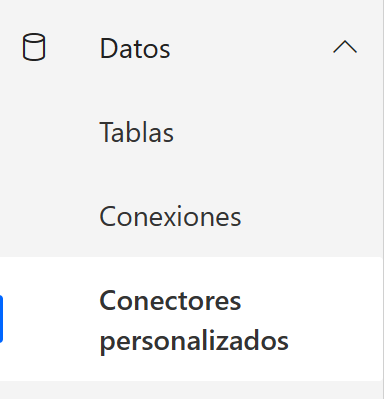

Una vez allí iremos a crear un nuevo conector personalizado y creamos
uno desde cero:

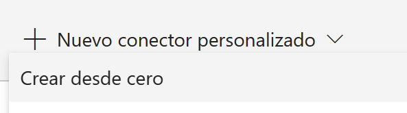

Le ponemos un nombre al conector y le damos continuar:

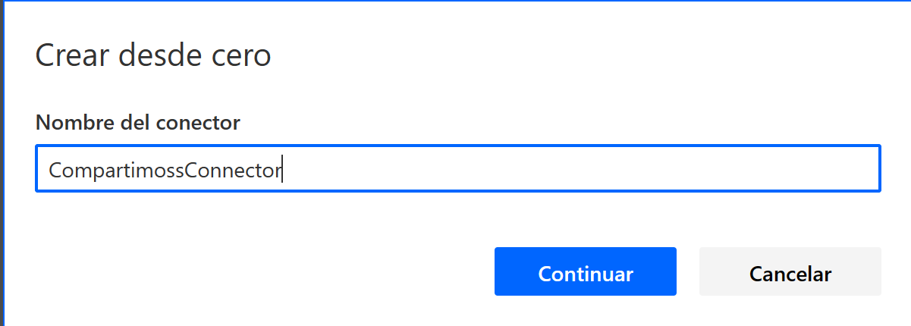

En esta parte de la creación del conector personalizado tendremos varias
secciones a rellenar con los datos de nuestro servicio web o API Rest en
Azure, por lo que vamos necesitar de diferente información de nuestra
Web Application y del registro de la misma en el Azure Active Directory.

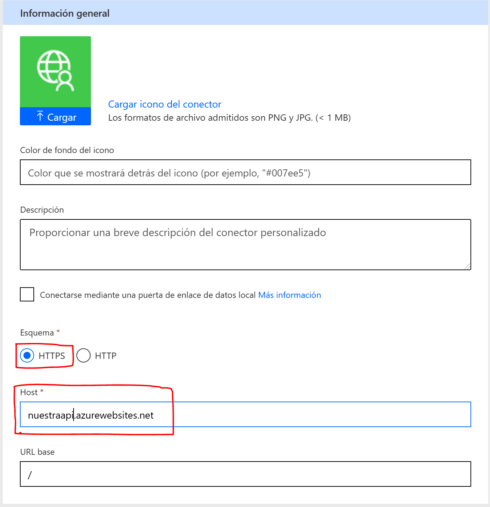

En esta sección los datos importantes son el esquema y el host, por lo
general el esquema debe ser HTTS y el host es el url de nuestro servicio
web en Azure. Una vez completada esta sección damos en 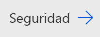 y continuamos con la siguiente sección.

En esta sección lo primero que debemos seleccionar es el tipo de
seguridad:

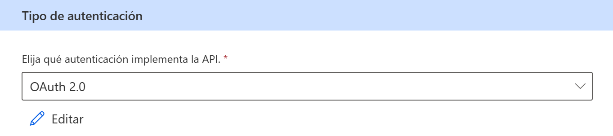

Seleccionamos OAuth 2.0 y nos aparecerá la siguiente pantalla:

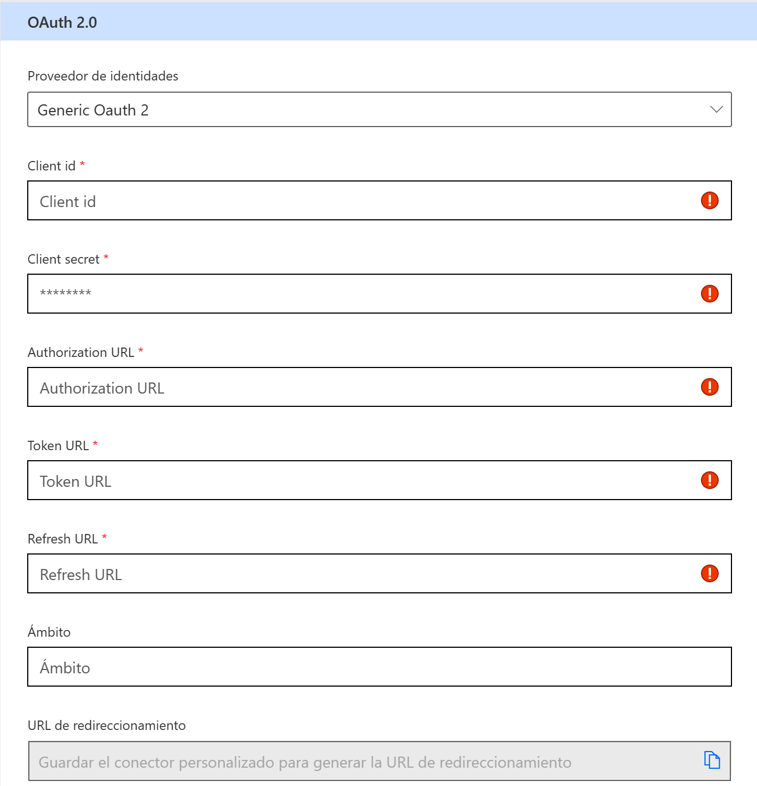

La información del Client id, Client Secret, Authorization URL, Refresh
URL, Token URL y Ámbito la obtenemos del registro de aplicación del
servicio web en el Azure Acitve Directory. Para llegar al registro de
aplicaciones ingresamos a al Azure Active Directory en la suscripción de
Microsoft Azure correspondiente y una vez allí vamos a "Registro de
aplicaciones"

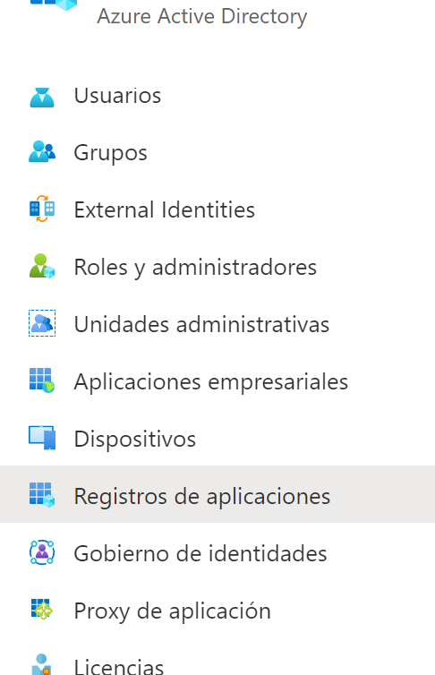

Ya en el detalle de nuestra aplicación obtenemos los datos
correspondientes:

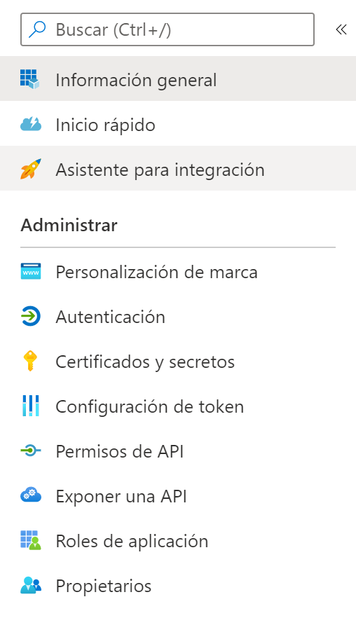

Ya cargados los datos pasamos a la definición haciendo clic en 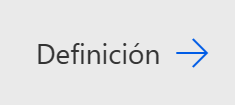

Aquí debemos definir todas las acciones que tendrá nuestro conector,
como ejemplo podría haber una acción por cada método de nuestra API.
Para agregar una nueva acción vamos a Acciones -> Nueva Acción

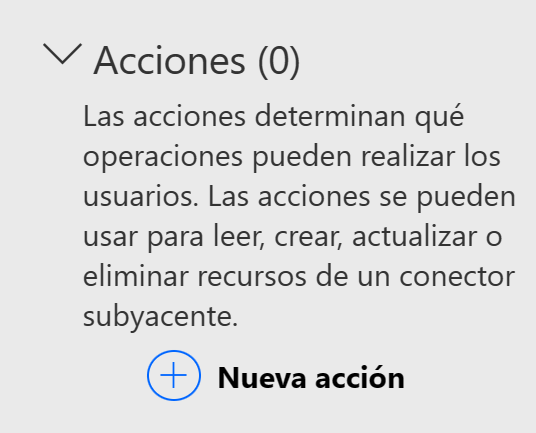

Debemos cargar el resumen, la descripción y el Identificador de nuestra
acción.

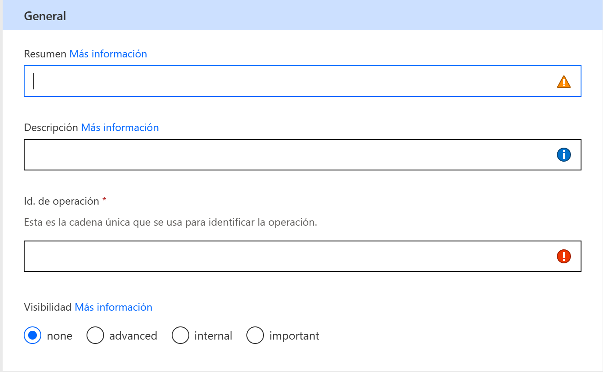

Luego vamos a crear la solicitud para esa operación.

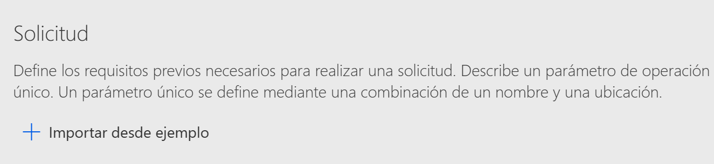

Luego vamos a importar desde ejemplo y le pegamos la llamada a nuestra
API. En este paso debemos seleccionar el verbo de la llamada "get","
post", "put", etc.

Si no necesita de un cuerpo particular pegamos la url y el propio
conector se encargará de crear el request y las variables si así las
identifica, si necesita un cuerpo debemos cargar un ejemplo del JSON
correspondiente.

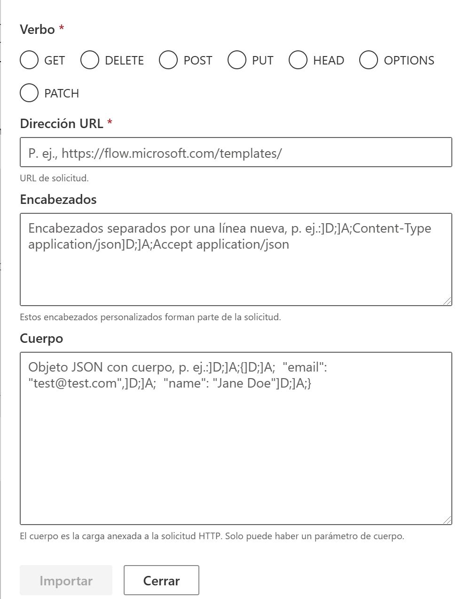

Luego de cargar todas las acciones que consideremos necesarias debemos
guardar y actualizar el conector. Podemos ir a la sección de probar
nuestro conector para validar que todo funcione correctamente.

Ya nuestro conector quedo listo, este aparecerá en los conectores
personalizados cuando estemos en el diseñador de flujos de Power
Automate y lo utilizaremos como un conector más dentro de nuestro flujo.
También se puede conectar a un servicio que este onPremise de la misma
manera utilizando onPremise data Gateway.

**Conclusiones**

Un conector personalizado nos permite organizar, encapsular y compartir
con otros colaboradores de la organización las llamadas a un servicio
web desde Power Automate o Power Apps.

**Alex Rostán**  
Microsoft Business Applications MVP  
AI & Smarts Applications/ Cloud Architect (Azure, O365, Power Platform)  
Mail: rostanker@msn.com  
Twitter: @rostanker  
LinkedIn: https://www.linkedin.com/in/alexrostan/   
 
import LayoutNumber from '../../../components/layout-article'
export default LayoutNumber
