En este artículo os voy a mostrar mis primeros pasos a la hora de
utilizar la nueva característica de Power Apps denominada **Custom Pages,** que está en Public Preview y que permitirá incorporar las
funcionalidades de las aplicaciones Canvas en las aplicaciones de tipo Model-driven.

Tal y como se anunció por Microsoft, las Páginas personalizadas
representan la convergencia entre las aplicaciones de lienzo y las de
modelo:

https://powerapps.microsoft.com/en-us/blog/custom-pages-for-converging-model-driven-apps-and-canvas-apps/

La verdad es que me ha encantado esta nueva característica para poder
incorporar en nuestras aplicaciones de modelo los componentes y las
funcionalidades de las aplicaciones de lienzo y, por tanto, poder
controlar completamente el diseño de esta parte de la aplicación.

Aquí os muestro los pasos que he dado para hacer una prueba de concepto
en la que he incorporado en una aplicación de modelo las funcionalidades
de leer y escribir datos en una lista de SharePoint.

**Prueba de Concepto**

En este caso, voy a partir de una aplicación de modelo totalmente nueva.
Para ello, desde la página de creación de aplicaciones de Power Apps
(https://make.powerapps.com/), seleccionaremos una nueva aplicación de
modelo y utilizaremos el "Diseñador de aplicaciones moderno (versión
preliminar)".

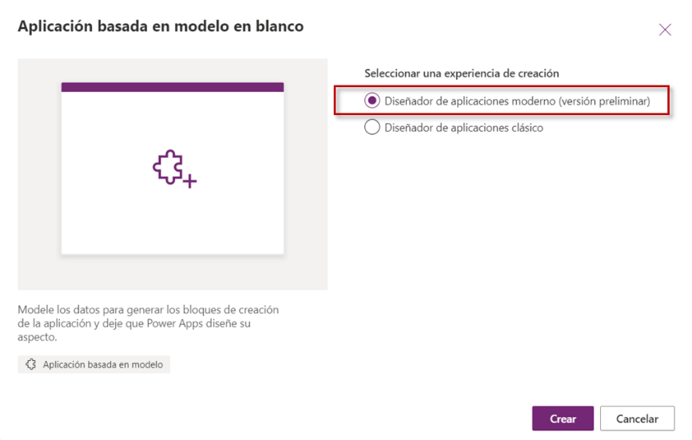

[NOTA]: Si lo que queréis es incorporar la Custom Page en una
aplicación de modelo ya creada, deberéis utilizar la opción de "Editar
en vista previa":

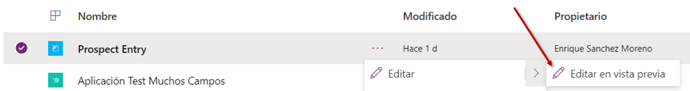

Una vez creada la aplicación de modelo, accedemos a la sección "Páginas" y pulsamos en la opción de "Agregar página".

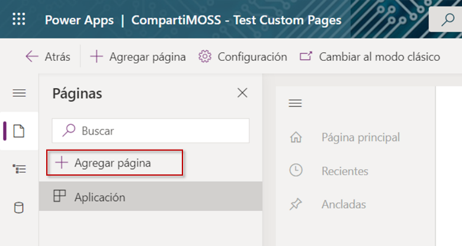

Ahora deberemos escoger la opción "Personalizado (vista preliminar)".

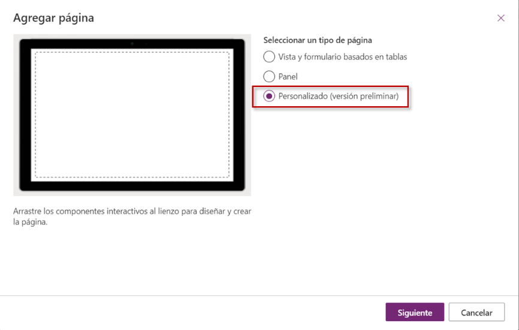

A continuación, marcaremos la opción "Crear una nueva página
personalizada" y asignaremos el nombre a la página.

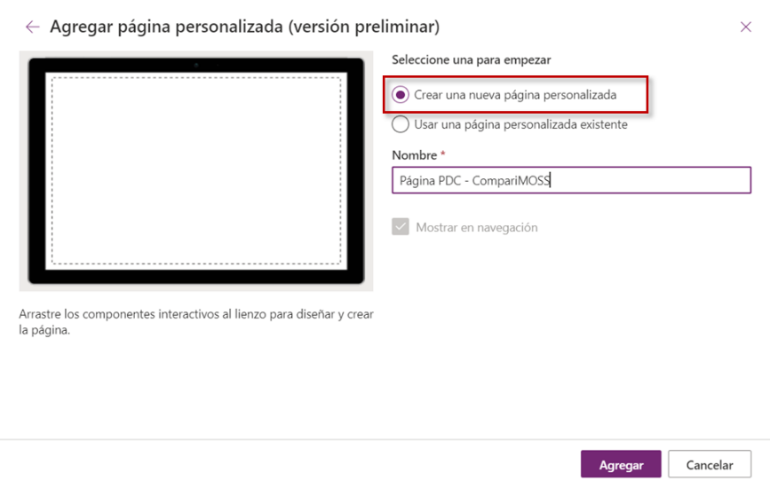

Tras pulsar el botón *Agregar*, se nos abrirá una nueva ventana con el
diseñador de aplicaciones de Power Apps con una pantalla en blanco lista
para ser editada. Si os fijáis en la parte superior izquierda, ya
podemos observar que estamos desarrollando una aplicación de tipo
Lienzo.

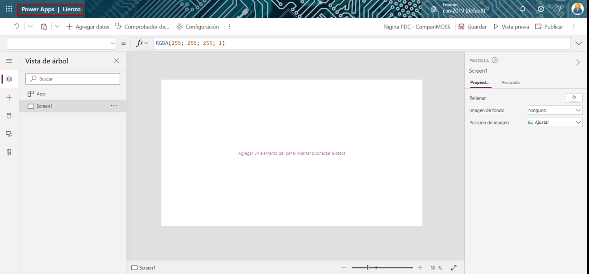

En la zona de Insertar (+) del menú de la izquierda, se observan todos
los componentes que podremos agregar a nuestra página personalizada de
la misma forma que en cualquier aplicación de lienzo. En el siguiente
apartado os mostraré las diferencias de componentes que he localizado en
esta sección. Para esta prueba de concepto, lo que he hecho es agregar
una conexión de SharePoint a una lista ubicada en una colección de
sitios (desde la opción de "Agregar datos") y después insertar en la
página (*Screen1*) la galería y el formulario correspondiente para la
gestión de los elementos de esta lista:

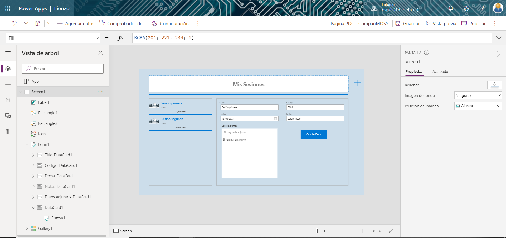

Una vez concluidas la edición de la página deberemos pulsar en los
botones Guardar y en Publicar que están ubicados en la parte superior
derecha de la pantalla. Después de hacerlo, ya podemos cerrar esta
ventana y volver a la ventana de nuestra aplicación de modelo. Cuando
vayamos a ella, nos mostrará un error indicando que no se ha encontrado
la página:

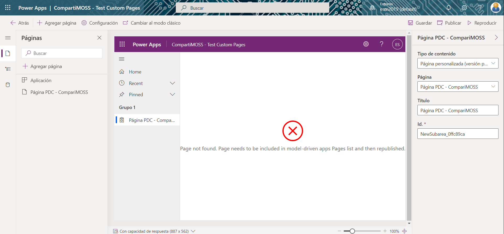

Lo que debemos hacer es Guardar nuestra aplicación de modelo y pulsar en
Publicar. Si volvemos a acceder a nuestra aplicación, podremos pulsar en
el botón Reproducir y se nos mostrará nuestra aplicación de modelo según
la visualizarían los usuarios. Ahí podremos observar que la página
personalizada ubicada en el menú de la izquierda bajo el epígrafe Grupo
1 ya que no hemos modificado nada en la navegación que la aplicación
trae por defecto:

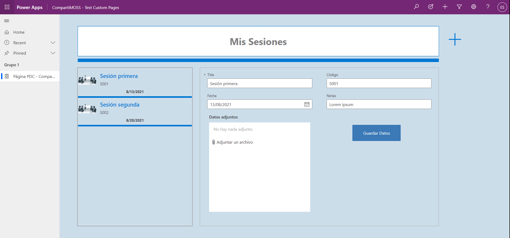

Por tanto, ahora nuestra aplicación de modelo no sólo podrá gestionar
los datos de nuestro Dataverse, sino que podremos también consumir y
alimentar orígenes de datos diferentes y con una apariencia totalmente
personalizada.

[NOTA]: Aseguraos de tener habilitadas las cookies para que
funcione. En caso contrario, os encontraréis un error como este:

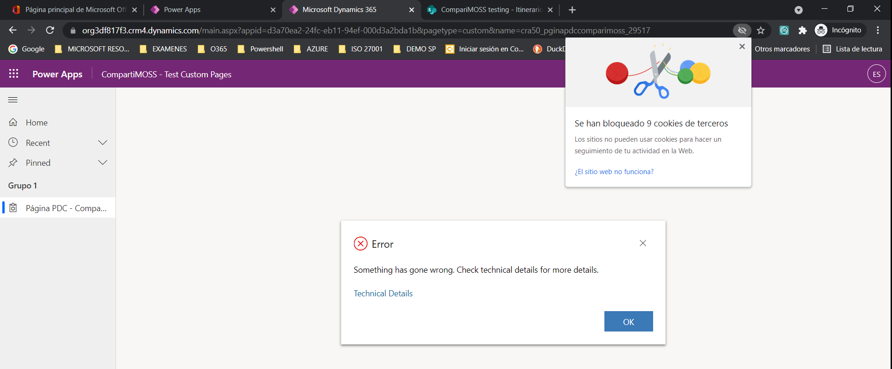

Si lo que queréis es modificar la página personalizada que hayáis creado
previamente, deberéis seleccionar la opción Editar que aparece junto a
la página en el apartado de *Páginas* del editor moderno de
aplicaciones. Al pulsarlo, accederéis de nuevo al editor de lienzo de
Power Apps.

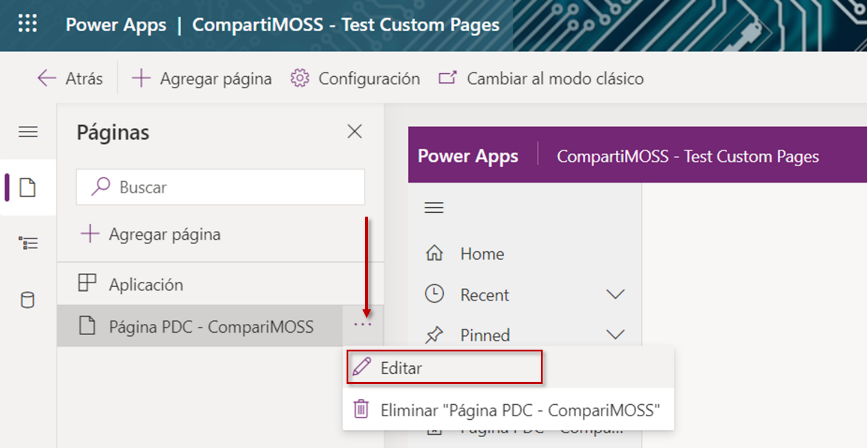

[NOTA]: Una vez realizadas las modificaciones, aseguraos de Guardar
y Publicar los cambios tanto en la Custom Page, [como en la aplicación
de Modelo].

**Diferencias entre Custom Pages y Canvas Apps**

A continuación, os indico algunas de los aspectos que he visto
diferentes entre una aplicación Canvas propiamente dicha y la página
personalizada (Custom page):
 

-   **Interfaz**: Para empezar, observaréis que la interfaz es
    ligeramente diferente ya que no tenemos la misma cinta de opciones
    (ribbon) de la parte superior de la página de desarrollo.

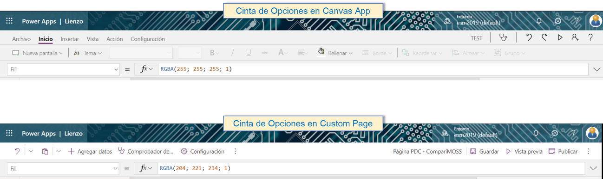

-   **Número de pantallas**: en las Custom Pages sólo podremos agregar
    una pantalla por página, mientras que en las aplicaciones Canvas
    podemos agregar todas las que necesitemos y navegar entre ellas.
    Podéis ver que incluso la opción de duplicar pantalla de la vista de
    árbol no aparece en las Custom Pages cuando pulsamos el botón
    derecho sobre la página.

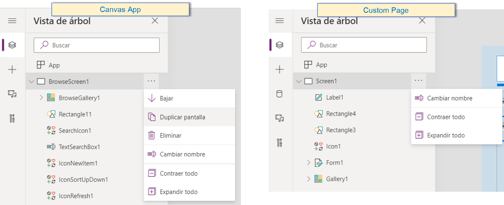

-   **Componentes estándar**: A la hora de insertar los componentes que
    vienen por defecto en Power Apps, se observa que en las Custom Pages
    no están disponibles todos los que hay en las aplicaciones de
    lienzo. Os dejo una comparativa de los componentes que he analizado
    entre los que me aparecen en mi tenant (los que aparecen entre
    paréntesis son porque tienen un nombre diferente):

  -----------------------------------------------------------------------
 | Canvas                                 | Custom Page
 | ---------------------------------------| -------------------------------
 | ENTRADA                                | 
|  Botón                                  | NO
|  Entrada de texto                       | SI (Cuadro de texto)
|  Entrada manuscrita                     | NO
|  Lista desplegable                      | NO
|  Cuadro combinado                       | SI
|  Selector de fecha                      | SI
|  Cuadro de lista                        | NO
|  Casilla                                | SI
|  Botón de selección                     | SI (Grupo de botones de opción)
|  Alternar                               | SI (Alternancia)
|  Control deslizante                     | SI
|  Clasificación                          | SI
|  Temporizador                           | NO
|  Formulario de edición                  | SI
|  Formulario de presentación             | SI
|  Editor de texto enriquecido            | SI
|  Entrada de dirección                   | NO
|  MOSTRAR                                | 
|  Etiqueta de texto                      | SI (Etiqueta)
|  Texto HTML                             | NO
|  Encuesta de Forms Pro (versión preliminar)         | NO                       
|  DISEÑO                                 | 
|  Galería vertical                       | SI
|  Galería horizontal                     | SI
|  Galería de altura flexible             | SI
|  Galería vertical en blanco             | SI
|  Galería horizontal en blanco           | SI
|  Galería de altura flexible en blanco   | SI
|  Tabla de datos (versión preliminar)    | NO
|  Contenedor horizontal                  | SI
|  Contenedor vertical                    | SI
|  Contenedor                             | SI
|  MULTIMEDIA                             | 
|  Imagen                                 | SI
|  Cámara                                 | NO
|  Escáner de código de barras            | NO
|  Vídeo                                  | NO
|  Microsoft Stream                       | NO
|  Audio                                  | NO
|  Micrófono                              | NO
|  Agregar imagen                         | NO
|  Importar                               | NO
|  Exportar                               | NO
|  Visor de PDF (experimental)            | NO
|  Mapa                                   | NO
| Ver en 3D                              | NO
|  FORMAS                                 | 
|  Flecha atrás                           | SI
|  Flecha siguiente                       | SI
|  Círculo                                | SI
|  Círculo de un cuarto                   | SI
|  Semicírculo                            | SI
|  Círculo de tres cuartos                | SI
|  Rectángulo                             | SI
|  Triángulo                              | SI
|  Triángulo rectángulo                   | SI
|  Pentágono                              | SI
|  Octágono                               | SI
| Estrella de 5 puntas                   | SI
|  Estrella de 6 puntas                   | SI
|  Estrella de 8 puntas                   | SI
| Estrella de 12 puntas                  | SI
|  GRÁFICOS                               | 
|  Gráfico de columnas                    | NO
|  Gráfico de líneas                      | NO
|  Gráfico circular                       | NO
|  Icono de Power BI                      | NO
|  AI BUILDER                             | 
|  Lector de tarjetas de presentación     | NO
|  Procesador de recibos                  | NO
|  Procesador de formularios              | NO
|  Detector de objetos                    | NO
|  Reconocedor de texto                   | NO
|  MIXED REALITY                          | 
|  Ver en MR                              | NO
|  Ver forma en MR                        | NO
 | Medir en MR                            | NO
 | -----------------------------------------------------------------------

 

Sin embargo, he visto que, a la hora de agregar componentes a medida, en
las Custom Pages se permite agregar componentes de biblioteca y
componentes de código de la misma forma que en las Canvas apps. Esta es
sólo mi primera aproximación a las Custom Pages, por lo que, seguro que
se me ha escapado alguna diferencia más.

De momento, como comentaba al inicio del artículo, me ha parecido una
gran característica que permitirá a los desarrolladores de Model-driven
apps tener un apartado dentro de su aplicación donde incorporar las
funcionalidades de las aplicaciones Canvas.

 

Espero que os sea de utilidad este artículo.

 

Un saludo.

**Enrique Sánchez Moreno**  
Cloud Services Manager en ILUNION IT Services  
[www.esanchezm.com](http://www.esanchezm.com) 
 
import LayoutNumber from '../../../components/layout-article'
export default LayoutNumber
