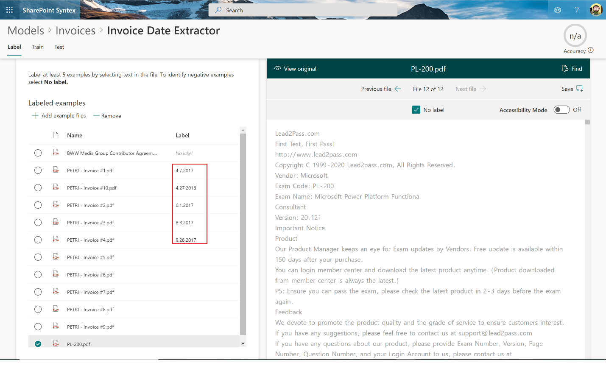

Como seguramente sabréis, [SharePoint Syntex](https://techcommunity.microsoft.com/t5/project-cortex-blog/announcing-sharepoint-syntex/ba-p/1681139)
es el primer producto generado por Microsoft como parte de la iniciativa
conocida inicialmente como Microsoft Content Services. SharePoint
Syntex, disponible como Add-On que se puede añadir en cualquier plan de
Microsoft 365, utiliza Machine Teaching y Modelos de Inteligencia
Artificial integrados en SharePoint Online para de forma automática
capturar, reconocer y extraer información clave que asegure que
cualquier documento que se cargue en una biblioteca de documentos se
almacena y clasifica de forma correcta. Además, es posible configurar
los Modelos de AI (o Document Understanding Models) para que se apliquen
etiquetas de retención o etiquetas de sensibilidad a los documentos que
se procesen.

Para evaluar SharePoint Syntex sin coste o tener que configurar una
Trial, Microsoft proporciona una plantilla de Sitio denominada Content
Center que nos permite evaluar cómo crear, entrenar y administrar los
Modelos de AI. Lo que no permite esta plantilla es que los modelos
creados se puedan aplicar posteriormente a bibliotecas de documentos de
nuestro tenant y ser ejecutados contra archivos cargados.

En este artículo vamos a ver cómo usar la plantilla de Syntex Content
Center para probar las capacidades de SharePoint Syntex como paso previo
a adquirir el producto.

**Creando un Syntex Content Center**

El primer paso para poder probar SharePoint Syntex pasa por crear un
Sitio haciendo uso de la plantilla indicada. Para tener disponible dicha
plantilla no hay que realizar configuración alguna y tiene que aparecer
como disponible en la categoría "Other options" cuando creamos un Sitio
desde el Admin Center de SharePoint.

Tras proporcionar los datos básicos para crear el Sitio y hacer clic en
Finish, este es el resultado que obtendremos. Respecto al Content
center:

-   Recomiendo hacer uso del Tour guiado de cómo crear un Document
    understanding model en el Content center.

-   Como se indica en el banner en la parte superior del Sitio, estamos
    accediendo a una versión limitada de las funcionalidades de Syntex.

**Creando y entrenando un Document understanding model**

Para probar las prestaciones de SharePoint Syntex, vamos a crear en
primer lugar un Document understanding model:

-   Hacemos clic en New -> Document understanding model de forma que se
    abre un panel en el que indicaremos las siguientes configuraciones:

    -   Nombre del modelo.

    -   Descripción del modelo.

    -   Si se creará un Tipo de contenido nuevo a partir del modelo o
        bien utilizaremos uno existente. Ni que decir tiene que como
        Consultores de Gestión documental es en este punto donde tenemos
        mucho que aportar trabajando previamente con nuestro cliente en
        el modelado de los Tipos documentales a utilizar para la
        clasificación de información.

    -   Opcionalmente, la etiqueta de retención que se desee aplicar al
        contenido procesado.

-   Hacemos clic en "Create" para crear el modelo. El proceso de
    creación es "pesado" y tardará unos minutos en estar listo, con lo
    que paciencia

Una vez creado el Document undestanding model, aterrizaremos en la
página en la que comenzar a entrenar el modelo creado. De nuevo,
recomendable seguir inicialmente las ayudas que se muestran para
facilitarnos trabajar con SharePoint Syntex.

**Configurando y entrenando el Document understanding model**

Una vez que el modelo está creado, lo siguiente que tenemos que hacer es
configurarlo y sobre todo entrenarlo para que identifique los documentos
a procesar (en este caso Facturas) y extraiga información de estos:

-   Comenzaremos añadiendo un mínimo de 5 documentos del tipo a procesar
    a través de la opción "Add files" en el tile "Add example files". En
    ese conjunto de archivos se recomienda añadir uno que sea diferente
    para facilitar el entrenamiento del modelo.

> Seleccionamos los archivos que queremos utilizar y en la ventana de
> carga de los archivos hacemos click en el botón "Add".

-   Una vez añadidos los archivos, el entrenamiento del modelo consiste
    en identificar por un lado muestras positivas que coinciden con el
    tipo de documentos a identificar y procesar; y por otro, muestras
    negativas de documentos que no coinciden con el tipo de documento a
    identificar y procesar. Para ello, haremos clic en "Train
    classifier" en el tile "Classify files and run training":

> Por cada archivo, tendremos que indicar (etiquetar) cuál es una
> muestra positiva y cuál no lo es.

> Repetiremos el proceso por cada archivo de manera que al final
> tengamos las muestras positivas y negativas claramente definidas:

-   Con las muestras etiquetadas, lo siguiente que tenemos que hacer es
    entrenar el modelo. Para ello, hacemos clic en la pestaña "Train"
    donde tendremos que añadir las explicaciones y tokens necesarios
    para que el modelo pueda identificar y clasificar los documentos.
    Una explicación:

    -   Se puede crear desde cero o bien a partir de una de las
        plantillas proporcionadas.

    -   Puede ser de tipo "Phrase list" (Palabras, Frases, Números u
        otros caracteres que permitan identificar el documento) o bien
        de tipo "Proximity" (Indicando como de próximas están dos
        explicaciones entre sí en cuanto a número de Tokens).

> En cuanto a los Token, se definen como un conjunto continuo de
> caracteres (números o letras) sin incluir espacios o símbolos de
> puntuación que se ubican entre dos explicaciones. Por ejemplo, un
> patrón de tipo número de una dirección va a continuación del nombre de
> la calle sin que haya ningún token de por medio.

> Por ejemplo, para definir una explicación que identifique una fecha en
> una factura podremos crear una explicación desde cero de tipo Phrase
> list y a continuación seleccionar el patrón de aplicación.

> Incluso en las configuraciones avanzadas de la explicación podremos
> indicar aspectos como la posición de inicio y de fin donde encontrar
> la fecha y los patrones de identificación a utilizar.

> Con las explicaciones añadidas, ya estamos en condiciones de entrenar
> el modelo haciendo clic en el botón "Train Model", de manera que en la
> sección "Trained files" veremos que la columna Evaluation tiene un
> valor de Match.

-   Una vez entrenado el modelo, ya estamos en condición de testearlo a
    través de la pestaña Test en la que tendremos que cargar archivos de
    ejemplo para probar el modelo. En mi caso, he añadido documentos de
    tipo factura diferentes a los usados para entrenar el modelo:

> Por cada archivo cargado, el modelo entra en acción y podremos ver si
> se identifica como una muestra positiva o negativa y el porcentaje de
> exactitud.

**Extrayendo información con un Document understanding model**

Un Document understanding model de SharePoint Syntex no solo permite
identificar documentos a partir de etiquetar estos, añadir explicaciones
y entrenarlo, sino que también permite extraer información de estos que
luego se pueda usar para su clasificación. La información que extraen un
Document understanding model se basa en definir Entity extractors:

-   Desde la página de detalle del modelo, hacemos clic en "Create
    extractor" de manera que se abre un panel en el que indicar el
    nombre del extractor y luego si queremos crear una columna de sitio
    nueva o hacer uso de una existente.

-   A continuación, tendremos que seguir un proceso similar al de
    identificación de muestras positivas y negativas de documentos, pero
    en este caso para identificar el Entity extractor en cada uno de los
    archivos disponibles. En los archivos que sean muestras negativas,
    seleccionaremos el check "No label".

> Conforme vayamos etiquetando archivos, en la columna "Label" se irán
> mostrando los valore etiquetados.

-   El siguiente paso consiste en entrenar el Modelo para que pueda
    extraer la información y de nuevo tendremos que crear las
    correspondientes explicaciones siguiendo la aproximación descrita
    para identificar los archivos. Si todo va correcto, cuando hagamos
    clic en Train Model veremos el resultado y si es capaz de extraer la
    información.

-   Finalmente, podremos testear de nuevo el modelo con el extractor
    definido.

**Conclusiones**

Si queremos probar cómo crear, configurar, entrenar y administrar los
Document understanding model de SharePoint Syntex sin necesidad de
adquirir el producto o bien de crearnos un trial, podemos hacer uso de
la plantilla de sitio de Content Center que permite disponer de Syntex
completamente funcional, aunque sin la posibilidad de aplicar loso
modelos creados y entrenados en bibliotecas de documentos del tenant de
SharePoint.

**Juan Carlos González**  
MVP Office Apps & Services  
M365 SME & Deliver Manager, RICOH España S.L.U  
@jcgm1978