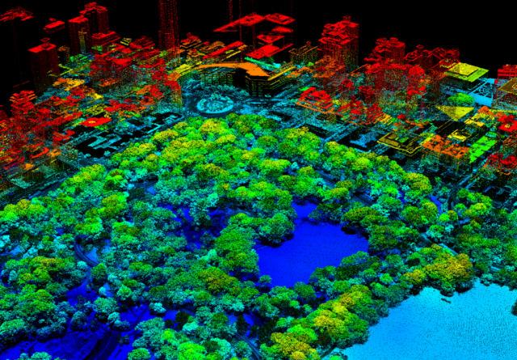
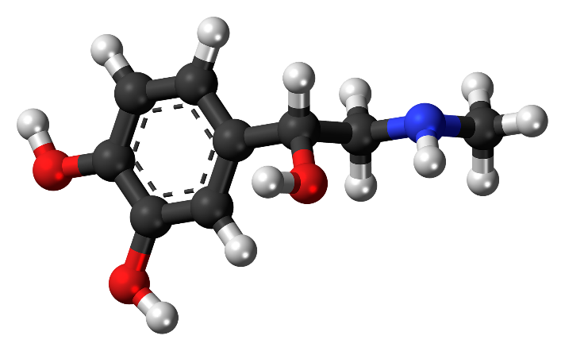
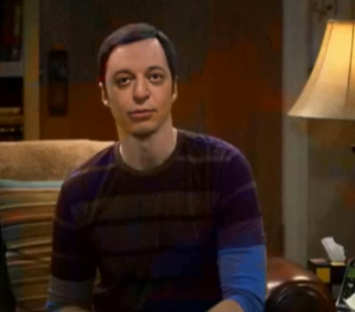
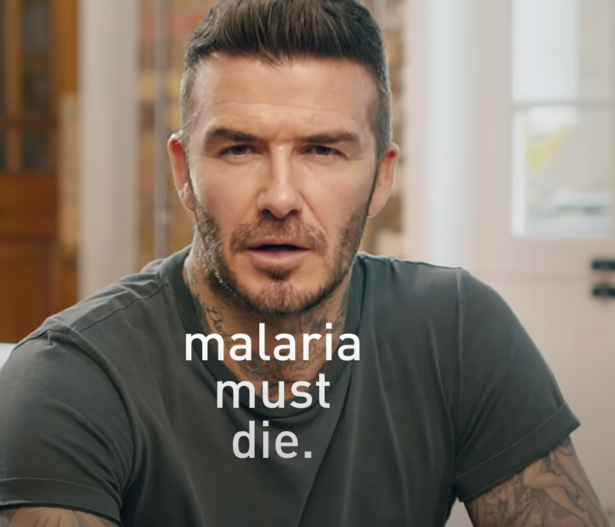
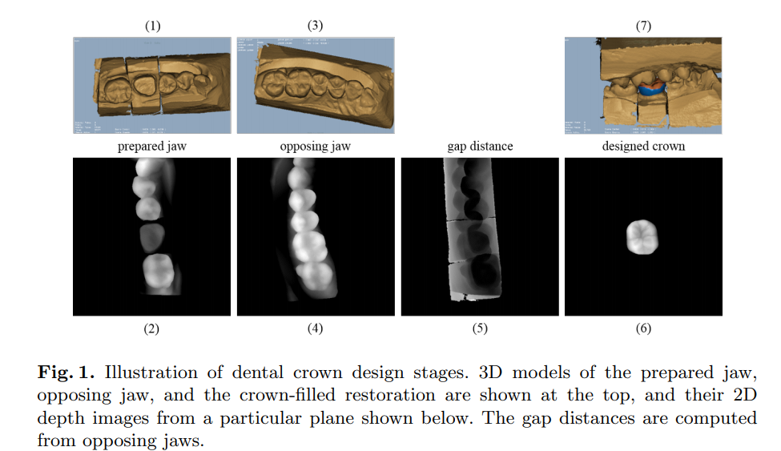

Tal como comentaba en la edición anterior quiero comentar algunos
ejemplos de aplicación práctica de las GAN's y todos los tipos derivados
que de ahí nacieron, por lo que lo mejor es ir al grano.

**Generando las bases**

Me encontraba hace un tiempo con un problema en una empresa del sector
energía que en realidad aplica a cualquier sector: la necesidad de
entrenar modelos de AI para reconocimiento y/o detección de determinada
cosa, pero en donde se carece de un número aceptable de imágenes de
ejemplo para realizar el entrenamiento del modelo. En este caso en
concreto hablábamos de invasión vegetal y más concretamente en la
necesidad de contar con imágenes de vegetación "trepando" por torres de
transmisión o invadiendo subestaciones. En la primera impresión este
puede parecer un problema trivial, "detectar plantas en una torre
eléctrica no puede ser tan complicado" y puedo estar parcialmente de
acuerdo, pero el problema real es que no tenemos una buena cantidad de
ejemplos para entrenar nuestro modelo. Cuando digo ejemplos hablo de
todos los tipos de invasión que te puedes encontrar, desde plantas
trepadoras hasta simples arbustos, y en todas las posibles casuísticas:
en torres (hay muchos tipos de torres distintas), en subestaciones, en
plantas de transformación, en transmisión de gas, etc. Hay una buena
forma de obtener estos ejemplos: sal ahí fuera y empieza a fotografiar
todas las invasiones vegetales que esta empresa tenía en la actualidad.
El problema de hacer eso no sólo es el coste de fotografiar con buena
calidad y desde varios ángulos, la invasión vegetal que nos podemos
encontrar en las torres de transmisión y en las subestaciones en España,
sino que la empresa cuenta con infraestructura en todo el planeta, por
lo que la invasión vegetal de Cantabria no es del mismo tipo que la del
Amazonas Central.

La solución que encontramos fue finalmente partir de un número finito de
imágenes iniciales (no llegaban a 1.500 imágenes) y utilizarlas para
generar nuevas imágenes falsas o *sintéticas* como me gusta llamarlas,
pero de tan buena calidad y bien hechas que un ojo experto no fuera
capaz de saber si determinada imagen era real o era sintética. Y eso fue
lo que hicimos, luego de muchas horas de computación llegamos a tener
miles de imágenes sintéticas que lograban "engañar" al experto. No es
una tarea trivial, tienes que hacer mucha corrección ya que no solo
hablas de la vegetación en sí misma sino también del entorno. Una vez
que tienes ese banco de imágenes base (las habíamos multiplicado hasta
las 180.000) ya estamos en capacidad de entrenar un modelo correcto de
detección, que sabemos que tendrá un acierto superior al 95% de certeza
que es lo que buscábamos. Finalmente, este modelo es utilizado para
evaluar imágenes captadas por drones, que vuelan automáticamente y
emiten alertas en los que la invasión vegetal empieza a ser lo
suficientemente importante como para requerir intervención humana.

 Este mismo modus operandi de generar
imágenes de ejemplo, falsas pero creíbles, para entrenar un modelo
posterior tiene múltiples aplicaciones que siempre tendrá un coste menor
que intentar hacerte con el banco de imágenes de forma real. Imagina su
aplicación para detección de personas, coches, paisajes, arte,
vestimenta, etc.

**Ampliando el campo**

Lo que te contaba antes no sólo aplica a imágenes. Podría hacer lo mismo
para un "estilo" de cosas. Como comentaba en la primera parte de este
artículo, podemos utilizar redes GAN no sólo para generar un resultado
final determinado, sino un estilo final. Con esto me refiero a que
generar el cuadro de Monet que tu quieras partiendo de una foto que
tienes en el móvil, algo como esto:

Esto mismo, pero con caricaturas, o estilos de comic, lo están haciendo
cientos de aplicaciones móviles que te puedes descargar gratuitamente de
la web: te haces un selfie y te caricaturiza inmediatamente... pues es
una aplicación de GAN más grande que una casa, así de simple.

**Una aplicación muy prometedora**

Cuando hablamos de inteligencia artificial orientada a la medicina, por
razones obvias, hay que ser muy cuidadosos antes de avanzar resultados.
Se dice muy rápido pero ¿no seria ideal encontrar una molécula, léase
por ende "un medicamento", que cure determinada cosa? Si es verdad que
se dice rápido, especialmente cuando investigas un poco y te encuentras
que una base de datos de posibles moléculas supera los 72 millones de
entradas pero eso son solo las moléculas más identificadas. Pero eso no
es todo, en realidad el número puede llegar a 10^200^ (10 a la 200
potencia). Pero eso sigue sin serlo todo, porque ahora para cada uno de
los casos o moléculas deberíamos investigar si impacta en la enfermedad
que queremos curar, y un pequeño detalle: si cura la enfermedad debe
preservar al huésped, porque una cura que mata al humano no tiene
sentido.

Y aquí es donde entran las redes GAN:
utilizarlas para generar juegos de moléculas que sabemos que deben tener
ciertas propiedades, y una vez que las encontremos serán solamente esos
juegos los que vamos a investigar con el objetivo de revisar si curan
determinada enfermedad. Con este punto en concreto no se han hecho
cálculos, pero se estima descartar más del 99% de las moléculas que NO
sirven para curar determinada cosa, y ¡el 99% de 10 a la 200 potencia es
mucho!

Hay que dejar claro que no se está buscando la cura o la llave milagrosa
para cualquier enfermedad, ya que no poseemos todavía el conocimiento
sobre lo que hay que buscar y qué es lo que cura y lo que no. Pero donde
sí aporta esta tecnología es en el refinamiento de los millones de
millones de combinaciones que podrían, o no, aportar algo. Por ahora el
uso de las redes GAN para la búsqueda de moléculas que curen determinada
enfermedad no es la solución definitiva, pero sí es un facilitador que
nos permite centrar mejor el tiro.

Encontrarás muchos más detalles de estos estudios, así como información
sobre los primeros resultados en
[https://pubs.acs.org/doi/10.1021/acs.molpharmaceut.7b01134#](https://pubs.acs.org/doi/10.1021/acs.molpharmaceut.7b01134)

**Los famosos DeepFakes**

Es muy probable que hayas visto el discurso de Barak Obama que nunca
impartió (<https://www.youtube.com/watch?v=cQ54GDm1eL0>) pero ¿sabías
que los DeepFakes están basados en realidad en redes GAN?.

Haciendo referencia al funcionamiento de las GAN's, recuerda aquello de
que el generador intentará siempre engañar al discriminador para que
este último no logre saber si una imagen es real o no, y como ya
comentamos la perfección del engaño es cuestión de tiempo y
entrenamiento del algoritmo. Pues eso son los DeepFakes: con el tiempo
de computación suficiente podríamos incorporar cualquier elemento a
cualquier video como si fuese parte

Si quieres ver uno de esos resultados, te adjunto un DeepFake propio
sobre una de las secuencias más conocidas de la serie The Big Bang
Theory, donde Sheldon explica el juego de *Piedra, Papel, Tijera,
Lagarto, Spock* y te invito a que visites una sesión que preparé para el
Global Azure 2021 que encontrarás en <https://youtu.be/p-CA_mOYIxI>

El debate está abierto sobre el uso de la tecnología para estos casos, y
me he encontrado muchos detractores y defensores con buenos argumentos
que defienden su punto de vista, pero no es el objetivo de este
artículo. Creo que todos coincidimos en lo curioso del resultado, por lo
menos desde un punto de vista de marketing, el video de Lola Flores y
Cruzcampo (<https://youtu.be/ir2GDC1Xo7A>) u otro más reciente en el que
el museo Reina Sofía revive a Salvador Dalí
(<https://youtu.be/u-buLnhtlxA>)

En cualquiera de los ejemplos que te he mencionado anteriormente el
funcionamiento es el mismo: se graba el video y sonido de lo que se
quiere incrustar y se procesa mediante herramientas (DeepFaceLab por
ejemplo) hasta lograr que su incorporación al video original quede con
la calidad suficiente como para que no seamos capaces de detectarla a
simple vista.

**Corrigiendo las voces sintéticas**

Otra de las grandes aplicaciones que han
tenido las GAN's es aportando mejoras a los modelos de voz,
completamente sintéticos, donde la mejora viene dada por el agregado de
tonos y pronunciaciones específicas difíciles de lograr de otra forma.

Desde el punto de vista de marketing los resultados son obvios, y
recuerdo el vídeo de David Beckham hablando 9 idiomas generado por la
gente de Synthesia (<https://youtu.be/QiiSAvKJIHo>). Pero no quiero
quedarme solamente ahí: todo lo que estamos viendo como avances en Azure
Custom Neural Voices está apoyado realmente en las bases de GAN y
ejemplos reales de Microsoft como los que puedes encontrar
<https://youtu.be/p4sknif1zJc> hacen que hoy mismo sea muy difícil
reconocer si la voz que oyes es real o sintética.

**Más y más usos**

Finalizo este artículo dejando tu mente abierta en las posibles
aplicaciones de las redes GAN, que no solo pasan por los ejemplos que te
he contado sino que ya tienen serias investigaciones y aplicaciones en
sectores de actividad tan dispares como el Transporte (predicción de
accidentes en base a comportamiento de vehículos), el Deporte (ya se
están aplicando en el football, carreras de motos y coches) o el Consumo
(predicción de gustos de moda basado en historial anterior). Hasta
ayudar y acelerar el proceso de construcción de dientes de reemplazo:

**Javier Menendez Pallo**  
Azure MVP