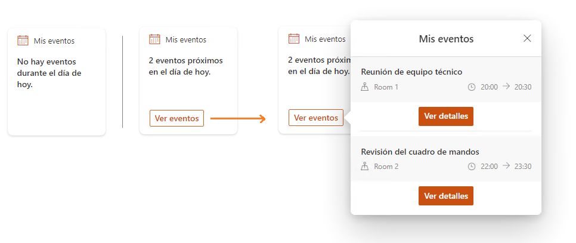

Con la llegada de la última versión de SPFx (SharePoint Framework 1.13),
aparece un nuevo tipo de componente, las Adaptive Card Extensions, que
nos permitirán extender el modelo de dashboards y páginas de Viva
Connections. El concepto que utiliza este nuevo componente es el mismo
que veníamos utilizando hasta ahora con las Adaptive Cards, es decir,
diferentes diseños visuales fáciles de crear a través de JSON
(<https://adaptivecards.io>) y una lógica de negocio, bajo SPFx.

En este articulo vamos a crear una nueva extensión que se encargará de
traer las próximas reuniones de nuestro calendario a través de
@PnP/Graph y mostrará esos datos mediante un diseño simple de Adaptive
Card.

**¿Cómo empezamos?**

En mi caso utilizaré Visual Studio Code, junto con la versión 1.13 de
SPFx ([detalles de cómo preparar un entorno de desarrollo de
SPFx](https://docs.microsoft.com/en-us/sharepoint/dev/spfx/set-up-your-development-environment)).
Crearemos un proyecto utilizando el mismo comando que veníamos
utilizando hasta ahora: "yo @microsoft/sharepoint" y a continuación
tendremos que pasar por el asistente de creación seleccionando en cada
paso las siguientes opciones:

Utilizaremos el nuevo tipo de componente y la plantilla de "Basic Card
Template".

Obtendremos una estructura muy familiar si estamos acostumbrados a
trabajar con las anteriores versiones de SPFx.

Por defecto, tendremos una nueva extensión con visualización y lógica de
ejemplo.

**¿Cómo visualizamos el componente?**

A partir de la versión 1.13 de SPFx el Workbench local ya no estará
disponible, por lo tanto, debemos configurar nuestro proyecto para
lanzar siempre el Workbench alojado en SharePoint Online. Para ello
debemos ir a la carpeta "config->serve.json" y modificar el parámetro
"initialPage" con la URL de nuestro tenant.

Después de realizar esta acción, debemos lanzar el comando "gulp
trust-dev-cert" y confirmar la comprobación de confianza en el
certificado de desarrollo.

Finalmente, para lanzar nuestro proyecto, usamos "gulpe serve" y
automáticamente se abrirá el Workbench y podemos añadir la nueva
extensión de adaptive cards a la página.

Los cambios realizados en el código TypeScript o en la plantilla json,
se verán reflejados sobre la marcha, solamente guardando los ficheros
modificados.

**¿Cómo cambiamos el diseño?**

Debemos diferenciar dos partes en cuanto al diseño:

1.  **La vista de tarjeta** (CardView -> controlado en el fichero
    CardView.ts): objeto gráfico inicial que nuestro componente pintará
    en pantalla.

2.  **La vista rápida o detalles** (QuickView -> controlado en los
    ficheros QuickView.ts y QuickViewTemplate.json ): objeto gráfico que
    se pintará bajo demanda al interactuar con la tarjeta inicial.

Dentro de nuestro proyecto tendremos una carpeta llamada "quickView"
donde estarán tanto el json para la adaptive card
(QuickViewTemplate.json), como la parte de enlace con los datos
(QuickView.ts). La plantilla json que vamos a utilizar tiene este
formato: [enlace a
GitHub](https://github.com/cdragosf/SPFx-ACEs/blob/master/src/adaptiveCardExtensions/agenda/quickView/template/QuickViewTemplate.json)

**¿Cómo recuperamos los datos?**

Dentro de la parte de negocio de nuestro proyecto debemos recuperar los
datos del calendario mediante "@pnp/graph" y exponer estos datos a
través del estado del componente hacia la plantilla json. Para ello
necesitamos crear un método que se encargue de recuperar los datos desde
Microsoft Graph:

Dentro del fichero principal de nuestra extensión
(AgendaAdaptiveCardExtension.ts) tenemos el método OnInit donde podre
llamar al método que recupera los eventos del calendario y
posteriormente guardamos estos eventos en el estado del componente.

Podemos utilizar la misma nomenclatura que veníamos usando hasta ahora
con "this.setState({...})" en las soluciones de SPFx, definiendo
previamente la interfaz que utilizará el estado del componente.

**¿Cómo pintamos los datos mediante la plantilla json?**

Una vez recuperados los eventos del calendario y guardados en el estado
del componente, solo nos falta pintar esos resultados mediante la
plantilla de adaptive card.

Por un lado, podemos controlar la **vista de la tarjeta** (CardView)
mediante el fichero "CardView.ts", donde podemos controlar la
visualización del título, descripción y botones de manera dinámica:

Por otro lado, la **vista rápida** (QuickView) la podemos controlar
mediante la plantilla json creada anteriormente, de manera dinámica
utilizando la siguiente nomenclatura:

Al igual que en la vista rápida, el enlace de los datos lo realizamos a
través del método "data()" dentro del fichero "QuickView.ts". En
este caso recuperamos los datos del estado:

**¿Y el resultado final?**

Lanzamos el comando "gulp serve", añadimos el componente al Workbench
y voila, nuestra primera personalización de Viva Connections mediante
Adaptive Card Extensions:

Tenemos muchas posibilidades en cuanto a los formatos y diseños de las
tarjetas; textos dinámicos, botones que cambian de color o estado según
lógica de negocio, contenido compuesto por imágenes, videos, texto,
carruseles, etc. ([ejemplos de
diseño](https://adaptivecards.io/samples/)).

**Ya no tienes excusas para no diseñar tu primer componente de adaptive
cards.**

**Consideraciones:**

-   Podemos utilizar this.properties y this.state igual que lo hacíamos
    hasta ahora con las soluciones de SPFx.

-   Podemos configurar propiedades nuevas en el panel de propiedades
    mediante el método "getPropertyPaneConfiguration()" igual que lo
    hacíamos hasta ahora con las soluciones de SPFx.

-   Podemos utilizar el método "this.setState({...})" por lo tanto es
    posible hacer uso del concepto de "lazy loading" o cargas
    asíncronas de datos.

-   El empaquetado y distribución de la solución se realiza con los
    mismos comandos que veníamos utilizando hasta ahora con SPFx (gulp
    bundle --ship y gulp package-solution --ship).

**Links útiles:**

-   [**Repositorio GitHub del ejemplo expuesto en el
    articulo**](https://github.com/cdragosf/SPFx-ACEs)

-   [**Cree su primera extensión de tarjeta adaptable de
    SharePoint**](https://docs.microsoft.com/es-es/sharepoint/dev/spfx/viva/get-started/build-first-sharepoint-adaptive-card-extension)

-   [**Repositorio de ejemplos SPFx + adaptive
    cards**](https://github.com/pnp/sp-dev-fx-aces)

**Cristian Dragos Fedotov**  
Microsoft 365 Solutions Architect en NTT DATA   
cristianfedotov@gmail.com   
<https://www.linkedin.com/in/cristianfedotov/>