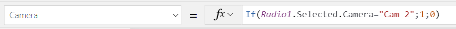
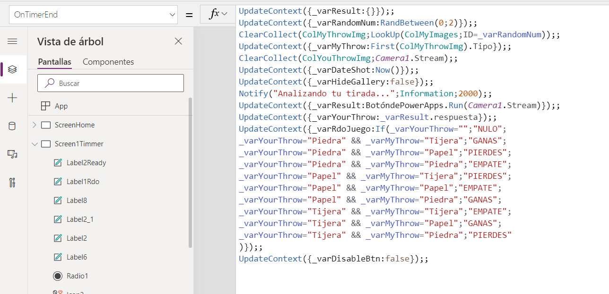

En este artículo os voy a hablar de cómo integrar los modelos de
inteligencia artificial del AI Builder en una aplicación Canvas de Power
Apps.

Como muchos ya sabéis, me encanta todo lo que tiene que ver con Power
Platform y, dado que las Canvas apps se ejecutan perfectamente en un
dispositivo móvil, se me ocurrió que podría ser interesante hacer un
juego para móviles con esta tecnología. Así que pensé que sería curioso
hacer un juego como el tradicional "Piedra, Papel o Tijera" en una
aplicación móvil y aprovechar la inteligencia artificial para su
desarrollo. De este modo, surgió la idea que fundamenta este artículo.

**Crear el modelo de AI Builder**

Para poder crear esta aplicación de Power Apps de "Piedra, Papel o
Tijera", lo primero es disponer del modelo apropiado en el AI Builder.
Para ello, necesitaréis adquirir la suscripción correspondiente, o bien
activar la prueba de 1 mes que os proporciona Microsoft para poder
practicar con esta tecnología. En mi caso, activé la prueba de un mes en
mi tenant de desarrollador. En este caso, siempre os aparecerá en la
parte superior los días que os quedan para que expire la prueba, aunque
luego os permitirán hacer una ampliación de esta.


Una vez que tengáis activado el AI Builder, podéis pasar a crear el
modelo. En este caso, habrá que seleccionar el que está basado en
"*Detección de objetos*".


Después, deberéis realizar los siguientes pasos:

-   Seleccionar como **Dominio del modelo** el de "*Objetos comunes*".

-   En **la Selección de objetos** a detectar, crearemos tres objetos:
    Piedra, Papel, Tijera.

-   Cargaremos las imágenes correspondientes a esos tres objetos.

-   Una vez cargadas, será la tarea de **Etiquetarlas.**

-   Posteriormente, pasaremos a **Entrenar** el modelo.

-   Cuando acabe el entrenamiento, deberéis **Publicarlo.**


Como podéis ver en los pantallazos, yo he cargado 49 imágenes. Algunas
las he sacado de Internet, pero otras son de cosecha propia. En las
recomendaciones se indica que al menos hay que agregar 15 imágenes por
objeto, pero, cuantas más imágenes agreguéis a vuestro modelo, más
preciso será a la hora de detectar vuestros objetos. De hecho, en la
página inicial del modelo podréis ver la efectividad en una escala del 1
al 100 y las recomendaciones para optimizarlo:


Aquí os dejo el enlace con las recomendaciones a la hora de subir
imágenes al modelo:
https://docs.microsoft.com/es-es/ai-builder/collect-images

Una vez que tenemos nuestro modelo preparado, podemos pasar a la
creación de la aplicación de Power Apps.

**Creación de la aplicación de Power Apps**

Ahora vamos a crear una nueva aplicación de lienzo (Canvas) en nuestro
entorno. Para este juego, utilicé el formato tableta porque luego
resultaba mucho más cómodo a la hora de colocar los componentes en la
pantalla y a la hora de utilizar la app.


**Object Detector**

Hasta la edición de noviembre de este año del Ignite (2021), la única
forma de utilizar los modelos de AI Builder en vuestras aplicaciones de
Power Apps era a través de los siguientes componentes que vienen por
defecto en el menú de AI Builder del Power Apps Studio:


Sin embargo, se ha anunciado que en breve se podrán consumir vuestros
modelos de AI Builder utilizando las fórmulas de Power FX. Como a fecha
de redacción de este artículo, esto aún no estaba implementado, voy a
continuar con el modo que hay actualmente.

Para que veáis cómo se consumiría nuestro modelo con estos componentes
estándar, bastaría con agregar el componente de "Detector de objetos"
en una ventana de nuestra app y asociarle el modelo correspondiente:


Una vez hecho esto, vais a encontraros un bug que hay en estos
componentes y es que todo lo que tiene que ver con colores, aparece de
forma errónea ya que le agrega dos veces el punto y coma. Tendréis que
ir modificando uno por uno dejando sólo un punto y coma para corregirlo.
Por ejemplo:


Cuando modifiquéis todos ellos, el componente estará listo para hacer la
predicción pulsando en el botón Detectar que aparece en la parte
inferior del mismo y seleccionando la imagen que queramos analizar. El
componente nos devolverá el siguiente resultado:


Lo bueno que tiene este componente es que, además de informar del objeto
que ha detectado mediante una etiqueta, devuelve un recuadro indicando
dónde ha encontrado dicho objeto.
El componente, sin embargo, tiene un gran inconveniente para utilizarlo
en el juego y es que el jugador es el que tiene que ser proactivo y
pulsar en el botón "*Detectar*" cada vez que quiera hacer una jugada.
No se puede lanzar la detección de forma autónoma que es lo que quería
incorporar en mi pantalla del juego.

Además, si se está usando la aplicación en el móvil, el jugador siempre
ha de escoger si quiere subir una nueva imagen del dispositivo, o hacer
una foto con la cámara. Esto, para que sea un juego fluido y amigable
(la famosa UX), no me resultaba útil.


Lo que yo quería era utilizar el componente de la Cámara de Power App
para disparar una foto de forma automática y enviárselo al modelo para
que me devolviese el resultado. Como decía, hasta el anuncio del Ignite,
esto no es posible hacerlo actualmente dentro de Power Apps, sino que
hay que apoyarse en Power Automate, así que procedí a crear el siguiente
flujo.

**Flujo de Power Automate**

Lo que hice es Crear un nuevo flujo desde la propia aplicación.


Esto lo que hace es crear un flujo de tipo "*Botón de Power App*s" con
el siguiente trigger:


Después de inicializar un par de variables que se utilizarán
posteriormente, lo que vamos a incluir es la acción "*Detectar y contar
objetos en imágenes*" seleccionando nuestro modelo de AI Builder que
creamos en el primer paso y le vamos a indicar que la imagen ha de
recogerla de nuestra aplicación de Power Apps:


Posteriormente, recorreremos los resultados que devuelve la acción
(aunque en realidad sólo será uno) almacenando en dos variables el
objeto obtenido y la puntuación de confianza que devuelve el modelo:


Finalmente, acabamos el flujo devolviendo a Power Apps los resultados a
través de la acción "*Responder a una instancia de PowerApps o a un
flujo*"


Una vez hecho esto, nuestro flujo está listo para utilizarse dentro de
la aplicación de Power Apps, por lo que retronamos a nuestra aplicación
Canvas para seguir la edición de esta.

**Colección de imágenes para la tirada de la aplicación.**

Como queremos que el juego sea una competición entre la aplicación y el
jugador, necesitamos contar con una colección de tres imágenes (piedra,
papel y tijera) que permitan implementar después la tirada aleatoria de
la aplicación. Por tanto, cargaremos las imágenes en la zona multimedia
de la app y en la regla *OnStart* de la app, generaremos una colección
con estas tres imágenes con la siguiente instrucción:

```
ClearCollect(ColMyImages;{ID:0;Tipo:"Piedra";Img:'014'};{ID:1;Tipo:"Papel";Img:'014_1'};{ID:2;Tipo:"Tijera";Img:'014_2'})
```


Ahora ya podemos crear una nueva pantalla en la app donde estableceremos
los componentes para el juego.

**Temporizador para la cuenta atrás**

Como os decía anteriormente, el componente del detector de objetos no me
servía porque quería que la aplicación utilizase el componente de la
cámara del dispositivo donde se ejecute la app. Además, quería que la
foto se disparase de forma automática para proporcionar una mejor
experiencia del usuario y, por esta razón, decidí utilizar un
Temporizador (Timer) que fuese el que disparase la foto tras una cuenta
atrás de 3 segundos.

Por tanto, lo que agregué a mi aplicación son los siguientes
componentes:

1.  **Cámara**

Lo primero es agregar el componente *Cámara* ubicado en el menú
*Multimedia*.


Dado que los teléfonos suelen contar con dos cámaras, además agregué un
Radio Button (Botón de selección) que permita al usuario seleccionar con
qué cámara quiere jugar la partida y lo establecí en la propiedad
"*Camera*" del componente (que admite valores 0, 1) de la siguiente
forma:



Además, es importante que modifiquéis el "*StreamRate"* para
establecerlo con el valor 100 para que luego podamos recoger la imagen
tras dispararla con el Timer.


2.  **Timer**

Ahora es el momento de agregar un temporizador de cuenta atrás. Lo vamos
a establecer en 3 segundos, por lo que estableceremos su propiedad
"*Duration"* en 3000.


Lo que vamos a hacer es que, cuando acabe el tiempo del temporizador, se
realice toda la lógica de la aplicación (en la acción "*OnTimerEnd"*).

Lo primero que haremos es recoger lo que haya en la imagen de la cámara
y almacenarlo en una Colección. Para ello, tenemos que utilizar la
propiedad *Stream* de la cámara y, por esta razón es por lo que
anteriormente establecimos el *StreamRate* del componente de la cámara
en 100. Por tanto, nuestra instrucción sería la siguiente:

```
ClearCollect(ColYourThrowImg;Camera1.Stream);;
```

También vamos a hacer que se escoja de forma aleatoria una jugada que
sería la tirada que hace la aplicación y así podamos hacer una
competición entre la app y nosotros. Esta jugada se escoge de la
colección de 3 imágenes que se carga al iniciarse la aplicación (en la
acción *App*.*OnStart*) .
Por tanto, nuestra tirada aleatoria se generará dentro del *OnTimerEnd*
con las siguientes instrucciones:

```
UpdateContext({_varRandomNum:RandBetween(0;2)});;

ClearCollect(ColMyThrowImg;LookUp(ColMyImages;ID=_varRandomNum));;
```

Además, cuando tengamos recogida la imagen de nuestra tirada (la de la
cámara), se la enviaremos al flujo de Power Automate para que la analice
y recogeremos la respuesta en una variable. Para ello, lanzaremos el
flujo de la siguiente forma:

```
UpdateContext({_varResult:BotóndePowerApps.Run(Camera1.Stream)});;

UpdateContext({_varYourThrow:_varResult.respuesta});;
```

Finalmente, tenemos que analizar la respuesta para ver quién ha ganado
(la app o el jugador) y lo guardamos en una nueva variable. Para ello,
aplicamos la siguiente lógica:

```
UpdateContext({_varRdoJuego:If(_varYourThrow="";"NULO";

_varYourThrow="Piedra" && _varMyThrow="Tijera";"GANAS";

_varYourThrow="Piedra" && _varMyThrow="Papel";"PIERDES";

_varYourThrow="Piedra" && _varMyThrow="Piedra";"EMPATE";

_varYourThrow="Papel" && _varMyThrow="Tijera";"PIERDES";

_varYourThrow="Papel" && _varMyThrow="Papel";"EMPATE";

_varYourThrow="Papel" && _varMyThrow="Piedra";"GANAS";

_varYourThrow="Tijera" && _varMyThrow="Tijera";"EMPATE";

_varYourThrow="Tijera" && _varMyThrow="Papel";"GANAS";

_varYourThrow="Tijera" && _varMyThrow="Piedra";"PIERDES"

)});;
```

Este sería un pantallazo de toda la lógica incluida en la propiedad
"*OnTimerEnd*" de nuestro temporizador:




3.  **Botón "Nueva Partida"**

Para que se dispare el temporizador a través de un botón en la pantalla,
lo que haremos es deshabilitar el Timer y agregar un nuevo botón con el
texto "*Nueva Partida*" con la siguiente lógica en el OnSelect:

```
UpdateContext({_varDisableBtn:true});;

UpdateContext({_varHideGallery:true});;

UpdateContext({_varRdoJuego:""});;

UpdateContext({_varStartTimmer:false});;

Reset(Timer1);;

UpdateContext({_varStartTimmer:true});;
```


4.  **Galerías**

Para mostrar al usuario cuál ha sido su tirada y cuál es la que ha hecho
la aplicación de forma aleatoria, incluiremos dos galerías en las que
asociaremos como origen de datos (propiedad *Items*) las dos colecciones
que se generaron cuando concluyó el temporizador (*ColYourThrowImg* y
*ColMyThrowImg*)

5.  **Etiquetas**

Finalmente, agregaremos una serie de etiquetas que muestren los mensajes
del juego al usuario.

En primer lugar, una etiqueta que muestre el texto "Ready, Steady, Go"
cuando está en marcha la cuenta atrás del Timer. Para ello, en su
propiedad *Text* incluiremos lo siguiente:

If(!_varDisableBtn;"";Timer1.Text="3";"READY";Timer1.Text="2";"READY";Timer1.Text="1";"STEADY";"GO")


Y, por último, una etiqueta que indique quién ha ganado el juego que
será el texto que hemos almacenado en nuestra variable *_varRdoJuego*.


A continuación, os muestro una imagen del aspecto que tiene esta
pantalla de la aplicación después de ejecutar un lanzamiento:


**Imagen 21.- Aspecto de la pantalla al ejecutar un lanzamiento.**

Y ahora os dejo un gif con la secuencia completa de cómo se ejecuta el
juego desde la página de inicio:


Bueno, pues con esto concluyo este artículo. Espero que os haya
resultado interesante.

¡Muchas gracias por leerme!

**Enrique Sánchez Moreno** <br />
Cloud Services Manager en ILUNION IT Services <br />
[**www.esanchezm.com**](http://www.esanchezm.com) 
 
import LayoutNumber from '../../../components/layout-article'
export default LayoutNumber
