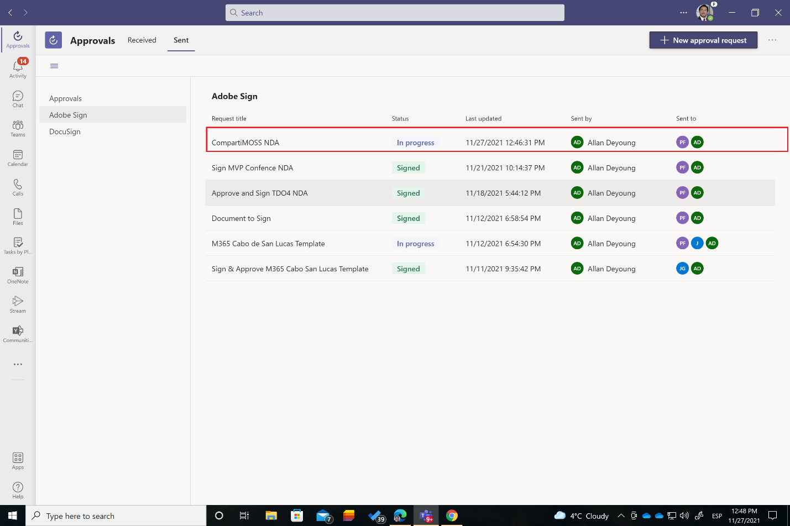

En el número 48 de CompartiMOSS escribí sobre como [con Approvals en
Teams podemos modelar escenarios de Aprobación sencillos de forma muy
rápida](https://www.compartimoss.com/revistas/numero-48/aprobaciones-rapidas-en-microsoft-teams-con-la-app-de-approvals)
e integrada en Microsoft Teams y cómo podemos ir más allá con las
plantillas de Aprobación de serie o creando nuestras propias plantillas.
De lo que no hablé es como podemos introducir Firma Electrónica en
procesos de Aprobación creados con Approvals en Teams. En este artículo
veremos precisamente como podemos incorporar firma electrónica en dichos
procesos.

**Prerequisitos para añadir Firma Electrónica a Procesos de Aprobación creados con la App de Approvals**

Dos son los prerrequisitos necesarios para poder incorporar firma
electrónica a nuestros procesos de Aprobación:

-   En primer lugar, revisar en el Teams Admin Center que la App de
    Approvals está configurada para permitir el uso de los proveedores
    de firma electrónica disponibles actualmente (Adobe Sign y
    DocuSign):

-   En segundo lugar, los usuarios que vayan a firmar con Adobe Sign o
    DocuSign necesitarán tener una cuenta en el proveedor de firma que
    corresponda ya que el paso de aprobación y firma tendrá lugar por
    fuera de Approvals en los servicios de firma de cada uno de ellos.

**Incorporando firma electrónica a un proceso de Aprobación en Approvals**

Incorporar firma electrónica a un proceso de Aprobación en Approvals en
Teams es muy sencillo y se puede realizar iniciando la Aprobación desde
el Hub de Approvals, un chat privado o un canal de Teams. En cualquiera
de los tres casos:

-   Comenzaremos en primer lugar seleccionando como tipo de Aprobación
    la que corresponda al proveedor de firma que vamos a utilizar. En mi
    caso voy a elegir Adobe Sign.

-   A continuación, configuraremos el proceso de firma de acuerdo a
    nuestras necesidades y siempre de acuerdo a las siguientes pautas:

    -   Indicaremos el nombre del proceso de firma y una descripción.

    -   Añadiremos el documento a firmar (Obligatorio).

    -   Si el proceso se tiene que aplicar en el orden en el que se
        definan los participantes en el mismo.

    -   Especificaremos los roles que participan en el proceso que
        pueden ser Signer y/o Approver. Podemos especificar tantas
        personas (corporativas y/o externas) con estos roles como se
        requieran. En mi caso por simplicidad voy a indicar un único
        firmante y un aprobador.

-   Cuando estemos listos, simplemente hacemos clic en Enviar de manera
    que a las personas que participan en el proceso les llegarán las
    correspondientes notificaciones en Teams y en el correo para
    continuar con el proceso. Como es de esperar, el proceso realizado
    se queda registrado en la sección "Sent" de procesos con Adobe Sign
    del Hub de Approvals:

-   La persona destinataria (Patti en el ejemplo) puede abrir el proceso
    desde la notificación que recibe en Teams y desde este acceder a
    revisar el documento que tiene que firmar. También recibirá una
    notificación por e-mail que le permite acceder al mismo documento
    para proceder a su firma.

-   En Adobe Sign Patti puede revisar el documento y proceder a su
    validación y firma integrada en el entorno de Adobe Sign.

-   Siguiendo con el proceso modelado, la siguiente persona en la cadena
    de aprobación y firma definida recibirá una notificación en Teams y
    un E-Mail para que visualice de nuevo en Adobe Sign el documento
    para su aprobación. La notificación por e-Mail será similar a la
    siguiente:

-   Allan accederá a Adobe Sign para visualizar y aprobar el documento
    que ha firmado previamente Patti.

-   El proceso de Firma y Aprobación concluirá con las siguientes
    acciones:

    -   Se enviarán notificaciones vía Teams a los participantes en el
        proceso.

    -   Se enviarán notificaciones vía e-mail a los participantes en el
        proceso para que puedan descargarse el documento final firmado y
        aprobado.

    -   La solicitud cambiará ha estado firmado tanto desde el punto de
        vista de quien la inició como de los participantes.

**Conclusiones**

Con Approvals en Microsoft Teams no solo podemos modelar escenarios de
aprobación básica o avanzada (mediante el uso de plantillas de
Aprobación), sino también incorporar pasos de firma electrónica que
permita que los documentos que participan en el proceso puedan ser
firmados por las personas involucradas. De esta forma se cubre desde
Teams un escenario muy habitual presente en muchas organizaciones en la
actualidad.

**Juan Carlos Gonzalez**  
Office Apps & Services MVP \| M365 SME & Delivery Manager en RICOH España   
@jcgm1978 
 
import LayoutNumber from '../../../components/layout-article'
export default LayoutNumber
