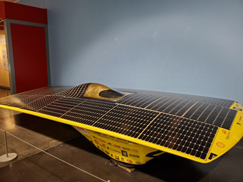

  
  
 De la tierra de ¨Encanto¨, nacida en Colombia, orgullosa en sus roles como madre, emprendedora, mujer en tecnología, y una amiga que trata de apoyar siempre su comunidad. Impulsada por la pasión por la tecnología, la educación y las experiencias que puede crear para impactar a miles de millones de usuarios. Diana se enfoca en estar orientada al cliente, basada en los datos y en operar con una mentalidad de crecimiento y colaboración mutua para alcanzar objetivos. Su experiencia trabajando con más de 200 empresas del sector público y privado, conduciéndolas con éxito a la nube y ayudando a la transformación digital de millones de usuarios que ahora trabajan de manera más eficiente, la mantiene motivada para contribuir a los nuevos desafíos mundiales en la industria. Diana ha sido galardonada y reconocida globalmente como Microsoft MVP en Cloud and Datacenter Management, desde el año 2015.

**¿Por qué y cómo empezaste en el mundo de la tecnología?**
Cuando tenía 7 años y mi Papá me regaló mi primer computador, me empezó a gustar mucho la tecnología, los video juegos, hacer mis tareas con la suite de Office, 
dibujar con Paint; entre otros. Decidí desde una temprana edad que iba a ser Ingeniera y trabajar con tecnología, y así mi familia me empezó a decir ¨Ingeniera¨, 
desde ese momento. Estaba tan decidida, que comencé mi primera carrera universitaria a los 15 años de edad, ya que me gradué de Educación Secundaria, o grado 11; 
para ser específicos, siendo aún muy joven.   

Ya estando en la universidad, asistí a una conferencia que había con exponentes de Microsoft, salí de allí con mucha curiosidad de lo que hablaron, las certificaciones que tenían, 
cómo estas podían desde ya aportar un valor agregado a mi hoja de vida siendo aún estudiante. Además, me hizo clic porque era una de las opciones de grado válidas. 
Minutos después, fui a un aula de clase y empecé a indagar sobre Microsoft. Encontré que había una charla de entrada gratuita al día siguiente, y allí me fui yo, 
luego de mi jornada académica. Recuerdo que ese día marcó mucho mi vida, la buena sensación de entrar por una puerta grande a la oficina de una multinacional, 
ver allí personas en escenario compartiendo conocimientos, regalando libros, camisetas y otras cosas. Al principio era algo confuso entender lo que enseñaban, 
pero empecé a asistir semanalmente y conocer muchas personas que más adelante se convirtieron en amigos que al día de hoy, aún conservo a muchos. 
Era la única mujer allí, y la más joven… De hecho, que ese primer día, alguien me preguntó si estaba allí esperando a mi papá o mamá… 
Me sentí un poco nerviosa, pero contesté: No, vine aquí para aprender. Al poco tiempo, empecé a ser parte de las estrellas del escenario, comencé mi internship, 
traía a mis colegas de oficina a los eventos de Microsoft, empecé a poner en práctica mi conocimiento en escenarios reales. Era muy emocionante todo esto, me sentí apoyada y 
con grandes motivaciones, inspirada por muchas personas que en sus carreras profesionales desde ya eran muy exitosos. 
Me contagié de esa chispa de compartir conocimiento, conocer personas, culturas,

**¿Cuáles son tus principales actividades tecnológicas hoy en día?**
Hoy en día me desempeño como Gerente de Producto en RealActivity LLC, una empresa Norte Americana, que está enfocada a la industria de Salud, en la cual desarrollamos 
soluciones de software para este sector y con asesoría de alto nivel, para brindar a las organizaciones a las que servimos; soluciones que apoyen su núcleo de negocio 
basados en nuestros valores de Integridad, Innovación, Objetividad y pensamiento crítico, Retribución, Diversidad, equidad e inclusión. Lideramos comunidades tecnológicas 
independientes a través de nuestras contribuciones filantrópicas a nivel local y global, siendo una fuente líder de conocimiento e información para mejorar el desempeño 
dentro de las organizaciones.

También soy cofundadora de Womens Voice IT, una comunidad que bajo los principios de aprendizaje colaborativo, sororidad, y empoderamiento; buscamos ser la voz de las mujeres 
que actualmente se desempeñan en la implementación de tecnología en Latinoamérica y el mundo, apoyándonos las unas a otras! 

Les comparto nuestras redes sociales para quienes quieran unirse y ser parte de nosotros:
- Womens Voice IT: https://www.facebook.com/WomensVoiceIT/ 
- Boston Healthcare Technology User Group: https://boshug.com
- Boston Power Platform Community: https://www.facebook.com/BostonPowerPlatform/ 

**¿Cuáles son tus principales actividades NO tecnológicas hoy en día?**
Mis actividades no tecnológicas involucran mi familia, actividades en las que comparto tiempo con mi esposo y mi hijo. También, dedico parte de mi tiempo a 
prestar servicio desde mi comunidad religiosa desde hace muchos años, enseñando clases de principios especialmente a niños. 

Busco siempre ser muy creativa y romper monotonía, incluso estando en casa, me gusta emprender mini proyectos para desarrollar nuevos talentos como pintar, 
coser, remodelar y un poquitito de cocinar, entre otros… 

**¿Cuáles son tus hobbies?**
Antes viajaba mucho, me iba con mi mochila y mi laptop y estaba fuera de casa por varios meses explorando el mundo. Ahora dadas las circunstancias y 
mi cambio de vida, viajo poco, pero salgo mucho. Mis fines de semana en particular, ¡son bien ocupados!

Me encanta salir, salir a pasear, explorar la naturaleza, caminar, ir a la playa, ir a cine, visitar tiendas y restaurantes, 
me encanta probar diferentes comidas y siempre ha sido uno de mis placeres y planes favoritos.

**¿Cuál es tu visión de futuro en la tecnología de acá a los próximos años?**
Pienso que no estamos lejos de convertir la ciencia ficción en realidad. El poder de los datos y la Inteligencia Artificial están gobernando el mundo 
y nuestras decisiones desde ya. Creo que la neurociencia y neuro tecnología evolucionan a pasos agigantados. El metaverso será desde ahora 
esa nueva normalidad y los exteriores de nuestras ciudades se van a transformar de una manera impresionante, la tecnología estará aún más implantada 
en edificios y grandes avenidas. Últimamente he estado muy emocionada también por el despliegue exponencial de carros eléctricos y porqué no, que éstos 
puedan utilizar otros tipos de energía a lo mejor, más favorables y eco sostenibles.  Hace unos días tomé esta fotografía en un museo en Washington, 
de un prototipo de carro solar que me pareció muy interesante, pueden buscar videos de carreras o más información en el sitio web del ¨American Solar Challenge¨.

Muchas gracias por este espacio en la revista CompartiMoss.  
Conecta en LinkedIn conmigo: https://www.linkedin.com/in/carolinatv/  
 
import LayoutNumber from '../../../components/layout-article'
export default LayoutNumber
