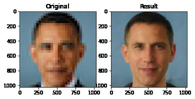
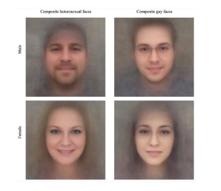
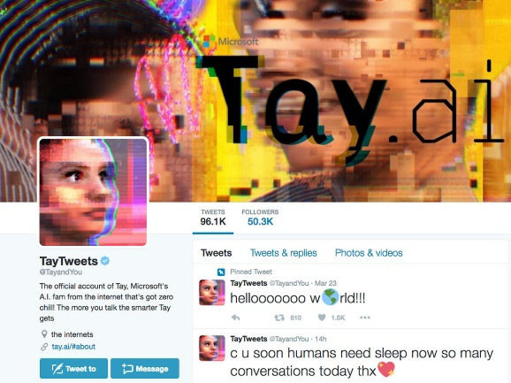

La Inteligencia Artificial está con nosotros desde hace mucho tiempo,
aunque no con el inmenso despliegue y capacidad de aplicación que ha
sufrido en los últimos años. Como cualquier otro elemento que impacta en
la vida de las personas, es importante tener claros aspectos sobre sobre
dónde, cuándo, cómo, qué y por qué la Inteligencia Artificial hace lo
que hace, ya sea cuando nos referimos al tratamiento de la información
en sí misma como a los procesos que funcionan por detrás o por delante
de cada elemento.

Desde mi punto de vista, podemos dividir los puntos éticos a tener en
cuenta en la Inteligencia Artificial en 4 grandes grupos o familias:
igualdad e inclusión, fiabilidad, seguridad y privacidad, y en último
lugar, pero no menos importante: transparencia. En las siguientes líneas
haré una exposición más detallada sobre lo que cada grupo incluye.

**Igualdad e Inclusión**

La igualdad es probablemente uno de los aspectos más pisoteados por
varios algoritmos de Inteligencia Artificial que, por suerte, no han
evolucionado debido justamente a los errores cometidos. Este grupo de
elementos son los que se refieren a la diversidad de la información con
la que se alimenta determinado algoritmo o proceso de IA. Como se podría
suponer, si al momento de alimentar o entrenar un algoritmo de IA no
contamos con un conjunto diverso de información de partida, es muy
probable que los resultados de ese algoritmo estén sesgados, y no porque
el algoritmo no sea capaz de incluir información más diversa, sino
simplemente porque no la conoce. El concepto queda muy claro si pensamos
en el entrenamiento de un proceso que a través de imágenes sea capaz de
diferenciar naranjas y limones. Parece obvio que para realizar ese
entrenamiento necesitaremos imágenes de naranjas por un lado y de
limones por otro, pero os adelanto que ese algoritmo estará sesgado. Es
correcto que una vez entrenado reconocerá y diferenciará entre naranjas
y limones, pero ¿sabéis lo que pasará cuando le mostremos una mandarina?
¡Exacto!, la confundirá con una naranja. ¿Y qué pasará con una lima, o
con un pimiento amarillo? La respuesta va por el mismo lado. Ahora,
basándonos en ese mismo algoritmo, imaginemos que ya no hablamos de
frutas, sino de personas. Cuando hemos metido a las personas dentro del
algoritmo, o cualquier información relacionada con la vida de las
personas, cualquier omisión en el entrenamiento podría sesgar el
resultado, y si de ese resultado depende determinada decisión el impacto
será mayúsculo.

Imagina que pasaría si en nuestro ejemplo, en vez de hablar de naranjas
y limones, hablamos de fotos de caras de hombres y mujeres. La idea
parece obvia, pero vayamos un paso más adelante y si analizamos lo que
pasa en la vida real veremos que hay hombres con rasgos femeninos, y hay
mujeres con rasgos masculinos. En estos casos, si el conjunto de fotos
con el que hemos entrenado el algoritmo no es lo suficientemente amplio
en ejemplos, es casi seguro que el algoritmo en algún momento cometa el
fatal error: confundir el sexo de una persona, lo que podría implicar
que esa persona está siendo avasallada por el algoritmo, menospreciada,
NO incluida. El resultado es, lo mires por donde lo mires, un insulto en
toda regla. Pero ahora avancemos un paso más, ¿qué hacemos con las
personas cuyos rasgos faciales no definen claramente el sexo? En este
caso nos encontramos que esa espada de Damocles con la que
diferenciábamos a las personas en grupos de hombres y mujeres ya no
sirve; tal vez debamos actualizar el algoritmo para diferenciar más de
dos sexos. O al menos, tener un tercer grupo donde poner a las personas
que el algoritmo no puede detectar, pero seamos conscientes de que sea
cual sea el nombre de ese grupo alguien podría sentirse herido. El
debate está servido.

Pero... ¡espera un momento!, demos otro paso y pensemos en la enorme
diversidad existente en la vida real sobre las cosas que podemos extraer
de una foto de la cara de una persona: ¿qué hacemos con el color de la
piel? ¿las personas de piel negra, amarilla, blanca, roja, fucsia, azul
o celeste cielo dejan de ser personas solo por el color de la piel? Lo
mismo pregunto por la apertura de sus ojos, o si tienen o no pelo, y la
lista sigue. La respuesta a todo esto es que, si quieres evitar que un
algoritmo determinado no sea excluyente, debes entrenarlo con el mayor
grupo de información de partida posible. No hacerlo podría arrojar
resultados como estos:

La imagen de la izquierda es un claro ataque a las personas de piel
negra, pero seamos conscientes que la culpa no es del algoritmo, sino de
la insuficiencia de más ejemplos en el entrenamiento del algoritmo o,
dicho de otra forma: las personas que entrenaron el algoritmo lo
hicieron mal y de forma incompleta. Las imágenes de la derecha son otro
claro ejemplo de un entrenamiento sesgado: si no entrenas con múltiples
ejemplos de las múltiples razas que tenemos en este planeta, sucederán
cosas como que tu algoritmo de de-pixelación de fotos confunde una foto
de Obama con alguien caucásico, o una foto de alguien con rasgos
asiáticos como la actriz Lucy Liu termina siendo mal reconstruida por el
algoritmo. En ambos casos ha faltado información de
partida/entrenamiento, y el resultado puede ser interpretado como un
insulto.

El impacto ético del algoritmo no solo pasa por la raza de las personas,
sino también por temas más amplios. ¿Es posible determinar mediante un
algoritmo de análisis facial si una persona es homosexual o no? ¿Es
correcto determinar la posibilidad de que alguien sea delincuente
basándose en su raza o el sitio donde vive? ¿Te parece válido que un
banco te otorgue o no una tarjeta de crédito basándose en el barrio en
que vives, o en la edad que tienes, o en la educación que has recibido?
Para esta última cuestión no cabe duda de que existirán estadísticas que
demuestren determinados patrones, es cierto, pero de lo que estamos
hablando es de que un algoritmo decida si te da la tarjeta o no
basándose en eso, no de estadística.

Si te interesa investigar más sobre cómo les fue a algunos de los ejemplos mencionados anteriormente, aquí te los
dejo:

Ahora extrapola lo anterior a un algoritmo que determina si una mancha
en la piel de tu brazo es una quemadura solar, o se debe a que te has
tirado aceite friendo los escalopes, o te ha salido una alergia, o es el
comienzo de algo más preocupante y serio que implica más analíticas.
Siempre lo digo: ***la Inteligencia Artificial es una herramienta que
debemos utilizar como tal: "una herramienta"***. En el caso anterior la
IA que clasifica manchas en la piel es extremadamente útil para un
médico dermatólogo, pero no la dejemos actuar sola si no queremos que en
algún momento confunda cáncer con algo que no era tan serio, lo cual
hará pasar al paciente por un susto y posterior enfado innecesarios, o
algo peor: que se confunda a la inversa, determinando como poco serio
algo que sí lo era. En este caso podemos anticiparnos a los problemas de
dos formas. En primer lugar debemos alimentar la IA con la mayor
cantidad posible de ejemplos de partida (información); en segundo lugar
es nuestra responsabilidad no darle atribuciones que nunca ha tenido y
asumir que el algoritmo es el dueño de la verdad: prefiero que el
resultado del algoritmo sea analizado por un humano especialista en
dermatología, que ha estudiado sus años para realizar una interpretación
correcta de la información, y por supuesto que podrá apoyarse en la IA,
pero no dejemos el diagnóstico final en manos de un algoritmo.

Como decía antes el debate está servido. Lamento no poder decirlo a
nivel global, pero por lo menos en la Unión Europea ya tenemos un marco
de excelencia de la IA que dice claramente que un algoritmo será
inaceptable bajo estos términos: "*Se prohibirá todo lo que se considere
una amenaza clara para los ciudadanos de la UE: desde la clasificación
social por parte de los Gobiernos a los juguetes que utilicen un
asistente de voz que incentive comportamientos peligrosos en los
niños.*"

En resumen, si la mayoría no aceptamos que cosas como "*tú eres de raza
X, no puedes trabajar aquí*", o "*si tienes más de 65 años no te doy ese
crédito*", o "*si eres hombre tu sueldo es Y, pero si eres mujer tu
sueldo es Z*", o "*la culpa del aumento de los contagios es de los
jóvenes*", o "*si eres un contribuyente de tipo M no negociamos, pero si
eres de tipo N sí*", y repito, si la mayoría no estamos de acuerdo y/o
no aceptamos esas afirmaciones/modus-operandi, por qué razón no hacer lo
mismo con los algoritmos que están por detrás?. Debate servido.

**Fiabilidad**

Cuando hablamos de fiabilidad en un sistema de Inteligencia Artificial,
estamos haciendo referencia directa a la confianza que depositamos en
ese sistema o, dicho de otra forma, a ese sentimiento humano que nos
dice que el sistema es seguro en lo que respecta a cómo funciona y los
resultados que se obtienen de él. Lograr que un sistema sea fiable no
pasa por considerar determinados aspectos en un momento dado, sino que
debe formar parte del ciclo de vida de ese sistema en todas sus fases:
antes (concepción), durante (implementación) y después (despliegue y
mantenimiento).

Hay varios aspectos que siempre debemos tener en cuenta y desde mi punto
de vista hay dos que destacan: resistencia y seguimiento. El sistema
debe ser lo más fuerte posible frente a la manipulación de datos y
resultados, ya sea de forma intencionada o no. Esto quiere decir que
además de las necesidades de seguridad que veremos más adelante, el
sistema debe garantizar que responde de forma correcta, tanto en
aquellas condiciones que son extremas como en aquellas no previstas.
Lograr este comportamiento no es para nada fácil, y requiere que de
forma constante se evalúe el rendimiento y los resultados esperados,
tanto en la búsqueda de mejoras como de anticipación a casos no
considerados inicialmente. Es casi imposible diseñar un sistema libre de
errores desde su concepción, pero normalmente y si el error no es
extremo o muy perjudicial, podemos reducir el impacto tomando medidas de
prevención y corrección. Si la concepción se ha realizado correctamente
es muy difícil que existan errores muy críticos, pero sí es común que
algunas casuísticas no hayan sido consideradas desde el inicio, o el
sistema se degrade con el tiempo. En estos casos, la clave es lo que he
dicho anteriormente: monitorización y evaluación constante de los
resultados que se obtienen, donde se verá si el sistema no se comporta
de forma ideal ante determinadas situaciones extremas (lo que podría ser
la antesala de una casuística no considerada al inicio) o que empiezan a
detectarse anomalías, normalmente de forma periódica, lo que podría ser
señal de degradación con el tiempo (implica re-entrenar y refrescar el
modelo).

En algunos casos la fiabilidad se ve comprometida de forma exponencial y
los elementos de control que hayamos puesto no funcionan o son
incapaces. Hay muchos ejemplos en los que la fiabilidad se ve
comprometida, más graves y menos graves. Mientras escribo este artículo
he realizado la siguiente prueba de traducción utilizando dos
herramientas: Google Translate y Microsoft Bing Translator, con una
frase muy idiomática que utilizamos en España, "***por si las moscas***"
(frase utilizada coloquialmente sinónimo de "*por si acaso*").

Estos son los resultados:

La traducción correcta de la expresión es "just in case" y soy
consciente de que este ejemplo no es Inteligencia Artificial pura, pero
sí que atañe muy específicamente al concepto de **Fiabilidad**. En este
caso, el no considerar elementos tan específicos como las frases
idiomáticas de cada lugar conlleva una clara pérdida de fiabilidad en el
sistema.

Otro ejemplo de fiabilidad expuesta, en
este caso por parte de Microsoft, fue la implementación del chatbot Tay
que funcionaba a través de Twitter, con el objetivo de demostrar/probar
la IA. Duró 16 horas -\> momento en el que Microsoft apagó el servicio,
debido principalmente a que el chatbot comenzó a contestar a los
usuarios de forma ofensiva en base a lo "aprendido" durante las primeras
horas, y gracias a la interacción con otros usuarios en Twitter. El
problema en Tay estuvo en la concepción y en la consideración de que el
bot iba a ser utilizado de forma correcta. Lo que no se tuvo en cuenta
fue que el bot se expuso de forma pública a determinados usuarios que
hoy llamamos "trolls" o "haters" que lo inundaron con mensajes, primero
políticamente incorrectos, y luego con cosas más graves como mensajes
racistas o difamatorios. En este caso, y aunque el resultado no fue para
nada el esperado, sí que debemos reconocer que la reacción fue
relativamente rápida y especialmente efectiva. Cada cual podrá sacar sus
propias conclusiones sobre este ejemplo, pero desde mi punto de vista el
error durante la concepción fue el "no considerar" que el bot fuese
utilizado con el objetivo de degradar su auto-aprendizaje, o dicho de
forma muy resumida: se pecó de inocencia.

**Seguridad y Privacidad**

Cada día aparecen más y más aplicaciones que contienen IA, y la
seguridad y privacidad de la información que se utiliza ha pasado al
primer plano. Cuando hablamos de Seguridad y Privacidad hacemos
referencia no sólo a la seguridad *informática* de la información, la
cual obviamente debe estar garantizada, sino también a quién, cómo, por
qué, para qué y cuándo se accede a esa información.

En Europa tenemos leyes que aplican al tratamiento de la información de
las personas, e incluso diferencian el nivel de seguridad necesario
dependiendo del tipo de dato tratado. Por ejemplo, el nivel de seguridad
y control de acceso al dato "nombre" de una persona es menor que el
nivel requerido para acceder al dato "religión" de esa misma persona. Y
esas leyes y garantías deben ser respetadas y garantizadas por los
sistemas de IA.

Pero no solo estoy exponiendo las
necesidades sobre el control del dato, sino también debemos ser
consecuentes al momento de concebir e implementar el sistema. Un ejemplo
clarificará el concepto: en Insight tenemos un sistema de gestión
integral de instalaciones (tiendas, fábricas, oficinas, etc.) donde
aplicamos IoT e IA para la integración, gestión y monitorización de
cualquier instalación y dispositivo. Una de las posibles funcionalidades
que el sistema permite implementar pasa por medir el tiempo de espera en
la cola de una tienda, y al mismo tiempo segmentar por edad las personas
que están en esa cola. Esta funcionalidad utiliza su propio proceso de
IA que detecta las personas a través de una cámara, predice el sexo y
edad, y además mide el tiempo de espera en la cola. Muchas veces, una de
las primeras preguntas que recibo es: "*¿qué pasa con esas imágenes?, la
ley exige que sean tratadas de forma rigurosa...*". Mas allá de que
obviamente el sistema respeta las leyes de los distintos países, debemos
tener en cuenta qué información debemos almacenar y qué información no.
Nuestro objetivo en este caso es segmentar sexo y edad, y medir tiempo
de espera, por lo que no necesitamos almacenar para nada la imagen de
las personas. Basta con realizar esa segmentación en tiempo real a
través de la imagen que se está capturando con la cámara en ese momento,
guardar los indicadores que he mencionado (sexo, edad, tiempo) y
descartar la imagen para pasar a la siguiente y comenzar el proceso
nuevamente. De esta forma se obtienen los datos al mismo que tiempo que
se garantiza la seguridad, ya que no hay dato más seguro que el que no
existe y la imagen no existe luego de ser procesada; al mismo tiempo, se
garantiza la privacidad ya que no es necesario conocer quiénes son las
personas de un determinado segmento de edad o sexo, sino simplemente el
número que hay en cada segmento en un momento dado.

Otro aspecto a tener en cuenta en materia de seguridad y privacidad es
relativo al origen de la información de base que utilizamos. En los
casos en que nuestro sistema de IA necesite de información externa,
debemos asegurarnos de que esa fuente es fiable, es decir, que cumple al
menos las mismas condiciones que queremos para nuestro sistema. Y con
esto me refiero a realizar preguntas a nosotros mismos y al proveedor de
la información, tales como ¿la información es oficial?, ¿cómo ha sido
obtenida?, ¿limitaciones de uso?, ¿origen de la información?, ¿cuál es
el proceso y periodicidad de actualización?, etc.

En último lugar de este epígrafe, pero no por ello menos importante,
debemos considerar la NO transmisión de información como un elemento que
ayuda a preservar la seguridad y la privacidad. Obviamente con esto no
quiero decir que nuestro sistema esté aislado, ya que hoy en día eso
sería imposible o incluso absurdo. Me refiero al hecho de diseñar un
sistema que obtiene el dato que necesita de forma local, tal como
explicaba en el ejemplo anterior, y sólo transmite la información
resultante pero no el dato original, lo que es de por sí una buena forma
de asegurar el conjunto. Una comunicación inexistente no puede ser
hackeada, porque NO EXISTE y por ende no hay nada factible de hackear.
Por ello, si el sistema que estamos implementando puede utilizar
tecnología que funciona de forma aislada, como la mayoría de la que
tenemos a nuestro alcance hoy en día, sigamos ese patrón y hagamos que
el sistema procese la mayor parte de la información comprometedora de
forma local, para luego transmitir estrictamente lo que sea necesario.
Soy consciente de que este escenario no siempre es posible, pero dados
los beneficios muchas veces valdrá la pena hacer una parada en el
proceso de implementación y volver a verificar que efectivamente toda la
información que entra y sale es la mínima y la exclusivamente necesaria
para lograr el objetivo.

**Transparencia**

Desde mi punto de vista la transparencia debería formar parte de todo
tipo de sistema, incluidos obviamente los sistemas de Inteligencia
Artificial. Cuando hablamos de transparencia queremos decir que los
componentes deben estar claros y deben ser definidos y explicados de
forma precisa. La transparencia ideal pasa por explicar al usuario de
forma clara y concisa cuál es el objetivo de nuestro sistema, qué
resultados espera obtener, qué hace para obtenerlos, cómo y por qué, y
cómo se trata la información recogida. La mala transparencia afecta
normalmente y de forma muy directa a la fiabilidad de un sistema y con
ello va el uso y aceptación que se hará del mismo.

Hay muchos casos en la historia de la IA en los que los sistemas no han
sido aceptados por falta de transparencia. Hace muy poco tiempo, en
España, veíamos cómo la publicación de una aplicación que informaba al
usuario sobre el nivel de riesgo de contagio según la zona donde se
encontraba, generó gran número de críticas y detractores en muy poco
tiempo. Todo ese ruido negativo se eliminó en cuanto los creadores
publicaron el código fuente de la aplicación, logrando no solo reducir
los malos comentarios, sino que también empezaron a recibir gran número
de mejoras tanto a nivel de código como funcionales.

La transparencia es muy necesaria siempre, pero se vuelve imprescindible
cuando los resultados del sistema de IA afectan a la vida de las
personas. Herramientas como aquellas de selección de personal, o de
valoración de un préstamo/crédito bancario, o relacionadas con cualquier
elemento de la salud, (y la lista sigue para todos aquellos temas que a
las personas nos importan) deben explicar cómo funcionan internamente y
cuáles son los datos que utilizan. Una herramienta de selección de
personal que utilice IA para elegir el mejor candidato debe explicar
cómo garantiza que no haya discriminación de sexo y/o edad. La
herramienta que dice si determinada persona puedo o no recibir un
crédito debería explicar cuáles son las reglas e indicadores por los que
se rige para otorgar ese crédito. La IA que ayude al médico a realizar
un diagnóstico en base a lo que detecta en una imagen de rayos X debe
ser transparente y explicar qué elementos busca y cómo predice un
diagnóstico u otro. Los casos son infinitos, pero como ventaja adicional
y para todos ellos, la transparencia no solo ayuda a la adopción, sino
que también permitirá que los humanos expertos en la materia de la que
estemos hablando empiecen a participar, mejorar y aportar en la
evolución de esa herramienta.

**Conclusión y opinión**

Para terminar, quiero dejar algunas claves de lo que he expuesto
anteriormente. Garantizar la igualdad e inclusión se logra contando con
un gran universo de datos de partida, pero también teniendo un equipo de
diseño e implementación lo más heterogéneo posible en lo que se refiere
a origen, raza, religión, sexo, edad, etc. La fiabilidad de un sistema
no se gana teniendo una mayor infraestructura o escribiendo más código;
se gana realizando muchas pruebas, y cuando hayamos terminado de probar
volvamos a empezar y hagamos más pruebas, y así constantemente. Tener un
plan de control sobre nuestro sistema también ayudará a la fiabilidad,
porque no podemos garantizar que el sistema jamás falle, pero sí podemos
garantizar que hacemos todo lo posible para que eso no suceda y si
sucede tenemos un plan para solventarlo inmediatamente. La seguridad y
la privacidad ya no es una elección, ya no existen usuarios que les de
igual lo que hagas con sus datos, es obligatoria por ley y pensarla bien
ayudará a que los usuarios no descarten tu sistema por inseguro o poco
confiable. La transparencia no solo dará mejor imagen, sino que
potenciará la fiabilidad en el sistema e incluso abrirá las puertas a
mejoras y crecimiento. ¡Hasta la próxima!

**Javier Menendez Pallo**  
AI MVP