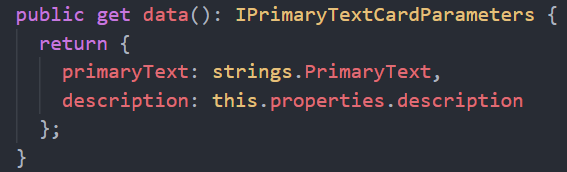

Durante el siguiente artículo vamos a ver cómo podemos extender Viva
Connections haciendo uso de nuestro framework favorito SPFx. Primero
veremos lo básico en la creación de la extensión, y luego daremos un
pasito más destripando la Adaptive Card Extension.

## Qué es Microsoft Viva & Viva Connections

Hace ya algunos meses que tenemos disponible Microsoft Viva... pero ¿qué es **Viva**?... pues bien, en las propias palabras de Microsoft:

> Microsoft Viva es una plataforma de experiencias del empleado que
> reúne comunicaciones, conocimiento, aprendizaje, recursos y
> conclusiones en el flujo de trabajo. Con tecnología de Microsoft 365 y
> usado mediante Microsoft Teams, Viva alienta una cultura que permite a
> las personas y los equipos disponer de las herramientas que necesitan
> para dar lo mejor de sí desde cualquier lugar.

Está compuesto por 4 componentes:

-   **Viva Leraning**: Viva ayuda a los empleados a que el aprendizaje
    forme parte natural de su día al incorporarlo al flujo de trabajo
    con las herramientas que ya usan.

-   **Viva Insights**: Viva ayuda a las personas y las empresas a
    prosperar con recomendaciones para mejorar la productividad y el
    bienestar.

-   **Viva Topics**: Viva te permite organizar automáticamente el
    contenido y la experiencia en toda tu organización para que sea más
    fácil de encontrar.

-   **Viva Connections**: ayuda a promover la comunicación en el área de
    trabajo, todo desde una ubicación central.

Como os decía, este artículo se centra en **Viva Connections**, que a su
vez podemos dividirlo en 3 bloques:

-   **Feed**: poco que añadir, un Feed donde el sistema te muestra
    aquello que cree que te es relevante, con contenido que han creado
    otros empleados. Normalmente suelen ser posts en Yammer o páginas de
    SharePoint.

-   **Resources**: Muestra enlaces que la compañía quiere que estén "a
    mano" para los empleados. Se basa en los elementos de navegación de
    la SharePoint app bar, los cuales pueden orientarse a audiencias
    concretas.

-   **Dashboard**: Es el cinturón de herramientas de tus empleados.
    Aglutina todas las herramientas que puede necesitar el empleado,
    dando acceso rápido, sencillo, y en cualquier momento y cualquier
    lugar.
    El Dashboard utiliza *cards* dinámicas con las que el empleado puede
    interactuar, completar tareas simples o revisar información crítica
    para ellos. El Dashboard se crea en SharePoint y se publica a la
    aplicación móvil de Teams.
    Las tarjetas del Dashboard se basan en *adaptive cards*, y, como
    vamos a ver, podemos desarrollar nuestras propias *cards* haciendo
    uso del SPFx.

Tenéis mucha más información en: https://docs.microsoft.com/en-us/viva/connections/viva-connections-overview

**Extendiendo Viva Connections con SPFx**

Desde la versión 1.13 del generador de Yeoman para SPFx, tenemos
disponible la opción de crear una **Adaptive Card Extension**, y crear
así nuestras propias cards para el Dashboard, con toda la funcionalidad
que deseemos.

Antes de entrar en materia, entendamos la anatomía de una *card* del
Dashboard. Estas cards están compuestas por una Card View, y una Quick
View, tal y como podemos ver en la siguiente imagen:

La Card View es la primera en aparecer en el Dashboard, y puede
renderizarse en 2 tamaños diferentes: Medio y Largo (mantiene la misma
altura, pero su ancho es el doble que la anterior). En breve veremos
ejemplos visuales de esto.

**Nota**: no me hagáis hablar, pero la nomenclatura de Card View / Quick
View, me parece bastante confusa. Para mi sería más sencillo de entender
si la Card View pasase a llamarse la Quick View, y la Quick View tuviera
un nombre más como Extended View o Detailed View...

La CardView, además de poderse renderizar en 2 tamaños, existen como 3
variantes de esta, según el tipo de Card que quieras usar:

A día de hoy, Microsoft advierte de que estos 3 tipos son fijos y no se
pueden cambiar:

> The card views for Adaptive Card templates are fixed and cannot be
> changed.

Al final del artículo os contaré como podemos *hackear* esto, pero ya os
adelanto que, además de no estar soportado, no podemos hacer una
*Adaptive Card* totalmente personalizada, ya que hay temas de estilos
que se pueden romper. Sin embargo, hay pequeñas modificaciones que sí
van a funcionar, y, además, la idea no es usarlo en producción, sino
entender algo mejor cómo funcionan las tripas.

Dentro de una Card View, independientemente del tipo que sea, vamos a
tener una zona de botones, donde podemos añadir un máximo de 2 botones,
que podrán realizar diferentes acciones. Ten en cuenta que si defines 2
botones, cuando la Card se muestra en tamaño Medium, sólo el primer
botón se muestra.

## Creando una Adaptive Card Extension con SPFx

**Importante**: Antes de poder desarrollar tus propias extensiones para
el Dashboard, es requisito que configures tu Tenant para instalar y
configurar Viva Connections. Los pasos a seguir están perfectamente
detallados en el siguiente link oficial de MS:
https://docs.microsoft.com/en-us/viva/connections/guide-to-setting-up-viva-connections

Una vez configurada nuestra Tenant, ya podemos crear un proyecto de
SPFx, como hacemos hasta la fecha.

La plantilla de Yeoman nos lo pone muy fácil para crear nuestra
*Adaptive Card Extension*. Basta con seguir el asistente con las
siguientes respuestas:

-   **Do you want to allow tenant admin the choice of deploying the
    solution to all sites immediately without running any feature
    deployment or adding apps in sites?** Yes

-   **Which type of client-side component to create?** Adaptive Card
    Extension

-   **Which template do you want to use?** Primary Text Template

-   **What is your Adaptive Card Extension name?** HelloWorld

-   **What is your Adaptive Card Extension description?** Hello World
    description

Fijaros como tenemos una opción para crear una Adaptive Card Extension,
y como dentro de esta, también nos permite seleccionar el tipo de
template para nuestra CardView

Una vez creado nuestro proyecto. Podemos ejecutar

*gulp serve --nobrowser*

Y podemos cargar nuestra Adaptive Card extensión haciendo uso del mismo
SharePoint Workbench que ya utilizamos para nuestros webparts.

Nota: para poder acceder a la Quick View, debemos poner el workbench en
modo Preview:

A destacar en el código creado por el asistente:

En el método **OnInit** de la clase principal **CardExtension**, debemos
registrar tanto la CardView, como la QuickView (o varias QuickViews si
así lo queremos, ya que luego podemos hacer navegación a diferentes
QuickViews)

En la clase de la CardView, destacamos:

La clase debe heredar de una de las 3 clases base que veíamos
anteriormente (*BaseBasicCardView, BasePrimaryTextCardView,
BaseImageCardView*)

El método **cardButtons** nos permite definir los botones (como os decía
antes, un máximo de 2) disponibles en nuestra *CardView*.

El tipo de acciones disponibles, se definen como:

-   **QuickView**: abre un QuickView según el nombre "*view*"
    especificado

-   **ExternalLink**: abre un link externo por su URL (*target*).
    También permite especificar si se trata de un Deep link de MS Teams
    (*isTeamsDeepLink*)

-   **Submit**: hace el Submit de la Card, pudiendo especificar un
    diccionario de parámetros, de tal forma que la misma card puede
    recoger esa info y actuar al respecto (cargar otro QuickView, etc)

El método **data**, debe retornar la información que luego será
renderizada en la Card

Según la interfaz retornada tendremos unos parámetros u otros, y estos
serán luego renderizados en la Adaptive Card (recordad que dicha card
sólo tiene 3 tipos, y que vendrán definidos según la clase base que esté
extendiendo nuestra CardView).

El método **onCardSelection**, nos permite definir la acción que
ocurrirá cuando se pinche en cualquier zona de la Card (que no sea otro
botón, claro)

En este método podemos definir si al pinchar sobre la Card abrimos una
QuickView, o un link externo.

En la clase que define nuestra **QuickView** (y recordad que podemos
tener todas las QuickViews que queremos), el código más relevante sería:

Heredamos de la clase base "**BaseAdaptiveCardView**", donde primero
recibe tanto las "props" como el "state" de la propia Viva Card
Extension, y además, definimos la interfaz de los datos que tendrá la
QuickView:

El método "**data**", rellena los datos que pintará posteriormente la
plantilla de la Adaptive Card. Debe retornar la misma interfaz que hemos
definido como último parámetro al heredar de la clase base:

Finalmente, el método "**template**", lo que hace es cargar el fichero
.json que contiene la definición de la Adaptive Card a renderizar por
nuestra extensión. Dicha template, puede ser casi cualquier adaptive
card que queremos definir. Si queréis ver más ejemplos de Adaptive
Cards, e incluso diseñar la vuestra propia con una herramienta visual,
sin tener que saber mucho del schema json, podéis ir a:
https://adaptivecards.io/designer/

La siguiente imagen es el JSON de la Adaptive Card template creada por
el asistente. Fijaros como los datos que renderiza, son los campos de la
interfaz retornada por el método "**data**":

## Hackeando el sistema de plantillas de la Card View

**Disclaimer**: Como os decía al comienzo del artículo, lo que os voy a
enseñar ahora, no está para nada soportado, y además, según la Adaptive
Card que defináis, es posible que os encontréis problemas de estilos.
Sin embargo, es divertido conocer algo más de las tripas, sobre todo por
un "*Eastern egg*" que me encontré al debugear el hacking

Ya hemos visto al hablar de la CardView, que ésta debe heredar de una de
las 3 clases bases disponibles. Sin embargo, si vemos la definición de
cualquier de estas 3 clases base, veremos que, al igual que las
QuickView, también definen un método "**template**":

Pues bien, si os fijáis en la imagen superior, aparece el atributo
"**@sealed**", que viene a decir que no se podría sobrescribir dicho
método en las clases hija. Sin embargo, para bien o para mal, esto es
TypeScript, y al final, el código se "transpila" a JavaScript, y, JS es
como el PowerPoint, que lo aguanta todo , así que vamos a poder
sobrescribir ese método en nuestra clase de la QuickView, y apuntar a un
fichero JSON que defina la Adaptive Card a utilizar:

Si la Adaptive Card la definís con sólo bloques de texto y sin mucha
"chicha", seguramente os pueda funcionar. Sin embargo, fijaros como
queda con una plantilla Adaptive Card más "compleja":

Como "frikada" está bien

Mientras "hackeaba" la template, estuve debugeando un buen rato para
intentar entender por qué se rompían ciertos estilos, y me encontré con
esta "joyita":

Suerte que el criterio para que te despidan, es usar dichos "internals",
y no nombrar variables con un nombre nada apropiado

Y hasta aquí el artículo. Espero que os sea de utilidad y os animéis a
crear vuestras propias extensiones para el Viva Connections Dashboard.

¡Hasta el próximo artículo!

**Luis Mañez**  
Cloud Architect en ClearPeople LTD  
@luismanez  
https://github.com/luismanez 
 
import LayoutNumber from '../../../components/layout-article'
export default LayoutNumber
