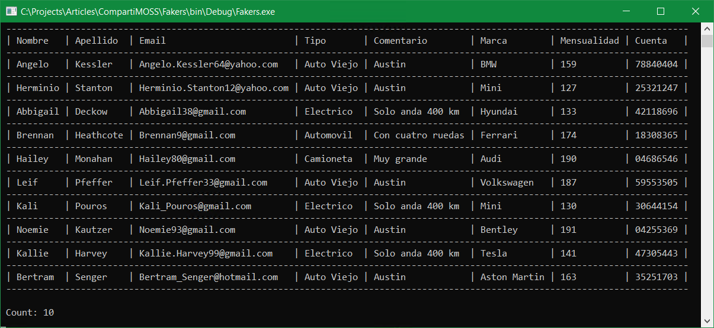
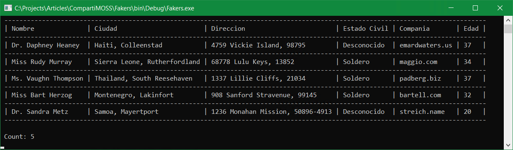

¿Cuántas veces, cuando está programando o probando una aplicación, ha
necesitado tener algunos (o muchos) datos a su disposición para ver si
todo funciona bien? ¿Para saber si un sistema reacciona con suficiente
rapidez? ¿Para poder dormir tranquilo, sin tener pesadillas en las que
despierta a media noche gritando: "Datos, datos... Mi reino por más
datos..."? (con mis disculpas a Ricardo III y William Shakespeare).

"Fakers" pueden ser la solución, si no desea programar su propio
generador específico para su aplicación. Fakers son Frameworks o
librerías que permiten crear datos con poco esfuerzo. Piense, por
ejemplo, en el caso clásico de un listado de personas (nombre, apellido,
dirección, número de teléfono, numero nacional de identidad), pero, con
toda seguridad, muchos otros casos de uso se le ocurren fácilmente.

Hay varios Fakers que se pueden utilizar en diferentes maneras: para
crear listados en formato .csv (Excel), o para inyectar los datos en
bases de datos, o para rellenar los objetos en su programa con datos de
prueba. La mayoría de los Frameworks son Open Source y gratis, pero hay
alguno, sobre todo para bases de datos, que son de pago. Al final del
articulo puede encontrar una lista de referencia con varios de ellos.

Hay dos Fakers en el momento que son, probablemente, los más utilizados:
Faker.NET y Bogus.

**Bogus**

Bogus es un proyecto Open Source de Brian Chávez que se puede encontrar
en GitHub (https://github.com/bchavez/Bogus) y en la galería de NuGet
(https://www.nuget.org/packages/Bogus/). Bogus puede generar
prácticamente cualquier tipo de datos utilizando los lenguajes de .NET
(CSharp, VB, F#).

Para utilizar Bogus en Visual Studio, instale primero el NuGet
"Bogus", o descárguelo desde la galería de NuGet he instale el
ejecutable en el computador de desarrollo.

Bogus ofrece métodos para crear múltiples tipos de datos por defecto:
direcciones, datos comerciales (facturas, cantidades, datos de bitcoin),
datos relacionados con compañías (nombres, etc.), fechas, para finanzas,
imágenes, internet (dominios, direcciones de Email), "LoremIpsum"
(generación de texto random), música, nombres, personas, teléfonos,
random, vehículos, pero también ofrece la posibilidad de crear
categorías propias si es necesario.

La programación de un generador de datos comienza con la definición de
una clase POCO ("Plain Old CLR Objects", es decir, una Entidad), que
es un objecto simple, sin código de lógica en la clase ni herencia de
algún tipo. El siguiente ejemplo define una clase POCO para un
parqueadero de autos, con la que se pueden crear objetos (automóviles)
que están guardados en un parqueadero. La clase no tiene ninguna
utilidad práctica, ha sido diseñada solamente para demostrar el
funcionamiento y algunas posibilidades de Bogus:

```
public class Automovil
{
    public string PropietarioNombre { get; set; }
    public string PropietarioApellido { get; set; }
    public string PropietarioEmail { get; set; }
    public TipoAuto AutoTipo { get; set; }
    public string AutoFabricante { get; set; }
    public int PrecioMensual { get; set; }
    public string CuentaGarage { get; set; }
}
``` 

Fuera de los tipos simples y por defecto como string, int, bool, etc.,
es posible utilizar tipos complejos como "TipoAuto", que es otra clase
POCO que incluye enumeraciones y Listas Genéricas:

```
public class TipoAuto
{
    public string Tipo { get; set; }
    public string Descripcion { get; set; }
    public TipoTransamision Transmision { get; set; }

    public static TipoAuto Automovil = new TipoAuto() { Tipo =
        "Automovil", Descripcion = "Con cuatro ruedas", Transmision =
        TipoTransamision.Automatica };

    public static TipoAuto Camioneta = new TipoAuto() { Tipo =
        "Camioneta", Descripcion = "Muy grande", Transmision =
        TipoTransamision.Manual };

    public static TipoAuto AutoViejo = new TipoAuto() { Tipo = "Auto
        Viejo", Descripcion = "Austin", Transmision = TipoTransamision.Manual
        };

    public static TipoAuto Electrico = new TipoAuto() { Tipo =
        "Electrico", Descripcion = "Solo anda 400 km", Transmision =
        TipoTransamision.NoTiene };

    public static List<TipoAuto> TodosLosAutos = new List<TipoAuto>
    {
        Automovil,
        Camioneta,
        AutoViejo,
        Electrico
    };
}

public enum TipoTransamision
{
    Automatica,
    Manual,
    NoTiene
}
```

Una vez se dispone de la clase base, es necesario definir el tipo de
reglas que van a regir la generación de los objetos. En el ejemplo vamos
a especificar que:

-   Nombre y apellido corresponden a nombres de personas. Bogus genera
    nombres y apellidos solamente en inglés, pero si es necesario, se
    puede modificar el código fuente del Framework (está en GitHub) para
    que genere nombres característicos en otros idiomas.

-   La dirección de Email es formada en base al nombre y apellido, con
    un dominio random pero existente (yahoo.com, hotmail.com, etc.).

-   El tipo de auto es generado random de los tipos definidos por la
    clase "TipoAuto". Esta es una forma fácil de crear propiedades
    personalizadas (que no están definidas por defecto en Bogus) para el
    objeto.

-   La marca del vehículo se obtiene de uno de los generadores por
    defecto de Bogus ("Vehicle.Manufacturer").

-   El alquiler mensual del parqueadero es un numero random entre 100
    y 200.

-   El numero de la cuenta es también generado por Bogus usando su clase
    para datos financieros.

El generador se crea programáticamente por medio de la clase "Faker"
de Bogus usando una sintaxis fluida ("Fluent interface"), la que
permite encadenar llamadas a los métodos de configuración, "RuleFor"
en este caso:

```
Faker<Automovil> generadorDeAutos = new Faker<Automovil>()
    .RuleFor(ag => ag.PropietarioNombre, bog => bog.Name.FirstName())
    .RuleFor(ag => ag.PropietarioApellido, bog => bog.Name.LastName())
    .RuleFor(ag => ag.PropietarioEmail, (bog, ag) => bog.Internet.

Email(ag.PropietarioNombre, ag.PropietarioApellido))
    .RuleFor(ag => ag.AutoTipo, bog =>
        bog.PickRandom(TipoAuto.TodosLosAutos))
    .RuleFor(ag => ag.AutoFabricante, bog => bog.Vehicle.Manufacturer())
    .RuleFor(ag => ag.PrecioMensual, bog => bog.Random.Number(100, 200))
    .RuleFor(ag => ag.CuentaGarage, bog => bog.Finance.Account());
```

Finalmente, el generador se puede iniciar con el método "Generate"
indicando el número de objetos que se necesitan, 10 en el ejemplo:

```
List<Automovil> autosEnParqueadero = generadorDeAutos.Generate(10);
```

El resultado en forma tabular es similar al mostrado en la siguiente
imagen:



Nota: para generar la tabla desde una aplicación de consola se ha utilizado el NuGet "ConsoleTable".

Una vez se tiene una lista genérica con todos los objetos generados
("autosEnParqueadero" en el ejemplo), no es muy difícil crear un
archivo JSON o .csv con los resultados:

```
File.WriteAllText(@"C:TemporarymyAutos.json",
    JsonConvert.SerializeObject(autosEnParqueadero, Formatting.Indented));

SaveToCsv(autosEnParqueadero, @"C:TemporarymyAutos.csv");
```

Para exportar la lista como JSON se ha utilizado el NuGet
"Newtonsoft.Json" y para el archivo .csv el método "SaveToCsv"
incluido en Bogus. Nota: El método "SaveToCsv" no es capaz de extraer
los valores correctos de objectos complejos, por lo que, en el csv, en
el campo "AutoTipo", aparece siempre "Fakers.TipoAuto".

Una vez se tiene el archivo .csv, por medio de Excel se puede crear un
archivo .xlsx que se puede utilizar para crear Listas Personalizadas de
SharePoint sin necesidad de ningún tipo de programación.

**Faker.NET**

Faker (https://github.com/oriches/faker-cs, NuGet
https://www.nuget.org/packages/Faker.Net>) es uno de los primeros
Frameworks creados para generar datos. Originalmente creado en Ruby hace
casi veinte años, ha sido el origen de varios otros Frameworks (entre
otros, Bogus fue originalmente basado en Faker). Faker dispone de menos
funcionalidad por defecto que Bogus, pero su implementación es más
sencilla y rápida, útil sobre todo cuando se necesita generar miles
(inclusive millones) de objetos.

Para programar un generador de datos con Faker se debe comenzar de nuevo
con la creación de una clase POCO que define los objetos a utilizar. En
el siguiente ejemplo se crea un generador de usuarios que utiliza tipos
genéricos y una enumeración:

```
public class Usuario
{
    public string Nombre { get; set; }
    public string Ciudad { get; set; }
    public string Direccion { get; set; }
    public string Bio { get; set; }
    public EstadoCivil EstadoCivil { get; set; }
    public string Compannia { get; set; }
    public string Email { get; set; }
    public int Edad { get; set; }
}

public enum EstadoCivil
{
    Soldero,
    Casado,
    Viudo,
    Desconocido
}
```

Faker no dispone de funcionalidad para crear una Lista Genérica por sí
mismo, por lo que hay que programarla explícitamente en el código fuente
(variable "NumeroDeUsuarios" en el siguiente ejemplo). Las reglas se
programan utilizando el método "Faker":

```
List<Usuario> misUsuarios = new List<Usuario>();
for (int unUsuario = 1; unUsuario <= NumeroDeUsuarios; unUsuario++)
{
    Usuario myUsuario = new Usuario();
    myUsuario.Nombre = Faker.Name.FullName(NameFormats.WithPrefix);
    myUsuario.Ciudad = $"{Faker.Address.Country()},
        {Faker.Address.City()}";
    myUsuario.Direccion = $"{Faker.Address.StreetAddress()},
        {Faker.Address.ZipCode()}";
    myUsuario.Bio = String.Join(" ", Faker.Lorem.Words(2));
    myUsuario.EstadoCivil = Faker.Enum.Random<EstadoCivil>();
    myUsuario.Compannia = Faker.Internet.DomainName();
    myUsuario.Email = Faker.Internet.Email(myUserio.Nombre);
    myUsuario.Edad = Faker.RandomNumber.Next(40, 18);
    misUsuarios.Add(myUsuario);
}
```

Faker tiene métodos para generar direcciones (USA y UK), información de
compañías, países, monedas, datos financieros, de identificación, de
internet, nombres, teléfonos, etc..

El resultado (mostrando datos parciales) del generador es similar al
mostrado en la siguiente imagen:



**Otros Fakers**

Hay numerosos generadores y Frameworks para generadores disponibles. En
seguida una pequeña recopilación de algunos de ellos.

**FakeItEasy** (https://fakeiteasy.github.io)

Open Source (https://github.com/FakeItEasy/FakeItEasy) y muy popular
para crear mocks y stubs para Unit Test. Dispone también de un NuGet
(https://www.nuget.org/profiles/FakeItEasy).

**SQL Data Generator**
(https://www.red-gate.com/products/sql-development/sql-data-generator/)

Creado por Redgate y comercial (no es gratis). Para generar datos
directamente en SQL Server.

**AutoBogus** (https://github.com/nickdodd79/AutoBogus)

Una biblioteca de C# que complementa a Bogus, agregándole capacidades de
creación automática y para popular objetos.

**ObjectHydrator** (https://github.com/PrintsCharming/ObjectHydrator)

Permite pasar clases POCO personalizadas, y devuelve una instancia de la
clase poblada con datos generados aleatoriamente, pero de aspecto real.
Open Source y con un NuGet disponible
(http://www.nuget.org/packages/objecthydrator/). Tiene un generador de
claves (passwords).

**Oxygenize** (https://github.com/kamil-mrzyglod/Oxygenize)

Oxygenize es una biblioteca que ayuda a crear datos en clases y
estructuras. El propósito principal es generar múltiples casos de prueba
automáticamente. Soporta tres estrategias de generación de datos:
random, personalizado o una mezcla de las dos. Open Source y dispone de
un NuGet (https://www.nuget.org/packages/Oxygenize/).

**RasicN** (https://github.com/RasicN/random-test-values)

En esta librería, lo importante es que los datos se devuelvan en el
formato correcto, no su apariencia. No utilice este framework si lo que
necesita son datos con alguna similitud a la vida real, úsela si lo
único que importa es su sintaxis, ya que por definición los datos son
totalmente aleatorios. OpenSource (aunque parece que el proyecto está
abandonado) y NuGet
(https://www.nuget.org/packages/RandomTestValues/).

**AutoFixture** (https://github.com/AutoFixture/AutoFixture)

librería creada específicamente para automatizar el uso de datos de
prueba en Unit Test. Al escribir pruebas unitarias, normalmente es
necesario crear algunos objetos que representen el estado inicial de la
prueba. A menudo, una API obliga a especificar muchos más datos de los
que realmente se necesitan, por lo que con frecuencia se termina creando
objetos que no tienen relevancia en la prueba, simplemente para hacer
que el código se pueda compilar. AutoFixture ayuda creando variables
anónimas automáticamente. Open Source y con un NuGet
(https://www.nuget.org/packages/AutoFixture).

**Nbuilder** (https://github.com/nbuilder/nbuilder)

A través de una interfaz fluida y extensible, NBuilder permite crear
rápidamente datos de prueba, asignando automáticamente valores a
propiedades y campos públicos. NBuilder permite validar las propiedades
mediante expresiones lambda. Open Source con NuGet
(https://ci.appveyor.com/project/NBuilder).

**Código fuente de los ejemplos**

El código fuente para los dos ejemplos (con Bogus y Faker) para una
aplicación de consola se puede encontrar en el sitio de GitHub
https://github.com/gavdPublic/CompartiMOSS50Fakers.

**Conclusión**

Si necesita crear datos para probar una aplicación, para hacer algún
tipo de demostración, para testear el rendimiento de un sistema
determinado, o por alguna otra razón, existen varios frameworks y
librerías que permiten hacer generadores con poco esfuerzo y pocas
líneas de código. Bogus y Faker.NET son dos de ellos, de los cuales se
muestran ejemplos en este artículo. Pero existen muchos otros, a veces
más especializados, que se pueden encontrar en Internet.

**Gustavo Velez** <br />
MVP Offices Apps & Services <br />
gustavo@gavd.net <br />
https://guitaca.com <br />
http://www.gavd.net <br /> 
 
import LayoutNumber from '../../../components/layout-article'
export default LayoutNumber
