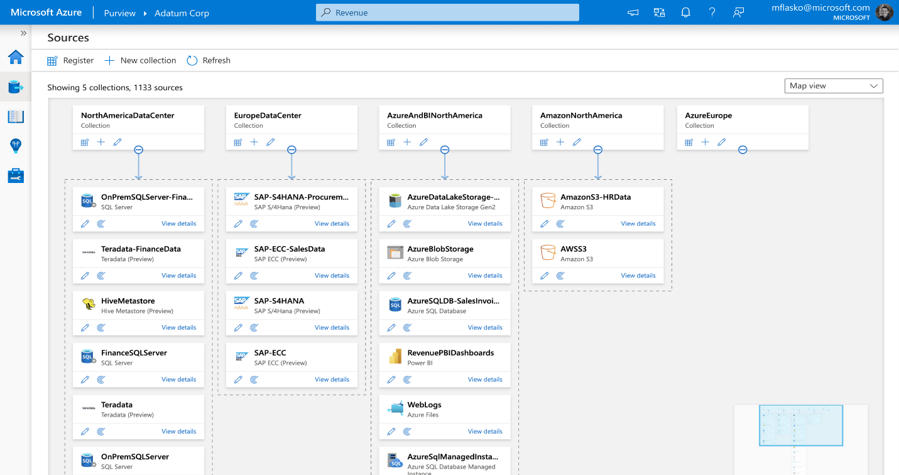

En este articulo hablaremos sobre esta plataforma de gobernabilidad y
lineaje de datos en Azure, que fue anunciada en disponibilidad general
recientemente y que viene pisando fuerte en el mundo de analitica a
nivel Enterprise. En una generalidad Microsoft con esta herramienta
busca integrar una atractiva manera de apoyar en temas de gobernabilidad
de datos, y al mismo tiempo maximizar el valor de datos para unidades de
negocio y consumidores.

En términos generales Microsoft ha encontrado la manera de generar una
opción para todos aquellos profesionales que trabajan con datos, para
mejorar no solo la integración sino la experiencia de usuario.

**Conceptos**

Comencemos con conceptos básicos de esta herramienta. Al dirigirnos al
portal de Azure y utilizando la búsqueda con la palabra clave Purview
encontraremos:

La opción de Purview Accounts, que es la que nos dará acceso a crear
nuestra cuenta en el Portal de Azure:

Como podemos ver en la imagen anterior, solo necesitamos definir nuestra
suscripción, el grupo de recursos que utilizaremos, dar un nombre único
a nuestra cuenta de Purview, y definir la región donde crearemos nuestra
instancia. En terminos de redes, podremos seleccionar si deseamos
conectarnos a nuestro portal de Purview en forma pública o privada a
través de un Endpoint. Una vez generada nuestra cuenta, podremos acceder
a lo que denominamos Purview Studio:

En nuestra experiencia con Purview Studio tendremos una interfaz capaz
de darnos una visión unificada de catalogo de datos (búsqueda, glosario
de negocios, lineaje), reportes de uso, escaneos predeterminados, y
clasificación de datos. Purview Studio se divide en Hubs de Actividades
como una manera practica de organizar tareas necesarias para el manejo
de actividades de gobernabilidad.

**Capacidades**

Varias de las actividades que se pueden realizar en Purview Studio
vinculadas a tareas, artefactos y documentación basado en el rol que se
conecta a nuestra instancia:

**Origenes**

Es posible mapear datos para manejar un mapa de metadata operacional y
transaccional independientemente donde resida. Algunas de las ventajas:

-   Escaneo automático de fuentes On-Premises, multi-nube y SaaS data.

-   Descubrir origenes de datos tales como Azure, Power BI, SQL.
    Integraciones posibles con Power BI, SQL (On Premises, Azure,
    Managed Instance) y Servicios de Azure tales como: Synapse, Cosmos
    DB, ADLS.

-   Manejo de metadata

-   Acceso a Apache Atlas Open API permitiendo publicar metadata y
    lineaje desde varios sistemas open-source.

Para registrar un nuevo origen de datos:

**Escaneos**

En Purview tenemos acceso a escaneos y clasificaciones automáticos para
varios origenes de datos On Premises, Multi-Nube y SaaS data. Podemos a
su vez definir el contexto de nuestro escaneo (por ejemplo, indicando
una cuenta entera de almacenamiento o solo ciertos contenedores o
archivos específicos):

También contamos con la capacidad de escanear solo ciertos tipos de
archivos:

De esta manera logramos a su vez y una vez escaneados diferentes
origenes de datos tener una visualización excelente del lineaje de
nuestra informacion corporativa:

**Conclusión**

A modo de conclusión, se vienen muchas funcionalidades en Purview que
busca de esta manera contribuir en el descubrimiento, búsqueda y
enriquecimiento de metada, lineaje, etiquetado de datos sensibles entre
otros para empoderar a las organizaciones en materia de gobernabilidad
de la informacion.

**Gastón Cruz**  
Data Platform MVP