Mucho se está hablando sobre #MicrosoftViva y #EXP últimamente. Para los
que ya llevamos tiempo usando productos y servicios de Microsoft sabemos
que una parte fundamental es la colaboración empresarial, con
protagonistas como SharePoint, Skype for Business y Office Services. Los
cuales han hecho la transición a un modelo de colaboración basado en
chat, reuniones y llamadas llamado ahora Microsoft Teams. Hasta aquí la
mayoría ya estamos familiarizados con el tema; sin embargo, en recientes
fechas se introdujo un nuevo ámbito en la colaboración llamado
"Plataforma de Experiencias para el Empleado" o EXP por sus siglas en
ingles.

Esta nueva plataforma, por el momento, incluye un set de servicios
conocido como Microsoft Viva que añade los módulos de #VivaConnections,
#VivaLearning, #VivaTopics y #VivaInsights. Para conocer más sobre
#MicrosoftViva les compartimos el curso introductorio de Microsoft
Learn: [Involucrar a los empleados con Microsoft Teams, Viva y Yammer -
Learn | Microsoft
Docs](https://docs.microsoft.com/es-mx/learn/modules/engage-employees-with-microsoft-stream-teams-yammer/).

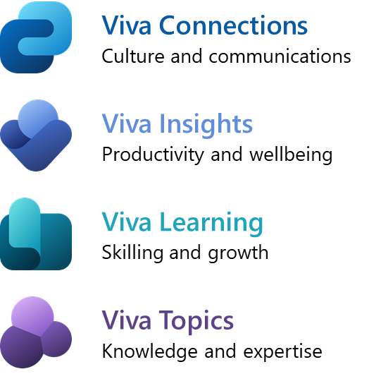

#VivaInsights aprovecha las estadísticas de consumo de los servicios de
Microsoft por parte de los empleados para ofrecer recomendaciones de
mejora continua en la productividad y el bienestar de cada empleado,
mánager o líder de la organización; en el caso de los managers y líderes
estás recomendaciones no son solo personales sino también sobre los
equipos de trabajo a su cargo. Esto se logra incorporando MyAnalytics
para las estadísticas de consumo personal y Workplace Analytics para las
estadísticas de la organización, además de concentrar datos de correos,
llamadas, reuniones y chats que se obtienen a través de Outlook y Teams,
así como información adicional que se proporcione sobre la estructura
organizacional y datos de CRM.

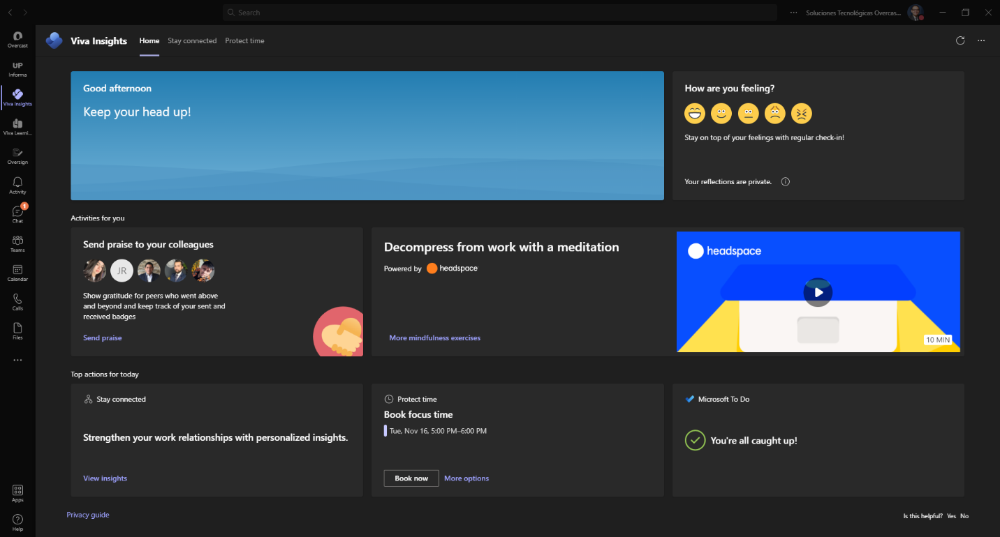

Se pueden obtener conclusiones personales en el flujo de trabajo, ya que
se exploran maneras de crear hábitos de trabajo, también hacer el
seguimiento de las reuniones para mejorar la eficiencia, y reservar
tiempo para el trabajo enfocado, y priorizar el bienestar con
recomendaciones prácticas tales como los ejercicios de respiración
proporcionados por Headspace.

Se fomenta la productividad y el bienestar de los equipo grandes o
pequeños obteniendo conclusiones para directivos y líderes. También
ayuda a los administradores a explorar y crear hábitos personales que
tengan un impacto en la forma de trabajar en equipo, programando días en
los que no haya reuniones.

También es importante mencionar que se pueden crear informes para los
lideres empresariales, contando con aceleradores de análisis y
visualización de informes interactivos. De aquí surge, como se puede ver
en la siguiente imagen, Workpalce Analytics, un espacio Web de análisis
de comportamiento laboral que permite a los analistas, gerentes y
líderes, analizar las tendencias de los empleados basados en análisis
predefinidos con plantillas y así activar planes de mejora continua que
también pueden basarse en plantillas preestablecidas. Para saber más
sobre #VivaInsights te compartimos el siguiente curso introductorio de
Microsoft Learn: [Introducción a Ideas Microsoft Viva (Workplace
Analytics) - Learn | Microsoft
Docs](https://docs.microsoft.com/es-es/learn/paths/m365-workplace-analytics-start/).

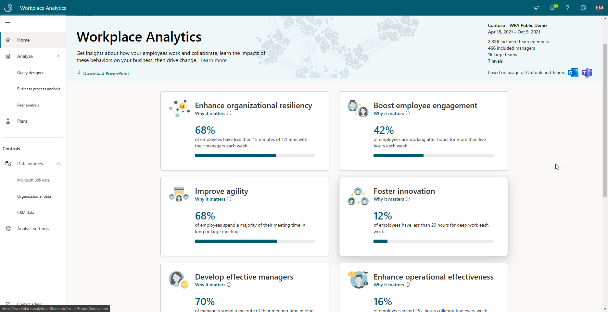

#VivaConnections permite traer parte de la colaboración empresarial a
Teams, así los empleados ya no requieren salir de Teams para navegar en
los contenidos de los sitios de SharePoint, además, gracias a las
extensiones para #VivaConnections, ahora también podemos agregar
tarjetas adaptables a nuestros contenidos en las páginas de SharePoint
que incorporen información necesaria para los empleados y que provenga
de otros servicios y aplicaciones.

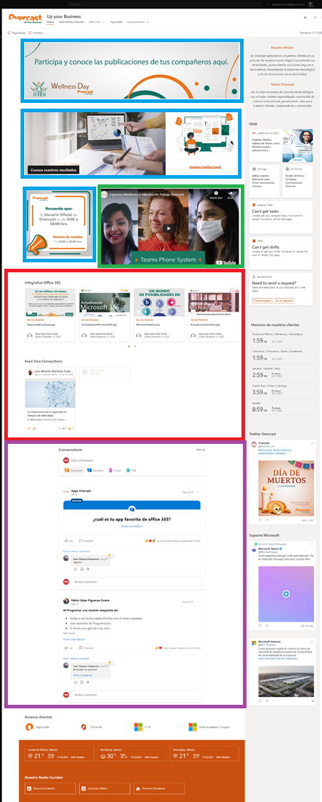

Lo que nos proporciona #VivaConnections es un entorno de colaboración
que les provee a nuestros colaboradores un entorno integrado y
personalizable, que les permite a los colaboradores navegar dentro de
los contenidos publicados en el sitio, mejorando su experiencia durante
el desarrollo de sus actividades dentro de su organización, y sin la
necesidad de salirse de su entorno de trabajo en Microsoft Teams.

Brindándole acceso a todas las herramientas que se necesitan para la
realización de sus actividades, así como también información necesaria
para el desarrollo de estas, como por ejemplo las noticias o comunicados
importantes que ocurren dentro de la empresa mediante el uso de
infografías, las cuales se pueden mostrar como tarjetas personalizadas
(Adaptive Cards en inglés, para más información consulta [Introducción a
Tarjetas adaptables - Adaptive Cards | Microsoft
Docs](https://docs.microsoft.com/es-mx/adaptive-cards/)). Un ejemplo de
esto lo podemos ver en la Imagen 4 resaltado de color rojo.

También tenemos la posibilidad publicar comunicados agregando una o más
imágenes con la información a difundir, además tenemos la capacidad de
poder agregar un enlace que nos permite redirigir al usuario a otros
contenidos dentro de la misma navegación, el cual puede ser interno o
externo a la organización, con la finalidad de complementar la
información mostrada; podemos ver algunos ejemplos en la sección
resaltada de color azul en la Imagen 4.

Otro de los elementos de multimedia que se pueden compartir dentro de la
organización son videos los cuales pueden estar guardados dentro de
OneDrive, Microsoft Stream o inclusive en sitios externos como por
ejemplo YouTube, un ejemplo de esto lo podemos ver resaltado de color
verde en la Imagen 4.

Además, le damos la capacidad a nuestros colaboradores para poder dejar
sus comentarios y observaciones, haciendo uso de la red social Yammer,
ahora conocido como Communities en Microsoft Teams, con la finalidad de
fomentar la comunicación entre los colaboradores, un ejemplo de esto lo
podemos ver resaltado en color morado en la Imagen 4.

Otra de las herramientas que podemos agregar es el acceso a los eventos
y reuniones a las que el colaborador ha sido convocado para esta, así
también como información externa a la información externa de la empresa,
como por ejemplo las redes sociales.

Con la integración de todas las herramientas que podemos integrar con
#VivaConnections, le proveemos a todos nuestros colaboradores una nueva
experiencia laboral, promoviendo la colaboración, la comunicación y
trabajo en equipo en todos sus dispositivos. Para conocer más sobre
#VivaConnections les compartimos el curso introductorio en Microsoft
Learn: [Introducción a Conexiones Microsoft Viva - Learn | Microsoft
Docs](https://docs.microsoft.com/es-es/learn/modules/viva-connections-get-started/).

#VivaLearning permite que los empleados puedan manejar su proceso de
capacitación técnica y personal desde Microsoft Teams, de esta forma
pueden en la misma plataforma colaborar y capacitarse, además de
mantenerse tanto ellos como sus managers informados del progreso de su
capacitación. Como fuentes de capacitación aceptadas actualmente tenemos
Microsoft Learn, Microsoft 365 Training, LinkedIn Learning (el cual
requiere de una suscripción premium) y SharePoint. Más adelante se
integrarán nuevas fuentes, así como LMS.

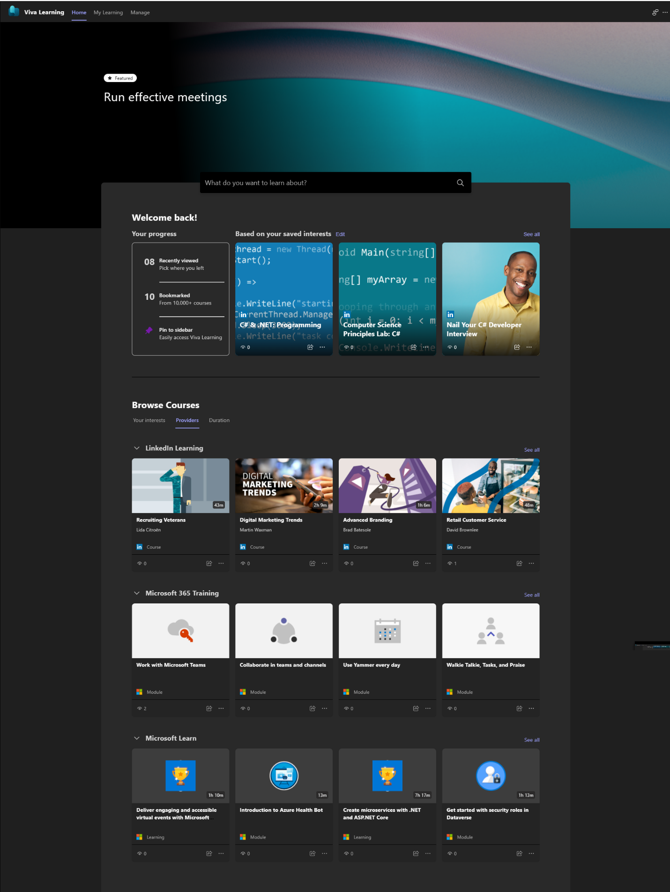

Además, desde el portal de #VivaLearning**,** cada usuario puede
visualizar todos los cursos habilitados dentro de la organización y ver
cuáles son de mayor interés tanto para él como para sus demás
compañeros. Todos los cursos pueden ser segmentados por categorías,
plataformas y duración.

En la sección **"**My Learning**"** podemos visualizar los cursos
Marcados o Guardados para ver en otro momento, cursos recomendados por
alguno de tus compañeros, los cursos visualizados más recientemente y un
historial de tus cursos completados. En esta sección los gerentes de la
organización podrán asignar a sus equipos de trabajo las capacitaciones
que requieran para su desarrollo profesional.

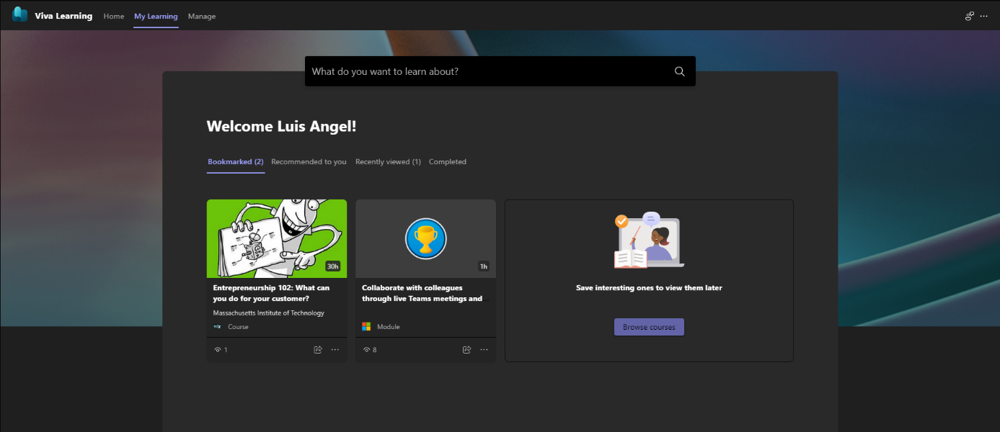

Puedes recomendarle un curso a uno o cualquiera de tus compañeros en la
organización, con un comentario y una fecha límite recomendada, de esta
forma se le puede dar seguimiento al aprendizaje de los colaboradores
dentro de la organización.

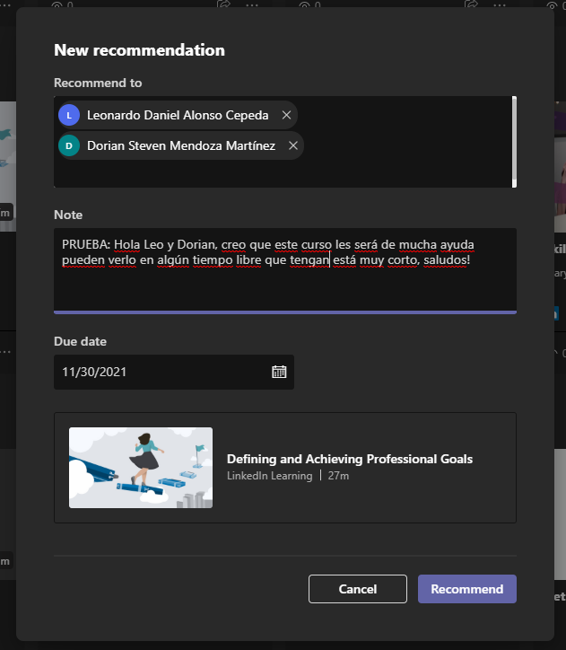

En la sección **"**Manage**"** podrás visualizar el historial y
progreso de los cursos que recomendaste a tus colaboradores, dicho
progreso es completamente transparente desde Microsoft Teams para Web,
Desktop y dispositivos móviles.

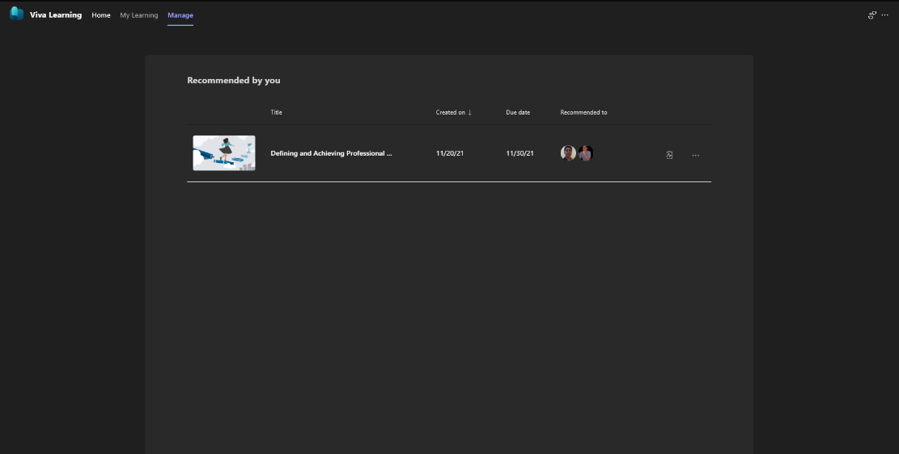

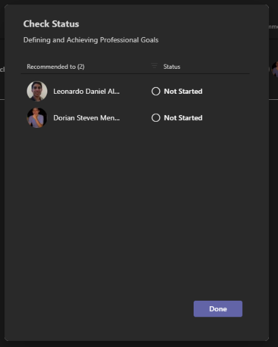

#VivaLearning proporciona a los usuarios una experiencia completamente
distinta de aprendizaje al extender funcionalidades de Microsoft Teams,
de esta forma los usuarios disfrutan de una navegación amigable en la
búsqueda de cursos nuevos y en el seguimiento del aprendizaje propio y
de los demás sin salir de la interfaz de Microsoft Teams, ya sea en Web,
Desktop o dispositivos móviles.

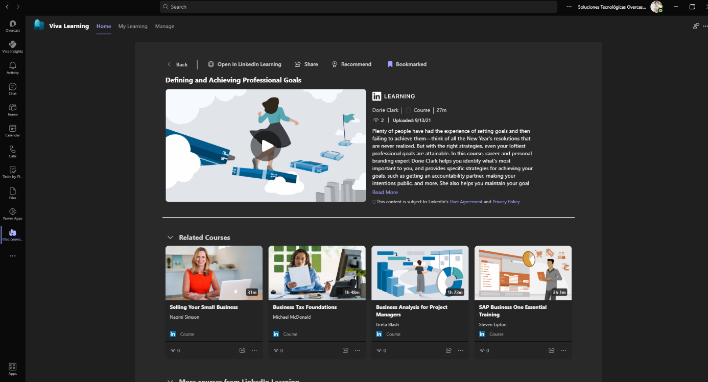

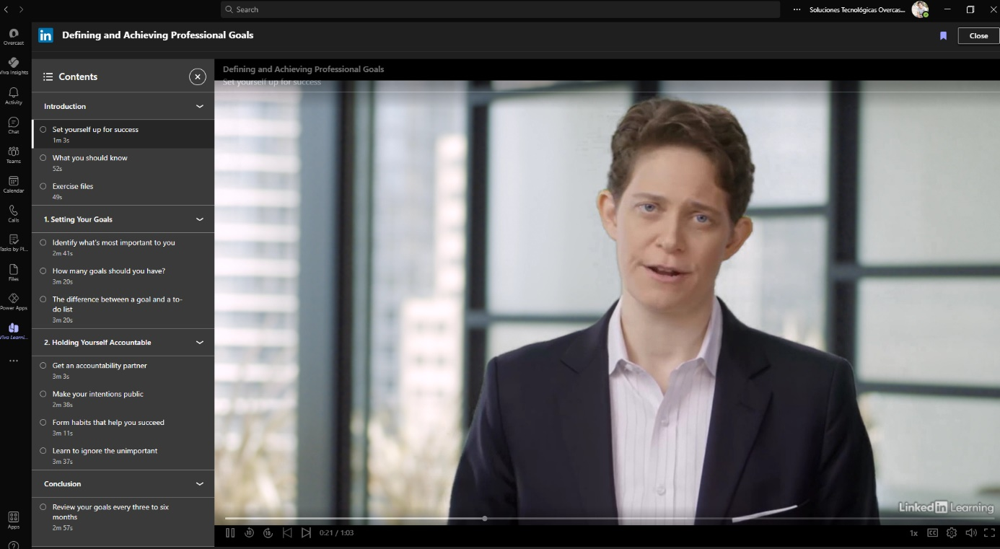

Gracias a qué #VivaLearning extiende funcionalidades de Microsoft Teams,
este se adaptar fácilmente a la interfaz de los dispositivos móviles
conservando el estilo de los componentes, solo requiere que los usuarios
se encuentren autenticados con su cuenta de Office 365.

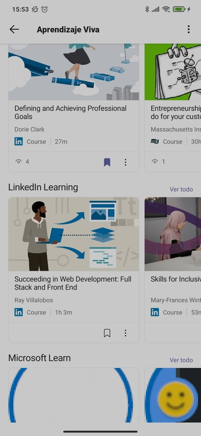

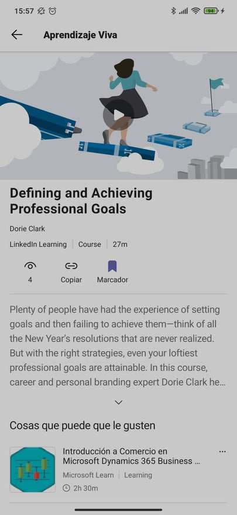

**[#VivaTopics](https://www.microsoft.com/es-mx/microsoft-viva/topics)**
ayuda a entender el contenido y hacerlo más transparente para los
empleados, para ello utiliza servicios de indexación y modelos de
inteligencia artificial que permiten darle al empleado todo lo necesario
alrededor de cada tópico o metadato que comúnmente se utiliza en las
organizaciones. Entre los componentes que podemos crear y administrar
están el Topic Center para controlar los tópicos y el Content Center
para controlar los modelos de Inteligencia Artificial gracias a
**[SharePoint
Syntex](https://techcommunity.microsoft.com/t5/sharepoint-syntex/bg-p/SharePointSyntex).**

Algunas de las características destacadas de #VivaTopics son el poder
visualizar estos temas generados durante toda la navegación del usuario
en servicios de la organización, tales como los contenidos de sitios,
los chats, los canales, los documentos, etc.; los colaboradores que son
usuarios con permisos para editar los temas, estos permisos pueden ser
otorgados a través de la configuración de los temas de #VivaTopics en el
Topic Center, y el poder administrar los topics y la información en
nuestra organización de una manera más amigable para el usuario.

Gracias a #VivaTopics los usuarios pueden ver los temas resaltados en
las páginas de SharePoint, el buscador de SharePoint, búsquedas dentro
de las aplicaciones de Microsoft, tales como Microsoft Teams y Office,
así como el Topic Center

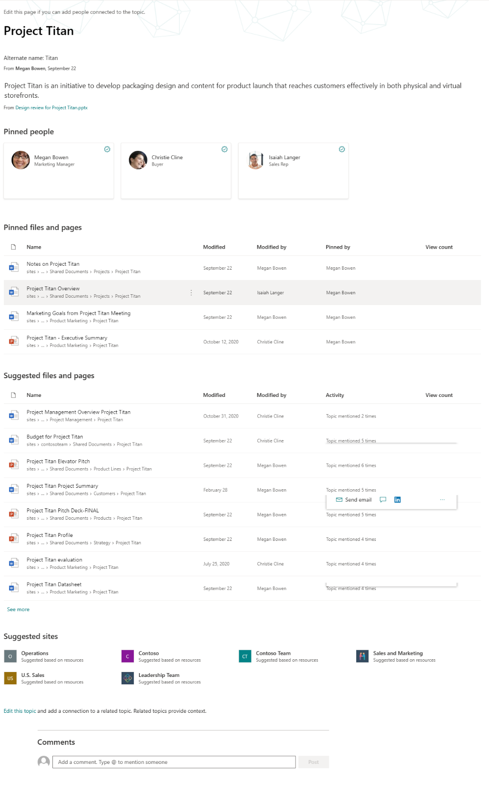

En #VivaTopics, la IA automáticamente identifica los contenidos y las
personas para agruparlos en temas relacionados, aunque esto se hace de
una forma automática, se puede ajustar antes de ser visto por el usuario
final, como quitar algunos archivos o personas que no estén relacionadas
al tema, durante este proceso toda esa información recopilada es
mostrada en una Topic Page de la siguiente forma:

-   Nombre.

-   Breve descripción.

-   Personas que estén relacionadas con el tema generado.

-   Y los recursos (archivos, paginas, sitios relacionados).

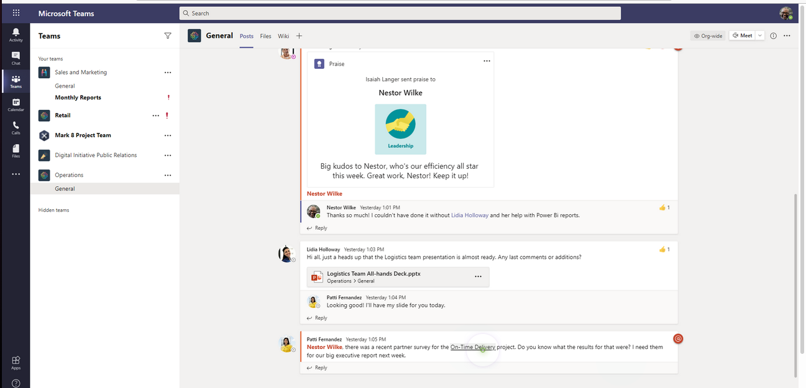

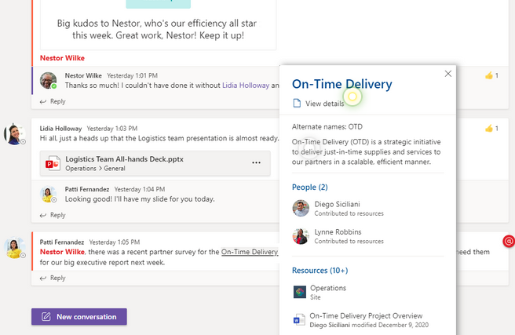

Estos temas pueden ser vistos por los usuarios en páginas modernas de
SharePoint y Microsoft Search, además de poder acceder mediante palabras
claves en las diferentes aplicaciones de Microsoft, como Microsoft
Teams, Word, PowerPoint, por decir algunos ejemplos.

El Topic Center se crea al momento de configurar #VivaTopics y nos
ayudará a poder visualizar nuestros temas y, en caso de tener permisos,
poder gestionarlos, este lo podemos encontrar en la configuración de
nuestra organización, en la pestaña de servicios, seleccionamos Topic
Experiences, y es donde estará el enlace a nuestro Topic Center.

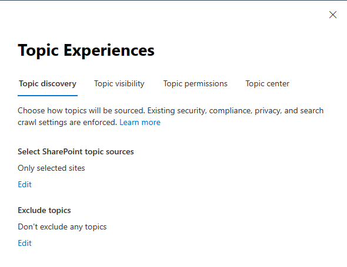

Dentro del Topic Center contamos con un panel de administración, dentro
de las acciones que se pueden realizar tenemos:

-   Poder confirmar los temas sugeridos por la IA

-   Publicar el tema, con esto los temas son resaltados para todos los
    usuarios que tengan acceso al tema, por lo que ya pueden ser vistos
    desde SharePoint o resaltadas en los chats de Microsoft Teams.

-   Quitar los temas que ya no son de interés para la organización,
    estos son llevados a una sección que podemos definir como un
    contenedor de basura, en la que eventualmente pueden volver a ser
    publicados de ser necesarios.

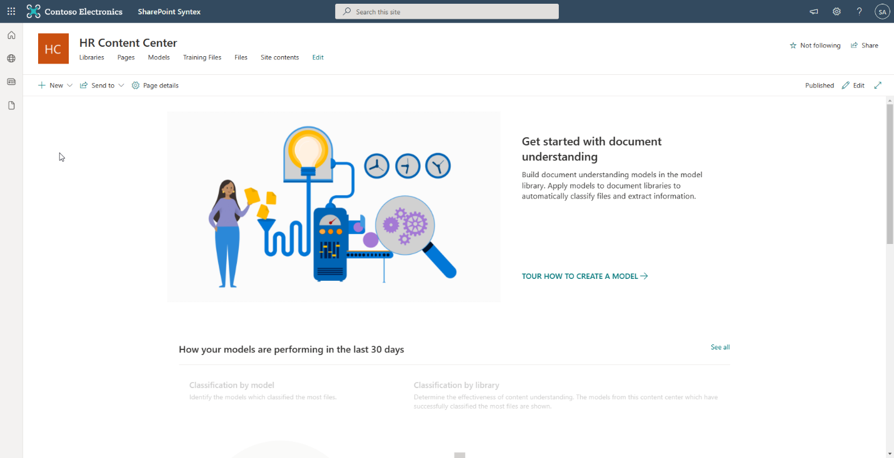

Otra de las funciones que nos ofrece #VivaTopics es el poder limitar la
información a nuestros usuarios que no tienen los permisos, por esta
razón podemos hacer que la Topic Page muestre solo ciertos elementos,
esto claro dependiendo del nivel de permisos que tenga el usuario.

También dentro de #VivaTopics, con ayuda de SharePoint Syntex, podemos
crear las palabras claves en los recursos de nuestra organización,
agregando los documentos necesarios y la programación sin código de la
inteligencia artificial basado en nuestros modelos, lo que genera que la
interacción al momento de consultar en SharePoint o en cualquiera de las
aplicaciones de Microsoft la relacione con nuestro tema o palabra clave.

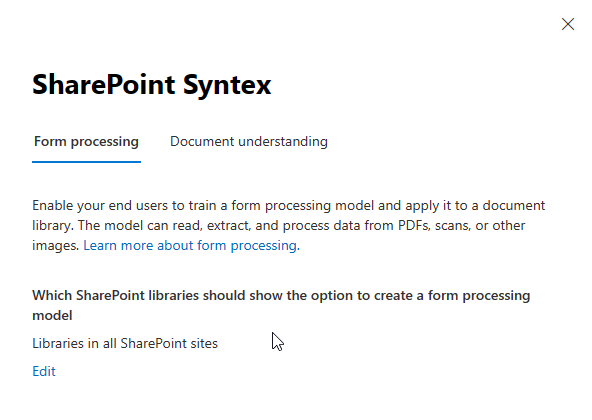

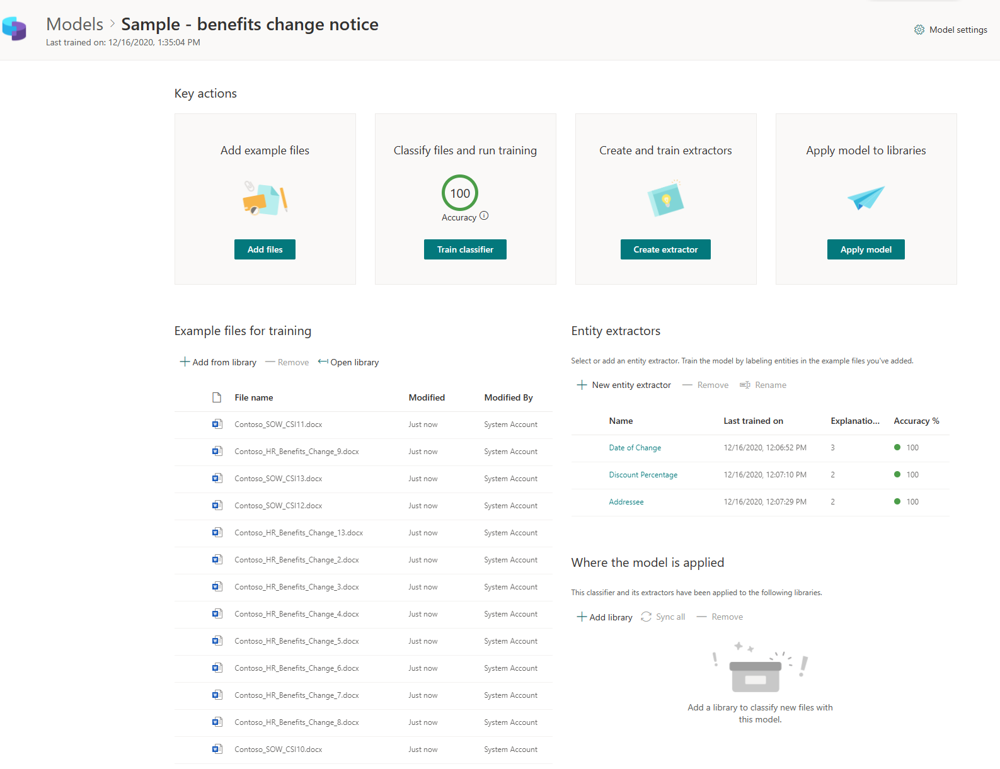

#VivaTopics cuenta con estadísticas para medir el impacto o importancia
que ha tenido cada tema o palabra clave, a continuación, podemos ver una
gráfica que muestra el total de temas acorde a la fecha en la cual
fueron publicado y puede ser una gran herramienta para detectar la
velocidad que tiene la IA al generar nuevos temas.

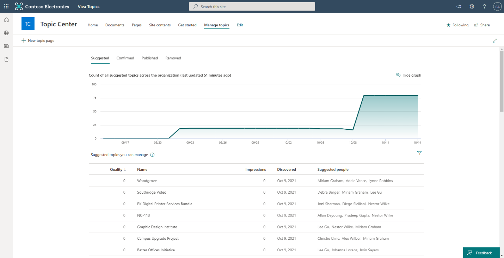

Para conocer más detalles, les invitamos a consultar el
[FAQ](https://resources.techcommunity.microsoft.com/viva-topics/faq/)
sobre #VivaTopics y el curso introductorio en Microsoft Learn:
[Introducción a Temas Microsoft Viva - Learn | Microsoft
Docs](https://docs.microsoft.com/es-es/learn/paths/m365-viva-topics/).
Además, para probar y obtener otros recursos sobre #VivaTopics, pueden
consultar el [Resource
Center](https://resources.techcommunity.microsoft.com/viva-topics/) de
Microsoft.

Por último, si necesitan apoyo de un Partner para conocer e implementar
cualquiera de los módulos de #MicrosoftViva, como #VivaConnections,
#VivaLearning, #VivaInsights y #VivaTopics puedes ponerte en contacto
con cualquiera de los miembros del equipo que participamos en la
elaboración de este artículo.

**Equipo de colaboradores:**  
**Vladimir Medina: <vmedina@overcastmx.com>**  
**Juan Carlos Hernández Marín: <jhernandez@overcastmx.com>**  
**Luis Ángel Torres Grimaldo: <ltorres@overcastmx.com>**  
**Luis Alberto Tzun Guzmán: <ltzun@overcastmx.com>**  
**Leonardo Daniel Alonso Cepeda: lalonso@overcastmx.com**